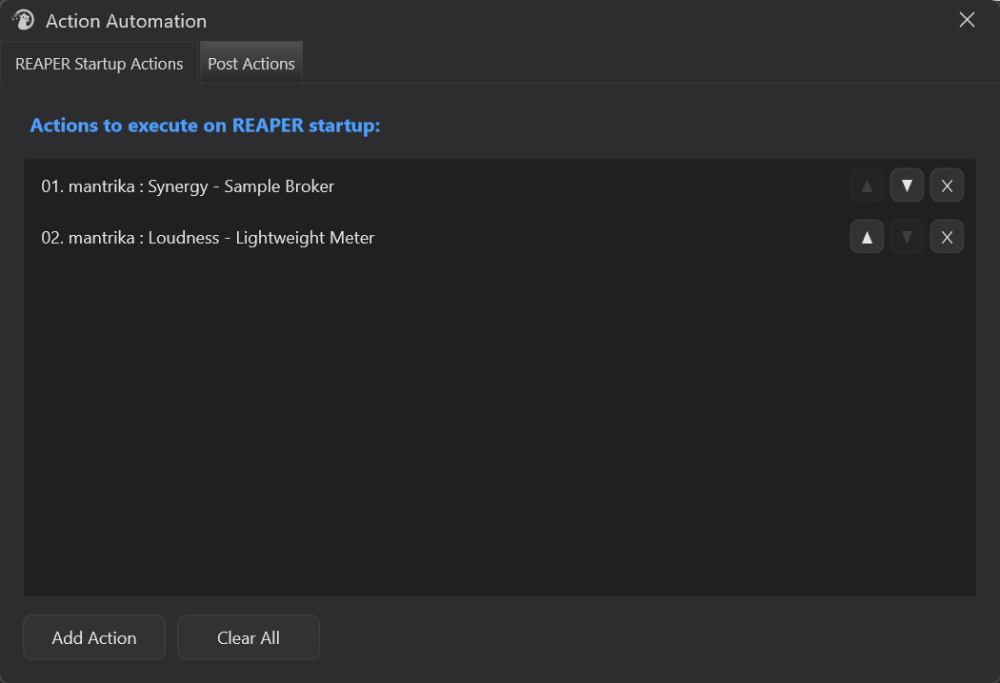
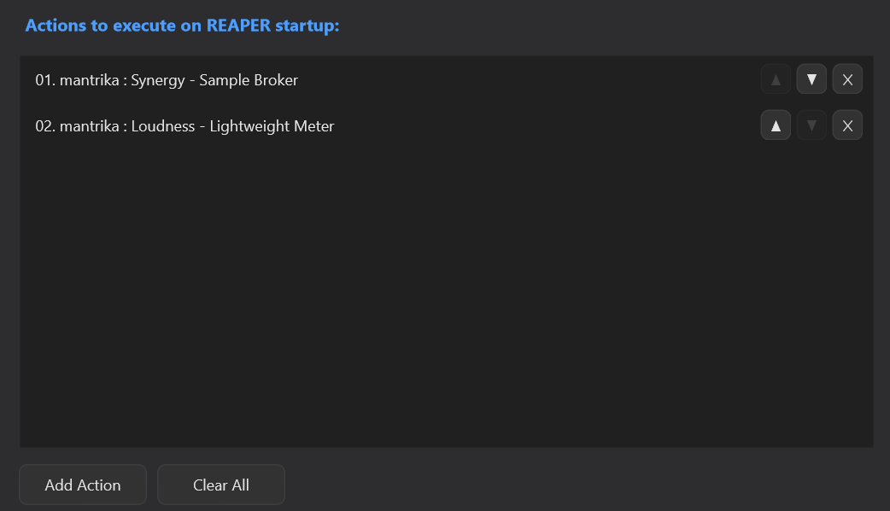
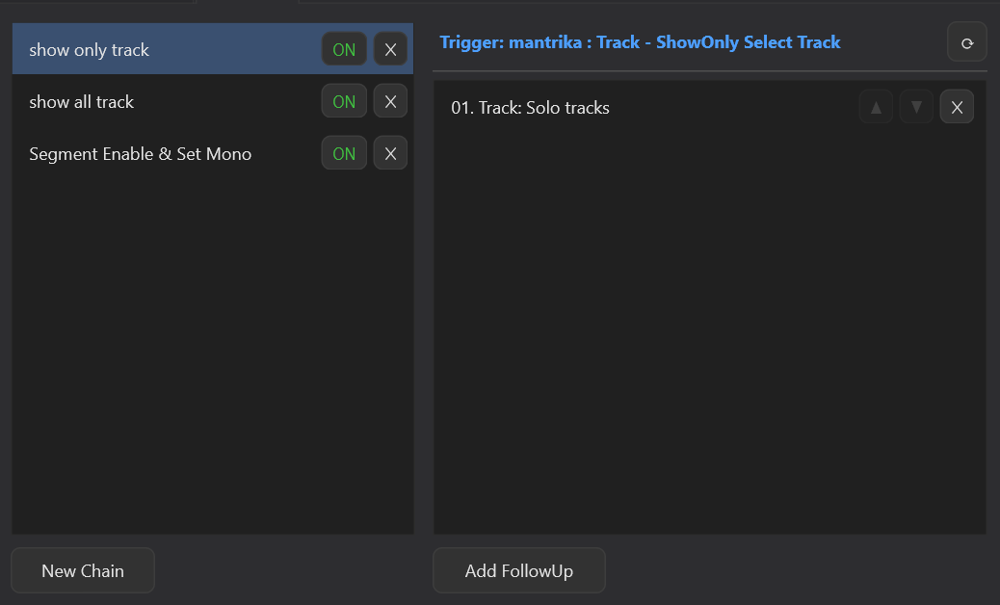

# Action Automation

---

## 1. What Is Action Automation?

**Action Automation** is an action configuration panel. In short, it turns the sequence of clicks you do every time into something that happens automatically.

It packs two kinds of automation into two tabs in a single window:

| Tab | What it solves |
| --- | --- |
| **REAPER Startup Actions** | Run a list of actions automatically every time REAPER starts (open windows, apply layouts, load templates, etc.). No more clicking through the same setup after every launch. |
| **Post Actions** | Attach follow-up steps to actions you already use. After a trigger action runs, the chained actions run automatically. Think of it as a lighter Custom Action that does not need a new shortcut. |

> Any action that appears in REAPER's Action List works: built-in REAPER actions, actions from other extensions, and your own recorded scripts or macros.
>
> Settings are saved in Mantrika Tools' global preferences and apply across all projects.

---

## 2. Opening Action Automation

Menu path:

```
Extensions → Mantrika Tools → Action automation
```

Or use the Action List (search for "Action Automation"):

| Action name | Purpose |
| --- | --- |
| **`mantrika : Misc - Options - Action Automation`** | Toggle the Action Automation window on/off |

The window is a standalone floating window (default size 700×450). The two tabs at the top switch between the two automation modes. Run the same command again to hide it.

---

## 3. Window Overview

The top of the window has two tabs:



| Tab | Purpose | See section |
| --- | --- | --- |
| **REAPER Startup Actions** | Set up actions that run automatically when REAPER starts | 5 |
| **Post Actions** | Build action chains that run after a trigger action | 6 |

---

## 4. Common Operation: Picking an Action

Whenever a tab asks you to specify an action (`Add Action`, setting a Trigger, or `Add FollowUp`), clicking it opens REAPER's native Action window— the same one you use when editing keyboard shortcuts.

```
1. Click the button (Add Action / ⟳ / Add FollowUp).
2. REAPER opens the Action window. Search for the action you want.
3. Select it and confirm. The action is added to the list.
To cancel, close the selector.
```

> Because it uses REAPER's native selector, you can pick any action REAPER can run, not just Mantrika actions.

---

## 5. Tab 1: REAPER Startup Actions

### 5.1 What this tab does

Create a startup list. Every time REAPER launches and the extension finishes loading, the actions in this list run once from top to bottom.

Typical uses: automatically open the windows, layouts, and helper scripts you use every day so REAPER is ready as soon as it starts.

### 5.2 Interface



Each row is one action, prefixed with a number (`01.`, `02.`, …) that shows the execution order. At the end of each row are three buttons:

| Button | Purpose |
| --- | --- |
| **▲** | Move this action up one position (grayed out on the top row) |
| **▼** | Move this action down one position (grayed out on the bottom row) |
| **✕** | Remove this action |

Buttons at the bottom:

| Button | Purpose |
| --- | --- |
| **Add Action** | Open the action selector and add an action to the end of the list (see section 4) |
| **Clear All** | Clear the entire list (a confirmation dialog appears; click Yes to confirm) |

### 5.3 How to use it (three steps)

```
1. Click [Add Action] → pick an action → it appears in the list.
2. Repeat to add more actions, then use ▲▼ to arrange them in the order you want.
3. Close the window. The next time REAPER starts, the actions will run in order.
```

### 5.4 Details

- **Order matters.** Actions run from top to bottom, so if one depends on another, arrange them accordingly.
- **Each action runs only once** at startup. It is not a persistent background process.
- **Duplicate protection:** If you try to add an action already in the startup list, a message says `This action is already in the startup list.` It will not be added again.
- **Invalid action warning:** If an action later becomes invalid (the script was deleted, the extension uninstalled, or the ID changed), it shows `[Invalid] ...` in the list. When REAPER starts, a warning dialog lists the invalid items so you can remove them.

---

## 6. Tab 2: Post Actions

### 6.1 What this tab does

In short: **it is a lighter, more flexible Custom Action.**

REAPER's native Custom Action lets you bundle several actions into one, but that creates a brand-new action. You then have to reassign shortcuts, toolbar buttons, or menu entries, and your existing muscle memory and bindings no longer apply. Adding or removing one step also means editing the Custom Action again.

**Post Actions takes a different approach:** instead of creating a new action, it attaches follow-up steps to an action you already use.

> "When a specific action (the Trigger) is executed, the follow-up actions you attached run automatically in order."

The key benefit is that **you do not change the trigger at all.** Keep using the same menu item, shortcut, or toolbar button you already use. The follow-ups just run behind it, with no new binding required. Adjusting the chain— adding, removing, or reordering steps— is much faster than editing a Custom Action.

Each chain = **one Trigger action** + **one or more FollowUp actions**.

Typical uses:
- Trigger = "Save project"; FollowUp = your custom backup script → every save automatically creates a backup, using your existing save shortcut.
- Trigger = an action you press often; FollowUp = a fixed cleanup/organization routine → one trigger runs a whole workflow.

### 6.2 Interface



**Left column (chain list)** — each row is one chain:

| Element | Purpose |
| --- | --- |
| **Chain name** | Click to select the chain. The right column updates to show its settings. |
| **ON / OFF** | Enable toggle. Green `ON` = active; gray `OFF` = disabled. **OFF chains do not trigger.** |
| **✕** | Delete this chain |
| **Double-click the chain name** | Rename the chain |
| **New Chain** | Create a new chain (you will be asked to name it) |

**Right column (settings for the selected chain):**

| Area | Purpose |
| --- | --- |
| **Trigger: ...** (top) | Shows the trigger action for this chain. If unset, it shows `Trigger: (not set)`. |
| **⟳** button | Set or change the trigger action (opens the action selector) |
| **FollowUp list** (bottom) | The actions to run after the trigger, each with ▲▼✕ (move up / move down / delete). Hover a row to see the full action name. |
| **Add FollowUp** | Add a follow-up action to the end of the list |

> If no chain is selected, the right column shows `(select a chain)`, and the **⟳** and **Add FollowUp** buttons are gray. **Select a chain in the left column first.**

### 6.3 How to create a chain

```
1. Click [New Chain] in the left column and give it a name (for example, "Backup on Save").
2. The new chain is automatically selected. Click [⟳] in the top-right and pick a trigger action (for example, "File: Save project").
3. Click [Add FollowUp] and pick the actions you want to run next. Add as many as you need.
4. Use ▲▼ to put the follow-ups in the right order.
5. Make sure the chain is ON. Done.
```

> New chains are **automatically selected**, so you do not need to click them again.

From then on, whenever you run that trigger action in REAPER, the follow-up actions run automatically.

### 6.4 Details

- **Temporarily disable a chain:** click its `ON` so it becomes `OFF`. The configuration stays and you can re-enable it anytime.
- **Chains are independent:** you can create multiple chains. If several chains share the same trigger, only the **first enabled chain in the list** triggers; the others are ignored.
- **Chains do not nest:** while a chain is running its follow-ups, other chains cannot trigger. Even if a chain's own trigger appears in its follow-up list, it is skipped during execution. This prevents runaway loops, so do not expect "A triggers B, B triggers C" cascading.
- **Main-section actions only:** chains listen to actions executed in REAPER's main window. Actions run in the **MIDI editor** or other separate sections **do not** trigger chains.

---

## 7. Typical Workflows

### Workflow A: Open common windows when REAPER starts

```
1. Switch to [REAPER Startup Actions].
2. Add Action → add each window action you open every session (Mixer, extension windows, etc.).
3. Use ▼ to set the order.
4. Close the window. The next time REAPER starts, the windows open automatically.
```

### Workflow B: Back up the project after every save

```
1. Switch to [Post Actions] → New Chain, name it "Backup on Save".
2. Click ⟳ and set the trigger to "File: Save project".
3. Click Add FollowUp and choose your backup script (or "Save project as..." / another action).
4. Keep the chain ON. From now on, every save also creates a backup.
```

### Workflow C: One action triggers a whole routine

```
1. New Chain, name it "Clean up items".
2. Click ⟳ and set the trigger to an action you already use.
3. Add FollowUp → select processing, rename, color, group, etc.
4. Use ▼ to set the correct order.
→ Trigger once and the whole sequence runs.
```

### Workflow D: Pause a chain without deleting it

```
1. Find the chain in the left column.
2. Click its ON to switch it to OFF.
→ The chain stays configured but no longer triggers. Click ON again to re-enable it.
```

---

## 8. Troubleshooting

| Symptom | Cause | Fix |
| --- | --- | --- |
| Startup warning says some startup action is "invalid" | An action in the list became invalid (script deleted, extension uninstalled, or ID changed) | Open Tab 1 and delete the rows marked `[Invalid]` |
| Clicking Add Action says "already in the startup list" | That action is already in the startup list | Normal; no need to add it again |
| Startup actions run in the wrong order | Order = list order from top to bottom | Use ▲▼ on each row to arrange them correctly |
| Chain does not trigger (follow-ups do not run) | - The chain is OFF<br>- No trigger is set (shows `(not set)`)<br>- The trigger action ran in a separate section like the MIDI editor | - Switch it to ON<br>- Use ⟳ to set a trigger action<br>- Use a trigger action that runs in the main window |
| ⟳ / Add FollowUp buttons in the right column are gray | No chain is selected | Select a chain in the left column first |
| Same trigger with multiple chains; only one works | When multiple chains share one trigger, only the first enabled chain in the list triggers | Merge the follow-ups into **one chain**, or reorder the chains |
| Expecting "Chain 1 triggers Chain 2" does not work | Chains block re-triggering during execution to prevent loops | Put all actions that need to run consecutively into the **same chain's** FollowUp list |
| Worried about losing settings | Settings are saved automatically in Mantrika's global preferences | They persist after closing the window, switching projects, or restarting REAPER |

---
