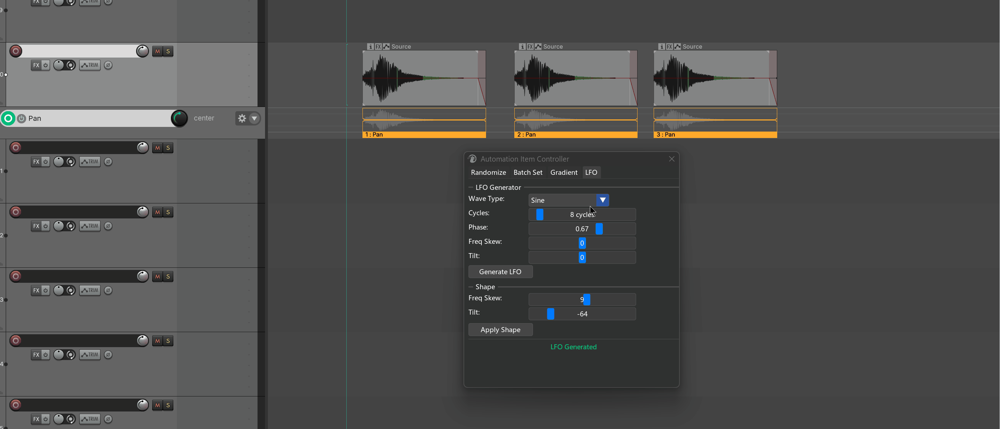
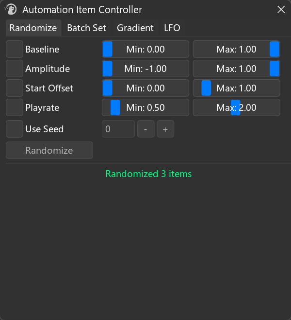
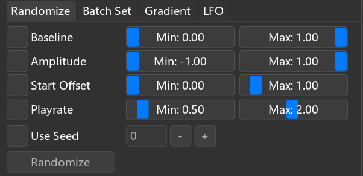
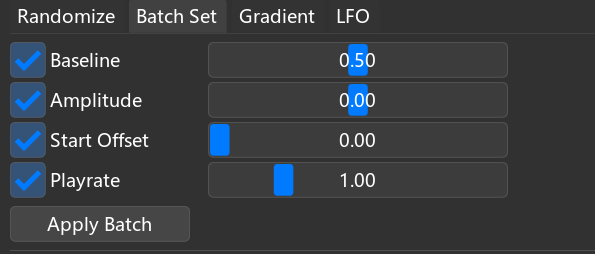
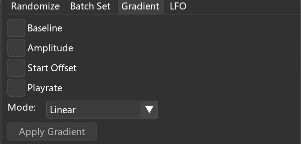
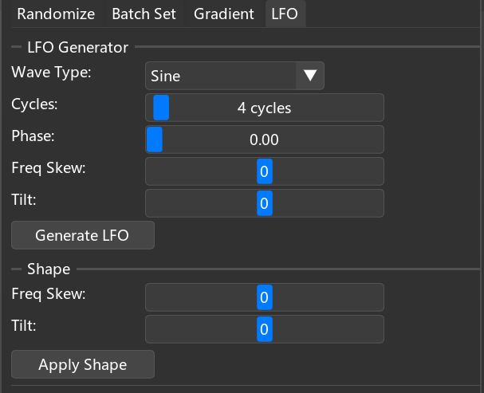

# Automation Item Controller

---

## 1. Overview

**Automation Item Controller** is a batch control panel for REAPER **automation items (AIs)**. Its purpose is "**select a bunch of AIs → change them all at once**".



It centers on four operations:

- **Randomize**: randomize each AI's baseline / amplitude / start offset / playrate — creating subtle differences across a batch of AIs to avoid a mechanical feel.
- **Batch Set**: set these properties to a single value for all selected AIs — commonly used for "zero everything / restore all to 1.0×" scenarios.
- **Gradient**: make these properties fade from A to B along the timeline — for overall evolutions like fade in/out.
- **LFO + Shape**: generate an LFO envelope inside each AI (sine / triangle / square / saw), or reshape existing envelope points with frequency skew / amplitude tilt.

> The objects being edited are always **the AI's own properties and the envelope points inside the AI**; tracks, items, and media files are not touched.

---

## 2. How to Open

| Entry | Path |
| --- | --- |
| Menu | `Extensions → Mantrika Tools → Automation item controller` |
| Action List (search "Automation Items") | **`mantrika : Automation Items - Show Controller`** |

---

## 3. Main Window Overview

The window is fixed at 400×420. Four tabs are across the top, with a status bar at the bottom:



| Area | Description |
| --- | --- |
| **Tab area** | The four functions are independent; parameters are retained separately |
| **Control area** | Each row is usually `[checkbox] [slider/input]`; only checked rows participate in the current operation |
| **Bottom buttons** | When no checkbox is checked, buttons are grayed out (LFO/Shape are exceptions and always clickable) |
| **Status text** | Idle shows `Ready`; after execution it turns **green** and reports how many AIs were processed |

> **Tip**: almost every slider supports **right-click = restore default**. If you mess up, you don't have to drag it back manually.

---

## 4. Common Prerequisite — What Is the Target?

All four tabs **share the same selection rule**:

> **Only automation items that are selected (highlighted) in the Arrange view are processed.**
> Cross-track and cross-envelope is fine; any AI in a selected state is included.

The workflow is always these two steps:

```
1. In the Arrange view, marquee- or click-select the automation items you want to process
2. Switch to the desired tab, configure parameters, click the bottom button
```

If no AIs are selected, the status bar shows `No automation items found` and nothing happens.

---

## 5. Randomize — Give a Batch of AIs Different Random Values

Good for "100 AIs all came from the same pool, but I want them to sound a little uneven".

### 5.1 Interface



### 5.2 What the Four Properties Are

| Property | Range | Effect |
| --- | --- | --- |
| **Baseline** | 0 ~ 1 | The AI's overall "base height" on the envelope (0 = envelope minimum, 1 = maximum) |
| **Amplitude** | -1 ~ 1 | Vertical scaling of the points inside the AI (negative values flip it vertically) |
| **Start Offset** | 0 ~ 10 s | Displacement of the AI's content relative to its own start (used to "stagger" AIs) |
| **Playrate** | 0.1 ~ 4 | Playback speed of the AI's internal timeline |

### 5.3 Usage

```
1. Select a batch of AIs
2. Check the properties you want to randomize (multiple allowed)
3. Drag the left and right sliders to set the random range
4. (Optional) check "Use Seed" and enter a seed for a reproducible random sequence
5. Click Randomize
```

Each AI independently picks a new value within `[Min, Max]`.

> **Without Use Seed, every run is different** (uses a nanosecond timestamp as the seed).
> To reproduce "that magic result", remember to check Use Seed and use the same value.
> It's fine if Min is dragged larger than Max; the tool swaps them automatically.

---

## 6. Batch Set — Set the Same Value to All Selected AIs

Good for tidy operations like "set every AI's playrate back to 1.0×".

### 6.1 Interface



One fixed-value slider per row; no interval concept.

### 6.2 Usage

```
1. Select a batch of AIs
2. Check the properties you want to change
3. Drag each slider to the target value
4. Click Apply Batch
```

> **Common quick scenarios**:
> - To "undo randomization": check all 4 items, right-click each slider to reset, then Apply Batch.
> - To uniformly restore playrate to 1.0×: check only Playrate, set value to 1.00, Apply.

---

## 7. Gradient — Fade a Batch of AIs Along the Timeline

Good for "the front AIs are quiet, the back AIs are loud" or "make an overall fade across several AIs".

### 7.1 Interface



Only checked properties expand From / To sliders.

### 7.2 What Dimension Does the Gradient Happen In?

**Not a gradient inside a single AI, but across multiple AIs arranged in time.**

The tool sorts AIs by their **start position**. The leftmost AI gets the From value, the rightmost gets the To value, and the ones in between are interpolated along the curve.

```
Timeline →[AI1] [AI2] [AI3] [AI4] [AI5]
 0% 25% 50% 75% 100% → Linear
```

### 7.3 How to Choose the Mode

| Mode | Shape | Use |
| --- | --- | --- |
| **Linear** | Straight line | Even, mechanical |
| **Ease In** | Slow start then accelerate | Small change at the start, stronger later |
| **Ease Out** | Fast start then settle | Big change at the start, flat later |
| **Ease In-Out** | S-curve | Smooth at both ends, faster in the middle |

### 7.4 Usage

```
1. Select multiple AIs laid out along the timeline (a single AI makes no sense)
2. Check the properties to gradient
3. Set From and To
4. Choose a Mode
5. Click Apply Gradient
```

> From / To **can be reversed** — From=1.0 / To=0.0 fades from large to small.

---

## 8. LFO + Shape — Generate or Reshape Envelope Points Inside an AI

This is the only tab that **actually writes envelope points**. The first three tabs only change AI container properties. The LFO section is on top, the Shape section below.

### 8.1 LFO Generator — Generate an Envelope from Scratch

**Clears existing points inside the AI** and writes an LFO waveform according to the settings.



```
Wave Type: [ Sine ▼] → Sine / Triangle / Square / Saw Up / Saw Down
Cycles: [ 4 cycles ] → Full cycles to fit inside the AI, 1~100
Phase: [ 0.00 ] → Phase offset, 0~1 (0 = no offset)
Freq Skew: [ 0 ] →-100 ~ 100, frequency skew
Tilt: [ 0 ] →-100 ~ 100, high/low tilt

 [ Generate LFO ]
```

**Wave Type**:

| Type | Shape |
| --- | --- |
| Sine | Smooth sine (Bezier points) |
| Triangle | Triangle wave (linear points) |
| Square | Square wave (step points) |
| Saw Up | Rising saw |
| Saw Down | Falling saw |

**Freq Skew**: redistributes cycles across the timeline.

- **Positive** → cycles are denser at the start, sparser at the end ("tight front, loose back").
- **Negative** → the opposite ("loose front, tight back").
- **0** → evenly divided.

**Tilt**: pulls wave peaks / troughs toward one extreme over time.

- **Positive** → troughs are gradually raised to max (overall shape goes from symmetric to "pinned to the ceiling").
- **Negative** → peaks are gradually pushed to min (overall shape goes from symmetric to "pinned to the floor").
- **0** → standard symmetric wave.

> Volume envelopes are special: Tilt is calculated in dB space (more perceptually natural), with a floor 30 dB below the current center.

### 8.2 Shape — Reshape Existing Points

**Does not clear or regenerate**; reads all existing points in the AI, redistributes their time positions by Freq Skew, reshapes their amplitudes by Tilt, and writes them back.

```
Freq Skew: [ 0 ] → Same as LFO Freq Skew
Tilt: [ 0 ] → Same as LFO Tilt

 [ Apply Shape ]
```

The two parameters mean exactly the same as in LFO; the only difference is "what they act on":

| | Target | Clears old points? |
| --- | --- | --- |
| **LFO Generate** | Generate the whole AI from scratch | ✅ Clears |
| **Shape Apply** | Read existing points and modify | ❌ Does not clear |

> Shape can also be applied to **hand-drawn envelopes**; you don't have to generate with LFO first.
> When both parameters are 0, clicking Apply does nothing and the status bar reports `No shaping applied (both params are 0)`.

### 8.3 Usage

```
Generate from scratch:
 1. Select AIs
 2. In the LFO section choose wave type, cycles, optional phase / skew / tilt
 3. Generate LFO
 4. Not satisfied? Click again (it clears each time)

Reshape an existing envelope:
 1. Select AIs (they must contain points, whether LFO-generated or hand-drawn)
 2. In the Shape section adjust Freq Skew / Tilt
 3. Apply Shape
```

---

## 9. General Tips

| Operation | Behavior |
| --- | --- |
| Right-click any slider | Reset to default |
| Switch tab | Parameters are independent and retained |
| No property checked | Randomize / Batch Set / Gradient buttons gray out (LFO / Shape always clickable) |
| No AIs selected | Buttons are still clickable, but execution shows `No automation items found` |
| After any operation | All support Ctrl+Z undo (goes into REAPER's standard undo stack) |
| Close window | Does not cancel an ongoing operation; operations are instantaneous, so don't worry |

---

## 10. Typical Workflows

### Workflow A: 100 identical ducking AIs that should not sound mechanical

```
1. Select all AIs
2. Randomize → check Baseline, Amplitude, Start Offset
3. Pull each attribute's Min/Max to a not-too-dramatic range (e.g., Baseline 0.4~0.6)
4. Randomize
```

To reproduce "that flavor" later, remember to check Use Seed with the same seed next time.

### Workflow B: Pull all AIs' playrate on an envelope back to 1.0

```
1. Select all AIs
2. Batch Set → check only Playrate
3. Right-click Playrate slider → restore to 1.0
4. Apply Batch
```

### Workflow C: Make 5 AIs fade in as a group

```
1. Select the 5 AIs (must be arranged in order along the timeline)
2. Gradient → check Baseline, From=0, To=1
3. Mode = Ease In
4. Apply Gradient
```

### Workflow D: Add a breathing LFO to a volume envelope

```
1. Drag out an AI on the volume envelope and select it
2. LFO → Wave Type=Sine, Cycles=8, Phase=0
3. Generate LFO
4. Too even? Shape → Freq Skew=30, Apply Shape
5. Want the back half to come down? Shape → Tilt=-50, Apply Shape
```

Each step can be repeated until you are satisfied.

---

## 11. Troubleshooting

| Symptom | Cause | Fix |
| --- | --- | --- |
| Button gray and unclickable | No property checkbox is checked | Check at least one |
| `No automation items found` | No AIs selected in the Arrange view | Select AIs first, then click the button |
| Randomize looks like nothing happened | Min and Max are too close / both 0 | Widen the interval; or confirm the property checkbox is actually checked |
| Gradient looks like the same value everywhere | Only 1 AI selected | Gradient needs at least 2 AIs to be meaningful |
| LFO waveform bunched to one side | Freq Skew is not 0 | Right-click Freq Skew to reset |
| Shape does nothing | Freq Skew and Tilt are both 0 | Set at least one to non-zero |
| Accidentally generated LFO over hand-drawn points | LFO clears existing AI points first | Ctrl+Z to undo |
| Volume LFO trough sounds too dead | dB-space floor is center-30 dB | By design; for deeper troughs change envelope or add Tilt |

---
