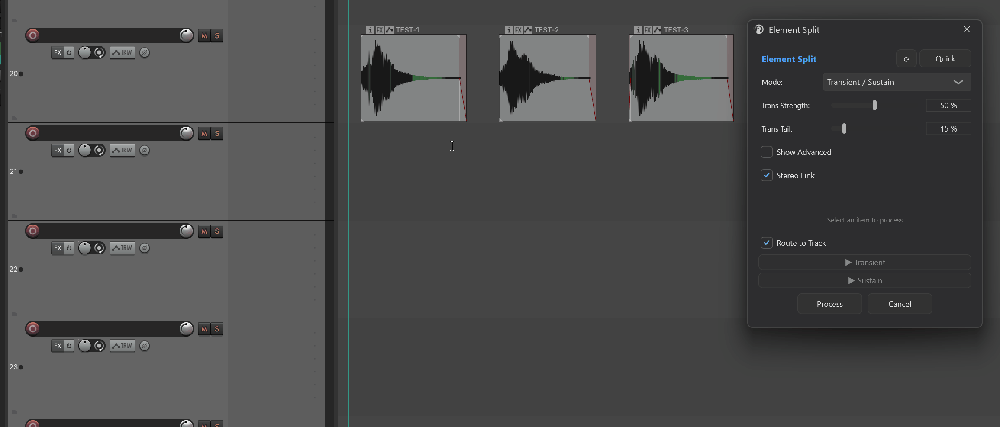
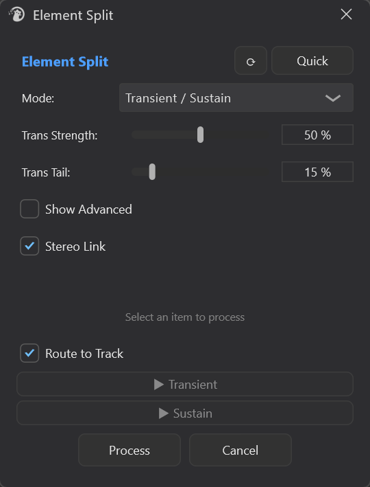
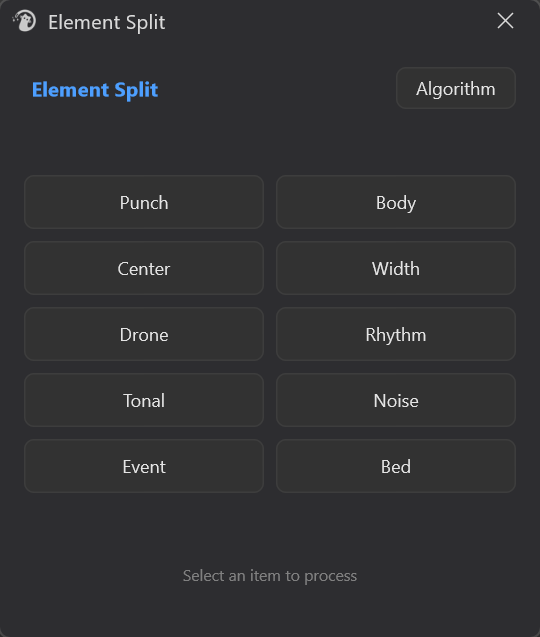
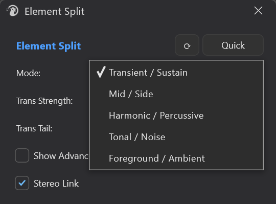

# Element Split

---

## 1. Overview

**Element Split** is Mantrika Tools' "sound element splitting" tool for **media items**. Its purpose is "**select an item → extract a specific element from that sound**".



What it does: for each selected audio item, it splits the sound into two layers using an algorithm (e.g., attack vs. tail, tonal vs. noise), optionally renders one or both layers as new files, and **automatically creates one or two output tracks directly below the original track** to place the results. The original item is left completely untouched.

It has two usage modes:

- **Quick mode**: 5 rows × 2 columns = 10 "goal-oriented" buttons (Punch / Body / Drone / Rhythm / Center / Width / Tonal / Noise / Event / Bed). Click the one you want and parameters use defaults. **Single click starts processing immediately**.
- **Algorithm mode**: manually pick an algorithm, adjust parameters, and **preview a single item** for both layers before clicking Process to batch.

All processing is **batched and parallel** — many items can run at once.

---

## 2. How to Open

Menu entry:

```
Extensions → Mantrika Tools → Element split
```

Action (search in Action List for "Element Split"):

| Action name | Purpose |
| --- | --- |
| **`mantrika : Process - Element Split`** | Open / close the Element Split window |

---

## 3. Main Window Overview

After opening, a **Quick / Algorithm** toggle button appears in the top-right corner of the window:



| Area | Description |
| --- | --- |
| **Top-right `Quick / Algorithm` button** | Switches between the two UIs; state persists and is reused next time |
| **`⟳ Refresh button`** (Algorithm mode) | Refreshes preview-button availability after the current selection changes (single-item preview requires ≥1 selected item) |
| **Mode drop-down** (Algorithm mode) | Choose one of five algorithms, detailed in §5 |
| **Progress bar / status text** | Shows progress count during processing; turns green on completion (success) or red (failure / cancellation) |
| **Process** | Runs batch processing; while processing the button becomes **Cancel** and can be interrupted at any time |
| **Cancel** (Algorithm mode) | Closes the window (also automatically cancels any running processing or preview) |

> Algorithm mode window height adjusts automatically with the Mode; Transient mode with **Show Advanced** open becomes significantly taller.

---

## 4. Quick Mode — One-Click Element Extraction

Quick mode is the shortcut for "I don't want to tweak parameters, I just want punch / body / center, etc."



```
1. Select one or more media items
2. (If not already in Quick) press [Quick] in the top-right
3. Click the button you want
4. Wait for the progress bar to finish
```

Meaning of the 10 buttons:

| Button | Extracted content | Algorithm | Best for |
| --- | --- | --- | --- |
| **Punch** | Transient / attack | Transient | Drum attack, weapon firing head |
| **Body** | Sustain / tail | Sustain | Drum body resonance, action tail |
| **Drone** | Sustained tonal content | HPSS harmonic | Drones, hums, resonance |
| **Rhythm** | Percussive / rhythmic content | HPSS percussive | Rhythmic passages (removes sustained tones) |
| **Center** | Center / mono content | Mid | Main source, dialogue |
| **Width** | Stereo width / ambience | Side | Space, reverb, wide resonance |
| **Tonal** | Narrow peaks / pure tones | TonalNoise tonal | Single-frequency whistles, whistling, electrical hum |
| **Noise** | Broadband / noise texture | TonalNoise noise | Wind, electrical floor noise, hiss |
| **Event** | Content above ambient floor | Foreground/Ambient fg | "Actions" in a scene, accents |
| **Bed** | Sustained ambient pad | Foreground/Ambient amb | Constant bed in location recordings |

> **Center / Width require the item to be stereo**, otherwise they fail. Other buttons also work on mono items.

Quick mode has no Preview and no Process / Cancel buttons— pressing a button processes immediately; closing the window cancels.

---

## 5. Algorithm Mode — Five Algorithms Explained

After switching to Algorithm mode, choose an algorithm from the **Mode** drop-down. Each algorithm outputs two layers (`Layer 1` / `Layer 2`). You can **preview** each layer separately for a single item, then decide whether to Process.



### 5.1 Transient / Sustain

**Purpose**: Separate the "hit" from the "tail" of a sound. Most commonly used for drums, weapons, footsteps, impacts.

| Mode | Control | Description |
| --- | --- | --- |
| **Simple** (default) | **Trans Strength** | Attack capture strength. Higher = more aggressive transient extraction |
| | **Trans Tail** | Tail length. Lower = transient layer keeps only a clean attack |
| **Advanced** (check Show Advanced) | **Fast Attack** (0.5–5 ms) | Fast envelope attack time. Smaller = catches sharper transients |
| | **Slow Attack** (10–50 ms) | Slow envelope attack time. Larger = transient layer carries more sustain |
| | **Release** (10–100 ms) | Envelope release time. Larger = smoother transient tail |
| | **Smoothing** (1–20 ms) | Mask smoothing, suppresses artifacts |
| | **Sensitivity** (1–15) | Detection sensitivity. Higher = more aggressive |
| **Common** | **Stereo Link** (default ON) | Multi-channel uses the same mask to avoid stereo image drift |

> When **Show Advanced** is checked, the 5 Advanced parameters are **initialized from the current Simple sliders** as a starting point, after which you can fine-tune them individually.

---

### 5.2 Mid / Side

**Purpose**: Separate the "center component" and "side component" from a stereo signal. **Meaningless for mono items**.

| Control | Range | Description |
| --- | --- | --- |
| **Mid Gain** | -12 ~ +12 dB | Gain offset when outputting the Mid layer |
| **Side Gain** | -12 ~ +12 dB | Gain offset when outputting the Side layer |

---

### 5.3 Harmonic / Percussive (HPSS)

**Purpose**: Separate "by direction" in the spectrogram. The **harmonic layer** keeps content that is stable over time and narrow in frequency (tones, drones); the **percussive layer** keeps content that is brief in time and wide in frequency (transients, clicks, noise).

| Control | Range | Description |
| --- | --- | --- |
| **Harmonic Len** | 3–31 frames (odd) | Temporal median filter length. Larger = purer harmonic layer, but may lose short sounds |
| **Percussive Len** | 3–31 frames (odd) | Frequency median filter length. Larger = catches wider-frequency transients |
| **Mask Power** | 1–8 | Wiener mask sharpness. 1 = soft (more residue), 2 = default, higher = closer to hard cut |

Best for: separating "sustained tones" from "rhythm / percussion" in music or composite sounds.

---

### 5.4 Tonal / Noise

**Purpose**: Separate "clear frequency peaks" from "broadband noise". Unlike HPSS, this looks at whether peaks in a **single frame** of the spectrum stand out above the local noise floor.

| Control | Range | Description |
| --- | --- | --- |
| **Peak Width** | 3–31 bins (odd) | Frequency neighborhood width used to estimate the local noise floor. Wider = better exclusion of wide peaks; narrower = higher resolution |
| **Peak Threshold** | 0–30 dB | How many dB above the local noise floor a bin must be to count as tonal. Higher = stricter, lower = more leakage |
| **Mask Power** | 1–8 | Mask sharpness; 1 = soft / 4 = default / higher = closer to binary |

Best for: extracting a 50 Hz hum or whistle from a recording, or conversely leaving pure noise for wind/floor-noise material.

---

### 5.5 Foreground / Ambient

**Purpose**: Use a longer time window to estimate an "ambient floor", then extract anything **significantly above it** as foreground and leave the rest as ambient. Unlike HPSS, this discriminates in the **time dimension**.

| Control | Range | Description |
| --- | --- | --- |
| **Ambient Time** | 0.5–10 s | Time window used to estimate the ambient floor. Longer = stricter (only truly steady-state content counts as ambient); shorter = closer to HPSS |
| **Threshold** | 0–30 dB | How many dB above the ambient floor a frame must be to count as foreground |
| **Mask Power** | 1–8 | Mask sharpness |

Best for: picking out interesting "events" (bird calls, passing cars, voice fragments) from location recordings, or conversely leaving a clean pad for ambience.

---

## 6. Single-Item Preview (Algorithm Mode Only)

In Algorithm mode, two preview buttons appear below the status bar. Their labels change with the algorithm (e.g., `▶ Transient` / `▶ Sustain`, `▶ Mid` / `▶ Side`, …).

```
1. Select exactly 1 audio item (multiple or zero selections are rejected)
2. Choose algorithm and adjust parameters
3. Click [▶ Layer1] or [▶ Layer2] to hear that layer
4. Click the same button again to stop; click the other button to switch layers
```

| Option | Behavior |
| --- | --- |
| **Route to Track** (toggle, persistent) | Off: preview goes to REAPER's main output, you hear the dry sound |
| | On: preview **routes through the item's track FX chain / routing**, making it easier to compare against the post-plugin-chain sound |

> Preview is only temporary synthesis —**no files are rendered, no item is modified**. If you change parameters and want to hear the new result, just click the button again.
> When you press Process after previewing, the preview is **automatically stopped** before processing begins.

---

## 7. Processing Results and Output

After pressing Process, **one or two output tracks with matching naming rules are automatically created below each original track**, with suffixes such as `Punch` / `Body` / `Drone` / —

- The two layers produced for each selected item are placed on the corresponding output tracks **at the original item's time position**
- Preserved: original item fade, take volume / pan, channel mode, item volume
- **Original item is untouched** and can be compared with the output layers at any time
- In Quick mode, if you press multiple buttons, each press is an **independent batch**— pressing several times creates several sets of output tracks
- After processing, **focus automatically returns to the main REAPER window** so you can keep working

---

## 8. Status Feedback

The status bar reports results:

| Display text | Meaning |
| --- | --- |
| `Select an item to process` | Idle |
| `Ready to preview` / `Select 1 item to preview` | Prompt after switching mode or refreshing selection |
| `Starting...` / `Processing N/M items...` | Running (multi-threaded parallel processing) |
| `Split complete: K/N items` | Complete, K items succeeded |
| `Processing cancelled` | You clicked Cancel or closed the window |
| `No audio items selected` / `No valid audio items` | No valid audio items in the selection |
| `No elements selected` | Quick mode triggered without pressing a button |
| `Processing preview...` / `Previewing...` / `Preview ended` / `Preview stopped` | Preview states |
| `Failed to read audio` / `Preview failed` | Preview preparation / processing failed |

---

## 9. Preference Persistence

A few choices persist across sessions:

| Item | Persistent? |
| --- | --- |
| Quick / Algorithm mode | ✅ |
| Algorithm selected in Algorithm mode | ✅ |
| Route to Track toggle | ✅ |
| Knob values per algorithm | ❌ (back to default each time the window opens) |
| Show Advanced checkbox | ❌ (back to default each time the window opens) |

> To quickly reset a parameter —**right-click / double-click** a knob usually returns it to default.

---

## 10. Keyboard / Mouse Quick Reference

| Operation | Behavior |
| --- | --- |
| Process button (during processing) | Becomes Cancel; click to abort |
| Close window (X / Cancel) | Automatically cancels running processing and preview |
| Click preview button for same layer again | Stop |
| Click preview button for the other layer | Switch to that layer |

---

## 11. Typical Workflows

### Workflow A: Get clean attacks from a batch of impact SFX

```
1. Select the items
2. Switch to Quick mode → click [Punch]
3. Wait for the batch to finish
4. A new track named "Punch" appears below the original track, containing the transient layer of each item
```

To also get the tail: click [Body] again — another "Body" track will appear.

### Workflow B: Extract interesting events from a location recording

```
1. Select the location-recording item, switch to Algorithm mode
2. Mode → Foreground / Ambient
3. Preview [▼ Foreground] to check whether desired events are audible
4. Not satisfied → adjust Ambient Time / Threshold and preview again
5. Satisfied → Process
```

Good for mining material from long recordings.

### Workflow C: Remove whistle squeals from mono dialogue

```
1. Select the target item, switch to Algorithm mode
2. Mode → Tonal / Noise
3. Preview [▼ Tonal] to hear how pure the captured squeal is
4. Adjust Peak Threshold to catch only the most obvious peaks
5. Process → the "Noise" layer is the de-whistled version you want
```

### Workflow D: Extract sides from a stereo environment for reverb material

```
1. Select a stereo environment item
2. Quick mode →[Width]
3. The Side layer on the output track can be dropped into a reverb as an IR or pad layer
```

---

## 12. Troubleshooting

| Symptom | Cause | Fix |
| --- | --- | --- |
| Preview buttons gray and unclickable | Not exactly 1 item selected | Select 1 item, or click `⟳ Refresh` |
| Status shows `Select 1 item to preview` | Same as above | Same as above |
| Status shows `No audio items selected` | Selection contains only MIDI / video / empty takes | Try with an audio item |
| Quick mode Center / Width produces no result | Item is mono | Use a stereo item, or use a different button |
| Fewer items than expected on output tracks | Some items failed (success K/N count shown) | Check whether source files are readable; confirm the algorithm is suitable for the item |
| Process does nothing | Still finishing Cancel, or no item selected | Wait for status to return to Ready; confirm ≥1 audio item is selected |
| Preview sound differs from final Process result | Preview does **not** go through REAPER's main-output FX; when Route to Track is off it also bypasses track FX | Turn on Route to Track to compare, or listen after Process |
| Want to undo the whole batch | Ctrl+Z once | The whole batch is one undo block |

---

## 13. Relationship with Other Modules

| Related module | Description |
| --- | --- |
| **Spectral Forge** | Spectral editing tool for fine spectrogram modifications; complements Element Split— Spectral Forge changes the spectrum, Element Split separates layers. |

---
