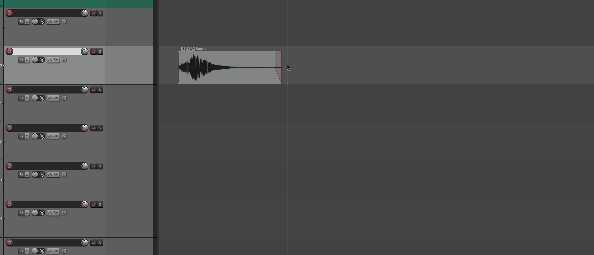
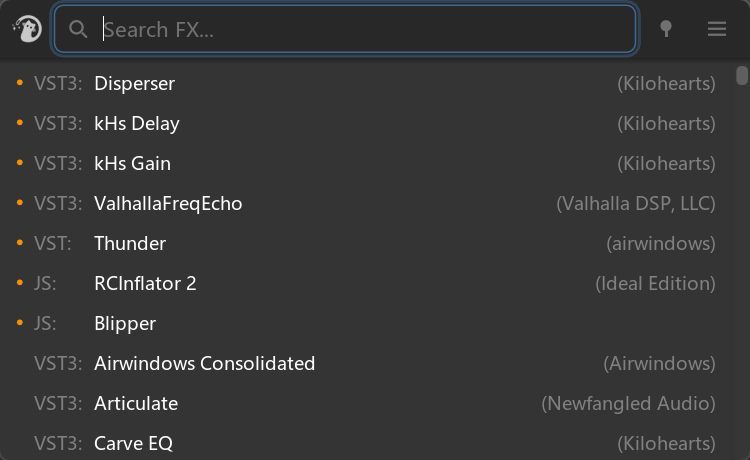
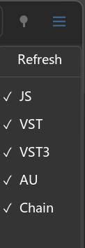

# FX Search

---

## 1. Overview

**FX Search** is Mantrika Tools' fast plug-in searcher, positioned as **"open and use, install an FX with a few keystrokes"**.

It gathers all FX available in the project — installed VST / VST3 / JS / AU plug-ins, plus RfxChain files under the `FXChains` directory — into a searchable list, so you can add plug-ins to selected tracks / items / takes without digging through layered menus.



Core interaction trio:

* **Type a keyword** → list filters in real time
* **Enter** / **double-click** → add the selected FX to the current target
* **Drag** → drag the FX to any target in the Arrange / TCP

Supported target objects:

| Target type           | Behavior                                        |
| --------------------- | ----------------------------------------------- |
| **Track FX**          | Add to the selected track                       |
| **Take FX**           | Add to the active take of the selected item     |
| **Item FX**           | Add to the item when dragged onto an item       |
| **New Track**         | Drag to empty area of TCP/Arrange to auto-create a track and add the FX |

---

## 2. Opening FX Search

FX Search has no fixed menu entry; we recommend binding the Action to a shortcut.
The Action name is **`mantrika : Synergy - FX Search`** (search "MTK FX Search" in REAPER's Action List).

Default behavior:

* When neither pinned nor docked, the window appears **near the current mouse position** (search box center aligned to mouse).
* The search box is **automatically focused** after opening — just start typing, no need to click first.
* Loses focus → auto-closes (unless pinned, see section 9).

Window size is about 500x309 logical pixels, DPI-aware.

⚠️ Dock function is Windows-only. Sorry MacOS users.

---

## 3. Interface Overview



| Area                       | Description |
| -------------------------- | ----------- |
| **Left drag handle**       | Displays the Mantrika logo; the window's **only** drag area. Right-click opens the docker menu. |
| **Search box**             | Type keywords to filter in real time. Border glows blue when focused. |
| **Clear button** (X)       | Appears on the right when the search box has content; click to clear and return focus to the input box. |
| **Pin button**             | Pin the window so it does not auto-close on focus loss or after applying an FX. See section 9. |
| **Settings button** ☰ | Toggle the right-side Filter Panel. |
| **FX list**                | Main area. Each row has four columns: star / type prefix / plug-in name / vendor. |
| **Filter Panel** (hidden when collapsed) | Appears on the right side of the window, containing Refresh button and 5 type-filter buttons. |

### Reading List Rows

Each row has four areas from left to right:

```
  ●     VST3:     FabFilter Pro-Q 3        (FabFilter)
─────  ──────   ────────────────────       ──────────
star   prefix   plug-in name (main)        vendor (auto-hides when window is narrow)
```

* **Star**: orange dot, indicates this FX is favorited.
* **Type prefix**: `VST3:` / `VST:` / `JS:` / `AU:` / `Chain:`, shown in gray.
* **Plug-in name**: main info, **selected row** turns blue.
* **Vendor**: vendor name in parentheses; **entire column auto-hides when the window is too narrow**, leaving more room for the plug-in name.

---

## 4. Basic Usage — The Full Flow of a Single FX Insert

Most common scenario: add a FabFilter Pro-Q 3 to a track.

**Steps**:

1. Select the target track (or item / take) in REAPER.
2. Press the shortcut to open FX Search; the window appears near the mouse and the search box is focused.
3. Type `fab proq` (or `q3`, `fpq`, `proq3` ... all will hit, see section 5).
4. Press **Down** / **Up** to select a row, or just trust the first row (the first row is auto-selected after typing).
5. Press **Enter**. The FX is added and the window closes.

> **Even faster**: **double-click** any row in the list, equivalent to "select + Enter".

### 4.1 Three Application Methods

| Method           | Trigger                               | Target object |
| ---------------- | ------------------------------------- | ------------- |
| **Enter**        | Press Enter while a row is selected   | Current REAPER selection (smart detection, see section 8) |
| **Double-Click** | Double-click a list item              | Same as above |
| **Drag & Drop**  | Hold left button on a list item and drag to Arrange / TCP / Item | Track / item / take under the drop point (or create a new track in empty area) |

---

## 5. Search Syntax

FX Search's search engine is heavily optimized; the goal is **"however messy you type, you hit the one you want"**.

### 5.1 Multiple Keywords = AND

Type multiple words separated by **spaces**; all words must match (**3 or more words allow missing 1** as fault tolerance).

```
fab proq           <- plug-ins containing both "fab" and "proq"
melda compressor   <- compressors from Melda
soundtoys decapitator
```

### 5.2 Exclusion: Prefix `-`

Add `-` before a word to exclude it:

```
comp -waves          <- find compressors, but not from Waves
eq -cockos           <- find EQ, but not REAPER stock EQ
```

Exclusion words do not trigger the list by themselves (i.e., typing `-waves` alone shows all FX except Waves, as a browse mode).

### 5.3 Vendor Aliases

To reduce typing, a set of **vendor abbreviation** aliases is built in and auto-expanded to full names:

| Alias | Equivalent to      |
| ----- | ------------------ |
| `mtk` | Mantrika           |
| `khs` | Kilohearts         |
| `pa`  | Plugin Alliance    |
| `nf`  | Newfangled Audio   |
| `ni`  | Native Instruments |
| `st`  | Soundtoys          |
| `la`  | Lunacy Audio       |

For example: `pa eq` is equivalent to `Plugin Alliance eq`; `khs phaser` is equivalent to `Kilohearts phaser`.

**Only some commonly used aliases are listed here; if you need more, contact the developers, or a custom feature may be added later.**

### 5.4 Four-Tier Match Scoring

Each keyword is scored by the highest matching tier below:

| Priority | Match type                    | Example                                       | Score |
| -------- | ----------------------------- | --------------------------------------------- | ----- |
| Tier 1   | **Matches start of plug-in name** | Search `fab` hits "FabFilter ..."             | 80    |
| Tier 2   | **Matches start of a word**   | Search `pro` hits "FabFilter **Pro**-Q 3"     | 60    |
| Tier 3   | **Initialism match**          | Search `pq` hits "**P**ro-**Q**"              | 50    |
| Tier 4   | **Substring match** (fallback) | Search `comp` hits "MultibandCompressor"      | 10    |

Meaning: start-of-name matches rank higher than middle matches, so typing the first few letters is usually most accurate.
**Initialism matching** is especially useful for long-named plug-ins; `fpq3` directly hits `FabFilter Pro-Q 3`. Occasionally there are even shorter ways, e.g., `q3` also hits `FabFilter Pro-Q 3`.

### 5.5 Case, Spaces, and Punctuation Are Ignored

All input is normalized to lowercase and only letters, digits, and `+` are kept. Therefore:

* `ProQ` / `proq` / `pro q` / `pro-q` hit the same results.
* A plug-in like `SoundHack ++pitchdelay` can be hit with `++pitch`. If there are not many with the same name, `++p` may be enough.
* Chinese / Japanese / other non-ASCII characters **are preserved**, so you can search for Chinese plug-in names.

---

## 6. Sorting Rules

The matched list is sorted by the following priorities (highest to lowest):

1. **Starred first**: favorited FX always appear at the top.
2. **Type priority**: VST3 > VST > JS / Chain / Unknown > AU.
3. **Match score**: weighted score from the 4-tier scoring.
4. **Stability fallback**: when scores are identical, sort by original index so refresh does not jump.

> **AU at the end** is intentional: on Mac the same plug-in often has both VST3 and AU versions, and VST3 is usually more convenient in REAPER, so VST3 is floated up by default.

---

## 7. Filter Panel

Click the **☰** button to the right of the search box; the window expands to the right by 80px to reveal the panel:



### 7.1 Refresh Button

Rescans the list of installed FX and the `FXChains` directory.
**Use when**: you installed a new plug-in, or added a new `.RfxChain` file in the `FXChains` folder; click to see it.

### 7.2 Type Filter Buttons (5)

| Action         | Effect |
| -------------- | ------ |
| **Left-click** | Toggle whether this type appears in the list (checkmark = show). Multiple can be on/off at once. |
| **Right-click** | **Exclusive mode** — show only this type, turn off the other four. Right-click the same item again to restore all-on. |

> **Tip**: Temporarily want to see only Chains? Right-click the `Chain` button; right-click again to restore.

Type settings are not saved to disk, so your normal browsing always covers all FX. Star and Pin states are persisted.

---

## 8. Smart Target Detection

When pressing Enter or double-clicking (not dragging), where the FX is added depends entirely on the **current REAPER selection** — FX Search judges your intent:

| Current selection | FX added to |
| ----------------- | ----------- |
| Only items selected | Active take of each item |
| Only tracks selected | Each selected track |
| Items + tracks, and **each selected track has a selected item** | Still **items** (interpreted as "I am working on items") |
| Items + tracks, but a track has **no selected item** | **Tracks** (interpreted as "I am working on tracks") |
| Items + tracks, but **any item's track is not selected** | **Tracks** (treated as track operation) |
| Nothing selected | **Last Touched Track** (fallback) |

> This rule follows MTK's selection-recognition philosophy elsewhere: items are more "specific" than tracks, so when both exist items take priority; only when tracks show "independent intent" (no item selection on them) does the view switch to tracks.

### 8.1 Bulk Threshold Confirmation

When the number of targets in one operation is **>= 5**, a REAPER native confirmation dialog pops up:

> `Apply "FabFilter Pro-Q 3" to 12 targets?`

Click OK to execute; Cancel silently exits.
After the dialog, the window revalidates all targets to avoid applying to the wrong place if the user changed selection during confirmation.

### 8.2 Target Detection While Dragging

Dragging is not constrained by the "smart detection" rules above — **whatever object the mouse is over is the target**.

| Mouse drop point | Target |
| ---------------- | ------ |
| Track (on TCP)   | That track |
| Item             | That item |
| Item's active take | That take |
| Empty area of Arrange / TCP | **Auto-create a new track and add the FX** (for instruments, record+All Midi Input is automatically enabled) |

The cursor changes during dragging to indicate whether the current drop point is valid. If the drop point is invalid (e.g., dragged outside the window), releasing does nothing.

---

## 9. Pin

Click the **📌 pin button** to the right of the search box; the button turns blue when pinned.

After pinning:

* Does not auto-close on focus loss.
* After applying an FX (Enter / double-click / drag) the window **does not close** — you can add multiple FX in a row.

> **Shortcut**: when undocked, press **F1** to toggle Pin / UnPin (works even while typing in the search box, no need to lift your hand to click the button). In docked state the window is forcibly pinned, the button is grayed out, and F1 is invalid (see section 9.1).

Good for:

* Adding a string of FX to a track in one go.
* Using FX Search as a resident panel.

### 9.1 Dock Behavior (Windows Only)

When docked into any REAPER docker, FX Search is **automatically forcibly pinned**.
When undocked it **restores** your Pin preference from before docking — so you do not need to reset Pin after each dock/undock.

> Sorry MacOS users; Mac version cannot dock for now, and Pin state is persisted directly.

---

## 10. Favorites (Star)

**Right-click** any FX row to toggle favorite status:

* First right-click → add star; an orange dot appears on the left, the list immediately re-sorts and the item rises to the top.
* Right-click again → remove star.

Favorite data is saved in **`FX-Favorites.json`** under the config directory, persistent across projects and sessions.

Good for "favorite FX pinned to top" — for example star your 5~10 most-used EQ / compressor / limiter, then just type two letters and hit Enter.

---

## 11. Keyboard Quick Reference

| Key               | Behavior |
| ----------------- | -------- |
| **Any character** | Types into the search box; list filters in real time |
| **Up / Down**     | Move selection up/down in the filtered list |
| **Enter** / Numpad Enter | Apply the currently selected FX to the detected target |
| **Esc**           | Close window (works even when pinned) |
| **F1**            | Toggle Pin / UnPin (only when undocked; works while typing) |
| **Tab**           | Standard ImGui focus switching (rarely needed) |

Mouse operations:

| Action                            | Behavior |
| --------------------------------- | -------- |
| **Left-click** list item          | Select (do not apply) |
| **Left double-click** list item   | Apply FX |
| **Left drag** list item           | Drag to Arrange / TCP to add FX |
| **Right-click** list item         | Toggle star for that FX |
| **Right-click** type filter button | Toggle exclusive filter mode |
| **Right-click** left drag handle (Win) | Open docker context menu |
| **Left drag** grip area to the right of search box | Drag the whole window |

---

## 12. Persistence

The following table lists which settings are saved and where:

| Item                  | Persisted | Location |
| --------------------- | --------- | -------- |
| Favorited FX list     | yes       | `<ConfigDir>/FX-Favorites.json` `starred` field |
| Pin state             | yes       | Same file, `pinned` field |
| Window position/size  | yes       | BaseDockableWindow SizeMemory system |
| Dock state            | yes       | REAPER's own docker config |
| Filter panel expanded/collapsed | no | Resets to collapsed every time |
| Type filters (JS/VST/...) | no    | Resets to "all on" every time |
| Search box text       | no        | Cleared on close |

---

## 13. FXChains Support

FX Search does not only search installed plug-ins; it also scans the **`FXChains/`** folder under the REAPER resource directory (recursively, up to 8 levels deep), adding each `.RfxChain` file as a `Chain:` type entry.

```
<REAPER Resource>/
└── FXChains/
    ├── My EQ Chain.RfxChain          → "Chain: My EQ Chain"
    └── Drum/
        └── Kick.RfxChain             → "Chain: Drum/Kick"
```

Subfolders are written as a prefix in the ident, making it easy to organize your chain library by directory.

Newly added `.RfxChain` files require **clicking the Refresh button in the Filter Panel** to appear in the list.

---

## 14. Notes

### 14.1 First Row Is Not Auto-Selected by Default

If you just open the window to "look around" — without typing any keyword — **no row** in the list will be highlighted.
Only after you type a keyword and the list finishes filtering is the first row auto-selected — this makes the "type → immediately Enter" ultra-fast experience possible.

### 14.2 Type Filters Are Window-Level, Not Persisted

Every time the window opens, all types are shown. If you often use only VST3, you can quickly switch with **right-click exclusive** mode, but next time it will return to all-on — to avoid the situation where you cannot find a JS next time.

### 14.3 Dragging to Empty Area Creates a New Track

When the drop point is clearly empty (below the TCP list, below the Arrange, etc.), a **new track is automatically created and the FX added**. If you just want to cancel the drag, release outside the window.

### 14.4 Bulk Operation "5" Threshold

>= 5 targets forces a confirmation dialog. This threshold is not adjustable; it prevents accidentally adding the wrong plug-in to a bunch of tracks.

### 14.5 Chinese Paths / Chinese Plug-in Names

The search engine preserves non-ASCII characters, so you can search Chinese / Japanese plug-in names. However, the `FXChains/` path is recommended to use ASCII as much as possible, to avoid file-traversal issues in extreme cases.

### 14.6 Refresh Does Not Affect Stars

Clicking Refresh to rescan the database does not lose star information — even if a favorited FX is not found this scan (rare, e.g., plug-in file temporarily missing), the star is not lost. Stars are stored as ident strings, and will automatically reappear next scan.

---

## 15. FX Insertion Window Strategy

After the FX is added, whether REAPER pops up the FX Chain / Floating Window by default is controlled by the **"FX Insertion Behavior"** section in **Preferences**, independently for **Track FX** and **Take/Item FX**.

See [Preferences User Manual section 3.6](../guide/preference.md) for details.

---

## 16. Typical Workflows

### Workflow A: Add an EQ at Maximum Speed

```
1. Select track
2. Press shortcut to open FX Search
3. Type: q3
4. Enter
```

**Result**: FabFilter Pro-Q 3 is added to the track, window closes. Takes less than 1 second.

---

### Workflow B: Browse the Full Soundtoys Collection

```
1. Open FX Search
2. Type: st       (st is the alias for Soundtoys)
3. Use up/down arrows to browse
```

**Result**: All Soundtoys plug-ins are presented by type + alphabetical order; you can select them one by one with arrow keys.

---

### Workflow C: Add the Same Saturator to Multiple Tracks

```
1. Select 5 tracks (do not select items)
2. Open FX Search
3. Type: decapitator
4. Enter
5. "Apply Decapitator to 5 targets?" pops up → click OK
```

**Result**: Each of the 5 tracks gets its own Decapitator.

---

### Workflow D: Drag a Reverb onto a Specific Take of an Item

```
1. In Arrange, visually identify the item you want to add reverb to
2. Open FX Search
3. Type: valhalla
4. Hold left button on the list item, drag it onto that item, release
```

**Result**: FX is added to the active take of that item (item-level FX).

---

### Workflow E: Use FX Search as a Resident Panel

```
1. Open FX Search
2. Click the pin to pin it
3. (Optional) dock to REAPER sidebar → auto-stays pinned
4. Any time later: type → Enter, FX is immediately added to current selection, window stays open
```

**Result**: FX Search becomes a resident quick FX retrieval panel, almost replacing REAPER's built-in FX Browser.

---

### Workflow F: Build Your Own Favorite FX Collection

```
1. Open FX Search
2. Type the keyword of a plug-in you use often
3. Right-click it; an orange dot appears on the left
4. Repeat to star 5~10 frequently used plug-ins
5. Next time you open FX Search, your favorites are already at the top; you may not even need to search, just press Down to select
```

---

## 17. Troubleshooting

| Symptom | Possible cause | Solution |
| ------- | -------------- | -------- |
| List is empty | All types turned off | Open Filter Panel ☰ and check at least one type |
| Newly installed plug-in not found | FX database not refreshed | Open Filter Panel and click Refresh |
| New `.RfxChain` does not appear | Same as above | Refresh |
| Search keyword is correct but no results | Too many keywords all miss / exclusion too strict | Reduce keywords or remove `-xxx` |
| Pressing Enter does nothing | No row selected (auto-select only happens after typing) | Press Down to select a row, or type any keyword |
| Enter adds FX to the wrong place | Selection does not match your expectation (see section 8 smart detection) | Reorganize REAPER selection, or use drag to specify target |
| Dragging to empty area unexpectedly creates a track | Drop point recognized as "empty" → triggers new track | Expected behavior; release outside window to cancel |
| Clicking outside makes the window disappear immediately | Not pinned | Click the pin to pin it |
| Pin button color looks wrong after dock | Dock forces pin (expected) | After undock, Pin state restores to your pre-dock preference |
| Favorited FX lost after REAPER restart | `FX-Favorites.json` failed to save (rare) | Check disk space |
| Bulk operation state looks odd after selection changed during confirmation | 5+ threshold dialog still possible to hit extreme timing | Reorganize selection and try again; FX Search does secondary pointer validation, crash risk is minimal |
| Vendor column not visible in list | Window too narrow | Widen window; vendor column appears automatically above threshold |
| Cannot search Chinese plug-in names | Input contains invisible weird characters | Re-type; do not mix control characters |

---

## 18. Relationship with Other Modules

| Related module       | Description |
| -------------------- | ----------- |
| **Radial Menu**      | Another fast FX retrieval method (radial menu), sharing the same FX application engine and insertion strategy settings with FX Search. The two complement each other — frequently used plug-ins as Radial Menu items, long-tail plug-ins searched with FX Search. |
| **Preferences section 3.6** | Controls post-insert popup strategy (Don't show / Show FX chain / Show floating window), independently for Track FX and Take/Item FX. |
| **Mirror Segments**  | Mirror is a non-mixing UI/UX proxy; FX Search cannot add FX to a Mirror Segment. |
