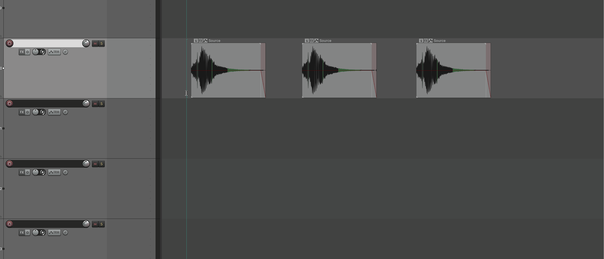
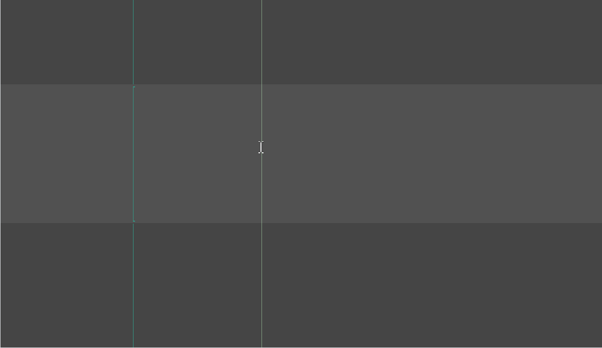
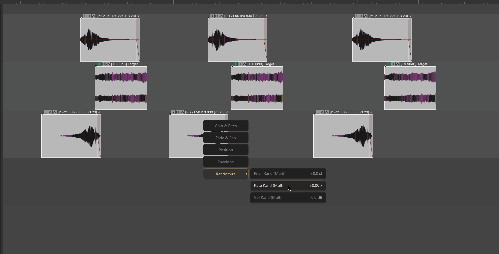

# Item Hub

---

## 1. Overview

**Item Hub** is a quick parameter adjustment panel for **media items**. Its purpose is **select an item → hold the shortcut → tweak → release, done**.

It packs the few dozen most commonly used item properties into a palm-sized floating window, so you do not have to open property dialogs or page through items one by one. One hand stays on the shortcut while the other uses the mouse to handle most everyday adjustments.



The window uses a **hold-to-show, release-to-close** interaction (momentary action) and never blocks the REAPER main window.

---

## 2. Opening the tool

This tool has no traditional "click to open" menu entry; it is triggered by **holding a shortcut**:

### Step 1: bind the shortcut

1. Open REAPER's Action List (shortcut `?` or menu **Actions → Show action list...**)
2. Search for **`mantrika : Synergy - Item Hub`**
3. Bind it to a convenient hotkey or mouse gesture (single key recommended)

> **Mac users**: if you bind system function keys such as F1/F2, REAPER's top **Actions → Show recent actions** menu may flicker rapidly. Disable that option or use a shortcut without F-keys.
> **Mac users should also avoid combo keys**, otherwise wheel category switching will not work.

### Step 2: use it

```
1. Select one or more items in the Arrange view
2. Hold the Item Hub shortcut → the window pops up near the mouse
3. Adjust parameters with the mouse (see §4)
4. Release the shortcut → the window closes and changes take effect immediately
```

---

## 3. Window interface overview

While holding the shortcut, the window appears next to the mouse:



| Area | Description |
| ---- | ----------- |
| **Left column (categories)** | Five large category buttons; click or use the scroll wheel to switch. The active category has a gold border and triangle indicator. |
| **Right column (parameters)** | The parameters for the current category, one per row: name on the left, value on the right. |
| **Progress bar** | A small bar under each row shows where the current value sits in its range. |

---

## 4. Basic usage — four typical operations

### 4.1 Single item: change volume, pitch, or pan

```
1. Select 1 item
2. Hold the Item Hub shortcut
3. Move the mouse over a parameter in the right column
4. Hold the left button and drag left/right → the value changes in real time and the item responds immediately
5. Release when satisfied, then release the shortcut
```

**Right-button drag** = fine mode, sensitivity is reduced for adjusting to two decimal places.

**Double-click a parameter row** = reset to default.

---

### 4.2 Multiple items: batch-unify parameters

```
1. Select multiple items (can be across tracks)
2. Hold the Item Hub shortcut
3. Switch to the desired category
4. Drag to adjust
```

**Behavior differences with multiple selections**:
- Most continuous parameters (such as Vol, Pitch, Pan) are shown as **relative changes** (for example `+3.0 dB`, `-2.0 st`). This means "add/subtract this amount from each item's original value."
- This lets you push items with different volumes up by 3 dB together without forcing them all to the same absolute value.

> A few parameters still show absolute values in multi-select: Item Vol, Take Vol, Rate, Preserve Pitch, Reverse, Fade Shape, Channel Mode.

---

### 4.3 Quickly switch categories

| Method | Operation |
| ------ | --------- |
| **Click left column** | Click the category button you want |
| **Scroll wheel** | Scroll anywhere inside the window to cycle categories |
| **Shortcut** | If the same action is bound to multiple keys, any of them opens the window while held |

One hand on the hotkey, the other scrolling categories and dragging parameters — no need to touch the window title bar.

---

### 4.4 Toggle and stepped parameters

Not every parameter needs dragging:

| Parameter type | How to operate | Examples |
| -------------- | -------------- | -------- |
| **Continuous value** | Drag left/right | Vol, Pitch, Fade In, Pan |
| **Toggle switch** | Left-click to toggle ON/OFF | Preserve Pitch, Reverse |
| **Discrete step** | Drag left/right to step | FadeIn Shape, Channel Mode |

**Fade Shape seven steps**: Linear → Fast Start → Fast End → S-Curve → Rev S-Curve → Sharp → Smooth

**Channel Mode five steps**: Normal → Rev Stereo → Mono (DM) → Left → Right

---

## 5. Five category cheat sheets

### 5.1 Gain & Pitch

| Parameter | Range | Description |
| --------- | ----- | ----------- |
| **Item Vol** | -150 ~ 12 dB | Item-level volume |
| **Take Vol** | -150 ~ 12 dB | Take volume |
| **Pitch** | -24 ~ 24 st | Pitch shift in semitones |
| **Rate** | 0.1 ~ 4.0 x | Playback speed (changes item length) |
| **Preserve Pitch** | ON / OFF | Preserve pitch when changing speed |

> Changing **Rate** automatically stretches or shrinks the item length while keeping the audio content intact.

---

### 5.2 Fade & Pan

| Parameter | Range | Description |
| --------- | ----- | ----------- |
| **Fade In** | 0 ~ 5000 ms | Fade-in length |
| **Fade Out** | 0 ~ 5000 ms | Fade-out length |
| **FadeIn Shape** | 7 steps | Fade-in curve shape |
| **FadeOut Shape** | 7 steps | Fade-out curve shape |
| **Pan** | L100 ~ R100 | Pan position (`0` shown as `C`) |
| **Reverse** | ON / OFF | Reverse audio |
| **Channel Mode** | 5 steps | Channel mode |

---

### 5.3 Position

| Parameter | Range | Description |
| --------- | ----- | ----------- |
| **Left Edge** | 0 ~ current upper limit | Trim the left edge (adjusts take offset + item position + length) |
| **Right Edge** | 0.001 ~ 30 s | Right edge position (directly changes item length) |
| **Take Offset** | -10 ~ 10 s | Take offset on the timeline |
| **Snap Offset** | 0 ~ item length | Item snap offset point |
| **Item Gap** | -1 ~ 5 s | **Multi-select only**: uniform gap between items |
| **Batch Trim** | 0.1 ~ 30 s | **Multi-select only**: trim all selected items to the same length |

> **Item Gap and Batch Trim are grayed out in single-select** because they are designed for multi-item spacing/trimming.

> When **Left Edge** is changed, Right Edge and Take Offset update live so the interface always reflects the item's actual state.

---

### 5.4 Envelope

Apply global transforms to **envelopes already visible** on the item take:

| Parameter | Range | Description |
| --------- | ----- | ----------- |
| **V-Scale** | 0.1 ~ 4.0 x | Vertical stretch (envelopes with larger value ranges stretch more) |
| **V-Offset** | -1.0 ~ 1.0 | Vertical offset (proportional to the envelope's own value range) |
| **T-Scale** | 0.1 ~ 4.0 x | Horizontal time stretch / compress |
| **Smooth** | 0 ~ 100 % | Smoothing amount (higher = smoother; applies multiple averaging passes based on original points) |

> Only envelopes that are **visible** when the window opens are modified; hidden envelopes are not touched.

---

### 5.5 Randomize

Apply randomized differences to each item, useful for creating batches of varied assets:



| Parameter | Range | Description |
| --------- | ----- | ----------- |
| **Pitch Rand** | 0 ~ 12 st | Each item's pitch fluctuates within `original value ± random factor × this value` |
| **Rate Rand** | 0 ~ 1.0 x | Same, applied to playback rate |
| **Vol Rand** | 0 ~ 12 dB | Same, applied to take volume |

> **A new random seed is generated every time you start dragging a Randomize parameter.** In other words, drag and release; if you do not like the result, drag again and you get a different random set.

---

## 6. Interaction cheat sheet

| Input | Behavior |
| ----- | -------- |
| **Hold shortcut** | Window opens and snapshots the state of all selected items |
| **Release shortcut** | Window closes; all changes are bundled into a single undo point (`MTK: Item Hub adjust parameters`) |
| **Left-drag** | Adjust continuous parameters; toggle ON/OFF for toggle parameters |
| **Right-drag** | Fine adjustment, much lower sensitivity |
| **Double-click a parameter row** | Reset to default; in multi-select mode resets to 0 (relative amount zeroed) |
| **Scroll wheel** | Cycle categories in the left column |
| **Click left column** | Switch to that category |
| **Window loses focus** | Closes automatically (same as releasing the shortcut) |

---

## 7. Key differences: single vs. multiple selection

| Scenario | Single selection (1 item) | Multiple selection (≥2 items) |
| -------- | ------------------------- | ----------------------------- |
| **Continuous parameter display** | Absolute value (e.g. `-3.0 dB`) | Relative change (e.g. `+2.0 dB`); a few parameters still show absolute values |
| **Item Gap / Batch Trim** | Grayed out | Available |
| **Randomize** | Random factor affects that item | Each item gets its own independent random value |
| **Adjustment mode** | Set to this value | Add/subtract from original value (except absolute-value parameters) |

---

## 8. Typical workflows

### Workflow A: quickly push or pull the volume of a group of items

```
1. Select a batch of items
2. Hold the Item Hub shortcut
3. Make sure the left column is on "Gain & Pitch"
4. Find Item Vol and nudge right to +3.0 dB
5. Release → all items are 3 dB louder
```

> If the items had different volumes before, their relative balance is preserved; only the overall level changes.

---

### Workflow B: batch add fade-ins and fade-outs to footsteps or weapon sounds

```
1. Select the whole group of assets
2. Hold the shortcut → switch to "Fade & Pan"
3. Drag Fade In to 20 ms and Fade Out to 50 ms
4. If needed, drag FadeIn Shape left/right to choose "Fast End"
5. Release
```

---

### Workflow C: use Randomize to create a varied batch of assets

```
1. Select 10 similar items
2. Hold the shortcut → switch to "Randomize"
3. Drag Pitch Rand to 2.0 st
4. Drag Vol Rand to 1.5 dB
5. Release → each item gets a slightly different pitch and volume
```

> Not happy? Hold the shortcut again and drag Randomize again; a new random set is generated.

---

### Workflow D: flatten and shift a group of envelopes

```
1. Select items that have envelopes (envelopes must be visible)
2. Hold the shortcut → switch to "Envelope"
3. Drag V-Scale to 0.5 (flatten by half)
4. Drag T-Scale to 1.2 (stretch time by 20%)
5. If needed, drag Smooth to 30%
6. Release
```

---

## 9. Troubleshooting

| Symptom | Cause | Fix |
| ------- | ----- | --- |
| Window does not appear while holding shortcut | Action not bound / bound to a combo that conflicts | Check the binding in the Action List; a single key is recommended |
| Dragging a parameter has no effect | Mouse not over the parameter row / parameter disabled in multi-select | Make sure the row is highlighted before dragging; grayed-out parameters are not interactive |
| Item Gap / Batch Trim is grayed out | Only 1 item is selected | Select at least 2 items to activate them |
| Item length changed after changing Rate | Normal behavior; Rate and length are linked | If you need fixed length, set Rate first, then adjust Length separately |
| Reverse turned on but nothing happens | The take does not support reversal / source file issue | Check that the take has a valid audio source |
| Envelope adjustment has no effect | The take has no visible envelope | Make the envelope visible in REAPER first, then open Item Hub |
| Want to undo after releasing | Press Ctrl+Z once | All changes are bundled into one undo point |
| Window flashes and closes | Window lost focus (for example, combo shortcut or clicking outside) | Use a single-key shortcut and avoid clicking other windows while holding it |

---
