# Macro

---

## 1. Overview

**Macro** is Mantrika Tools' "macro parameter" tool. One macro corresponds to **one knob**; behind the knob you can **attach multiple FX parameters (or send volumes)**. Turn the knob, and all attached parameters move together in the direction and amount you preset.

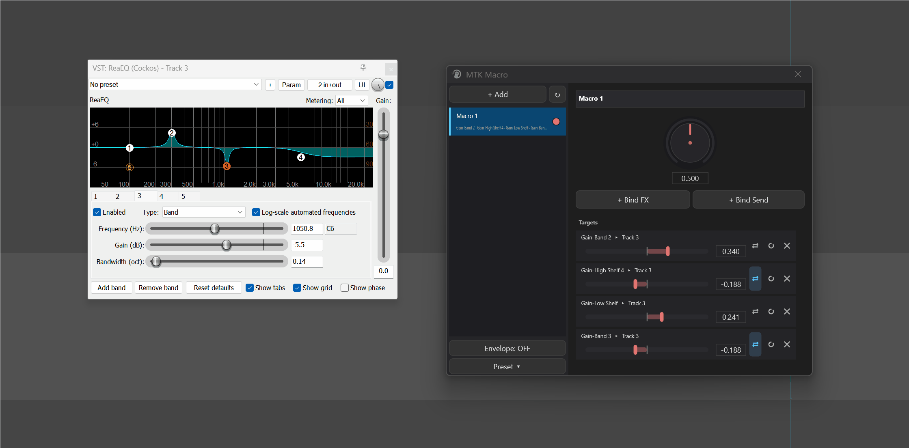

It solves needs like these:

* A "Brightness" knob simultaneously boosts EQ high end + reverb wet + saturator drive
* An "Intensity" knob pushes a compressor harder while pulling reverb mix down
* A "Send Wet" knob uniformly controls the volume of multiple sends

```
       ┌──────────────┐
       │  Macro Knob  │
       │     0..1     │
       └──────┬───────┘
              │
   ┌─────────┼──────────┬──────────┐
   ▼         ▼          ▼          ▼
 EQ High  Reverb Wet  Drive    Send Vol
 +0.6 ↑   +0.4 ↑     +0.8 ↑   −0.3 ↓
```

Each target has its own **direction + amount** (-1 to +1): positive values follow the knob upward, negative values go the opposite way; larger amount pushes farther.

**Key concepts in one sentence**:

| Concept | Meaning |
| --- | --- |
| **Macro** | One knob (0..1, midpoint 0.5 = no modulation). Up to 8. |
| **Target** | An FX parameter or send volume controlled by this macro. One macro can attach multiple targets. |
| **Baseline** | The "current parameter value" recorded at the moment of binding. When the knob returns to midpoint 0.5, all targets automatically return to baseline. |
| **Amount** | How far and in which direction this target follows the macro (-1..+1, 0 = this target does not move). |
| **Envelope mode** | Mirrors the macro onto a JSFX on a hidden track, letting you draw envelopes / record automation in REAPER to drive the macro. |

---

## 2. Opening Macro

| Entry | Path |
| --- | --- |
| Menu | `Extensions → Mantrika Tools → MTK Macro` |
| Action List | **`mantrika : Macro - Param Control`** |

---

## 3. Interface Overview

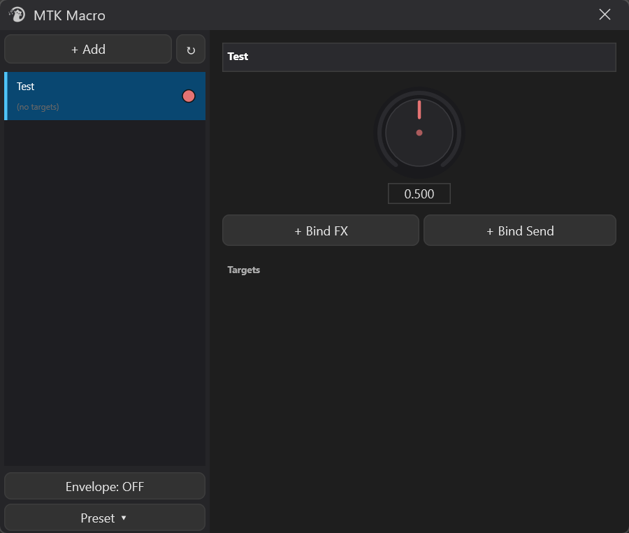

| Area | Content |
| --- | --- |
| **Top-left** | `+ Add` (new macro) / `↻` (refresh names) |
| **Middle-left** | Macro list (up to 8), each row shows macro name + controlled parameter preview + status dot |
| **Bottom-left** | `Envelope: ON/OFF` (envelope mode master switch) / `Preset ▾` (save/load) |
| **Top-right** | **Name edit box** for the currently selected macro |
| **Middle-right** | **Big knob** (macro value, 0..1) |
| **Right Bind row** | `+ Bind FX` (bind FX parameter) / `+ Bind Send` (bind send volume) |
| **Right Targets area** | List of all targets currently attached to this macro |

---

## 4. Basic Macro Operations

### 4.1 Creating a New Macro

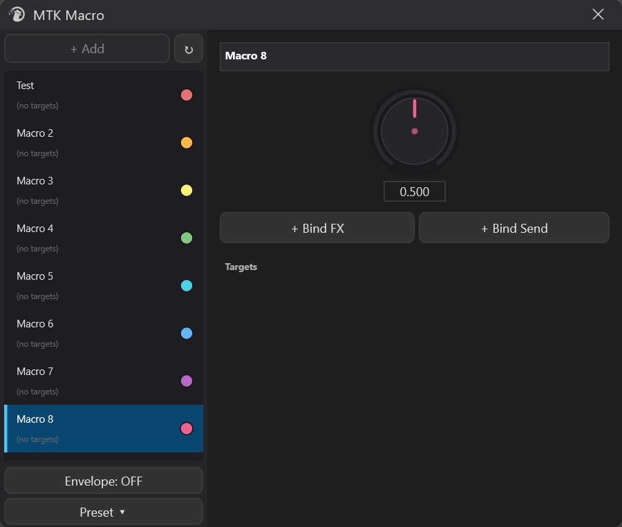

Click the top-left **`+ Add`**. The new macro appears in the list automatically with default names `Macro 1`, `Macro 2`... The upper limit is **8**; when reached the `+ Add` button grays out automatically.

### 4.2 Selecting a Macro

Left-click any row in the list. The right detail panel immediately switches to that macro's contents.

### 4.3 Renaming

Two ways:

* **Right-click macro → Rename** — automatically focuses the right name edit box and selects the current name, just type to overwrite

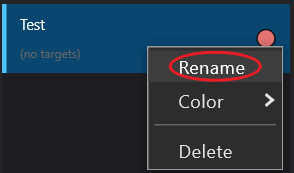

* **Click the right name edit box directly** — manually click then edit

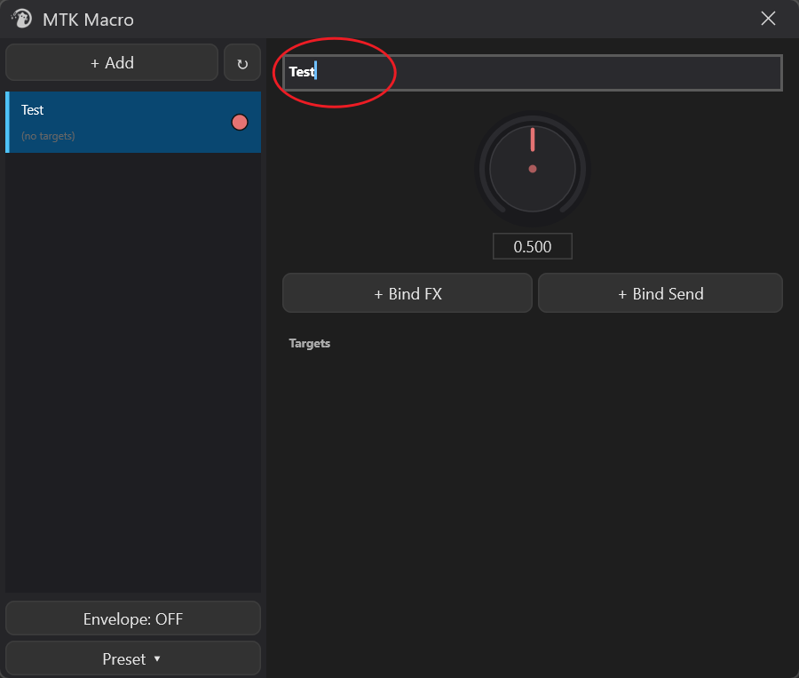

### 4.4 Changing Color

Right-click macro → **Color** submenu. Choose from 8 preset colors:

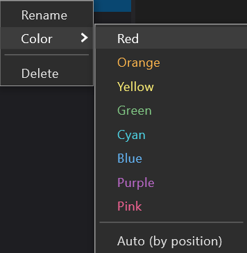

```
Red · Orange · Yellow · Green · Cyan · Blue · Purple · Pink
```

Or choose **Auto (by position)** to restore automatic coloring by list position.

Color affects the left list status dot + right big knob ring color + amount slider hue, helping you instantly tell "which macro is currently moving".

### 4.5 Enable / Disable (Active Toggle)

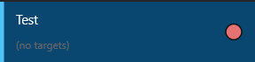

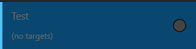

Each row has a **dot** at the far right:

| Color | Meaning |
| --- | --- |
| Macro's own color | ✅ enabled — turning the knob writes to all targets |
| Dark gray | ⛔ disabled — turning the knob no longer writes to targets; parameters stay where they are |

**Click this dot** to toggle active state. Disabled macro names turn gray, but configuration is not lost; re-enable to restore.

> Tip: Use to temporarily "suspend" a macro to avoid accidental touches, or keep its targets at the current position.

### 4.6 Deleting

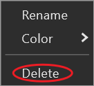

Right-click macro → **Delete**. Deletion cannot be undone, but target parameters stay at the position at the moment of deletion; they do not automatically return to baseline.

### 4.7 Big Knob (Macro Value)

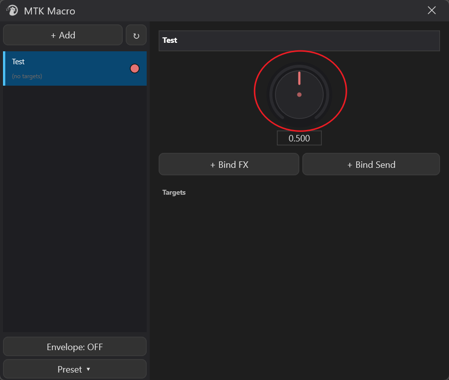

The big knob in the center-right is this macro's **current position**:

* **Range 0~1**, midpoint **0.5 = no modulation** (all targets sit at their baselines)
* The higher you turn (→1.0) the more it pushes in the positive amount direction; the lower you turn (→0.0) the more it pushes in the reverse direction
* **Double-click the knob** = immediately return to 0.5 (all targets immediately return to baseline)
* **Hold Shift while dragging** = enter fine mode; for the same drag distance the value changes only **1/6** of default, convenient for small adjustments; release Shift and click again to restore default drag speed

---

## 5. Binding Targets

A newly created macro is empty — no parameters attached, turning the knob does nothing. You need to **bind targets** first.

### 5.1 `+ Bind FX` — Bind FX Parameters

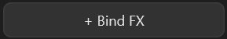

This is the most common method:

```
┌─ Workflow ─────────────────────────────────────────┐
│ 1. Select the macro to attach on the right         │
│ 2. Click [ + Bind FX ] → button turns orange       │
│    and says "Confirm Bind"                         │
│ 3. Switch to REAPER and move the parameter you     │
│    want to attach on any FX                        │
│ 4. Come back and click [ Confirm Bind ] →          │
│    parameter is added to the Targets list          │
└────────────────────────────────────────────────────┘
```

**What happens at the moment of binding**:

| Field | Auto-filled |
| --- | --- |
| **Baseline** | The parameter's current normalized value — meaning **current position = midpoint = no modulation** |
| **Amount** | Default **0.5** (medium positive push); you can change it freely in the target row afterwards |

After binding, the knob is at midpoint (0.5) and the target stays at baseline — everything as before. Push the knob up and the target starts moving.

### 5.2 `+ Bind Send` — Bind Send Volume

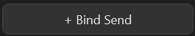

FX parameter paths do not use sends, so a separate button:

```
┌─ Workflow ─────────────────────────────────────────┐
│ 1. In REAPER click the source track you want to    │
│    bind (ensure it is last-touched track)          │
│ 2. Back in Macro window click [ + Bind Send ]      │
│ 3. A menu pops up listing all sends on this track: │
│       → Track 5                                    │
│       → Track 8 (FX Bus)                           │
│ 4. Choose a send → immediately added to Targets    │
└────────────────────────────────────────────────────┘
```

This binds the **volume** (linear gain) of that send; baseline is the current send volume.

* Selected track has **no sends** → menu shows `(Track X has no sends)`, cannot click
* No track selected → menu shows `(Select a track in REAPER first)`

---

## 6. Target Row Details

Each target occupies one row, looking like this:

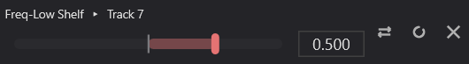

### 6.1 Name Column

Displays `Parameter ▸ Owning track [▸ item name]`. **Hover** the mouse to show full tooltip:

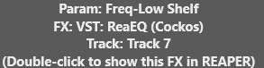

**Double-click the row body** (not the buttons) → opens that target's FX chain in REAPER and scrolls to the corresponding FX. Convenient for quickly locating "which FX parameter this target actually is".

### 6.2 Amount Slider (-1 to +1)

| Visual element | Meaning |
| --- | --- |
| **Center vertical line** | amount = 0 (this target is not affected by the macro) |
| **Semi-transparent colored block** | Extends from center to thumb position — shows "how far this target can be pushed" |
| **Thumb** | Current amount value. Colored = the macro's own color |
| **Thin bright vertical line (live needle)** | Where macro.value actually pushes this target — it moves **in real time** when dragging the big knob, an intuitive signal for "how much this target has changed" |

* **Double-click amount slider** = return to default value **0.5** (same as initial amount when a new target is bound)
* Positive = follow macro forward, negative = reverse
* To "temporarily stop this target from being driven by the macro", manually drag amount to 0 (binding retained but no movement)
* **Hold Shift while dragging** = enter fine mode (same as big knob); value change is 1/6 of default

### 6.3 Three Icon Buttons (Right End of Row)

| Icon | Name | Function |
| --- | --- | --- |
| **⇄** | Reverse | One-click invert amount (positive ↔ negative). When currently negative the button "lights up" as a hint. |
| **↻** | Re-capture baseline | Realign this target's baseline to the **current actual value** of the parameter in REAPER. |
| **✕** | Remove | Delete this target (does not move the FX parameter itself; parameter stays at current position). |

### 6.4 When to Re-capture Baseline?

**Trigger scenario**: you **manually** changed a macro-controlled parameter in REAPER (not via the macro, but by dragging it directly in the FX UI). At this point the parameter's "current value" is no longer equal to baseline — after the macro takes over again, the next time the knob returns to 0.5 it will push it back to the **old baseline**, which may not be the "current state" you want.

Press **↻** to tell the macro "treat the current position as the new baseline".

> You can also right-click the target → **Re-capture baseline** for the same effect.

### 6.5 Right-Click Target Row

Context menu:

| Item | Function |
| --- | --- |
| **Re-capture baseline** | Same as ↻ button |
| **Show in REAPER** | Same as double-clicking row body; open FX chain and locate this target |
| **Remove** | Same as ✕ button |

### 6.6 Invalid Targets

If a target's FX is deleted / the whole track is gone / the project structure changes significantly, that target displays as:

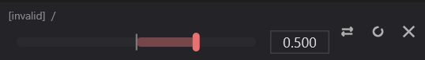


Text turns gray, amount has no effect. Two options:

1. **Fix it**: restore that FX / track in REAPER, then press the top-left **↻ Refresh** button; the target automatically realigns
2. **Delete it**: x button removes it directly

---

## 7. Top-Left ↻ Refresh Button

Small icon next to the `+ Add` button. Function: **re-read all targets' track / FX / parameter names from REAPER**.

When to use:

* Reordered track order and target row track names look outdated
* Renamed an FX or renamed a track
* Project just finished loading and some targets show placeholders like `(track)` `(fx)`
* Some targets were marked `[invalid]` and you fixed the underlying structure and want them restored

> Refresh only re-reads names and revalidates whether targets are valid; it **does not** accidentally delete your targets — when the underlying FX cannot be found it only marks invalid.

---

## 8. Envelope Mode (Bottom-Left `Envelope: ON/OFF` Button)


### 8.1 What It Is

By default, the macro knob only works inside the Macro window — drag it, parameters move, no automation trace is left.

**After Envelope mode is turned on**, Macro creates a track named **`MTK Macros`** in the project, with an 8-slider JSFX (called MTKMacros). Each macro corresponds to one slider; knob and slider **sync both ways**:

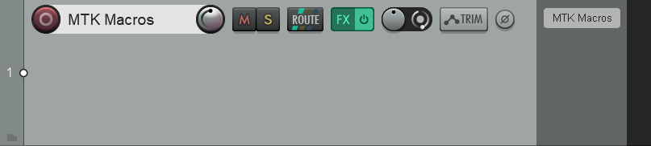

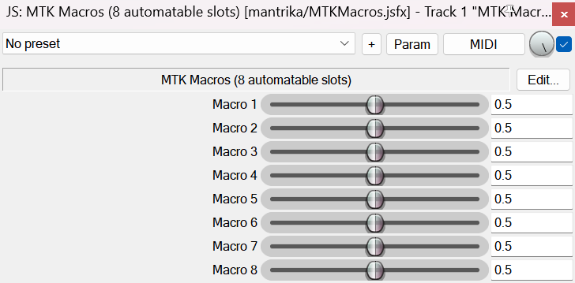

```
   You drag the knob in Macro window → JSFX slider follows → REAPER records it as automation on the envelope

   You draw an envelope for the slider in REAPER → macro targets follow the envelope
```

> Simply put: **Envelope ON = macro can be controlled by envelopes / recorded automation; Envelope OFF = macro is just a manual knob**.

### 8.2 How to Turn On

Click the bottom-left `Envelope: OFF` button; text changes to `Envelope: ON` and turns green. Click again to turn off.

After turning on, if the project has macros, it automatically creates / finds the `MTK Macros` track and loads the JSFX; after turning off writing stops, but the track is not automatically deleted (you can delete manually; it will be recreated when needed).

### 8.3 State Is Project-Level

Envelope ON/OFF persists with the project:

* Project A on → save/close/reopen remains on
* Switch to Project B (B was off) → automatically switches to off
* **Does not** pollute Project B with Project A's state

### 8.4 Common Uses

```
Workflow A: Record automation
1. Turn Envelope: ON
2. Select the Macro 1 slider of MTKMacros JSFX on the "MTK Macros" track
3. Enable "Touch / Latch" automation record mode in REAPER toolbar
4. Play → drag the knob in Macro window → REAPER automatically records actions to the envelope
5. Stop → switch to Read mode → playback knob follows the envelope

Workflow B: Draw envelope
1. Turn Envelope: ON
2. On the "MTK Macros" track find the envelope lane for the corresponding macro's slider
3. Draw curves directly with envelope points
4. During playback all targets attached to this macro follow the curve
```

> ⚠️ When Envelope is OFF, `+ Add` a macro **does not** create the `MTK Macros` track — this is intentional, to avoid adding a mysterious track to projects that do not use envelope. Turn the switch on when you need envelope.

---

## 9. Preset System (Bottom-Left `Preset ▾`)

You can package "a set of FX + the macro configuration controlling them" as a preset, to one-click restore on another project / another track later.

> Note: presets save **more than just macro data** — they also include the entire FX chain text block controlled by the macros. This means loading a preset injects the FX chain together onto the target track / take.

### 9.1 Save Preset

Click `Preset ▾` → **Save Preset...** opens the Save dialog:

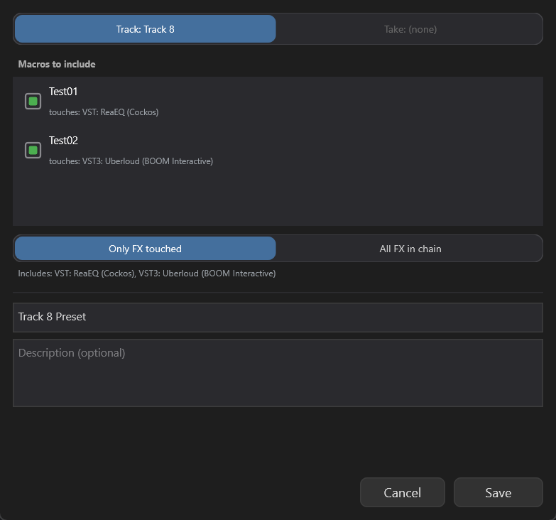

**Source** (top section): determines where to take the FX chain from.

* **Track**: current last-touched or first selected track (will not select the `MTK Macros` management track itself)
* **Take**: active take of currently selected item
* When both are available you choose; when only one is available it is auto-selected

**Macros to include**: lists all macros in the current project whose targets are on this source, letting you check whether to package them.

* Grayed-out items cannot be checked — common reasons: the macro has send targets (preset system does not currently carry sends) or targets are not on the current source
* Defaults to all checkable items checked

**FX scope (segmented)**:

| Option | Meaning |
| --- | --- |
| **Only FX touched** | Only package the FX touched by checked macros; FX chain is trimmed |
| **All FX in chain** | Package the **entire FX chain** on the source; target FX indices are stored by original chain position |

The lower area shows in real time which FX the current preset will include, for intuitive visibility of scope.

**Preset name / Description**: name is required, description optional. The name is sanitized for use as a filename when saved.

**Name conflict**: if a preset with the same name already exists, a confirmation box appears:

```
A preset named "XXX" already exists.
Overwrite it?
   [ Overwrite ]   [ Cancel ]
```

### 9.2 Load Preset

Click `Preset ▾` → **Load Preset...** opens the Load dialog:

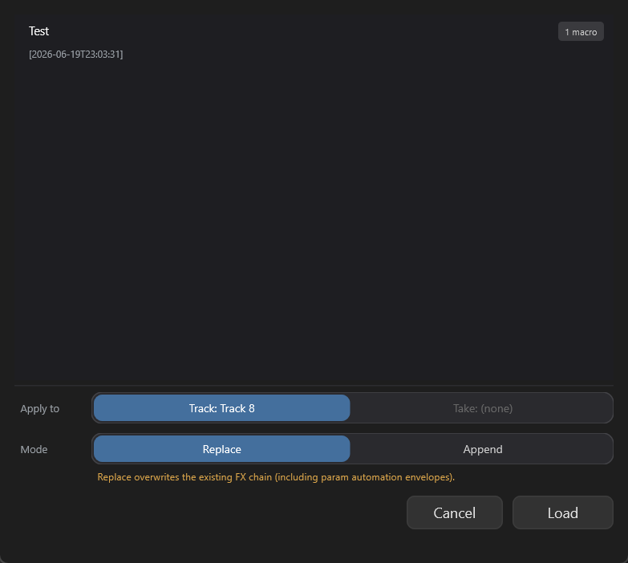


**List**: all saved presets. The badge in the upper-right corner of each row shows how many macros this preset carries.

**Apply to**: choose target track or take (again, `MTK Macros` itself is not selectable).

**Mode (segmented)**:

| Mode | Behavior |
| --- | --- |
| **Replace** | **Overwrite** the target's entire FX chain. ⚠️ Existing automation envelopes on FX parameters will disappear. |
| **Append** | **Append** preset FX to the end of the target FX chain; existing envelopes remain untouched. |

> 🟠 Replace mode has an orange warning line below clearly stating "existing envelopes will be cleared" — this is the preset system's **biggest pitfall**.

**Right-click a preset row** to **delete**; a second confirmation appears: "Delete preset 'XXX'? This cannot be undone."

---

## 10. Color and Status Visual Rules

To tell at a glance which macro is moving, Macro uses several layers of visual encoding:

| Visual element | Follows |
| --- | --- |
| **Dot at the right end of left list row** | Macro color (color when enabled / dark gray when disabled) |
| **Big knob ring + pointer** | **Currently selected macro** color |
| **Targets area amount slider thumb and fill color** | **Currently selected macro** color |
| **Thin bright needle on amount slider** | Follows `macro.value` in real time |

Switching macros → the entire right panel color **uniformly changes to that macro's color**, avoiding confusion about "which macro's target is moving now" when switching among 8 macros.

---

## 11. Multiple Macros Controlling the Same Parameter

If two targets point to **the same FX parameter** (e.g., Macro A and Macro B both attached to EQ Freq), their writes **overwrite each other** — **the last one to move wins**.

There is no weighted mixing, no summing.

---

## 12. Where Data Is Stored

| Data type | Storage location |
| --- | --- |
| Macro configuration (each project's macro list / targets / amounts / values etc.) | **Saved with project** (REAPER project state) |
| Envelope ON/OFF switch | **Saved with project** |
| `MTK Macros` track + MTKMacros JSFX | Written into project as a normal track |
| Macro Preset files | `MacroPresets/` subfolder under user config directory, `.macropreset` suffix, **shared across projects** |

Switching projects → automatically reloads that project's macro configuration.

---

## 13. Typical Workflows

### Workflow A: Build a "Brightness" Macro

```
1. + Add → get Macro 1
2. Double-click list row to rename "Brightness"
3. In REAPER open a ReaEQ → drag the high-band freq
4. Back in Macro window → + Bind FX → Confirm Bind
   → ReaEQ Freq enters Targets list
5. Go to ReaXcomp and drag threshold
6. + Bind FX → Confirm Bind
   → ReaXcomp Threshold also enters Targets
7. Adjust amount for each target (e.g., Freq +0.6, Threshold -0.3)
8. Drag the big knob → one hand boosts high end + loosens compression
```

### Workflow B: Automate a Macro with Envelope

```
1. Build macro + bind targets
2. Click Envelope: OFF → becomes Envelope: ON
3. Switch to REAPER: MTK Macros track appears at the top
4. Select the slider corresponding to your macro on the MTKMacros JSFX
5. Draw envelope on the track (or record automation with Touch mode)
6. Play → envelope pushes slider → macro targets follow the envelope
```

### Workflow C: "Send Wet" Macro Controlling Multiple Reverb Sends

```
1. + Add → rename "Send Wet"
2. Click the first source track to control (ensure it is last-touched)
3. + Bind Send → menu pops up → choose Reverb Bus → enters Targets
4. Select second source track
5. + Bind Send → same choose Reverb Bus → second send enters Targets
6. Set both amounts to +0.7
7. Drag macro knob → all reverb sends open/close together
```

### Workflow D: Save a "Drum" Setup as Preset

```
1. On Drum Bus track configure ReaEQ + Compressor + several macros
2. Preset ▾ → Save Preset...
3. Source choose Track: Drum Bus
4. Check the macros to package
5. FX scope choose "Only FX touched" (trim unrelated FX)
6. Name "Drum Bus Default" → Save
7. Next time in a new project:
   Select Drum Bus → Preset ▾ → Load Preset... → choose Drum Bus Default
   → Mode: Replace (if empty track) → Load
   FX chain + macro configuration restored with one click
```

---

## 14. Notes

### 14.1 Bind FX Must Actually Move the Parameter

The `+ Bind FX` workflow's third step is "move the parameter in REAPER". **Just opening the FX UI or just selecting the FX does not count** — the parameter value must actually change (even once, you can change it back afterwards). If you confirm without moving, you may bind the previous last-touched parameter.

### 14.2 Multiple Macros on the Same Parameter Do Not Add

See section 11. Last write wins, no blend mode.

### 14.3 Replace Mode Clears Existing Automation

Loading a preset with Replace mode overwrites the target's entire FX chain — including existing envelopes drawn on FX parameters. If you want to keep envelopes, use **Append**.

### 14.4 Envelope OFF: New Macros Do Not Create Track

Only when ON does `+ Add` ensure the `MTK Macros` track exists. In OFF state there is no trace in the project. Turn the switch on when you need envelope and it will be added.

### 14.5 Deleting a Macro Does Not Restore Target Parameters

After right-click → Delete, all FX parameters attached to that macro **stay at the current position**, they do not automatically return to baseline. If you want them back to baseline first, drag the knob to 0.5 before deleting.

### 14.6 Invalid Targets Do Not Auto-Remove

When the underlying FX / track is deleted, the target is marked `[invalid]` but kept in the list — giving you a chance to restore the underlying structure and revive it (press ↻ Refresh). Delete manually with x only when you are sure you do not need it.

### 14.7 8 Is a Hard Limit

The JSFX has only 8 sliders, so the macro count limit is 8. When reached, `+ Add` grays out automatically.

### 14.8 Do Not Manually Delete the MTK Macros Track

You can delete it, but it will be automatically recreated next time envelope is turned on / `+ Add` is used. Be aware: deleting the track also **deletes the envelopes on it**.

### 14.9 Presets Do Not Carry Sends

Macros with send targets are grayed out and cannot be checked in the Save Preset dialog — the preset system currently only packages FX chain + FXParam targets, send targets do not travel across projects.

### 14.10 `MTK Macros` Track Does Not Appear in Preset Source / Target Options

To avoid using the macro management track itself as source/target and causing circular confusion, the Preset dialog automatically skips it.

---

## 15. Troubleshooting

| Symptom | Possible cause | Solution |
| --- | --- | --- |
| Dragging knob, target does not move | Macro disabled (dot is dark gray) | Click dot to re-enable |
| Dragging knob, target does not move | amount = 0 | Drag amount slider to non-zero value |
| Dragging knob, target does not move | target marked `[invalid]` | Fix underlying FX/track then press ↻ Refresh |
| Confirm Bind bound wrong parameter | Did not move that parameter in REAPER | Move the target parameter again then Confirm |
| Target row track / FX name shows `(track)` `(fx)` | Name cache expired | Press top-left ↻ Refresh |
| Knob returned to midpoint but target did not return to original value | Manually changed target parameter in between | Press target row ↻ to recalibrate baseline |
| `+ Bind Send` shows `(no sends)` | Selected track has no sends | Select a track with sends |
| `+ Bind Send` shows `(Select a track first)` | No last-touched track | Click the track you want to bind in REAPER |
| Envelope on but slider not moving | Project just switched, still settling | Wait a moment / press ↻ Refresh |
| `+ Add` button grayed out | Macro count reached 8 limit | Delete unused macros |
| Load Preset envelopes gone | Replace mode overwrote FX chain | Use Append mode / back up envelopes beforehand |
| Cannot check a macro in preset | That macro has send targets, presets do not support | Split macro: separate FX part and send part |
