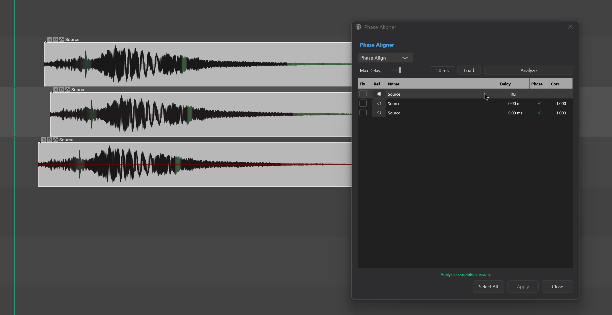
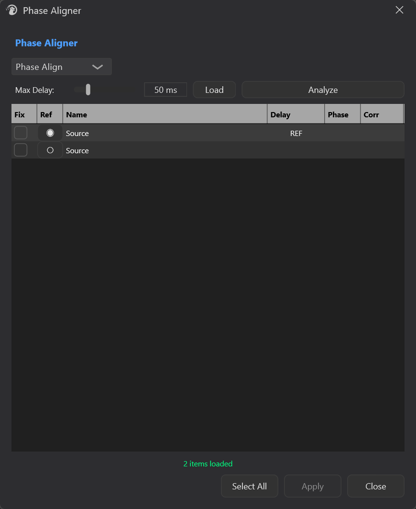

# Phase Aligner

---

## 1. Overview

**Phase Aligner** is Mantrika Tools' phase-alignment tool for **multiple time-overlapping media items**. Its purpose is "**load several multi-mic / multi-take clips of the same origin → analyze → align with one click**".



It solves two typical problems:

- **Multiple microphones recording the same source** (drum in/out, snare top/bottom, main/secondary vocal mics — have timing differences from a few milliseconds to tens of milliseconds; when summed, phase cancellation makes the sound thin.
- **Multiple takes intended to be layered for thickness** are offset by a few samples, sounding muddy and unfocused.

It does two things:

- **Measure**: analyze the **time delay** and **polarity** of each item relative to a reference item, giving correlation / summed-gain metrics.
- **Modify**: nudge the **position** of checked items into alignment and invert polarity if needed. It modifies item position and polarity only; it does not render or destroy waveforms.

The whole workflow revolves around "a group of **time-overlapping** items" — select them, Load → Analyze → check Fix → Apply.

---

## 2. How to Open

Menu entry:

```
Extensions → Mantrika Tools → Phase aligner
```

Or search in the Action List:

| Action name | Purpose |
| --- | --- |
| **`mantrika : Process - Phase Aligner`** | Open / close the Phase Aligner window |

---

## 3. Main Window Overview



| Area | Description |
| --- | --- |
| **Mode selection** | `Phase Align` or `Max Energy`, for different purposes (see §5) |
| **Max Delay** | Maximum alignment displacement allowed; Phase Align defaults to 50 ms, Max Energy defaults to 10 ms |
| **Focus** (Max Energy only) | Which frequency band to focus on for alignment: Sub Bass / Low / Mid / Full |
| **Load** | Load the currently selected items from the Arrange view into the table |
| **Analyze** | Analyze the offset of all items relative to the Reference |
| **Fix column** | Checked items are aligned when Apply is pressed |
| **Ref column** | Single-select — designates which item stays still as the reference |
| **Status bar** | Load / analysis progress and results |
| **Select All** | Check / uncheck all at once (auto-skips low-correlation items) |
| **Apply** | Actually performs alignment: nudges position, inverts polarity if necessary |

> **The reference item is temporarily colored dark blue in the Arrange view** to help you confirm which one is the reference. The color is automatically restored when the window closes or the reference changes.

---

## 4. Basic Usage — Three Steps

```
1. In the Arrange view, marquee-select all items to align (must be ≥2 and overlap in time)
2. Open Phase Aligner → click Load
3. In the Ref column, click a circle to set the reference
4. Click Analyze
5. Read the Delay / Phase / Corr columns
6. Check the Fix column for the rows you want to fix (or click Select All)
7. Click Apply
```

**What Apply does:**

- Time-shifts the position of each checked item along the timeline to align it with the Reference.
- If polarity inversion is detected (the Phase column shows ⚠️), it flips that take's volume once (equivalent to inverting polarity).

> After Apply, the window **automatically runs Analyze again** so you can immediately see the alignment effect — ideally all Delay values become close to 0 and Phase shows ✓

> Apply modifies **item position + polarity**; the original audio files are untouched. To undo, simply press **Ctrl+Z** once.

---

## 5. How to Choose the Two Modes

### 5.1 Phase Align (Default)

**Best for**: aligning multiple sensors/takes of the same source (multi-mic drum recording, layered vocal takes, stereo left/right mic matching).

- Uses **cross-correlation** to find each item's time offset relative to the reference.
- Polarity determination is based on waveform-shape comparison.
- Max Delay range is larger (up to 200 ms), suitable for cases where sensor distances are larger.
- The last column is named **Corr**, showing a correlation coefficient from 0.0 to 1.0.

**How to read Corr:**

| Value | Meaning |
| --- | --- |
| High (≥ 0.7) | Strong correlation, result is reliable, feel safe to Apply |
| Medium (0.3 ~ 0.7) | Weak correlation, alignment possible, but listen before deciding |
| Low (< 0.3, gray) | Too weak — likely not from the same source; the Fix checkbox for that row is disabled |

### 5.2 Max Energy

**Best for**: when you don't care about the geometric meaning of phase "alignment" and just want multiple items to sum **louder / with less cancellation** (typical scenarios: bass DI + mic, kick sub-alignment, synth layering for energy maximization)

- **Exhaustively** tries displacements within the Max Delay window and picks the offset that maximizes summed energy.
- Adds a **Focus** frequency band selector — energy is evaluated only in the specified band, especially useful for low-frequency alignment (bass / kick).
- The Ref column becomes **Lock** (🔒) — designates locked item
- The last column becomes **Gain (dB)**:

| Value | Meaning | Color |
| --- | --- | --- |
| ≥ +2.5 dB | Significantly louder when summed, strongly recommended to Apply | Green |
| 0 ~ +2.5 dB | Slight improvement | Yellow |
| < 0 dB | Quieter after alignment — suggested to leave unchecked | Red |

> Switching modes **clears the previous analysis results**; you must click Analyze again.

---

## 6. Table Column Quick Reference

| Column | Phase Align mode | Max Energy mode |
| --- | --- | --- |
| **Fix** | Checked items are aligned when Apply is pressed | Same |
| **Ref** | Single-select radio ◉/○, designates reference item | Single-select 🔒/·, designates locked item |
| **Name** | Take name | Same |
| **Delay** | Time offset relative to reference; `REF` = reference itself | Same; `LOCK` = locked item itself |
| **Phase** | ✓ normal polarity / ⚠️ inverted (Apply auto-flips) | Same |
| **Corr / Gain** | Correlation coefficient 0~1 (< 0.3 gray, unfixable) | Summed gain in dB (color coding see §5.2) |

---

## 7. Which Items Are Loaded

When you click Load, items are filtered from the current Arrange selection:

| Type | Loaded? |
| --- | --- |
| ≥2 audio items selected | ✅ |
| **Overlaps in time with at least one other selected item** (> 10 ms) | ✅ |
| Selection count < 2 | ❌ Status shows `Select at least 2 items` |
| Items with no time overlap | ❌ Status shows `No overlapping items found` |
| MIDI take | ❌ Silently skipped |
| No active take | ❌ Silently skipped |

> **Overlap is what matters** — two clips that don't overlap in time cannot meaningfully be "aligned".

---

## 8. Status Feedback

The status bar at the bottom of the main window reports results:

| Display text | Meaning |
| --- | --- |
| `N items loaded` | Load successful |
| `Select at least 2 items` | Fewer than 2 audio items in the selection |
| `No overlapping items found` | Selected items do not overlap in time |
| `Analysis complete: K results` | K valid results 🟢 |
| `Low correlation - items may not share a common source` | All correlations are low; likely not the same source |
| `No valid analysis results` | No valid results for any item |
| `Fixed K items` | Apply complete 🟢 |
| `Selection changed, click Load to refresh` | You changed the selection in the Arrange view; need to Reload |
| `Mode changed, re-analyze required` | Mode switched; need to re-Analyze |
| `Reference changed, re-analyze required` | Reference changed; need to re-Analyze |

---

## 9. Typical Workflows

### Workflow A: Multi-mic drum phase alignment (most common)

```
1. Select KickIn + KickOut + KickSub items
2. Open Phase Aligner → Load
3. Default Phase Align mode
4. Set KickIn as Ref (the most direct-sounding one)
5. Analyze
6. Read Corr column: > 0.7 is very reliable
7. Select All → Apply
8. Listen to the summed result — low end should be noticeably firmer
```

### Workflow B: Bass DI + mic for maximum summed level

```
1. Select BassDI + BassMic
2. Load → switch to Max Energy mode
3. Focus → Low (200 Hz)
4. Set BassDI as Lock (keeps it still)
5. Analyze
6. Read Gain column — only check rows ≥ 0 dB (skip red rows)
7. Apply
```

### Workflow C: Layered vocal takes

```
1. Select all vocal takes to layer
2. Load → Phase Align mode
3. Ref → the main take with the best feel
4. Reduce Max Delay a bit (10~20 ms, take differences are usually small)
5. Analyze → Select All → Apply
```

---

## 10. Troubleshooting

| Symptom | Cause | Fix |
| --- | --- | --- |
| Load shows `Select at least 2 items` | Fewer than 2 audio items in selection | Select more |
| Load shows `No overlapping items found` | Selected items don't overlap in time | Drag them to an overlapping range, or use different material |
| After Analyze all rows are gray, Fix checkbox unclickable | In Phase Align mode all correlations < 0.3, likely not the same source | Try Max Energy mode, or confirm the right items are selected |
| Status shows `Selection changed, click Load to refresh` | You changed selection / deleted an item in Arrange | Click Load to reload |
| Apply sounds worse (Max Energy mode) | Checked a row with negative Gain | Ctrl+Z to undo, then skip red rows |
| Reference item turned dark blue | Temporary window highlight | Color restores automatically when switching Ref or closing window |
| Can't find polarity-inverted items | Look for the ⚠️ icon in the Phase column 🟠 | Apply automatically flips polarity; no manual action needed |
| Want to undo the whole alignment | Ctrl+Z once | Apply is one undo block |

---
