# Qi

***

**Qi** is a **media variant generator** — select several items in the project, press Generate, and it creates **N stylistically different copies along the timeline** according to the random/sequential rules you set: each copy has different volume, pitch, pan, reverse state, start offset, and even the parameters of any FX you have captured.

Typical use cases:

* A footstep, sword clash, or explosion clip that you want **20 non-repeating variants** laid out on the timeline
* A continuous clip that you want to **transition gradually** from -3 semitones to +3 semitones
* A set of Foley clips where you want each variant to **randomly play a short segment** rather than the whole clip
* Wanting to **audition variations several times** before deciding whether to keep them — Qi provides a full playable blue preview before you press Generate
* A "recipe" you use often — **save it as a preset** and recall it with one click next time

The core workflow of the whole window: **select items → adjust parameters → audition preview → Generate to commit**.

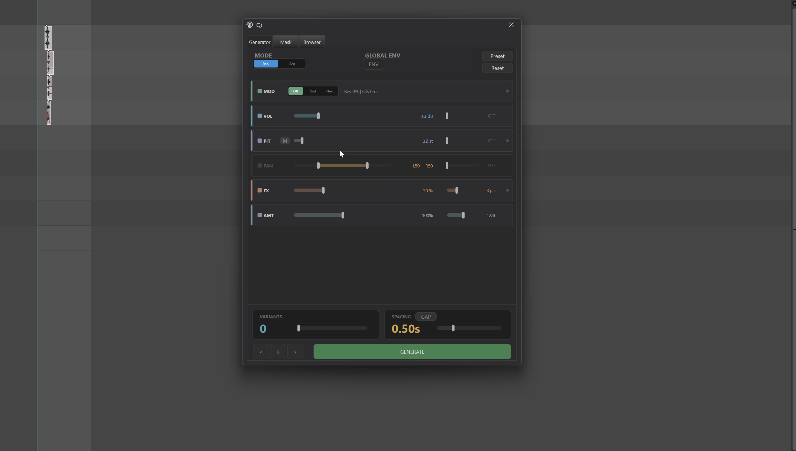

---

## 2. Opening Qi

Menu entry:

```
Extensions → Mantrika Tools → Qi
```

Or search in the Action List:


| Action name | Purpose |
| --- | --- |
| **`mantrika : Misc - Qi`** | Open / close the Qi window |
| **`mantrika : Qi: Apply Preset 1`** ~ **`5`** | Apply presets 1~5 to selected items without opening the window |

> Tip: The five Preset Actions can be bound to shortcuts — select items → press shortcut → results appear instantly, no window needed.

---

## 3. Interface Overview

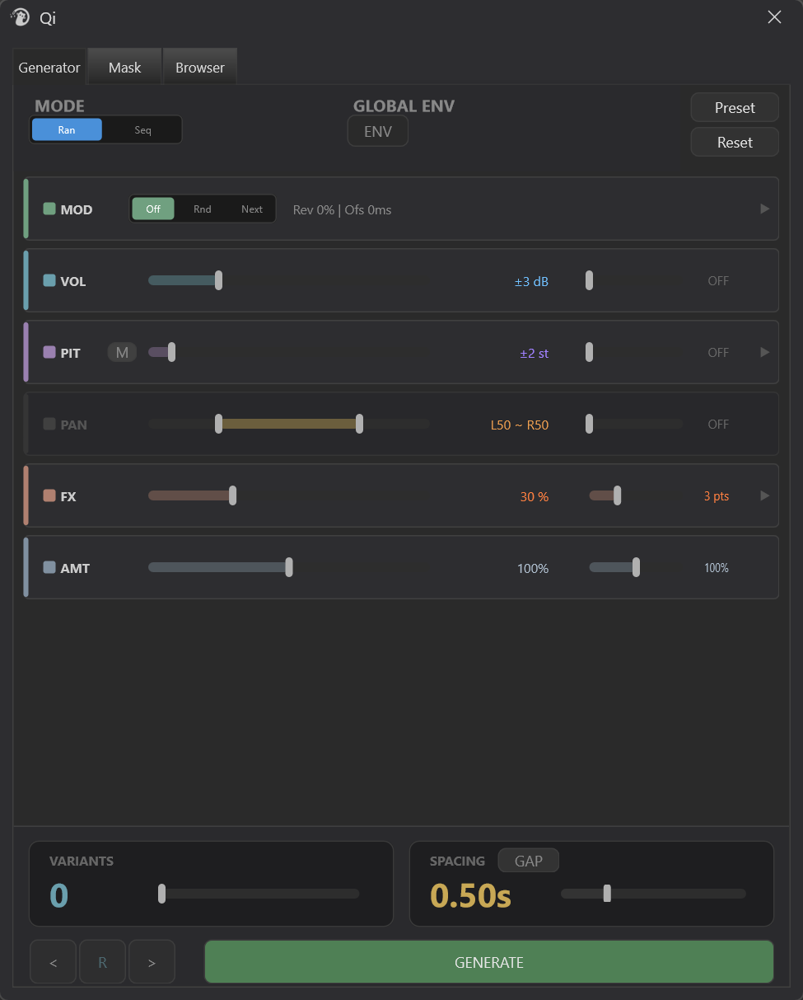

The Generator Tab consists of four areas:

| Area | Content |
|---|---|
| **Logic Bar** (top) | Random / sequential mode, global ENV switch, Preset and Reset buttons |
| **Strips** (middle) | Six horizontal strips: MOD / VOL / PIT / PAN / FX / AMT, each controlling one parameter category |
| **Footer** (bottom) | VARIANTS (how many variants), SPACING (variant spacing), audition and Generate buttons |
| **Tab row** | Generator (main panel) / Mask (per-item parameter masking) / Browser (media library browser and drag-drop) |

---

## 4. Selecting Items and Previewing

### 4.1 Selecting Items

Select one or more items on the REAPER timeline, then switch to the Qi window — Qi treats these items as **source material**, and all variants are generated based on them.

> Tip: When **multiple items** are selected, Qi treats them as a **group** for copying: each variant contains all items in the entire group, preserving the relative positions and lengths of items inside the group.

> ⚠️ **Source lock** — once the blue preview appears, the source item set is **locked**: changing the selection in REAPER will not update the source material. To switch source material, press Reset (or Generate to commit) to end the current round and reselect.

### 4.2 Blue Preview

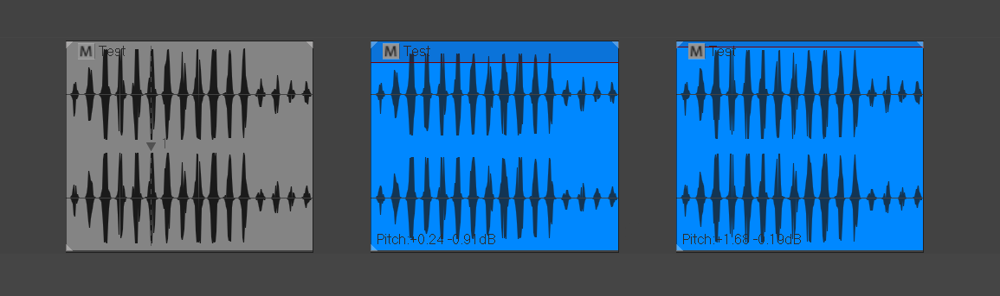

As long as **VARIANTS > 0** (default is 0, drag the VARIANTS slider first), Qi will **automatically generate a set of blue items** on the timeline after you move any parameter slider — this is a preview, not yet committed. Blue means "temporary" and can be changed freely.

* After changing parameters: blue items **automatically recalculate**
* Satisfied: press **GENERATE**, blue items become normal colored, permanent items
* Do not want them: press the **Reset** button (top-right corner), all blue items disappear, parameters return to defaults, or drag VARIANTS to 0

> ⚠️ **Undo (Ctrl+Z) and Qi preview** — Qi automatically cleans up preview records in the undo history, so old blue items do not pollute the project.

### 4.3 Three Audition Buttons

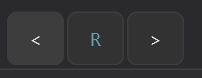

The `<` `R` `>` buttons on the left side of the Footer switch which variant is played:

| Button | Behavior |
|---|---|
| `<` | Switch to the previous variant and play |
| `R` | Jump to a random variant and play |
| `>` | Switch to the next variant and play |

Each switch moves the edit cursor to the start of that variant and **plays from the beginning** (via REAPER transport, without Solo — solo the track yourself if you want to hear it in isolation).

> Tip: The Spacebar inside the Qi window is for **auditioning files in the Browser Tab** (pause / resume), not for playing variants on the timeline.

---

## 5. Logic Bar (Top Row)

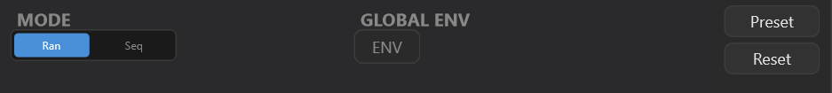

### 5.1 MODE: Random vs Sequential

* **Ran (Random)** — each variant's parameters are **truly random**, independent of each other
* **Seq (Sequential)** — parameters walk linearly from min to max, producing a **gradual** change

Switching to **Seq** reveals a second switch:

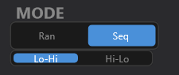

Controls the sequence direction: from low to high, or from high to low.

> Tip: Seq is very convenient for "gradually louder footsteps" or "a charge-up whose pitch keeps rising".

### 5.2 GLOBAL ENV: Global Envelope Switch

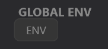

Controls whether **take envelopes are drawn inside variants**. When off, each variant's Vol/Pitch/Pan **keeps a fixed random value** across the variant length; when on, multi-point envelopes are drawn inside the variant, making values **dynamically fluctuate** over time.

The Env sub-sliders (point count) of the Vol / Pit / Pan strips require this master switch to be on to take effect. **The FX Strip's Pts is an exception** — FX envelopes are not controlled by GLOBAL ENV, only scaled by the AMT sub-slider (env macro).

### 5.3 Preset Button


Opens the preset panel; see section 10 for details.

### 5.4 Reset Button


Restores all parameters to defaults and clears the blue preview.

---

## 6. Strips (Six Horizontal Strips)

Each Strip has the same structure:

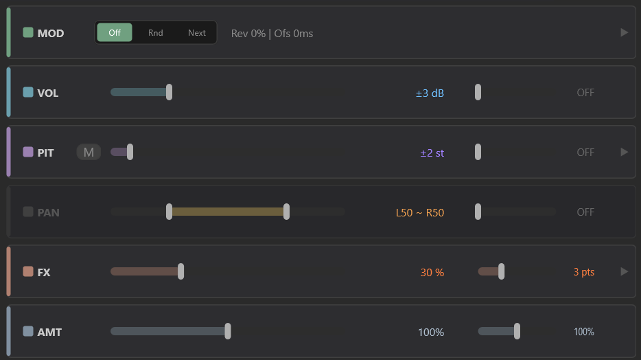

* **Left dot indicator** — click to **enable / disable** the strip; gray = disabled
* **Main slider** — random amount / intensity of that parameter
* **Env sub-slider** — envelope point count (how many rises and falls)
* **▶ expand arrow** (if present) — expands to reveal more detailed settings

> Tip: **Slider modifier keys** (apply to all parameter sliders, including Footer VARIANTS / SPACING):
> * **Shift + drag** = fine adjustment, movement becomes finer for detailed tweaking
> * **Alt + drag** (PAN dual-value slider only) = shift the whole range, both left and right handles move together, preserving the interval width
> * **Ctrl + left-click the numeric text** (not the slider, the number text next to it) = the number **becomes an input box in place**, type a new number and press Enter to commit. Out-of-range values are automatically clamped to physical limits; Esc / clicking elsewhere cancels
>
> 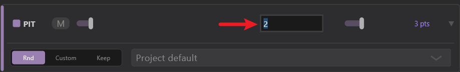
>
>   - When the editor opens the whole text is selected; just type the new value to replace it
>   - PAN dual-value numbers accept `L50 ~ R50` / `C ~ R30` / `-0.5 ~ 0.5` syntax; separate the two parts with `~`. If either part fails to parse the whole input is discarded
>   - Entering `0` for the env sub-number is equivalent to OFF

### 6.1 VOL: Volume Randomization

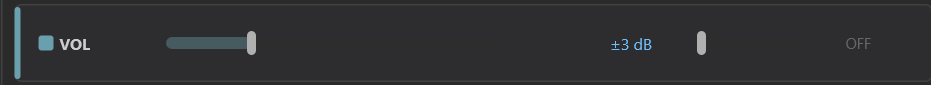

Main slider range **0~12 dB**. A value of `±X dB` means each variant's volume is randomized/sequenced between **-X and +X dB**.

Sub-slider: envelope point count (0~10). With **GLOBAL ENV** on, each variant's interior gets N volume envelope points for "dynamic loudness changes inside the variant".

### 6.2 PIT: Pitch Randomization

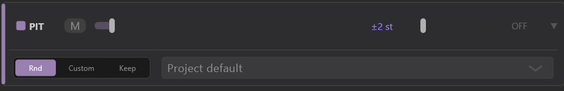

Main slider range **0~24 semitones**. A value of `±X st` means pitch varies between **-X and +X semitones**.

**Expanded content ▶**:

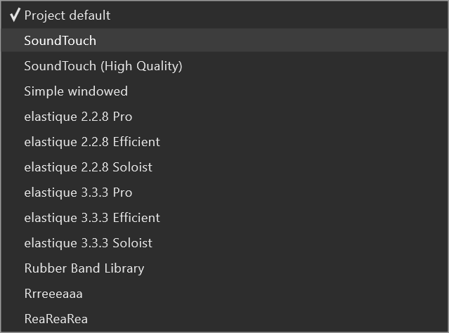

* **Rnd**: each variant uses a **random algorithm** (diverse quality when stretching)
* **Custom**: uses a fixed algorithm selected from the dropdown (Elastique Pro, etc.)
* **Keep**: keeps the algorithm originally set for each source item
* **[M] button (STR/PIT toggle)**: when on, the strip title changes from `PIT` to `STR` — switches to **Stretch mode**: variant length changes (actually tempo change); the original "pitch shift without tempo change" becomes "tempo and pitch change together"

> ⚠️ In Stretch mode, the pitch envelope switches to a **stretch envelope** (stretch marker tempo envelope); the Env sub-slider then controls the number of stretch marker points.
>
> ⚠️ Switching [M] **resets PIT intensity back to ±2**; the value you set before switching is not retained.

### 6.3 PAN: Pan Randomization

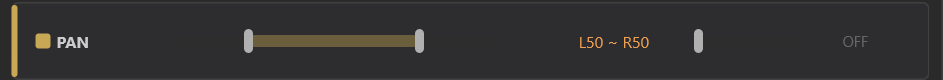

The main slider is a **dual-handle** slider; you can set left and right boundaries separately:

* `L50 ~ R50` means random within the left 50% to right 50% range
* `C ~ R80` means random from center to right 80%

Sub-slider: envelope point count, making pan wander back and forth inside the variant.

### 6.4 MOD: Reverse + Start Offset

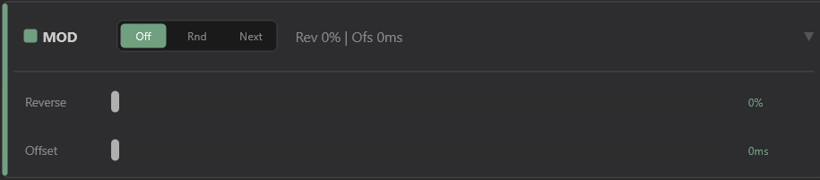

```
[ Off | Rnd | Next ]    Rev 50% | Ofs 100ms
```

**Head segment switch (Segment mode)** — controls **which segment of the source material the variant uses**:

| Mode | Behavior |
|---|---|
| **Off** | Each variant uses the **full segment** of the source material (default) |
| **Rnd** | Each variant **randomly picks one segment** from automatically detected segments |
| **Next** | Each variant **sequentially takes** the next detected segment (good for long clips to "lay out chunks") |

> Tip: Rnd / Next are great for "chopping and relaying" long Foley clips without manual cutting.
>
> ⚠️ Segments come from **energy-based segmentation detection** of the material (independent of the SPACING slider); Rnd / Next have no effect if the material does not detect at least 2 segments.

**Expanded content ▶**:

* **Reverse slider (0~100%)** — probability that each variant plays **reversed**. 100% = all reversed, 50% = half the variants reversed.
* **Offset slider (0~1000 ms)** — random **start offset amount** for each variant. For example, setting 200ms means each variant's start will randomly jitter within ±200ms, creating a "rhythmically loose" humanized effect.

> Tip: The indicator dot for the whole MOD Strip controls whether Reverse is enabled; Offset is independent inside the expanded area.

### 6.5 FX: FX Parameter Randomization

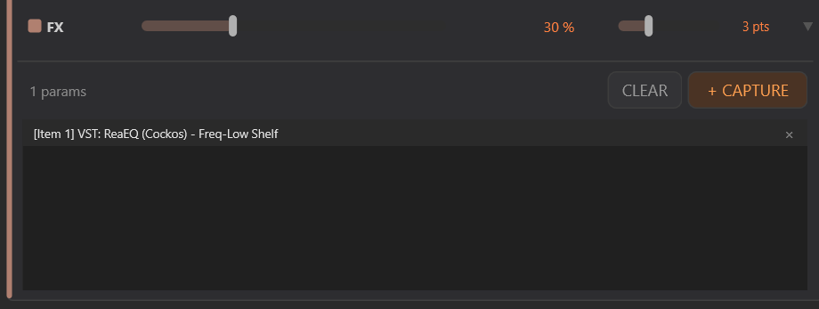

* **Strip header** (visible when collapsed) shows the Depth main slider + Pts sub-slider; the first line of the expanded area shows `N params` — the number of FX parameters you have "captured" for Qi to control.
* **Pts slider** — how many rise/fall points the FX envelope draws inside the variant
* **Depth slider (0~100%)** — **swing amplitude** of the FX envelope (percentage of the parameter's full travel)
* **CLEAR button** — clears all selected FX parameters
* **+ CAPTURE button** — pressing enters "listen mode" (button becomes **OK**); at this point **move any FX parameter in REAPER** and Qi will **automatically capture** it into this list; press **OK** to exit listen mode. Note that Qi operates on items, so only FX parameters on items are supported; track FX parameters are not supported.
* **× icon / double-click / Delete key** — removes an FX parameter from the list

> Tip: **Workflow**: select source items → add the FX you want to randomize → in Qi click CAPTURE → gently move the FX parameter in REAPER → Qi records it automatically → repeat → click OK to finish. After that, each variant will randomly swing on the captured FX parameters.

### 6.6 AMT (Amount): Global Amount Macro

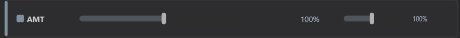

The bottom strip. Both sliders are **0~200%** **global scalers**:

| Slider | Effect |
|---|---|
| **Main slider** (left) | Scales the random amount of VOL / PIT / PAN / Offset / FX Depth together |
| **Sub-slider** (right) | Scales the envelope point count of VOL / PIT / PAN / FX together |

100% = as set; 0% = completely derandomized (all variants identical); 200% = double amount (clamped by each parameter's physical upper limit).

**Click the indicator dot once** = bypass: no parameters are scaled by AMT, they keep the values you set; the slider values are retained, and clicking again restores scaling.

> Tip: **Typical usage**: set VOL / PIT / PAN / Offset to the "maximum effect" you want, then use the AMT main slider to **control the overall amount of variation with one hand** — seamlessly adjust from "very subtle" to "completely out of control".

---

## 7. Footer (Bottom)

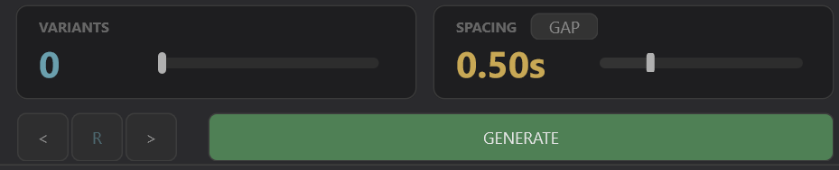

### 7.1 VARIANTS: How Many Variants

Slider **0~50**, nonlinear segments:

| Segment | Slider travel | Use case |
|---|---|---|
| 0~3 | First 25% | Fine adjustment, a small curated set |
| 3~10 | 25%~50% | Daily workload |
| 10~20 | 50%~75% | Batch laying |
| 20~50 | 75%~100% | Mass output |

Low segments give fine control, high segments give coarse control — matching real-world usage.

### 7.2 SPACING: Variant Spacing

Controls the **time distance** between variants, in seconds.

Slider **0~10s**, like VARIANTS, uses **nonlinear segments** — small spacings are the daily work area and get more travel for fine adjustment:

| Segment | Slider travel | Use case |
|---|---|---|
| 0~0.5s | First 25% | Very tight spacing, dense / overlapping laying |
| 0.5~2s | 25%~50% | Common daily spacings |
| 2~5s | 50%~75% | Stretched spacing |
| 5~10s | 75%~100% | Large spacing, coarse adjustment |

Low segments fine, high segments coarse — same idea as VARIANTS.

The `START / GAP` button switches between two meanings for spacing:

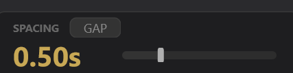

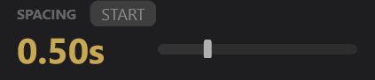

| Mode | Meaning |
|---|---|
| **START** | Interval between the **start points** of each variant (may overlap) |
| **GAP** | Interval from the **end** of one variant to the **start** of the next (never overlaps) |

> Tip: Use START for dense laying (allows overlapping for a "stomping" feel); use GAP for orderly sequences.

### 7.3 Audition + GENERATE

* **`<` `R` `>`**: previous / random / next variant (see section 4.3)
* **GENERATE button**: commits the current blue preview as real items, then resets parameters to defaults
* **Enter key**: equivalent to GENERATE

> ⚠️ After Generate, **all parameters and source item locks are cleared** — this is by design: "after committing one round, start a new round".

---

## 8. Mask Tab: Per-Item Parameter Masking

Switch to the **Mask** Tab to see a table:

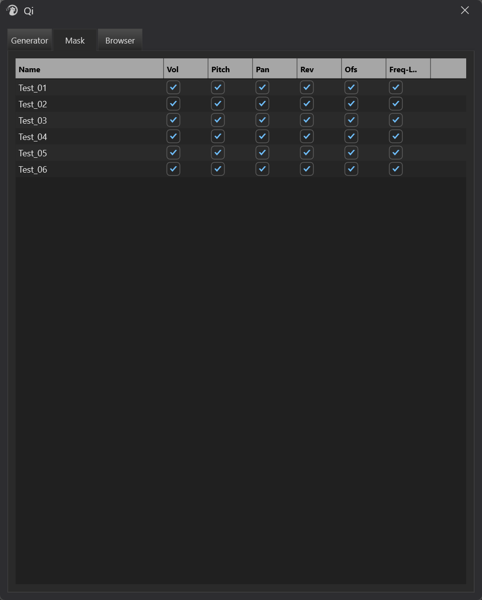

Each row corresponds to a source item; each column corresponds to a parameter: **Vol / Pitch / Pan / Rev / Ofs** (start offset), followed by columns for FX parameters you have captured. **Unchecking = this item does not participate in that randomization**.

**Typical usage**:

* Some items in a group already have a fixed pitch and you do not want Qi to randomize their Pitch → uncheck Pitch for those rows
* Some item sounds bad when reversed → uncheck Rev for that row

> Tip: FX columns only appear after you CAPTURE FX parameters; column names are truncated to 6 characters; hover to see the full name.

---

## 9. Browser Tab: Media Library Browser

Switch to the **Browser** Tab to search and drag from your preconfigured media libraries.

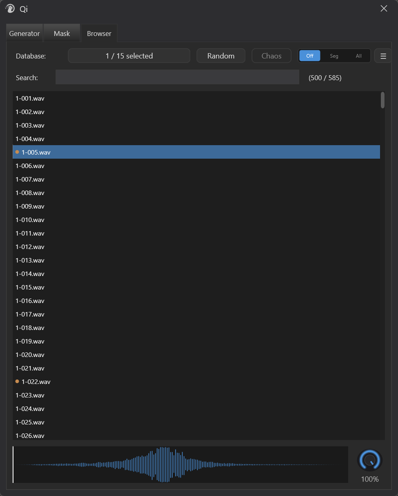

### 9.1 Top Bar

| Control | Purpose |
|---|---|
| **Database button** | Choose which media libraries to enable (from REAPER's built-in Media Explorer database list). Also supports **Soundminer** databases — marked with **[SM]** prefix in the list |
| **Random** | Randomly pick one result for preview |
| **Off / Seg / All** | Whether to apply Segment slicing when dragging: Off = no slice; Seg = slice one segment; All = slice all segments |
| **Chaos** | **Automatically apply Qi's current randomization parameters** when dragging — what you drag out is already a variant |
| **☰ Settings** | "Search on Enter" toggle (on by default; turn off for **search-as-you-type**), "Result limit" maximum result count (empty = unlimited) |
| **Search** | Keyword search, triggered by **Enter** (clearing the search box refreshes immediately). The counter on the right shows "loaded / total hits"; scrolling to the bottom of the list automatically loads the next batch |

### 9.2 File List

* **Click**: audition the file (waveform area starts playing)
* **Drag**: drag to a REAPER track and release; multiple files can be dragged
* **Orange dot**: marks that the file has already been auditioned or dragged in this session, avoiding repeated use

**Multi-file drag arrangement** — when dragging 2 or more files and releasing, an arrangement chooser pops up (matching REAPER's native "Insert Multiple Media Items" dialog), choose one of three:

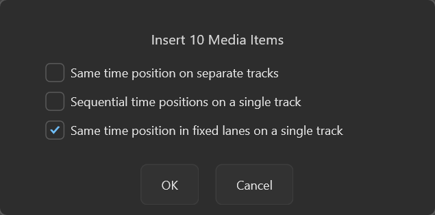

| Mode | Behavior |
|---|---|
| **Same time position on separate tracks** | Same time position, each file on its own track (new tracks are created automatically if needed) |
| **Sequential time positions on a single track** | All on the drop track, placed end-to-end in sequence |
| **Same time position in fixed lanes on a single track** | All on the drop track at the same time position, each file in its own fixed lane |

* The dialog **defaults to your last choice** (persistent, remembered even after restarting REAPER)
* Clicking **Cancel** aborts the drag; no files are inserted
* Seg / All / Chaos still apply when active; in All mode, multiple sliced segments are placed sequentially in Sequential mode and belong to the same lane in fixed-lanes mode
* Single-file drag does not pop up a dialog; behavior is unchanged

### 9.3 Waveform View

The small waveform strip at the bottom is for **precise auditioning + dragging a selected clip**:

| Action | Behavior |
|---|---|
| **Left-click** | Move playhead to this position |
| **Right-click** | Also moves playhead (works even when paused) |
| **Left-click drag** | Marquee-select a region (orange highlight + duration label) |
| **Drag selection to REAPER** | Insert **just the selected segment** onto the track (not the whole file) |
| **Short click inside selection** | Clear selection |
| **Spacebar** | Pause / resume audition |

There is also a **preview volume knob** (0~100%) on the right side of the waveform: double-click to reset to 100%, Ctrl + click to enter a value, Shift drag for fine adjustment.

> Tip: Use this for "I only want the 0.5-second blast in this long clip" — marquee-select → drag to track → done.

---

## 10. Preset System

Click the **Preset** button in the top-right of the Logic Bar:

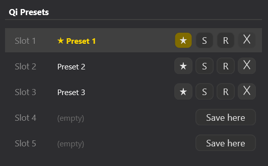

**Five fixed slots**. Each slot:

| Button | Behavior |
|---|---|
| **Click row body** (saved slot) | Load that preset |
| **★** | Set as default preset (gold = current default). Automatically loaded when opening the window; click again to unset default |
| **S** | Save current parameters to this slot (naming popup; existing slots are overwritten) |
| **R** | Rename |
| **✕** | Delete (with confirmation) |

**Save here button** (empty slot): save current parameters to this empty slot.

### 10.1 Purpose of the Default Preset

After setting a default preset, every time you open the Qi window that parameter set is loaded automatically — convenient when working on a sound type with relatively fixed settings.

### 10.2 Direct Action Application

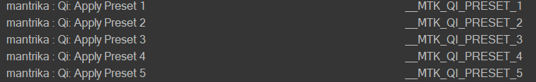

These 5 Actions **do not open Qi** — select items, press shortcut → generate directly. Good for "I already know what this preset does and do not need to look at the window" scenarios.

---

## 11. Typical Workflows

### Workflow A: 50 Never-Repeating Footsteps

```
1. Select a footstep item
2. Open Qi
3. Drag VOL to ±3 dB
4. Drag PIT to ±2 st
5. Click "Rnd" on the MOD head (random slice)
6. Expand MOD, drag Reverse to 10% (10% chance of reverse)
7. Drag VARIANTS to 50
8. Drag SPACING to 0.4s
9. Press < > R a few times until satisfied
10. Press GENERATE (or Enter)
```

---

### Workflow B: Gradual Strum

```
1. Select a guitar strum item
2. Switch Logic Bar to Seq + Lo-Hi
3. Drag PIT to ±5 st
4. Drag VOL to ±2 dB
5. VARIANTS = 8
6. SPACING = 1.0s
   → 8 variants pitch from -5 semitones to +5 semitones linearly
7. GENERATE
```

---

### Workflow C: Use FX Randomization for "Different Every Time" Filter Sweeps

```
1. Select a pad clip and add ReaEQ
2. Open Qi, expand the FX Strip
3. Click + CAPTURE
4. Gently move the Frequency knob on ReaEQ
   → Qi automatically captures "ReaEQ - Frequency"
5. Move Resonance too
   → Qi automatically captures "ReaEQ - Resonance"
6. Click OK to exit listen mode
7. Adjust FX Strip Pts = 5, Depth = 60%
   (FX envelope does not depend on GLOBAL ENV, no need to turn it on)
8. VARIANTS = 10 → GENERATE
   → 10 variants, each with a different filter sweep curve
```

---

### Workflow D: Chop and Relay a Long Foley Clip

```
1. Select a 30-second long Foley clip
2. Switch MOD head to "Next" (sequential slice)
3. Switch SPACING to GAP mode, drag to 0.0s
4. VARIANTS = 20
   → 20 variants sequentially cut from the clip and laid on the timeline
5. Drag VOL to ±2 dB for slight variation
6. GENERATE
```

---

### Workflow E: Use AMT Macro to One-Hand Adjust "Wildness"

```
1. Set VOL, PIT, PAN, and Offset to your desired "maximum effect"
   (e.g., VOL ±6dB, PIT ±4st, Offset 300ms)
2. Want "very subtle" — drag AMT main slider to 30%
3. Want "medium" — drag AMT to 60%
4. Want "completely out of control" — drag AMT to 150%
   → One slider controls the overall intensity of all parameters
```

---

### Workflow F: Drag a Segment from the Media Library onto the Timeline

```
1. Switch to Browser Tab
2. Search "explosion"
3. Click one result to audition the waveform
4. Left-click drag on the waveform to select the blast segment you want
5. Hold the selection and drag it to a REAPER track
   → Only the selected segment is inserted, not the whole file
```

---

### Workflow G: One-Key Generation with Preset Action

```
1. First use: tune a set of parameters and save to Preset Slot 1
2. In REAPER bind a shortcut to "Qi: Apply Preset 1" (e.g., Ctrl+1)
3. From then on:
   - Select an item
   - Press Ctrl+1
   → Window stays closed, variants are generated directly
```

---

## 12. Notes

### 12.1 Blue Preview Is Not the Final Result

Blue items = temporary preview. **Only pressing GENERATE turns them into real items**. Closing the Qi window or pressing Reset will make all blue items disappear.

### 12.2 All Parameters Are Cleared After Generate

This is by design — one commit = one round ends. If you want to keep parameters, **save them as a Preset** first.

### 12.3 Multiple Selected Items Are Copied "As a Group"

It does not create a separate variant for each item; instead it copies "the whole group" as a unit N times. Relative positions and lengths of items inside the group are preserved.

### 12.4 Stretch Mode Changes Variant Length

Turn on the **[M]** button on the Pitch Strip → strip title changes to STR → **tempo and pitch change together** (drag stretch markers), and variant length changes with the PIT random value. At this point the pitch envelope is replaced by a **stretch marker tempo envelope** (the Env sub-slider controls marker point count), and no take Pitch Envelope is created.

### 12.5 Add FX Before Capturing FX Parameters

CAPTURE listen mode can only capture **FX currently on the selected items**. If you move parameters in the air while listening, nothing is recorded.

### 12.6 AMT = 0% Makes Variants Almost Identical

Qi is not broken — 0% means "zero randomization"; Vol / Pitch / Pan / Offset / FX use base values. To restore randomness, drag the AMT main slider back to 100%.

Note that AMT **does not scale Reverse probability or Segment slicing** — when those are on, variants still differ in "reversed or not / which segment".

### 12.7 Mask Columns Are Also Affected by Global Strip Switches

If a strip's indicator dot is off, the corresponding column in the Mask table becomes **disabled** (gray and unclickable) — because the parameter itself is off, per-item masking has no meaning.

---

## 13. Troubleshooting

| Symptom | Possible cause | Solution |
|---|---|---|
| Items selected but no blue preview | VARIANTS = 0 | Drag VARIANTS to at least 1 |
| Blue preview not updating | Parameters not moved / Qi still debouncing | Wait 0.1s; or drag a slider to trigger update |
| GENERATE does nothing | No blue preview | Adjust parameters so blue preview appears |
| No audible difference | AMT main slider = 0% / all strips disabled | Check AMT and strip indicator dots |
| Audition buttons gray | No blue preview yet | Adjust parameters so preview appears |
| FX CAPTURE not working | Selected item has no FX, or you moved a different item's FX | Make sure you moved an FX parameter on the source item |
| No Pitch Envelope in Stretch mode | By design | Pitch envelope is replaced by stretch marker tempo envelope; Env sub-slider still works (controls marker point count) |
| Changed item selection but preview did not update | Source item set is locked while blue preview exists | Press Reset to end the round, then reselect |
| MOD switched to Rnd / Next but no reaction | Material does not detect at least 2 segments | Use a longer / more dynamic material |
| Browser keyword has no effect | Default is Enter-triggered search | Press Enter; or turn off "Search on Enter" in ☰ to search as you type |
| Preset Action says "Preset is empty" | That slot has not been saved yet | Save something in the window first |
| Preset Action says "Please select items first" | No item selected | Select at least one item before pressing the shortcut |
| Browser list is empty | No database enabled, or keyword too strict | Click Database button to check enabled items; clear Search |
| Variants not randomized after dragging files in | Chaos not checked | Check Chaos before dragging |
| Multiple variants overlap | SPACING is in START mode and value is too small | Switch to GAP mode, or increase SPACING |
| Blue items reappear after undo | Undo restored a generate operation | Qi will clean them automatically, but give it a moment |
