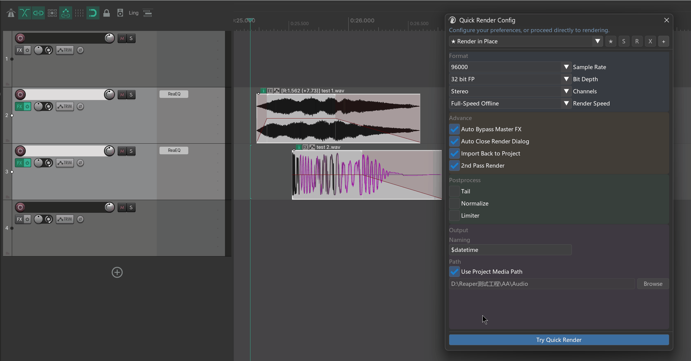
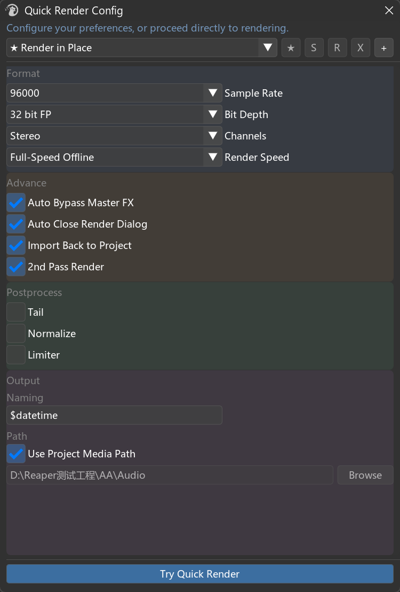
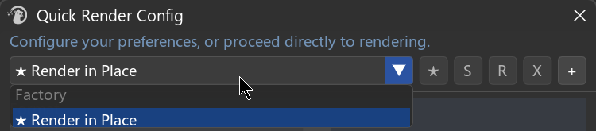
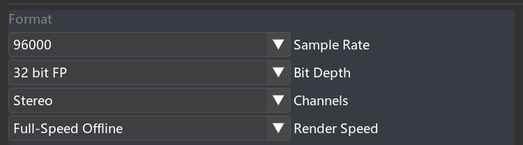
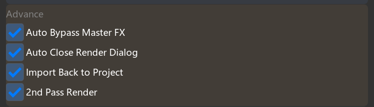
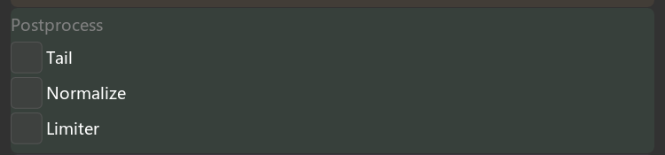
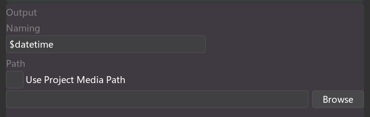

# Quick Render

---

## 1. What Is Quick Render?

**Quick Render solves a core gap in REAPER: there is no native one-click way to glue items across multiple tracks and bake FX into the result.**



Specifically:

- REAPER's native **Glue items** only works **inside a single track** and **does not** bake track or Master bus FX into the audio.
- To merge a selection of items **across multiple tracks** into **one file with FX baked in**, the native workflow requires opening the Render dialog, setting "selected media items (via master) / as one file," and adjusting parameters every time.

Quick Render compresses this into **select → one key**: it renders your selected items (which can span multiple tracks) **through the Master bus into a single file**, baking item, track, and Master FX into the output, and optionally **imports the result back into the project at the original position**.

It consists of **two parts** that work together:

| Part | What it is | What it does |
| --- | --- | --- |
| **Quick Render Config window** | A small configuration window (500×740) | Tune your common render parameters, save them as **presets**, and designate one as the **default preset** |
| **Quick Render one-click action** | A REAPER action that can be bound to a shortcut | Renders the current selection using the default preset without opening any window |

In one sentence: **configure once in the window, set it as default, then select items and press one shortcut to render a merged, FX-baked file.**

> **Difference from Render Queue:** Render Queue is a batch manager that accumulates a list and produces **multiple separate files**; it is suited for final project exports. Quick Render is a lightweight tool that merges the selected cross-track items **into one FX-baked file** with one click. They are independent— use whichever fits the task.

> **Parameter scope:** The Quick Render window exposes only the **most commonly used** parameters (enough for everyday game-sound quick exports). For finer format control (OGG/MP4, fades, silence removal, dither, etc.), use the more comprehensive **Render Queue**. If a native REAPER option you need is missing from both, use REAPER's own Render panel and **contact the plugin author** to request it.

---

## 2. Opening Quick Render

Quick Render provides two actions (search "Quick Render" in REAPER's Action List):

| Action name | Purpose |
| --- | --- |
| **`mantrika : Synergy - Quick Render Config`** | Toggle the **Quick Render Config window** on/off |
| **`mantrika : Synergy - Quick Render (use user's default preset)`** | **One-click render:** render the current selection using the default preset without opening a window |

> It is recommended to bind a shortcut to the second one-click action. In the Action List, select it → Add → press the key combination you want. This is the real payoff: select items → press the key → render is done.

---

## 3. Main Workflow (see the diagram first)

```
        ┌─────────────────────────────┐
        │  Quick Render Config window  │
        │  1. Set parameters            │
        │     (format/post/output)      │
        │  2. Save as Preset            │
        │  3. Click ★ to set default    │
        └──────────────┬──────────────┘
                       │  Default preset saved
                       ▼
        ┌─────────────────────────────┐
        │  From now on:                │
        │  Select items → press the    │
        │  one-click shortcut →        │
        │  render with default preset  │
        └─────────────────────────────┘
```

Spend a couple of minutes setting up the default preset the first time; after that, daily work usually uses only the one-click shortcut.

---

## 4. Window Overview (Config Window)



The window is divided into four colored sections from top to bottom:

| Area | Purpose |
| --- | --- |
| **Top preset bar** | Select / save / rename / delete presets and set the default |
| **Format 🔵** | Sample rate, bit depth, channels, render speed |
| **Advance 🟠** | Master FX bypass, auto-close render dialog, import back, second-pass render |
| **Postprocess 🟢** | Tail, loudness normalization, limiting |
| **Output 🟣** | File naming, output path |
| **Bottom button** | `Try Quick Render` — render once immediately using the parameters currently shown in the window |

---

## 5. First-Time Setup

```
1. Run the action "Synergy - Quick Render Config" to open the window.
2. Click the [+] button on the preset bar to create a new preset from the current parameters.
3. Adjust Format / Postprocess / Output to your usual settings.
4. Click [S] to save the changes back to the preset.
5. Click [★] to set it as the default (a ★ appears in front of its name).
6. Select the items you want to render in the project, then click [Try Quick Render] at the bottom to verify.
7. When satisfied, bind a shortcut to "Synergy - Quick Render (use user's default preset)".
 → From now on, select items and press the shortcut to render.
```

---

## 6. Top: Preset Bar

The preset bar = one **dropdown** + five **small buttons**.



### 6.1 Preset dropdown

The dropdown shows presets in two groups:

- **Factory:** Built-in presets. **Cannot be renamed, deleted, or overwritten** (see section 9).
- **User:** Presets you created. Fully editable.
- A **★** in front of a name marks the current **default preset**. When no preset is selected, it shows `No Preset`.

**Click a preset** to load all its parameters into the settings area below.

### 6.2 The five buttons (left to right)

| Button | Name | Purpose | Grayed out when |
| --- | --- | --- | --- |
| **★** | Set as Default | Set the currently selected preset as the **default** (used by the one-click action) | It is already the default |
| **S** | Save to Preset | Save the **current settings-area parameters** back to the selected preset | No preset selected / a Factory preset is selected |
| **R** | Rename | Rename the selected preset (a popup appears; press Enter to confirm) | No preset selected / a Factory preset is selected |
| **✕** | Delete | Delete the selected preset | No preset selected / a Factory preset is selected |
| **+** | New Preset | Create a new User preset from the **current settings-area parameters** (auto-named `Preset N`) | Never |

> **Remember to click S:** Changes made in the settings area live in the "working area." To keep them in a preset, you must click **S** (or **+** to create a new one first). Otherwise, switching to another preset or closing the window discards unsaved changes.
>
> **Default must be set manually:** Creating a new preset does **not** make it the default. Click **★** to set it. If no default preset exists, the one-click action will prompt you to set one in the Config window first.

---

## 7. Settings Area Explained

### 7.1 Format 🔵



| Field | Options | Description |
| --- | --- | --- |
| **Sample Rate** | 44100 / 48000 / 96000 | Output sample rate (Hz) |
| **Bit Depth** | 16 bit / 24 bit / 32 bit FP | Bit depth (output WAV precision) |
| **Channels** | Mono / Stereo | Channel configuration |
| **Render Speed** | Full-Speed Offline / 1x Offline / Online Render / Offline Render (Idle) / 1x Offline Render (Idle) | Render speed mode. The default `Full-Speed Offline` is usually fastest |

### 7.2 Advance 🟠



Four checkboxes:

| Option | Purpose |
| --- | --- |
| **Auto Bypass Master FX** | Temporarily bypass FX on the **Master** bus during rendering, then restore them afterward. Enable this when you want a "dry" file unaffected by Master processing. |
| **Auto Close Render Dialog** | Automatically close REAPER's render dialog after rendering finishes, saving a click. |
| **Import Back to Project** | Import the rendered file **back into the project as a new track**, placing it near the source items. |
| **2nd Pass Render** | **Second-pass render** (second pass improves loudness/limiting accuracy and can also help with looping material). |

### 7.3 Postprocess 🟢



Each item is a checkbox plus a parameter; it does nothing unless checked:

| Field | Parameter | Description |
| --- | --- | --- |
| **Tail** | `[ ] ms` | Append a tail length to the end of each render (default 1000 ms) to avoid cutting off reverb or delay. |
| **Normalize** | `Type [▼]` + `Target` | Loudness normalization. **Type** options: `LUFS-I / LUFS-M max / LUFS-S max / Peak / True Peak / RMS-I`; **Target** is the target value (default -23.0). |
| **Limiter** | `Ceiling [ ] dB` + `□ True Peak` | Limit to the specified ceiling (default -0.1 dB); check **True Peak** to use true-peak mode. |

### 7.4 Output 🟣



| Field | Description |
| --- | --- |
| **Naming** | Naming rule for the merged file (default `$item` — uses the selected item's name). REAPER naming wildcards are supported, such as `$item`, `$datetime`, etc., and can be combined freely. |
| **Use Project Media Path** | When checked, the output path **follows the current project's media folder** automatically (the manual path field becomes gray and disabled). The path updates when you switch projects. |
| **Path + Browse** | When the above is unchecked, specify the output folder manually: type directly in the field, or click **Browse** to open the system folder picker. |

> Naming examples: `$item` → file name equals the item name; `$item_$datetime` → item name plus timestamp.

---

## 8. Bottom: Try Quick Render

The blue button at the bottom, **`Try Quick Render`**, renders once immediately using the parameters **currently shown in the settings area**, regardless of the default preset. This is useful for testing while tuning.

Requirements:

- Select the items you want to render in the project first (the window itself does not enforce this, but rendering needs a selection).
- **Output Path cannot be empty**, or a popup warns `Please set an output path.`.

> Difference from the one-click action: `Try Quick Render` uses the **current parameters in the window** (good for testing). The one-click action uses the **preset you set as default** (good for daily work).

---

## 9. Built-in Preset: Render in Place

The Factory group includes a ready-to-use preset called **`Render in Place`**, tuned for "render in place and replace" scenarios:

- Format: **WAV / 32 bit FP / 96000 Hz / Stereo**, **second-pass render**
- Naming: `$datetime` (timestamp, avoids overwriting)
- Checked: **Auto Bypass Master FX**, **Auto Close Render Dialog**, **Import Back to Project**, **Use Project Media Path**

The result: select items → one click → high-quality render → automatically imported back into the project near the original position, saved to the project media folder. To use it directly, set it as default with **★**.

> It is a built-in preset, so it **cannot be renamed, deleted, or overwritten**. To customize it, select it first (its parameters load into the settings area), then click **[+]** to save a new User preset.

---

## 10. Typical Workflows

### Workflow A: Create a common preset + bind a shortcut (recommended daily workflow)

```
1. Open the Config window →[+] create a new preset.
2. Set WAV / 48000 / 24 bit, the normalization and limiting you need, and naming `$item`.
3. [S] Save → [★] Set as Default.
4. Bind a shortcut to "Quick Render (use user's default preset)".
5. From now on: select items → press shortcut → render done, no window needed.
```

### Workflow B: Use the built-in Render in Place directly

```
1. Open the Config window → select "Render in Place" from the Factory group.
2. Click [★] to set it as default.
3. Select items → one-click action → high-quality render imported back into the project.
```

### Workflow C: Render once with temporary settings without changing the default

```
1. Open the Config window and change the settings area to what you want for this render.
2. Select items → click [Try Quick Render].
3. Do not click S; close the window. The default preset is unchanged.
```

### Workflow D: Switch between multiple common configurations

```
1. Create several presets (for example, "Engine WAV 48k" and "Preview Reference").
2. When you need one, select it from the dropdown → [★] Set as Default.
3. The one-click action always follows the current default.
```

---

## 11. Troubleshooting

| Symptom | Cause | Fix |
| --- | --- | --- |
| Red text in the window: `REAPER v7.37+ Required` | REAPER version is too low | Upgrade REAPER to 7.37 or later |
| One-click action shows `No items selected.` | No items were selected before rendering | Select the items you want to render, then try again |
| One-click action shows `No default preset found...` | No default preset has been set | Open the Config window, select a preset, and click **★** to set it as default |
| `Try Quick Render` shows `Please set an output path.` | Output path is empty | Fill in the Output path, or check **Use Project Media Path** |
| Parameter changes disappear when switching presets | Changes were only in the working area, not saved | After changing, click **[S]** to save to the preset, or **[+]** to save as a new preset |
| **S / R / X** buttons are gray and unclickable | A Factory built-in preset is selected (not editable) | Click **[+]** to save it as a User preset first, then edit that one |
| Rendered sound is colored by Master FX | Master FX were not bypassed | Check **Auto Bypass Master FX** |
| Rendered file does not appear in the project | Import back was not enabled | Check **Import Back to Project** |

---
