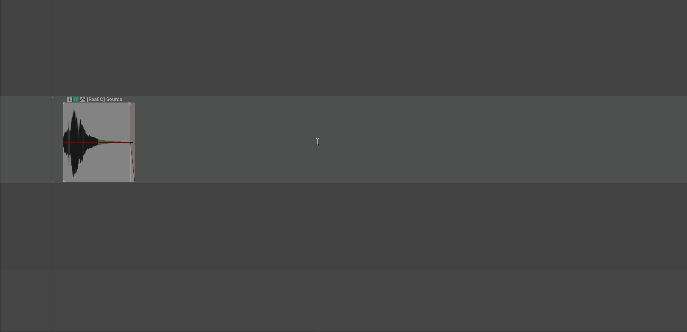
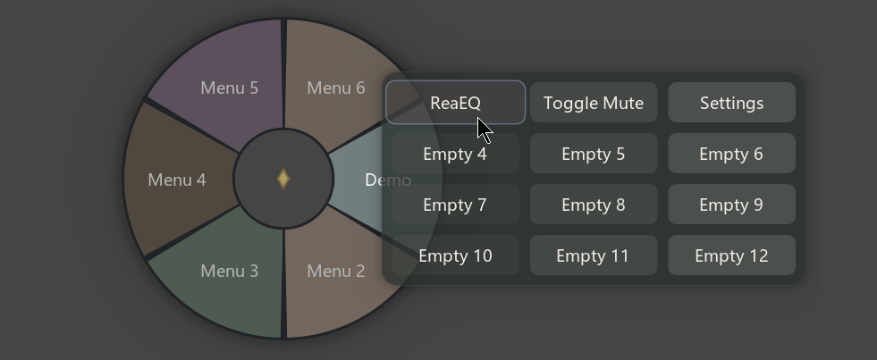
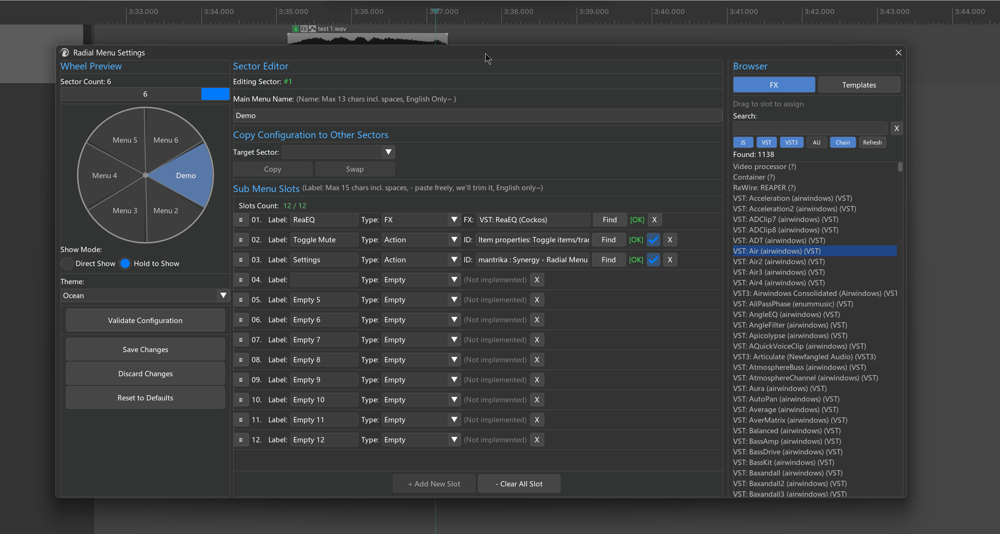
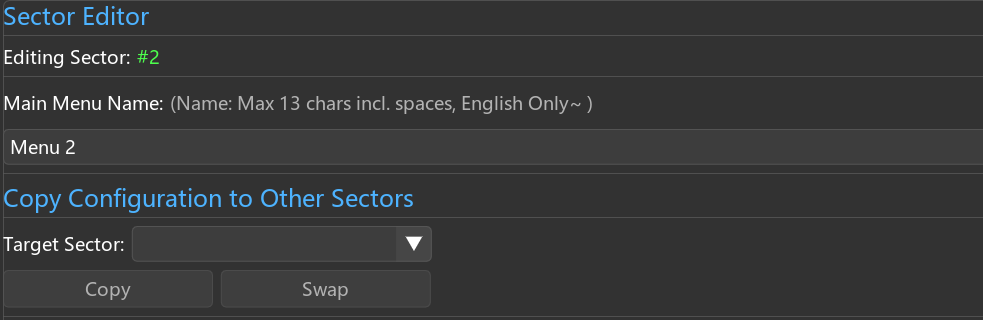
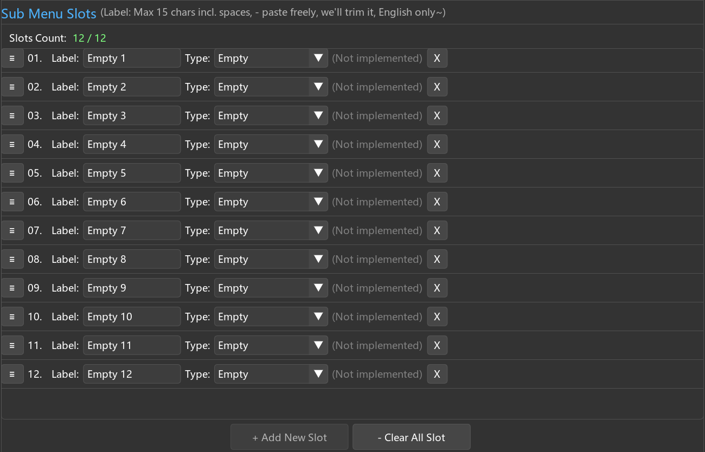

# Radial Menu

---

## 1. Overview

**Radial Menu** is a pie-style quick launcher in Mantrika Tools. The idea is **raise your hand, click, done in one second**.



It organizes your most-used actions, FX, and track templates into a two-level structure: **sectors → slots**, all inside a circular menu.

Press the shortcut → the menu appears at the mouse position → flick the mouse toward a sector and the submenu pops out → click or drag to complete the call.

The whole interaction is built around the mouse and a one-handed shortcut, so you never have to leave your current editing position.

---

## 2. How to open it (important: bind a single key)

Radial Menu has no fixed menu entry; you must bind it to a shortcut in REAPER's Action List first.

Action name: **`mantrika : Synergy - Radial Menu`** (search for "MTK Radial Menu").

> ⚠️ **Strongly recommended: bind a single key** such as `Z`, `Q`, `Tab`, or a mouse side button. **Do not bind a combo** like `Ctrl+Shift+R`.
> Two reasons:
> 1. Radial Menu has a "hold to show, release to close" mode (see §5), and holding a combo can trigger other side effects.
> 2. A single-key open speed directly determines how useful this tool is. Binding a combo is like putting a tractor transmission in a sports car.

Default behavior after opening:

- The menu appears **centered on the mouse**.
- You do not need to click; simply **flick the mouse** toward a sector to activate it.
- Releasing the shortcut closes the menu automatically (Windows supports Pin; see §7. Mac does not support Pin).

⚠️ **Special note for Mac users**: Pin is **not supported** on Mac, and the Radial Menu **automatically hides during dragging** so the mouse can pass through to the REAPER project window — this is a platform limitation, not a bug. See §8 for details.

---

## 3. Interface overview



| Area | Description |
| ---- | ----------- |
| **Radial dial** | Hollow center with sectors around the edge. Moving the mouse into a sector activates it and pops the submenu out. Up to 6 sectors. |
| **Submenu panel** | Up to 12 slots (4 columns × 3 rows). Background color follows the sector theme. |
| **Center pin icon** | On Windows, a small orange diamond appears when pinned. Not present on Mac. |

---

## 4. Basic usage — a complete call

Most common scenario: use Radial Menu to add FabFilter Pro-Q 3 to the current track.

**Steps**:

1. Select the target track (or item / take) in REAPER.
2. Press your bound single-key shortcut — the menu appears at the mouse position.
3. Flick the mouse toward a sector (no click needed; in non-Pin mode the mouse direction activates it) — the submenu pops out.
4. Move the mouse over a slot.
5. **Click** or **drag** — the action / FX is applied to the current selection and the menu closes.

---

## 5. Two display modes

You can switch the open/close behavior in Settings (see §11):

| Mode | Behavior | Best for |
| ---- | -------- | -------- |
| **Direct Show** (default) | Press the shortcut once to open the menu; it closes after you choose an action or when focus is lost. | When you do not want to hold a key. |
| **Hold to Show** | Hold the shortcut to show the menu; release or execute a slot to close. | Maximum speed — the whole call becomes "press → flick → release" in one motion. |

> **Why Hold to Show must use a single key**: holding a combo keeps firing OS-level shortcut behavior, for example holding `Ctrl+Z` keeps undoing. A single key does not have this problem.

---

## 6. Submenu — click vs. drag

After entering a submenu, each slot has two very different trigger methods:

### 6.1 Click — apply to the current REAPER selection

Move the mouse over a slot and press and release the left mouse button **without moving**.

Behavior: applies the action / FX to **whatever is currently selected in REAPER** (track / item / take). Where exactly it lands depends on §9 "Smart target detection".

### 6.2 Drag — apply to the object under the release point

Move the mouse over a slot, press the left button, **hold and move** to a location in the REAPER project window (track, item, take, or empty area), then release.

Behavior: ignores the current REAPER selection and **applies to whatever object is under the mouse when you release**.

| Release location | Result |
| ---------------- | ------ |
| A track in the TCP | Apply to that track |
| An item in the Arrange view | Apply to that item |
| The active take of an item | Apply to that take |
| Empty area of the TCP / Arrange view | **Create a new track automatically and apply there** |
| Outside the window | Cancel automatically, no effect |

> **Core difference**:
> - **Click** = "do this to what I already selected"
> - **Drag** = "do this to whatever I am pointing at"
>
> Drag is useful when you want to specify a target precisely or do not want to adjust the REAPER selection first.

---

## 7. Pin (Windows only)

**Right-click** any sector in the dial to toggle Pin state. When pinned, an orange diamond appears in the center.

After pinning:

- The menu does not close on focus loss.
- After executing an action / FX, the **menu stays open** — you can perform multiple operations in a row.

Good for:

- Adding several FX to one track in sequence.
- Using Radial Menu as a persistent panel.

Right-click the same sector again to unpin.

---

## 8. Mac-specific notes

Because Mac windowing and mouse-passthrough work differently, **Radial Menu behaves differently on Mac in two ways**:

### 8.1 Pin not supported

The Mac version has no Pin feature; right-clicking a sector does nothing. The menu closes automatically after every operation.

### 8.2 Window hides during dragging

On Mac, the moment you hold a submenu slot and start dragging, the **Radial Menu window immediately hides**, leaving only a small floating label following the mouse.

This allows the mouse to "pass through" to the REAPER project window below and hit tracks / items. After the drag ends (mouse release), the FX / action is applied to the object under the release point.

**Practical impact for Mac users**:
- You cannot see the wheel while dragging.
- Release over the target track / item in REAPER; the behavior is identical to the Windows version.
- Click mode behaves the same as on Windows, with no visual difference.

---

## 9. Smart target detection (click mode)

When you **click** a slot, where the FX / action lands depends entirely on the **current REAPER selection**. Radial Menu decides your intent automatically:

| Current selection | FX lands on |
| ----------------- | ----------- |
| Only items selected | The **active take** of each selected item |
| Only tracks selected | Each selected **track** |
| Items + tracks selected, and every selected track has a selected item on it | Still **items** |
| Items + tracks selected, but some track has no selected item | **Tracks** |
| Nothing selected | **Last Touched Track** (fallback) |

> This rule is identical to FX Search: items are more "specific" than tracks, so items take priority when both are present.

### 9.1 Batch threshold confirmation

When an operation targets **5 or more** objects, REAPER's native confirmation dialog appears:

> `Apply to 12 targets?`

Click **OK** to proceed; **Cancel** exits silently.
Slots with **Global Action** checked bypass this threshold (see §13.4).

---

## 10. Keyboard / mouse cheat sheet

| Input | Behavior |
| ----- | -------- |
| Custom shortcut (single key recommended) | Open / close the menu |
| Hold shortcut | Show menu in Hold to Show mode; release to execute |
| Mouse movement | Enter a sector → submenu pops out |
| **Click** a submenu slot | Apply to current REAPER selection |
| **Drag** a submenu slot | Apply to object under release point |
| **Right-click** a sector (Windows) | Toggle Pin |
| Esc | Close menu (ignored when pinned) |

---

# Configuration

---

## 11. Opening the settings window

Action name: **`mantrika : Synergy - Radial Menu Settings`** (search for "MTK Radial Menu Settings").

Extensions menu path: `Extensions → Mantrika Tools → Mantrika Options → Radial menu settings...`

You can also reach it from the default configuration by clicking "Settings" in one of the sectors (if you have not changed the default config).



The settings window has three columns:
- **Left column**: number of sectors, display mode, theme, bottom action buttons.
- **Middle column**: submenu editor for the selected sector.
- **Right column**: FX / Template Browser; drag items to the middle column to fill slots quickly.

> All changes are **tentative** until you click **Save Changes**.

---

## 12. Configuring sectors



### 12.1 Number of sectors

Slider at the top of the left column: 1 to 6 sectors.

### 12.2 Select a sector to edit

In the left-column dial preview, **click the sector** you want to edit. The selected sector turns blue (or red if that sector has configuration issues).

### 12.3 Name a sector

Type in the **Main Menu Name** field at the top of the middle column. **English, maximum 13 characters**.

---

## 13. Configuring submenu slots



The middle column shows the slot list for the selected sector; each sector can have up to 12 slots.

### 13.1 Add / delete / reorder

| Operation | Behavior |
| --------- | -------- |
| Click **+ Add New Slot** | Adds an empty slot at the end |
| Click **- Clear All Slot** | Clears all slots in the current sector |
| Click the **X** at the end of a slot row | Deletes that slot |
| Drag the **≡** handle at the start of a slot row | Reorders slots up or down |

### 13.2 Three fields per slot

| Field | Description |
| ----- | ----------- |
| **Label** | Text shown in the submenu. English, maximum 15 characters. Pasting longer text truncates automatically. |
| **Type** | One of: `Action` / `FX` / `Track Template` / `Empty` |
| **Value** | Depends on Type (see below) |

### 13.3 How to fill each Type

**Type = Action**
- Click the **Find** button → REAPER's native Action Picker opens → choose an action; it fills automatically.
- After filling, `[OK]` or `[Invalid]` appears on the right.

**Type = FX**
- Use the **FX Browser** in the right column to find the plug-in, then **drag it onto the slot**.
- Or type the plug-in name directly in the input box (search suggestions supported).
- After filling, `[OK]` or `[Missing]` appears on the right.

**Type = Track Template**
- Use the **Templates Browser** in the right column to find the template, then **drag it onto the slot**.
- After filling, `[OK]` or `[Missing]` appears on the right.

**Type = Empty**
- Placeholder; does nothing.

### 13.4 Global Action checkbox (Action type only)

Each Action-type slot has a small checkbox at the end of its row:

- **Unchecked** = the action runs once per selected target according to smart target detection. For example, with 5 tracks selected it runs 5 times.
- **Checked** = the action runs **once**, ignoring the number of selected targets. Use this for global actions like "open render dialog" or "toggle grid settings" that should not trigger batch confirmation. In most cases it is recommended to check this option.

---

## 14. Right column: FX / Template Browser

Switch tabs: **FX** or **Templates**.

### FX Browser

- Top search box filters in real time.
- Five type buttons below (JS / VST / VST3 / AU / Chain) control which types are shown.
- **Refresh** button: click after installing new plug-ins or adding new `.RfxChain` files.
- **Drag list items to slots in the middle column** to fill them automatically.

### Templates Browser

- Search box filters.
- **Refresh** button: click after adding new Track Template files.
- **Drag to a slot** to fill it automatically.

---

## 15. Bottom buttons in the left column

| Button | Behavior |
| ------ | -------- |
| **Validate Configuration** | Checks whether Action IDs / FX / Templates in all sectors are still valid; sectors with invalid items are highlighted red in the dial preview. |
| **Save Changes** | Saves to disk; Radial Menu reloads the new configuration immediately. |
| **Discard Changes** | Discards all unsaved changes and reloads from disk. |
| **Reset to Defaults** | Resets all sectors to the default configuration (**theme colors are preserved**). |

---

## 16. Display mode / theme (middle of left column)

### Show Mode

- **Direct Show** (default): press shortcut once to open, press again to close.
- **Hold to Show**: hold to show, release to execute and close.

### Theme

- **Preset themes** (Rainbow / Dark / etc.): automatically generate colors based on the number of sectors.
- **Custom**: selecting this reveals the **Edit Colors...** button → assign individual colors to each sector.

---

## 17. Typical workflows

### Workflow A: ultra-fast common EQ (Hold to Show mode)

```
1. Select a track
2. Hold the Z key (your bound shortcut)
3. Flick the mouse toward the "EQ" sector
4. Move the mouse over the "FabFilter Pro-Q 3" slot
5. Release Z
```

**Result**: FX added, menu closes automatically. The whole process takes under 0.5 seconds.

---

### Workflow B: drag to specify a precise target

```
1. Press Z to open Radial Menu
2. Move the mouse into the "Reverb" sector
3. Press and hold the left button on the "Valhalla Room" slot
4. Drag onto the target item in the Arrange view
5. Release
```

**Result**: Valhalla is added to the active take of that item, ignoring your current REAPER selection.

---

### Workflow C: pin and chain multiple FX (Windows)

```
1. Press Z to open Radial Menu
2. Right-click any sector → Pin; an orange diamond appears in the center
3. Click Pro-Q in the "EQ" sector → added, menu stays open
4. Click Pro-C in the "Compressor" sector → added
5. Click Pro-L in the "Limiter" sector → added
6. Right-click the sector again → unpin → menu closes
```

---

### Workflow D: customize your common FX layout

```
1. Trigger the Radial Menu Settings action
2. Set the sector slider to the number you want (e.g. 4)
3. Click sector 1 in the left-column preview
4. Name it "EQ" in the middle column
5. Search for "Pro-Q" in the right column and drag it to slot 1 in the middle column
6. Repeat to add other common EQs
7. Click other sectors to set up Compressor / Reverb / Utility...
8. Click Save Changes
```

---

## 18. Troubleshooting

| Symptom | Cause | Fix |
| ------- | ----- | --- |
| Shortcut does nothing | Action not bound / bound to a combo | Re-bind "MTK Radial Menu" in the Action List to a single key |
| Submenu does not pop after entering a sector | That sector has no slots | Go to Settings and add slots to that sector |
| Action-type slot shows `[Invalid]` | Action was uninstalled or renamed | Click Find and re-select it |
| FX-type slot shows `[Missing]` | FX not installed / path changed | Click Refresh in the FX Browser to rescan |
| Hold to Show does not display while holding | Bound to a combo, which the OS intercepts while held | Re-bind to a single key |
| Dragging to empty area creates an unexpected new track | Release point was recognized as empty → triggers new-track creation | This is expected; to cancel, release outside the window |
| Window disappears during dragging on Mac | Mac platform limitation requires hiding to passthrough | This is expected |
| Right-clicking a sector does nothing on Mac | Mac does not support Pin | This is a platform limitation |
| Radial Menu does not change after editing | Save Changes was not clicked | Go back to Settings and click Save |
| Confirmation dialog appears after selecting 5+ tracks | Batch threshold protection | Click OK to proceed, or check the slot's Global Action checkbox (Action type only) |
| Clicking a submenu slot does nothing | Mouse moved outside the slot area before release | Retry, keeping the cursor inside the slot while held |

---

## 19. Persistence

| Setting | Persisted? | Location |
| ------- | ---------- | -------- |
| Sector structure / slot config | ✅ | Radial Menu config file (written after Save Changes) |
| Display mode / theme | ✅ | Same as above |
| Pin state (Windows) | ❌ | Reset to unpinned every time the window opens |
| Type filters (FX Browser) | ❌ | Reset every time you enter Settings |
| Search box text | ❌ | Cleared on close |

---

## 20. Relationship with other modules

| Related module | Description |
| -------------- | ----------- |
| **FX Search** | Another way to quickly call up plug-ins (linear search). Radial Menu is best for **a small set of high-frequency items**; FX Search is best for **long-tail searches**. They share the same FX application engine and behave identically. |
| **Preferences §3.6** | Controls the FX insertion window policy (`Don't show` / `Show FX chain` / `Show floating window`). Radial Menu follows this policy when applying FX. |
| **Mirror Segments** | Mirror items are non-mixing UI/UX proxies; you cannot add FX to a Mirror Segment via Radial Menu. |

---
