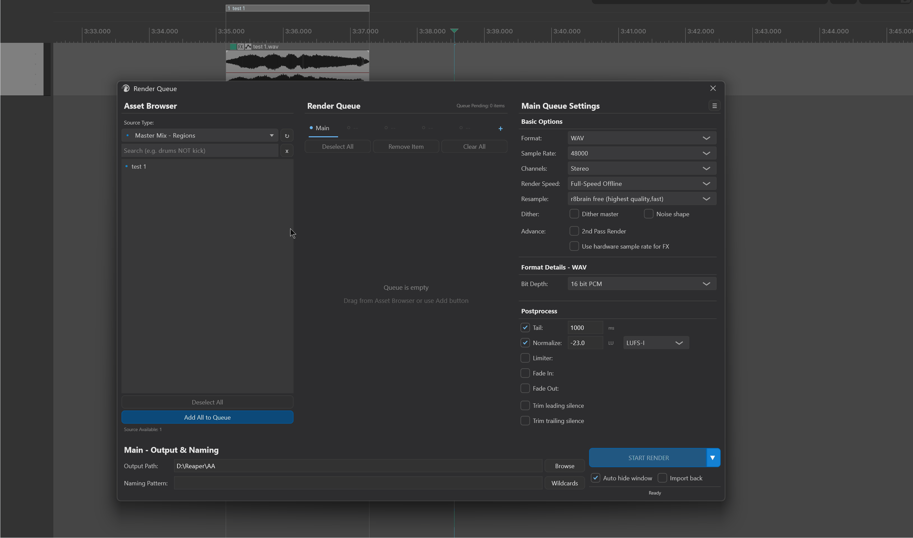
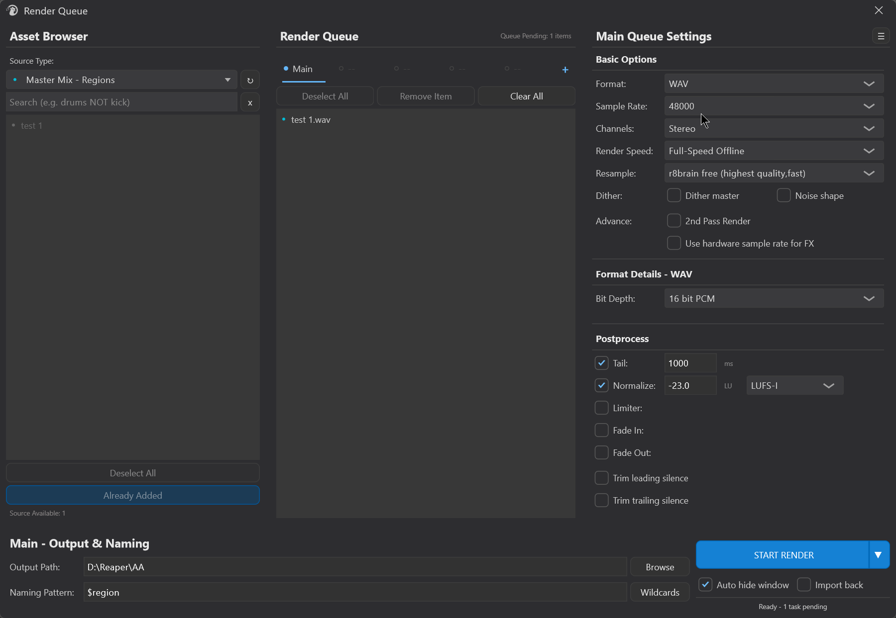
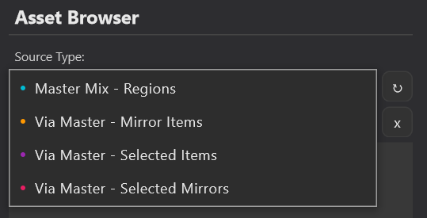
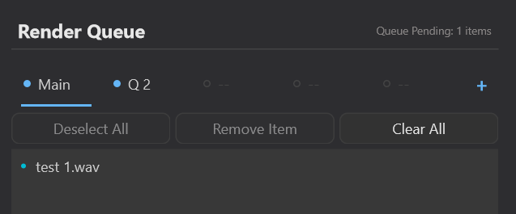
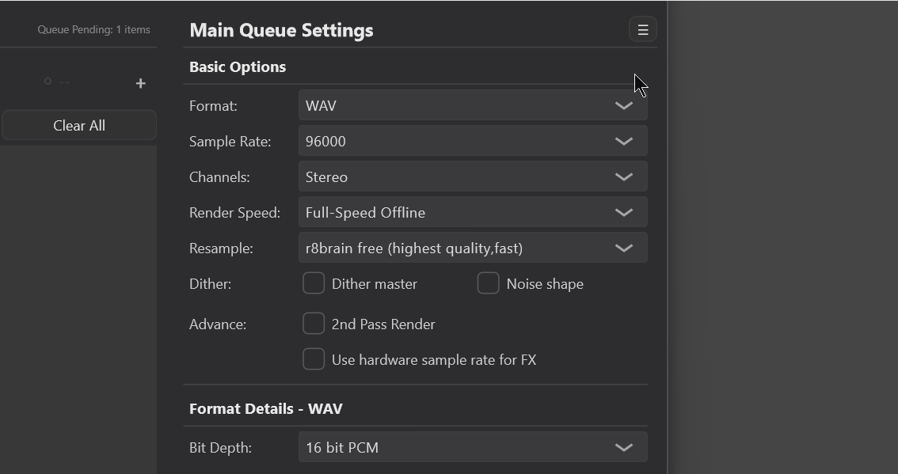
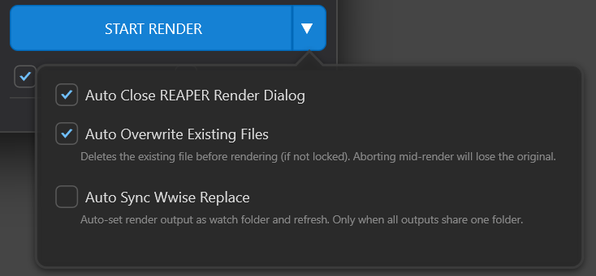

# Render Queue

---

## 1. Overview

**Render Queue** is a batch-render management console. Its purpose is **collect what you want to render into one list → configure format and post-processing → render everything with one click**.



It solves several pain points of REAPER's native rendering:

- Want to render multiple regions or items with different formats or loudness settings? The native dialog forces you to change and click repeatedly.
- Want to produce both a "WAV 48 kHz for the engine" and an "OGG for preview" in one go?

Render Queue wraps this into a three-column window: **left column picks assets → middle column queues them → right column configures parameters**, with **output path + naming + START RENDER** at the bottom. The configuration is **saved automatically with the project** and is still there the next time you open it.

> **About parameter scope**: the render parameters here correspond almost one-to-one with REAPER's own Render panel, but trimmed to the actual needs of **game-audio rendering**. If you find a REAPER-native option that is essential and missing here, use REAPER's own Render panel for that render and **contact the extension author** — the missing option may be added to the interface.

> This manual only covers the Render Queue window. **Quick Render** (one-click rendering of selected items) is a separate feature and is not covered here.

---

## 2. Opening the tool

Menu path:

```
Extensions → Mantrika Tools → Render queue
```

Or use the Action List (search "Render Queue"):

| Action name | Function |
| --- | --- |
| **`mantrika : Synergy - Render Queue`** | Toggle the Render Queue window on/off |

The window is a standalone floating window; you can drag, resize, close, and reopen it. It restores its previous state when reopened.

---

## 3. Interface overview



The workflow runs **left to right, then bottom**:

| Area | What it does |
| ---- | ------------ |
| **Left column: Asset Browser** | Pick the assets you want to render (regions / items) and add them to the queue |
| **Middle column: Render Queue** | See what is currently queued; create multiple queues to split different configurations |
| **Right column: Config** | Configure format, sample rate, and post-processing for the current queue (or a single item) |
| **Bottom: Output & Naming** | Set output folder, file-naming rules, then press **START RENDER** |

---

## 4. Fastest getting-started flow (four steps)

```
1. In the left column, choose a Source Type (for example, "Master Mix - Regions") → the list shows all regions.
2. Select the ones you want and click [Add Selected]; they appear in the middle-column queue.
3. In the right column, set Format / Sample Rate / any post-processing you need (fade, loudness normalization...).
4. Set the output folder at the bottom → click START RENDER (or press Enter).
```

The rest of this manual explains each column in detail.

---

## 5. Left column: Asset Browser (picking assets)

### 5.1 Source Type — decide what to render

The **Source Type:** dropdown at the top determines which kind of assets the list grabs. There are four types, each with its own color dot:



| Option | Color | What it renders |
| ------ | ----- | --------------- |
| **Master Mix - Regions** | Cyan | Render each region through the master bus |
| **Via Master - Mirror Items** | Orange | Mirror items through the master bus |
| **Via Master - Selected Items** | Purple | The items currently selected in the project, through the master bus |
| **Via Master - Selected Mirrors** | Pink | Selected named Mirror items through the master bus |

> The most common choice is **Master Mix - Regions**: draw regions around each sound in the project, and this list lets you render them all as separate files in one go.

### 5.2 Search and refresh

- **Search box** (placeholder `Search (e.g. drums NOT kick)`): type keywords to filter the list. Supports logic such as `AND`, `NOT`, `OR` (for example, `drums NOT kick` = contains "drums" but not "kick"). Click the **`x`** on the right to clear the search.
- **`↻` refresh button**: rescans the assets in the project.
 - If there are **more than 150** assets, auto-refresh is disabled to avoid lag, and the button tooltip changes to `Auto-refresh disabled (too many items, >150)` — click `↻` manually to refresh.

### 5.3 Adding to the queue

After selecting assets, send them to the middle-column queue in one of three ways:

| Method | Description |
| ------ | ----------- |
| **Select → click bottom button** | The button text changes with state: when items are selected it shows **`Add Selected (N)`**; when nothing is selected it shows **`Add All to Queue`** (adds the whole filtered list). |
| **Drag and drop** | Drag assets directly from the list to the middle-column queue area. |
| **Double-click** | Double-click an asset to **jump to its position on the timeline**, useful for confirming it is the right one before adding it. |

The bottom label **`Source Available: N`** shows how many assets are available for the current type; **`Deselect All`** clears the current selection.

> **Two cases where the button is grayed out**:
> - **`Requires New Queue`**: the selected asset type does not match the type already locked by the current queue (each queue holds only one Source Type; see §6.2). Create a new queue first.
> - **`Already Added`**: the selected assets are already all in the current queue.

---

## 6. Middle column: Render Queue (lining up)

### 6.1 What is in the queue

The top of the middle column shows the title **Render Queue**, and **`Queue Pending: N items`** shows the current queue's pending count in real time.



When empty, the queue shows:

```
Queue is empty
Drag from Asset Browser or use Add button
```

Each entry shows the asset name plus a colored dot indicating its type. Three buttons at the bottom:

| Button | Function |
| ------ | -------- |
| **Deselect All** | Clear selection inside the queue |
| **Remove Item** | Remove the selected entry (grayed out when nothing is selected) |
| **Clear All** | Empty the entire queue (grayed out when the queue is empty) |

### 6.2 Multiple queues — split configurations with tabs

Above the queue title is a row of **tabs**. Each tab is an independent queue, **up to 5**. This is the core workflow:

> **One queue = one configuration + one Source Type**.
> Want to produce both "WAV for the engine" and "OGG for preview" at the same time? Open two queues, configure each separately, and one START RENDER renders both.

Tab operations:

| Operation | Behavior |
| --------- | -------- |
| **Click tab** | Switch to that queue (right-column config switches with it) |
| **Dot on tab** | Shows that queue's **enabled** state; click it to toggle. **Disabled queues are not rendered** |
| **Right-click tab** | Menu: **Enable / Disable**, **Rename**, **Delete** |
| **`[+]` button** | Create a new queue (grayed out when 5 queues already exist) |

> Each queue locks to the Source Type of the first asset added; afterwards only assets of the same type can be added (this is why the left column shows `Requires New Queue`).

---

## 7. Right column: Config (parameters)

The right column is the render parameter panel. The title changes depending on the current selection:

- Nothing selected: **`<Queue name> Queue Settings`** (default `Main Queue Settings`) — edits configuration for the **whole queue**.
- Single entry selected: title becomes the entry name + `Settings`, and an **Override** switch appears (see §7.1).
- Multiple entries selected: title shows `[N items selected]` and the config form is disabled (multi-selection does not support config changes).

The **`☰`** button in the top-right corner opens **Presets** (see §8).

### 7.1 Override — special settings for a single entry

By default all entries in a queue share the queue's configuration. If one entry needs different settings:

```
1. Click that entry in the middle column (single selection)
2. The right column shows □ Override Queue Settings
3. Check it → the config form unlocks, and changes affect only this entry
```

The switch is **orange = not overridden** (follows queue), **green = overridden** (independent); overridden entries show `[Override]` in their title.

> Note: **output path and naming rules are always queue-level**. Override only covers format / post-processing parameters.

### 7.2 Basic Options

| Item | Description |
| ---- | ----------- |
| **Format** | Output format: WAV / OGG Vorbis / OGG Opus / MP4 (H.264/AAC). Choosing a format reveals its detail panel below (for example, bit depth for WAV). |
| **Sample Rate** | Sample rate, 8000 ~ 192000 Hz |
| **Channels** | Channels: Mono / Stereo / 4 / 6 / 8 |
| **Render Speed** | Render speed mode (Full-Speed Offline / 1x Offline / Online / Offline idle, etc.) |
| **Resample** | Resampling algorithm, from Point Sampling to `r8brain free (highest quality, fast)` |
| **Dither** | `Dither master` / `Noise shape` (noise shape requires dither to be enabled first) |

### 7.3 Advance

| Item | Description |
| ---- | ----------- |
| **2nd Pass Render** | Two-pass render (second pass is useful for precise loudness/limiting, or works particularly well for game-audio loop material) |
| **Use hardware sample rate for FX** | Process FX at the hardware sample rate |

### 7.4 Postprocess

Each item is a checkbox + parameters; unchecked means no effect:

| Item | Parameters | Description |
| ---- | ---------- | ----------- |
| **Tail** | `[ ] ms` | Append a tail length at the end of each render (default 1000 ms) |
| **Normalize** | `[value] [LU/dB] [type▼]` | Loudness normalization. Type options: **LUFS-I / LUFS-M max / LUFS-S max / Peak / True Peak / RMS-I**; LUFS types show `LU`, others show `dB` |
| **Limiter** | `[value] dB [Peak/True Peak▼]` | Limit to the specified ceiling (default -0.1 dB) |
| **Fade In** | `[ ] ms [curve▼]` | Fade in. Curves: Linear / Fast Start / Fast End / Slow Start/End / Sharp Curve |
| **Fade Out** | `[ ] ms [curve▼]` | Fade out; same curves as Fade In |
| **Trim leading silence** | `threshold [ ] dB` | Cut leading silence below the threshold (default -60 dB) |
| **Trim trailing silence** | `threshold [ ] dB` | Cut trailing silence |

---

## 8. Presets

Click the **`☰`** button in the right column to open the **Queue Preset Manager**, where you can save a full configuration for reuse.



| Operation | How |
| --------- | --- |
| **Save preset** | Type a name in `Enter preset name...` → click **Save** |
| **Apply preset** | Click a preset row; the configuration is applied to the current queue immediately |
| **Set default** | Click **Default** on a row (click **Unset** to remove). A default preset is **automatically applied to new queues** |
| **Delete preset** | Click the **✕** at the end of a row |

When there are no presets, the list shows `No presets saved yet`.

---

## 9. Bottom: Output & Naming + rendering

### 9.1 Output path

- **Output Path** input box + **Browse** button. Clicking Browse opens a quick picker:
 - **`⌂ Current Project Folder (Same as .RPP)`** — use the folder where the project file is located
 - **`⧉ Open System Dialog...`** — open the system folder picker
 - Below that, **recently used paths** (or `No recent paths` if none)

### 9.2 Naming pattern and wildcards

- **Naming Pattern** input box (default `$region`) determines the output file name.
- Click **Wildcards** to open a panel listing available tokens by category (Region / Item / Time / Project info, etc.); click one to insert it into the naming box.
- The panel also lets you choose a **separator** (`Separator:` →**None / `_` / `-`**) and **↺ Reset to Default** to restore the default pattern for the current Source Type.

> Example: `$region` → output file name is each region's name; `$project_$region` → project name + underscore + region name.

### 9.3 START RENDER

The large button at the bottom triggers rendering:

| Situation | Button text | Render scope |
| --------- | ----------- | ------------ |
| No entry selected | **`START RENDER`** 🔵 | All **enabled** queues, fully rendered |
| Entry/entries selected | **`RENDER SELECTED`** / **`RENDER SELECTED (N)`** 🟠 | Only the selected entries |

Extra tips:

- **Press `Enter`** — same as clicking START RENDER.
- **Hold `Shift` and click the button (or `Shift+Enter`)** — even if entries are selected, forces rendering of **all enabled queues** (the button tooltip also notes this).
- Before rendering starts, focus is handed back to REAPER, and REAPER's own render progress window shows the progress.

### 9.4 Two switches

| Switch | Function |
| ------ | -------- |
| **Auto hide window** | Automatically hide the Render Queue window when rendering finishes (on by default) |
| **Import back** | Import the rendered files back into the project after rendering |

The **status text** on the far right (`Ready` / `Selected: ...` / `Ready - N tasks pending`) shows the current state and pending count in real time.

### 9.5 Render settings menu (`▼` to the right of the button)



The small triangle **`▼`** to the right of START RENDER opens global switches:

| Switch | Description |
| ------ | ----------- |
| **Auto Close REAPER Render Dialog** | Automatically close REAPER's render dialog when rendering finishes |
| **Auto Overwrite Existing Files** | If the output file already exists, delete the old file before rendering. ⚠️ Aborting a render after this is enabled will lose the original file. |
| **Auto Sync Wwise Replace** (Windows only) | After rendering, automatically set the output folder as Wwise Replace's watch folder and refresh (only works when all outputs are in the same folder) |

> When **Auto Overwrite** is enabled, the tool checks whether the target files can be deleted before rendering; if any file is **locked by another program**, rendering is aborted and you are told which file — close the program that has it open and try again.

---

## 10. Typical workflows

### Workflow A: render all regions in the project as separate WAV files

```
1. Draw regions around each sound in the project
2. Left column Source Type = "Master Mix - Regions" → list shows all regions
3. Click [Add All to Queue] to add them all
4. Right column: Format = WAV, Sample Rate = 48000, Channels as needed
5. Naming box = $region, output = [Current Project Folder]
6. START RENDER (or press Enter)
```

### Workflow B: produce two formats from the same batch

```
1. Queue 1: add assets, configure WAV 48 kHz (for the engine)
2. Click [+] to create Queue 2, add the same assets, configure OGG (for preview)
3. Keep both tab dots enabled
4. Do not select any entry, then START RENDER → both configurations render in one pass
```

### Workflow C: same configuration for the whole batch, but one entry needs special treatment

```
1. All entries follow the default (for example, normalize to -23 LUFS)
2. Single-click the special entry → check □ Override Queue Settings (turns green)
3. Change only that entry to -16 LUFS / add a fade-out
4. START RENDER → that entry uses its own settings, the rest use the queue settings
```

### Workflow D: save a common configuration for reuse

```
1. Set format / sample rate / post-processing to your usual values
2. Click ☰→ type a name → Save
3. Click that preset's Default to make it the default
4. From now on, every [+] new queue automatically loads this configuration
```

---

## 11. Troubleshooting

| Symptom | Cause | Fix |
| ------- | ----- | --- |
| Left-column list is empty | No assets of the current Source Type exist; or project has no regions / no items selected | Switch Source Type; or create regions / select items in the project first, then click `↻` |
| `Add` button shows **Requires New Queue** and is grayed out | Selected asset type differs from the type locked by the current queue | Click `[+]` to create a new queue, then add that type of asset |
| `Add` button shows **Already Added** | Selected assets are already all in the current queue | Normal; nothing to do |
| Clicking `↻` does not auto-update | More than 150 assets; auto-refresh disabled | Click `↻` manually each time |
| START RENDER is grayed out and unclickable | No renderable entries, or all queues are disabled | Add assets to the queue; check that tab dots are enabled |
| Right-column config cannot be changed | Multiple entries selected (multi-select disables config), or single entry selected but Override not checked | Deselect to edit queue config, or check Override on a single entry |
| Rendering aborts with a "file in use" message | Auto Overwrite enabled, but the target file is locked by another program | Close the program using that file (player / engine), then render |
| Window disappears after rendering | `Auto hide window` is on (default behavior) | Uncheck it if you prefer the window to stay open |
| Worried about losing config changes | (Not possible) configuration is saved automatically with the project | Closing, reopening, or switching projects preserves the settings |

---
