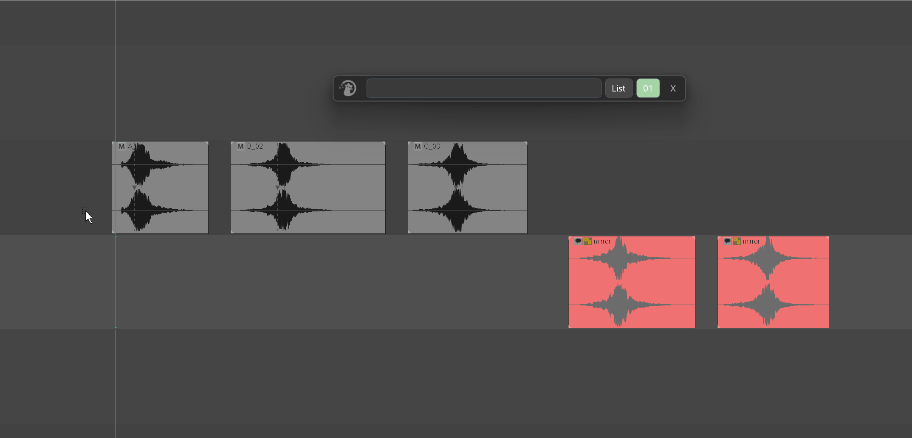
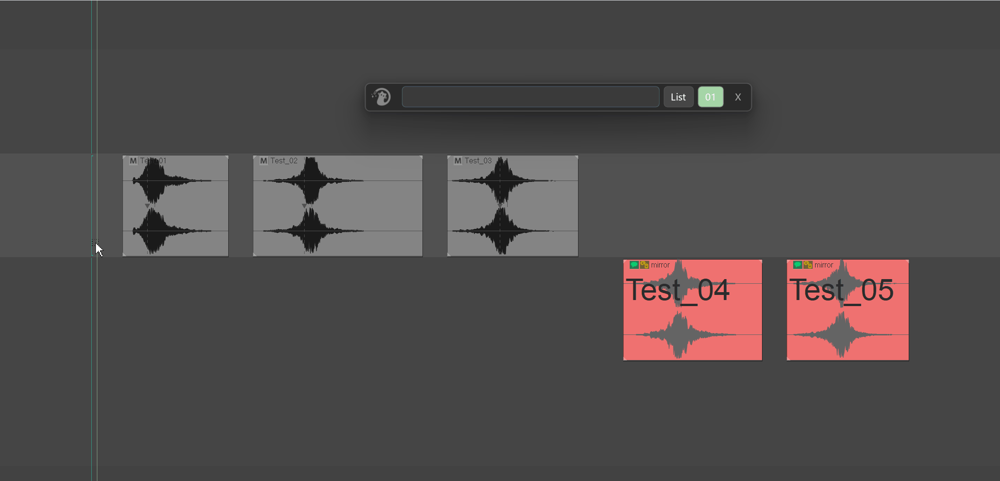
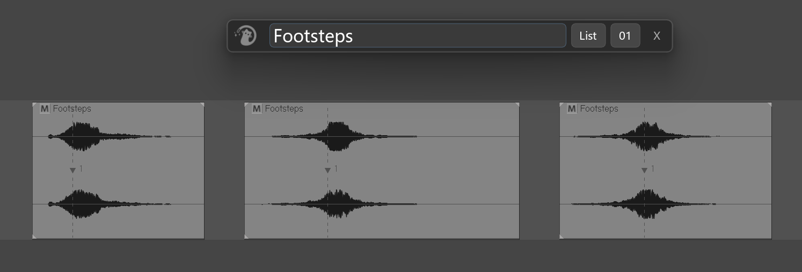
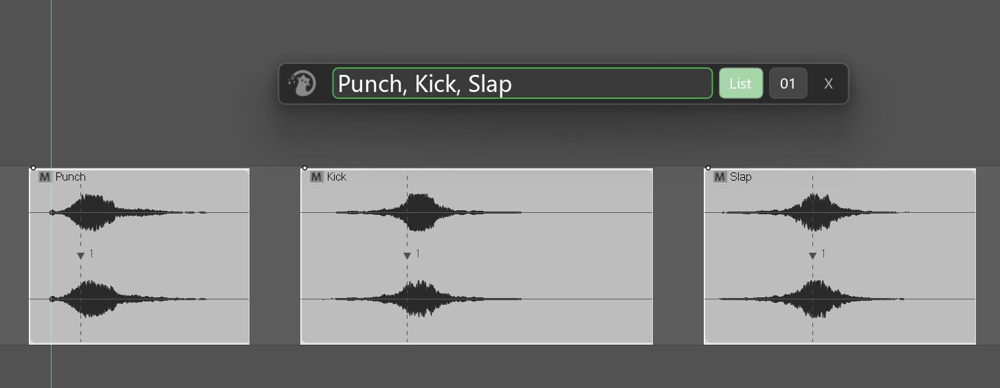
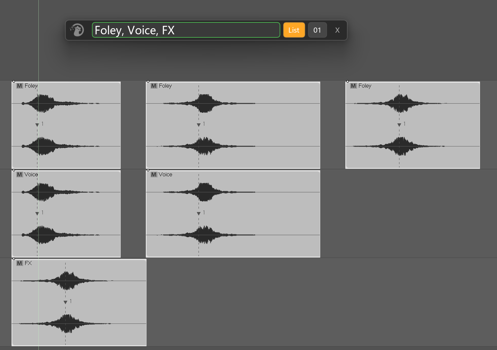
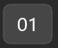
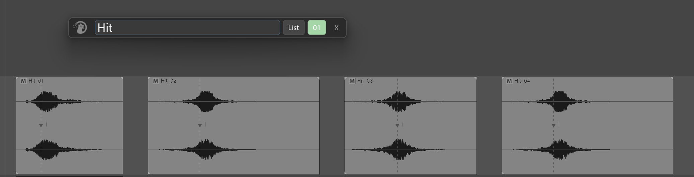
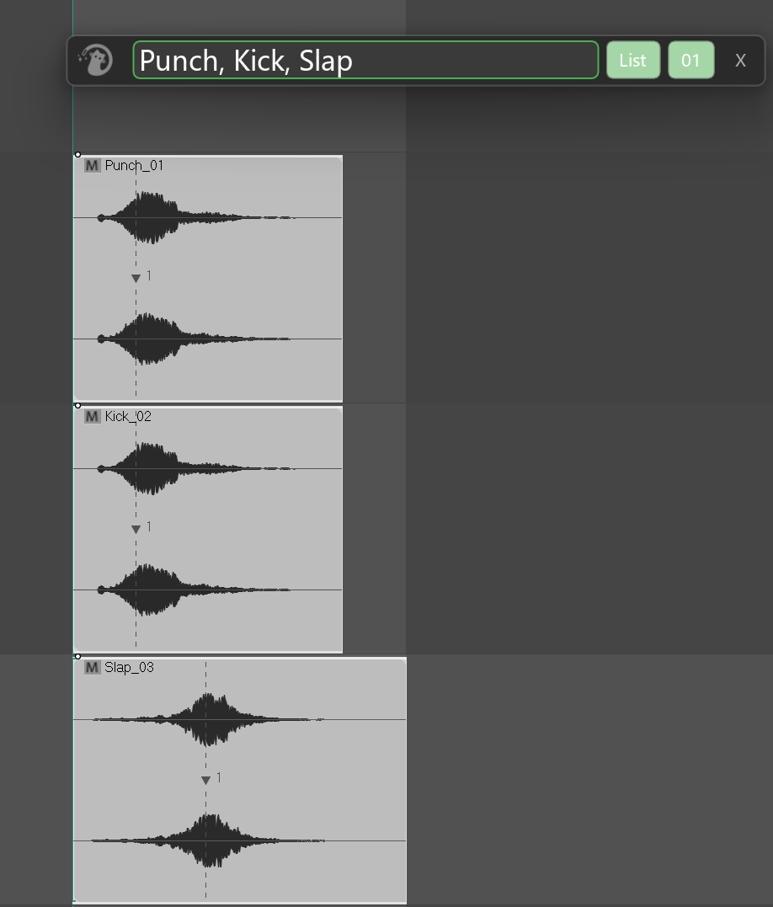
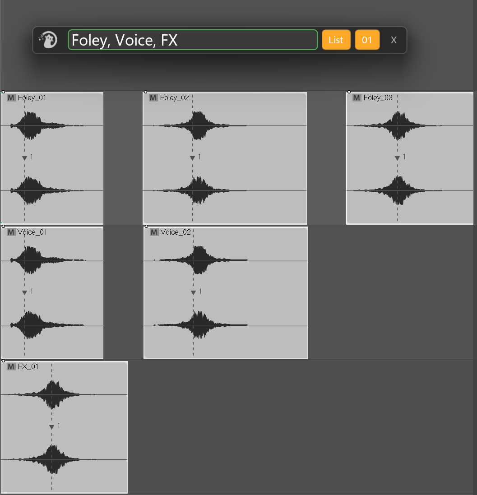

# Simple Rename

---

## 1. What Is Simple Rename?

**Simple Rename** is Mantrika Tools' ultra-light, fast rename tool. Its goal is "open it, type, press Enter, done."

It compresses the three most common renaming needs into a single horizontal bar:

- Rename a group of objects to the **same name** all at once.



- Rename a group of objects **one by one from a list**.



- Batch rename with **sequential numbering**.

Supported objects:

| Object type | Supported |
| --- | --- |
| **Items** | ✅ |
| **Mirror** | ✅ |
| **Tracks** | ✅ |
| **Items + Mirror mixed** (including collapsed-folder scenarios) | ✅ |
| Regions / Markers | ❌ Use Advanced Rename |

**Selection rule:** As long as the current selection contains any item (including Mirror items), Simple Rename **only processes items**. It processes selected tracks only when no items are selected. To rename tracks, deselect all items first.

---

## 2. Opening Simple Rename

Menu path:

```
Extensions → Mantrika Tools → Rename tool (simple)
```

Or search the Action List:

| Action name | Purpose |
| --- | --- |
| **`mantrika : Synergy - Simple Rename`** | Open / close the Simple Rename window |

---

## 3. Window Overview


| Area | Description |
| --- | --- |
| **Drag handle on the left** | Shows the Mantrika logo. Hold it to drag the window— this is the **only** draggable area. |
| **Large input box** | All names / name lists are typed here. Press **Enter** to apply the rename. |
| **List button** | Three-state toggle that controls how the input is interpreted (see §5). |
| **01 button** | Three-state toggle that controls whether `_01 _02 _03 ...` numbering is appended (see §6). |

---

## 4. Basic Use — Rename Everything to the Same Name

The most common case: rename the selected N objects to one shared name.

**Steps:**



1. In REAPER, select the objects you want to rename.
2. Open the Simple Rename window.
3. Keep **List: OFF** and **01: OFF** (the defaults).
4. Type the desired name in the input box, for example `Footsteps`.
5. Press **Enter**.

**Result:** every selected object is renamed to `Footsteps`.

> Simple Rename **does not** refuse to run just because duplicate names would result. If you want ten items to all be called `Footsteps`, it will do exactly that. Use Numbering (§6) when you want to avoid duplicates.

---

## 5. List Mode — Rename One by One from a List

If you want to give selected objects **different** names instead of a single shared name, turn on List mode.

Each click on the List button cycles through the states:


```
OFF → ON → Group by Track → OFF
Gray Green Orange
```

### 5.1 List: ON — One-to-one

Button color: **matcha green**.

**Input format:** Separate multiple names with an **English comma** `,`. Leading and trailing spaces around each name are trimmed automatically. Empty names are skipped.

**Example:** Three items selected, type:

```
Punch, Kick, Slap
```

After pressing Enter:



| Position | New name |
| --- | --- |
| 1st item | `Punch` |
| 2nd item | `Kick` |
| 3rd item | `Slap` |

Object **order** is determined by "track first, then time": items on higher tracks come first, and within the same track earlier items come first.

### 5.2 List: Group by Track — Group by Track

Button color: **amber orange**.

This is a special mode for Items / Mirror, designed for the case where **all items on the same track share one name, but different tracks get different names**.

**Input format:** Comma-separated names, where each name corresponds to one **track** (in the order tracks first appear in the selection, which is usually top to bottom).

**Example:** Six items arranged like this:

```
Track A: itemA1, itemA2, itemA3
Track B: itemB1, itemB2
Track C: itemC1
```

Type:

```
Foley, Voice, FX
```

After pressing Enter:



```
Track A: Foley, Foley, Foley
Track B: Voice, Voice
Track C: FX
```

**Actual behavior of Group by Track for each object type:**

| Selected objects | Group by Track behavior |
| --- | --- |
| **Items** | ✅ Groups by the owning track |
| **Mirror** | ✅ Same as above (Mirror groups by the folder track it is attached to) |
| **Items + Mirror mixed** | ✅ Same as above |
| **Tracks** | ⚠️ **Falls back to List: ON** — tracks are independent by nature, so the behavior is identical to List: ON |

> The List button turning orange on Tracks is not a bug. Because tracks have no grouping relationship, orange and green behave exactly the same on Tracks.

### 5.3 Input Box Border Color — Live Count Hint

When List mode is on, the input box border **continuously** compares the number of names you typed with the number of objects to rename:

| Border color | Meaning | Can run? |
| --- | --- | --- |
| Light blue (thin) | List off, or input box empty | — |
| **Green (thick)** | Count matches exactly | ✅ Pressing Enter executes |
| Orange (thick) | More names typed than objects | ❌ Pressing Enter does nothing |
| Red (thick) | Fewer names typed than objects | ❌ Pressing Enter does nothing |

**Important: orange / red means Enter is silently ignored** — no error, no popup, nothing happens. This is deliberate protection to avoid leaving objects unrenamed or creating extra unused names.

> Adjust by editing the input box, or by changing the REAPER selection. The border color updates immediately.

**How is the count calculated in Group by Track mode?**

- **For Items / Mirror:** it counts the number of **unique tracks** involved, not the number of items. So six items across three tracks only require three names to turn green.
- **For Tracks:** it counts selected tracks, just like List: ON.

---

## 6. Numbering Mode — Append Sequential Numbers

The `01` button has three states:




```
OFF → ON → Reset on Change → OFF
Gray Green Orange
```

The numbering format is **fixed** as `_NN`:

- Starts at `_01`.
- Padded to two digits (`_01 _02 ... _09 _10`).
- Beyond 99 it naturally becomes `_100 _101 ...` (no more padding, just normal counting).

### 6.1 Numbering: ON — Global continuous numbering

Button color: **matcha green**.

Numbers increase continuously across all objects, regardless of whether the generated names are the same or different.

**Example 1:** Four items selected, type `Hit`, List: OFF, Numbering: ON:

```
Hit_01
Hit_02
Hit_03
Hit_04
```



**Example 2:** Combined with List: ON, type `Punch, Kick, Slap`:

```
Punch_01
Kick_02
Slap_03
```



### 6.2 Numbering: Reset on Change — Reset when the name changes

Button color: **amber orange**.

**When the generated name differs from the previous one, the counter restarts from `_01`.** This mode is designed for use with **List: Group by Track** (or any other situation that produces repeated names in a row).

**Example:** Six items across three tracks, List: **Group by Track** + Numbering: **Reset on Change**, type `Foley, Voice, FX`:

```
Track A: Foley_01, Foley_02, Foley_03
Track B: Voice_01, Voice_02
Track C: FX_01
```



Every time the track (and therefore the name) changes, the number resets to `_01`.

> ⚠️ Using Reset on Change with **List: ON** is allowed, but because every name is different under List: ON, **every object triggers a reset**, so every object ends up with `_01`. **Reset on Change is intended for modes that produce repeated names.**

---

## 7. List + Numbering Combination Quick Reference

The following table uses the same example: **6 items across 3 tracks (3 + 2 + 1)**.

| List | Numbering | Input | Result |
| --- | --- | --- | --- |
| OFF | OFF | `Boom` | `Boom, Boom, Boom, Boom, Boom, Boom` |
| OFF | ON | `Boom` | `Boom_01 ... Boom_06` |
| OFF | Reset on Change | `Boom` | `Boom_01 ... Boom_06` (name never changes, so no reset occurs) |
| ON | OFF | `A, B, C, D, E, F` | `A, B, C, D, E, F` |
| ON | ON | `A, B, C, D, E, F` | `A_01, B_02, C_03, D_04, E_05, F_06` |
| ON | Reset on Change | `A, B, C, D, E, F` | `A_01, B_01, C_01, D_01, E_01, F_01` (each name triggers a reset) |
| Group by Track | OFF | `Foley, Voice, FX` | `Foley, Foley, Foley, Voice, Voice, FX` |
| Group by Track | ON | `Foley, Voice, FX` | `Foley_01, Foley_02, Foley_03, Voice_04, Voice_05, FX_06` |
| **Group by Track** | **Reset on Change** | `Foley, Voice, FX` | **`Foley_01, Foley_02, Foley_03, Voice_01, Voice_02, FX_01`** |

---

## 8. Operation Details

### 8.1 Enter = Execute

When the input box has focus, press **Enter** to apply the rename. There is no "OK" button and no mouse click required— the whole tool is built around the Enter key.

### 8.2 Three Cases Where Execution Is Silently Rejected

In the following cases, pressing Enter does **nothing** (no error, no popup):

1. Nothing is selected.
2. The input box is empty.
3. List mode is on and the counts do not match (border is orange or red).

### 8.3 Success Feedback

After a successful rename:

- The input box border briefly flashes green and fades out over about **0.6 seconds**.
- Focus returns to the input box so you can immediately start the next rename.
- The tool refreshes automatically and is ready for the next selection.
- REAPER's Undo History records one entry described as **"MTK Simple Rename"**.

### 8.4 Auto-Follow Selection Changes

While the window is open, Simple Rename checks the REAPER selection roughly every 100 ms. When the selection changes, it refreshes its internal data and re-evaluates the border color automatically— you do not need to press a refresh button.

### 8.5 Dragging the Window

Only the **logo handle on the left** can drag the whole window. The input box and buttons capture mouse input for their own interactions— this is intended.

### 8.6 Undo

Every successful Enter press creates one REAPER undo entry described as **"MTK Simple Rename"**. Use `Ctrl+Z` to undo normally.

> If the rename does not actually change any object's name (for example, the new name is identical to the old one), no undo entry is written.

---

## 9. Typical Workflows

### Workflow A: Number five footsteps consistently

```
1. Select the 5 footstep items.
2. List: OFF, Numbering: ON
3. Type: Footsteps_Wood
4. Enter
```

**Result:** `Footsteps_Wood_01 ... Footsteps_Wood_05`

---

### Workflow B: Name six different actions

```
1. Select the 6 action items.
2. List: ON, Numbering: OFF
3. Type: Punch, Kick, Slap, Smack, Throw, Slam
4. Enter
```

**Result:** Each of the 6 items gets the matching name.

---

### Workflow C: Group and number takes by track ⭐Recommended

The most common character-sorting scenario:

```
1. Select all take items across multiple tracks:
 - Track A: 6 player actions
 - Track B: 4 NPC actions
 - Track C: 2 ambience items
2. List: Group by Track, Numbering: Reset on Change
3. Type: Player, NPC, Ambient
4. Enter
```

**Result:**

```
Track A: Player_01 ... Player_06
Track B: NPC_01 ... NPC_04
Track C: Ambient_01, Ambient_02
```

---

### Workflow D: Rename three tracks

```
1. Deselect all items (important: items selected means tracks are ignored).
2. Select the 3 tracks.
3. List: ON, Numbering: OFF
4. Type: Vocal, Drums, Bass
5. Enter
```

**Result:** The three tracks are renamed to `Vocal`, `Drums`, and `Bass`.

---

### Workflow E: Edit names based on the original name

❌ **Not supported** by Simple Rename.

Simple Rename is **overwrite-style** renaming— it writes exactly what is in the input box and **does not** preserve the original name.

If you need:

- Add a prefix / suffix to the original name
- Find & replace a part of the original name
- Case conversion (UPPER / lower / Title)
- Remove redundant spaces / special characters
- Interact with UCS naming conventions

Use **Advanced Rename** instead— it is a rule-based advanced renaming tool.

---

## 10. Notes

### 10.1 This is overwrite-style renaming

What you type in the input box is the final result; the original name is **not** preserved. For original-name-based processing, use Advanced Rename (see §9-E).

### 10.2 Duplicate names are allowed

Simple Rename does not refuse to run just because duplicate names would be created. Duplicates are allowed and often expected (a group of similar sources should share the same name). Use Numbering when you want uniqueness.

### 10.3 Group by Track has no independent effect on Tracks

See the note at the end of §5.2. The button turning orange is not an error, but the behavior is identical to List: ON.

### 10.4 Items take priority over Tracks

As long as any item (including Mirror) is selected, only items are processed. To rename tracks, **deselect all items first**.

### 10.5 Regions / Markers are not supported

Simple Rename does **not** support renaming Regions or Markers. Use Region Work Flow or Advanced Rename.

---

## 11. Troubleshooting

| Symptom | Likely cause | Fix |
| --- | --- | --- |
| Pressing Enter does nothing | Input box is empty | Type something |
| Pressing Enter does nothing | Nothing is selected | Select objects in REAPER first |
| Pressing Enter does nothing | Border is orange / red in List mode | Adjust the input or selection so the border turns green |
| Track rename does not apply | Items are also selected | Deselect all items |
| Group by Track is orange but behaves like List: ON | Currently selected objects are tracks | Expected behavior; see §5.2 |
| Cannot type in the input box | Focus is not in the input box | Click the input box, or reopen the window (focus is set automatically on open) |
| Want to rename regions / markers but cannot | Simple Rename does not support them | Use Advanced Rename |

