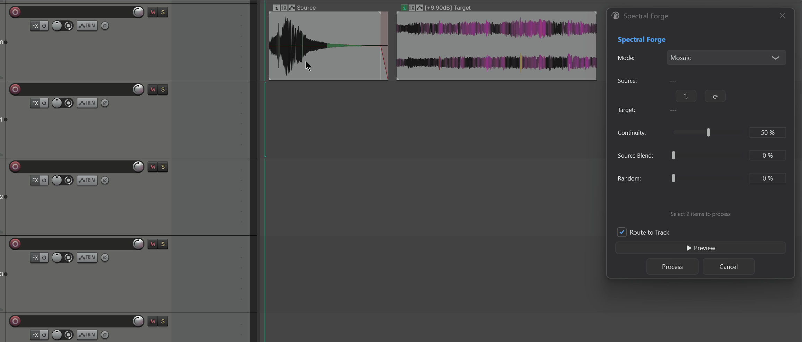
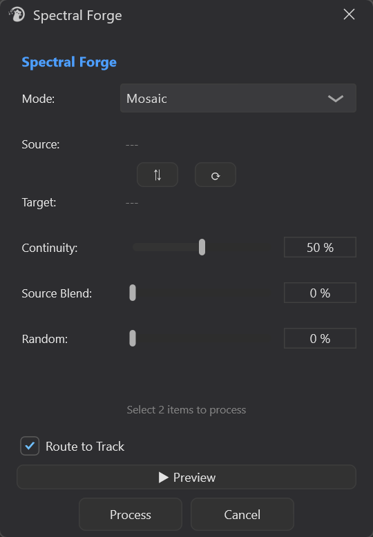
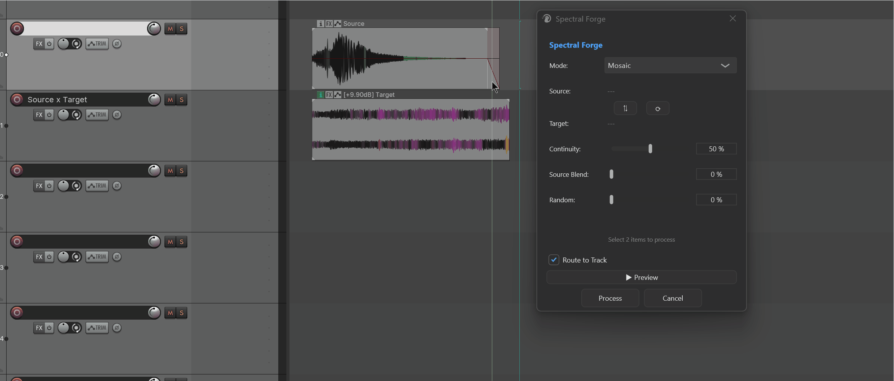

# Spectral Forge

---

## 1. Overview

**Spectral Forge** is a spectral-synthesis tool in Mantrika Tools for pairing **two media items**. Its workflow is: **select two sounds → blend them in some way → get a new sound**.

Each run treats your two selected items as **Source** (provides the spectral “identity”) and **Target** (provides the spectral “shape” or “trajectory”), blends them with the chosen algorithm, renders a new WAV to `<project directory>/SpectralForge/`, and **automatically creates a new output track** with the same name and places the new item there. The original two items are left untouched.



Three synthesis algorithms:

- **Morph (OT)**: Optimal-Transport-based spectral morphing that interpolates along a frequency trajectory between Source and Target.
- **Cross-Synthesis**: Takes the **spectral envelope** from one item and the **excitation** from the other, producing “say B’s content with A’s tone color.”
- **Mosaic**: Searches Source’s spectrum frame by frame for the fragment that best matches each Target frame, then stitches them together. The result “sounds like Source but follows Target’s rhythm/trajectory.”
Every algorithm lets you **Preview** before you **Process**.

---

## 2. Opening Spectral Forge

Menu entry:

```
Extensions → Mantrika Tools → Spectral forge
```

Actions (search “Spectral” in the Action List):

| Action Name | Purpose |
| --- | --- |
| **`mantrika : Process - Spectral Forge`** | Open / close the Spectral Forge window (toggle) |
| **`mantrika : Process - Create Spectral Transition for Overlapping Items`** | Sibling action: for **two items that already overlap**, generates a “tone transition” item over the overlap region without opening the main window |

---

## 3. Main Window Overview



| Control | Description |
| --- | --- |
| **Mode** | Choose one of the three algorithms; see §5 |
| **Source / Target labels** | Names of the two paired item takes (extension removed). `---` = nothing selected yet |
| **`⇅` Swap** | Swap Source and Target (colors and labels swap together) |
| **`↻` Reload** | Re-detect Source/Target from the current REAPER selection |
| **Algorithm parameter knobs** | Change with Mode; see §5 |
| **Route to Track** | Whether the Preview is routed through the **FX chain of the track that holds the Source item** |
| **▶ Preview** | Renders in the background and **plays but does not save**; while playing the same button becomes `■ Stop` |
| **Process** | Renders in the background, writes the file, and automatically creates a track + item; while running the button becomes **Cancel** |
| **Cancel** | Close the window (also cancels any running Preview/Process and restores item colors) |

> The window height adjusts automatically for the current Mode.

---

## 4. Rules for Selecting Items



```
1. Select exactly 2 audio items in the Arrange view (must be audio; MIDI / empty takes are rejected)
2. Trigger “Process - Spectral Forge” to open the window
3. The window automatically pairs Source / Target and colors the two items:
 · Source = cyan (#4A7A8A)
 · Target = orange-red (#A35A3D)
4. The colors let you see at a glance which is which in the Arrange view
```

**Auto-pairing rules:**

| Situation | Who Becomes Source |
| --- | --- |
| Two items on **different tracks** | The one on the **higher** track |
| Two items on the **same track** | The one that is **earlier** in time |

Not happy with it? Click **`⇅`** to swap instantly.

> **Closing the window / successful Process / Cancel automatically restores the two items' original colors** — no cyan/orange residue is left behind.

To change items, select two new ones in REAPER and click **`↻`** in the window.

---

## 5. The Three Algorithms

### 5.1 Morph (OT)

**Purpose**: Slide Source’s spectrum toward Target’s spectrum along the frequency axis. Unlike a simple crossfade, Optimal Transport (OT) shifts each spectral line to its corresponding position, giving a more continuous morph. Good for sound-morphing effects.

| Control | Range | Description |
| --- | --- | --- |
| **Interpolation** | 0–100 % | 0% = entirely Source; 100% = entirely Target; 50% = halfway |
| **OT Strength** | 0–100 % | 0% = degrades to a normal crossfade; 100% = full spectral slide; in between is a blend of the two behaviors |

**How to tune**: start with Interpolation at 50% and listen, then adjust OT Strength to control how “morph-like” the transition feels — high OT sounds more like a slide/morph, low OT sounds more like a superposition of the two sounds.

Best for: gradually turning sound A into sound B, or creating intermediate states between two sounds.

---

### 5.2 Cross-Synthesis

**Purpose**: Take the **spectral envelope** (tone-color “shape”) from Target and the **excitation** (residual / “who is speaking”) from Source, then multiply them. The intuitive result: “say B’s content with A’s tone color.”

| Control | Range | Description |
| --- | --- | --- |
| **Envelope Detail** | 0–100 % | 0% = smooth envelope (only broad tone coloring); 100% = detailed envelope (preserves more formant detail) |

**Source / Target roles:**

- **Source** provides **excitation** (the driving signal / energy distribution).
- **Target** provides **envelope** (tone color / formant shape).
- Want to swap roles? Click **⇅**.

Best for: vocoder-style effects, vocal re-coloring, dressing a rhythmic source in another timbre.

---

### 5.3 Mosaic

**Purpose**: Slice Source into small frames and **search frame by frame** for which Source frame best matches the current Target frame, then string the matched Source frames together. The result “rebuilds Target’s trajectory using Source’s material library.”

| Control | Range | Description |
| --- | --- | --- |
| **Continuity** | 0–100 % | 0% = each frame independently picks the best match (jumpy); 100% = strong continuity (prefers frames near the previous one, smoother) |
| **Source Blend** | 0–100 % | 0% = pure collage; 100% = identical to Source spectrum; in between blends the collage result with Source |
| **Random** | 0–100 % | 0% = fully deterministic (same input always gives same output); 100% = maximum randomness, picks randomly from candidate frames |

**About the random seed:**

- Once you raise **Random**, each **Preview** uses a new random seed → press Preview several times to try different “random variations.” Once you press **Process**, it uses **the seed from the most recent Preview** (if any), so **what you hear is what you get**.
- If you Process without ever Previewing, a new seed is used.

Best for: sound-design tasks like “redo B with A’s texture” or generating granular variants that retain Source’s character.

---

## 6. Preview and Process Workflow

### 6.1 Preview

```
1. Choose Source/Target, Mode, and parameters
2. Click [▶ Preview]
3. Wait a few seconds → status shows “Previewing...” → listen to the result
4. To stop midway, click the same button (now [■ Stop])
```

| Option | Behavior |
| --- | --- |
| **Route to Track** (persistent toggle) | Off: Preview goes to REAPER’s main output (dry). |
| | On: Preview is routed **through the FX chain of the track that holds the Source item**, making it easy to compare the sound after the plug-in chain. |

Preview **does not write files or move items**. Change parameters and click Preview again to hear a new result.

### 6.2 Process (Render)

```
1. When you are happy with the Preview, click [ Process ]
2. Status changes to “Processing...” and the button becomes Cancel
3. When done, status changes to “Forge complete”.
```

**Output placement:**

- WAV file: `<project directory>/SpectralForge/<source>_<target>_<Mode>.wav` (if the name already exists, a serial number is appended automatically)
- A new track named `<source> x <target>` is created **directly below the Source item’s track**
- The new item is placed at the **Source item’s time position** and its length follows the rendered result
- The new item inherits the Source item’s playback gain
- Focus returns to the main REAPER window when finished

---

## 7. Status Feedback

The status bar tells you what is happening:

| Status Text | Meaning |
| --- | --- |
| `Select 2 items to process` / `Select 2 audio items` | Idle / invalid selection |
| `Selection reloaded` | You clicked `↻` to re-detect |
| `Selected items are no longer valid` | You deleted or moved the paired Source/Target items after opening the window |
| `Processing...` / `Processing preview...` | Background rendering in progress |
| `Previewing...` / `Preview ended` / `Preview stopped` | Preview stage |
| `Forge complete` | Process succeeded and the new item is in place |
| `Process failed: <reason>` / `Preview failed: <reason>` | Failure; reason shown |
| `Failed to read source/target audio` | Audio read failed during preparation |
| `Failed to create output directory` | Could not create the SpectralForge directory (project not saved? disk read-only?) |

---

## 8. Preference Persistence

| Setting | Persisted? |
| --- | --- |
| Last selected Mode | ✅ |
| Route to Track toggle | ✅ |
| Algorithm knob values | ❌ (reset to defaults each time the window opens) |
| Last random seed | ❌ (only reused within the same session when Process follows Preview) |

> To quickly reset a knob, **right-click or double-click** it — this usually returns it to the default value.

---

## 9. Keyboard / Mouse Quick Reference

| Operation | Behavior |
| --- | --- |
| Trigger `Process - Spectral Forge` | Open / close the window |
| **Enter** | Same as clicking Process |
| Process button (while processing) | Becomes Cancel; click to abort |
| Preview button (while playing) | Becomes `■ Stop`; click to stop |
| `⇅` Swap | Swap Source / Target (including colors) |
| `↻` Reload | Re-pair from the current REAPER selection |
| Close window (X / ESC) | Automatically cancel processing + stop preview + restore item colors |

---

## 10. Typical Workflows

### Workflow A: Turn a Metal Impact into a Sustained Ambience

```
1. Select the two items: metal_clank (short) and ambient_wash (long)
2. Open Spectral Forge
3. Check Source = metal_clank (cyan) and Target = ambient_wash (orange-red)
 If reversed, click ⇅
4. Mode = Morph (OT)
5. Preview Interpolation at 30 / 50 / 70 and listen
6. When satisfied, click Process
```

### Workflow B: Make a Synth Pad “Speak”
```
1. Select vocal_phrase (the “words”) and synth_pad (the “tone color”)
2. Open the window
3. Make Source = vocal_phrase (provides excitation) and Target = synth_pad (provides envelope)
 — arrange the items using the “higher track / earlier position = Source” rule, or just click ⇅
4. Mode = Cross-Synthesis
5. Try Envelope Detail between 30–60%
6. Process
```

### Workflow C: Rebuild Wind Movement with a Stone Scrape Texture

```
1. Select stone_scrape (Source material library) and wind_long (Target trajectory)
2. Source = stone_scrape; Target = wind_long
3. Mode = Mosaic
4. Set Continuity to 60–80% to avoid frame-to-frame jumps
5. Press Preview a few times (each uses a new seed) → pick a version you like → Process
 ★ Process reuses the seed from the last Preview, so what you hear is what you get
```

---

## 11. Troubleshooting

| Symptom | Cause | Fix |
| --- | --- | --- |
| Source / Target shows `---` | Selection does not contain exactly 2 audio items, or includes MIDI | Select exactly 2 audio items and click `↻` |
| Status says `Selected items are no longer valid` | You deleted or moved the paired items | Select the items again and click `↻` |
| Status says `Failed to read source/target audio` | Source file unreadable / corrupt | Check the source file and whether the take is valid |
| Status says `Failed to create output directory` | Project not saved / project directory read-only | Save the project and confirm write permission |
| Preview and Process sound different (Mosaic) | You changed the **Random** knob after Preview, or closed and reopened the window | Follow Preview → Process immediately without changing Random |
| No new item after Process | Look one track **below** the Source item’s track; it may be out of view | Scroll the Track Control Panel to just below the Source track |
| Item colors remain after closing | Rare (usually from an abnormal exit) | Select the item → Item Properties → clear the custom color |
| Process seems stuck | Large items (several minutes) take time to synthesize; the progress bar is indeterminate | Wait, or Cancel and try shorter source material |

---
