# Advanced Rename 用户手册

> 适用版本：Mantrika Tools（当前主线）
> 本手册的姊妹篇是 [Simple Rename 用户手册](./simple-rename.md)，建议先读 Simple Rename 再看本篇。

---

## 1. 概述

**Advanced Rename** 是 Mantrika Tools 的高级重命名工具。如果说 Simple Rename 解决"快速覆盖式改名"的需求，那么 Advanced Rename 解决的是 **"基于原名字做规则化变换"** 的需求——查找替换、加前后缀、按结构重排、按列表替换、按位置裁字符、统一编号、UCS 命名规范……都在这一个窗口里。

**与 Simple Rename 的关键差异**：

| | Simple Rename | Advanced Rename |
|---|---|---|
| 定位 | 打开即用、回车即生效 | 配置规则链 → 预览确认 → Apply |
| 改名方式 | 覆盖式（写入框里的就是结果） | 规则链式（在原名上做变换） |
| 适用对象 | Items / Mirror / Tracks | 同 + **Regions / Markers** |
| 实时预览 | 边框颜色提示数量匹配 | 完整预览表（原名→新名） |
| 规则数量 | 内置三种（List/Numbering） | 8 种规则可任意组合 |
| 预设系统 | 仅记忆模式开关 | 规则链预设 + UCS 预设 |
| UCS 支持 | ❌ | ✅ 独立 Tab |
| 适用场景 | 当你已经知道想叫什么 | 当你需要从原名衍生新名 |

**适用对象（与所选模式强相关）**：

- **T&I 模式**（Tracks & Items）—— Items / Mirror / Tracks
- **R&M 模式**（Regions & Markers）—— Regions / Markers

---

## 2. 打开方式

菜单入口：

```
Extensions → MantrikaTools → Rename tool (advance)
```

或在 Action List 搜：

| Action 名称 | 用途 |
| --- | --- |
| **`mantrika : Synergy - Advanced Rename`** | 打开 / 关闭 Advanced Rename 窗口 |

---

## 3. 界面总览

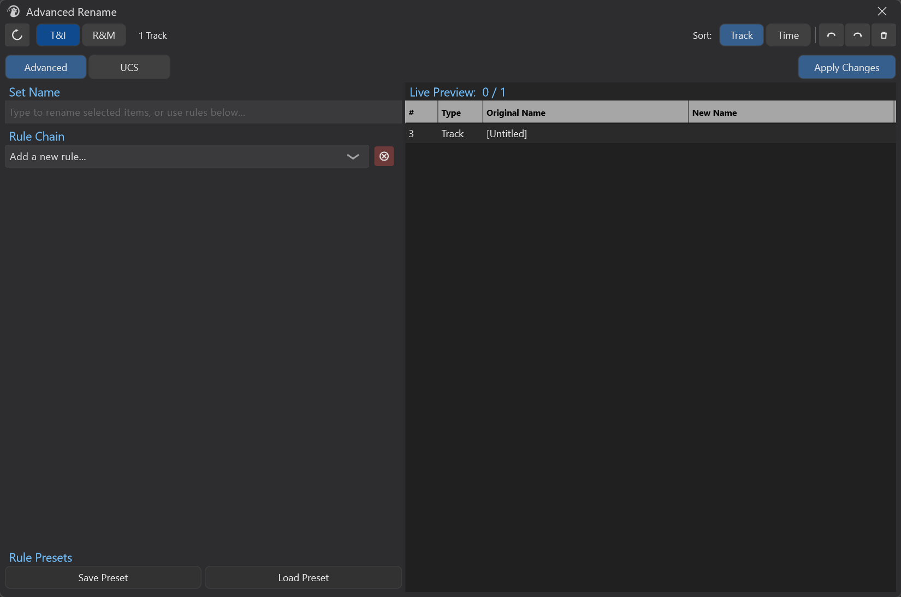

四大区域：

| 区域 | 内容 |
|---|---|
| **Header**（顶部 28px） | Refresh / 模式切换 / Status / Sort / Undo·Redo·Clear Names |
| **Tab 行**（30px） | Advanced / UCS Tab + Apply Changes 按钮 |
| **左面板**（~45% 宽） | 当前 Tab 的配置区（规则链 或 UCS 字段） |
| **右面板**（~55% 宽） | Preview 表（T&I）或 Selection + Preview（R&M） |

---

## 4. 工作模式：T&I vs R&M

窗口顶部有两个互斥按钮 **T&I** 和 **R&M**，决定 Advanced Rename 当前在处理什么类型的对象。

### 4.1 T&I 模式（Tracks & Items）

**默认模式**。直接读取 REAPER 当前选区——选了 items 就处理 items（含 Mirror），完全没选 item 时才处理选中的 tracks。

跟 Simple Rename 完全一样的选区识别规则：**只要有 item 选中，就忽略 track 选择**。

### 4.2 R&M 模式（Regions & Markers）

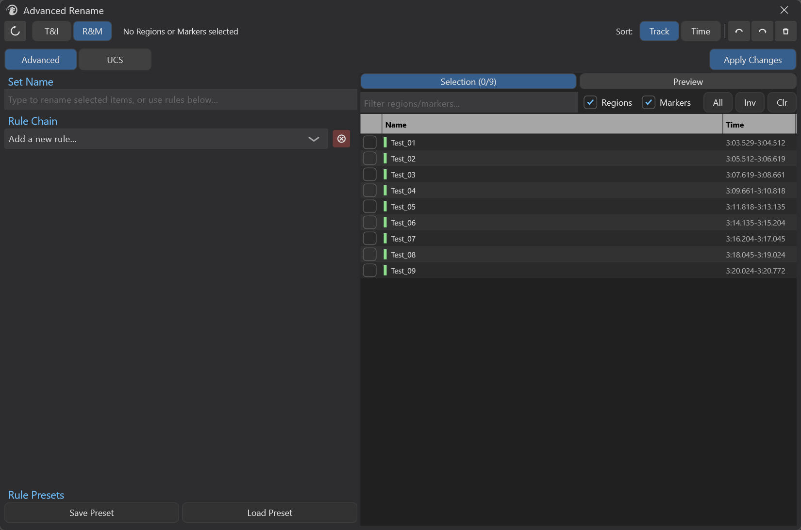

启用**内置选择器**——你不再使用 REAPER 的常规"选中"机制，而是在 Advanced Rename 右面板的 **Selection Tab** 里手动勾选要重命名的 region / marker。

进入 R&M 模式后右面板会出现两个 tab：


- **Selection** —— 工程内所有 region/marker 的可勾选列表，带过滤器和批量选择按钮
- **Preview** —— 跟 T&I 模式一样的预览表，但数据源是 Selection Tab 里勾上的那些

> 详细操作见 §11。

### 4.3 模式切换

- 切换模式会立即刷新预览表 + 重新布局。
- **R&M Tab 状态会被记住**：你在 R&M 模式下手动切到了 Preview tab，再切到 T&I，再切回 R&M 时仍然停留在 Preview tab。
- T&I↔R&M 切换不会清空已配置的规则链或 UCS 字段。

---

## 5. 顶部工具栏

### 5.1 Refresh 按钮 ⟳


重新扫描 REAPER 选区并刷新预览表。

> ⚠️ **必须手动点击** —— Advanced Rename **不会自动跟随** REAPER 选区变化（与 Simple Rename 不同）。你在 REAPER 里改了选区、改了名字、增删了 region/marker 之后，都需要回到本窗口点 Refresh
>   才能让预览同步。

-   需要 Refresh 的典型场景：

    - 在 REAPER 里改了选区（增/减/换对象）
    - 在 REAPER 里手动改了对象名字（外部修改）
    - R&M 模式下，REAPER 的 region / marker 列表本身被修改（增/删/重命名）

  > Undo / Redo / 模式切换 / 排序切换按钮内部都已经自动调用 Refresh，这些操作后不需要再手动点。

### 5.2 排序模式：Track / Time

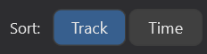

- **Track**（默认）—— 先按所属 track 顺序，再按时间位置
- **Time** —— 纯按时间位置排序，无视所属 track

排序影响 **预览表的显示顺序** 和 **规则链的执行顺序**。例如 Numbering 规则会按 Sort 后的顺序连续编号。

### 5.3 Undo / Redo / Clear Names

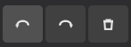

Header 最右侧三个图标按钮：

| 图标 | 功能 | 等效 |
|---|---|---|
| ↶ Undo | 撤销 REAPER 操作 | `Ctrl+Z` / Main_OnCommand 40029 |
| ↷ Redo | 重做 REAPER 操作 | `Ctrl+Y` / Main_OnCommand 40030 |
| ✕ Clear Names | **把所有选中对象的名字置空** | RenameDataModel::ClearSelectedObjectNames |

> ⚠️ **Clear Names 是不可逆的批量操作**（虽然有 Undo）。它直接把 N 个对象的名字写空字符串，主要用于"重新开始命名"前的清场。

---

## 6. 规则链基础工作流

Advanced Rename 的核心心智模型是 **"规则链"**——你配置一串规则，规则按列表顺序对 *每一个* 选中对象执行，最终结果显示在右侧 Preview 表里，按 **Apply Changes** 写回 REAPER。

### 6.1 添加规则

左面板的 Rule Chain 区域顶部有一个下拉框：

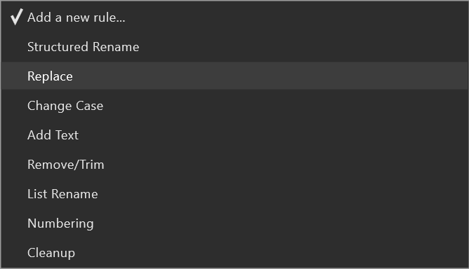

选中任意一项即添加一条规则到列表底部。每种规则可以**重复添加**（例如两个 Find Replace 串起来）。

**Clear All 按钮**（红底 ⊗）—— 删除当前所有规则（**不可撤销**，按下前请保存预设）。

### 6.2 规则卡片结构

每条规则在列表里是一个可折叠卡片：

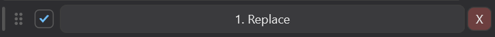

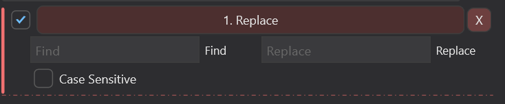

规则头从左到右：

| 元素 | 作用 |
|---|---|
| ⠿ 拖拽手柄 | 按住可上下拖动，调整规则在链中的位置 |
| ☑ 启用复选框 | 不勾选 = 规则被跳过（保留配置但暂时禁用） |
| 规则名 + 简述 | 显示规则类型和当前关键参数 |
| ⓧ 删除按钮 | 红底 X，删除该规则 |

点击规则头其余区域可折叠/展开参数 UI。

### 6.3 规则执行顺序

**严格按列表从上到下执行**。每条规则的输入是上一条规则的输出。

举例（按规则链 1→2→3 执行）：

```
原名:        "Footstep_Wood_01.wav"
↓ 规则 1: Remove/Trim (移除 ".wav")
            "Footstep_Wood_01"
↓ 规则 2: Replace (Wood → Stone)
            "Footstep_Stone_01"
↓ 规则 3: Change Case (Title)
            "Footstep_Stone_01"
            ↓ Apply
最终:       "Footstep_Stone_01"
```

调整规则顺序会改变结果——把 Numbering 放在 Replace 之前 vs 之后会得到完全不同的输出。

### 6.4 Preview 表

右面板的 4 列表格：

| 列 | 含义 |
|---|---|
| **#** | 排序后的序号（受 Sort 模式影响） |
| **Type** | 对象类型（Item / Track / Mirror / REG / MRK） |
| **Original Name** | 当前实际名字 |
| **New Name** | 规则链输出的新名字 |

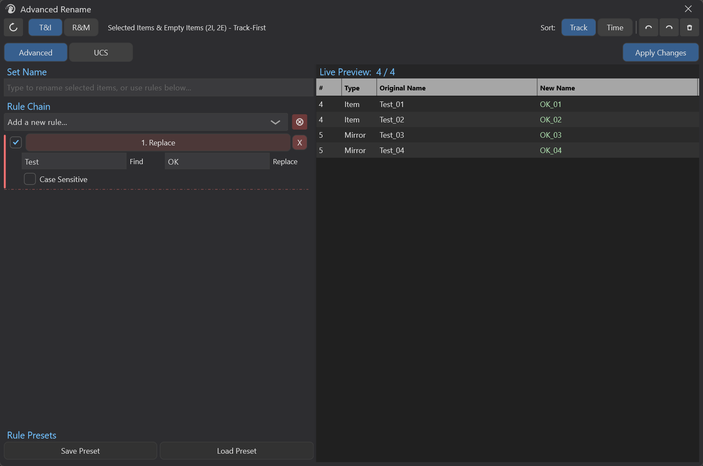

**视觉编码**：
- 新名字与原名不同 → **绿色高亮**（说明会被改）
- 新名字与原名相同 → 灰色（Apply 会跳过）
- 选中行 → 蓝底
- 没选中任何对象时，表格上方叠加文字："Select tracks/items in REAPER to begin"

### 6.5 手动编辑预览

可以**直接双击** New Name 单元格修改某一行的最终名字。手动编辑会**覆盖该行的规则链输出**，仅对该行有效，其他行依然走规则链。

> 用途：批量改完之后再微调个别异常项。

### 6.6 冲突检测（不阻塞 Apply）

当两个或更多对象的新名字**相同**时，Status 标签会显示：

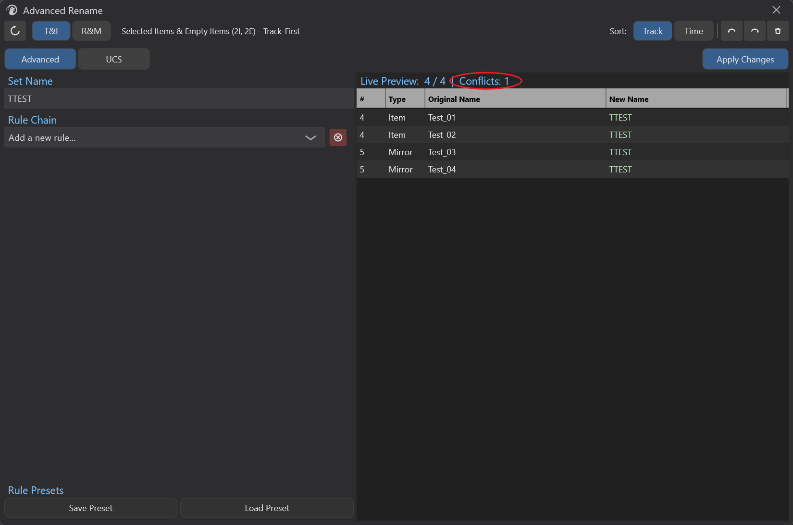

⚠️ **冲突不会阻止 Apply**——按下 Apply Changes 仍然会执行重命名。Advanced Rename 只是告诉你"会有重名"，是否处理由你决定。

> 如果你的目标就是让一组对象同名（很常见），冲突标记可以忽略。如果你不想要重名，加一条 Numbering 规则在末尾。

### 6.7 Apply Changes

Tab 行右侧的按钮（也可以按窗口级 **Enter** 等效触发）：

- **执行条件**：至少有 1 个对象的新名字与原名不同（即 Stats.successCount > 0）。完全没有变化时按 Enter 没反应。
- **执行后**：
  - REAPER Undo 栈写入一条 `MTK Advanced Rename` 记录（即便是 Advanced Rename 触发的，描述用的是这个名字）
  - **Set Name 编辑框被清空**
  - **UCS 建议状态重置**
  - Apply 按钮变绿、文本变 `Renamed N items`，0.9 秒后还原
  - Status 标签同步显示成功消息

---

## 7. Set Name 直通编辑框

左面板顶部第一行就是 **Set Name** 编辑框：

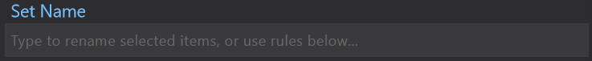

**这是 Advanced Rename 里最容易被误解的功能**。它**不是**"覆盖规则链输出"——而是**作为规则链的输入起点**。

也就是说，Set Name 决定的是 **"规则链拿到的初始名字"**——后续规则仍然会作用其上。

### 7.1 三种典型用法

**用法 A：当 Simple Rename 用**

不加任何规则、Set Name 输入 `Footsteps`、按 Enter →
所有选中对象都被改名为 `Footsteps`。等同于 Simple Rename 的最基础场景。

**用法 B：Set Name + Numbering 规则**

Set Name 输入 `Hit`、加一条 Numbering 规则 →
得到 `Hit_01, Hit_02, Hit_03 ...`。

**用法 C：留空 + 规则链**

Set Name 留空，加 Replace / Numbering 等规则 →
规则在原名基础上变换（最常见的"高级重命名"场景）。

### 7.2 行为细节

- 内容变化会**实时**触发 generatePreview（每按一个键都会更新预览）
- 在 Set Name 编辑框内按 **Enter** 等效于 Apply Changes
- Apply 成功后会**自动清空** Set Name 编辑框
- 仅在 Advanced Tab 显示；切到 UCS Tab 时整个 Set Name 区域会隐藏

---

## 8. 8 种规则详解

下面 8 节按下拉框出现顺序逐个讲解。

---

### 8.1 Structured Rename

**用途**：把"结构相同的一组文件名"按分隔符拆解成组件、重排或编辑组件、再用相同分隔符拼回。

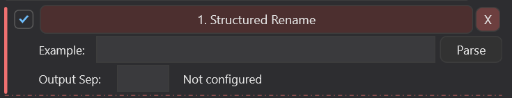

例如把 `Punch_Loud_Wood_01` 重排成 `Wood_Punch_Loud_01`。

**工作流程**：

1. **提供示例**：在规则面板里粘贴一个示例文件名（通常就是选区里第一个对象的名字）。
2. **自动检测分隔符**：引擎从候选 `_ - . space ~ #` 中挑出最可能的那个，把示例拆成组件。
3. **拖拽重排组件 / 内联编辑组件内容 / 增删组件**。
4. **设置输出分隔符**（默认沿用检测到的）。
5. 规则会对选区里**每个**对象用同一分隔符拆开，按你定义的顺序拼回。

**特殊行为**：

- **额外组件保留**：如果某个对象拆出的组件比模板多（例如模板 3 段、目标 5 段），多出来的部分会原样追加在末尾。
- **手动编辑覆盖**：你内联编辑过的组件会被当成"固定文本"，对所有目标使用同样的内容（而不是从目标对象里取）。
- **解析失败时降级**：自动检测失败时，引擎会依次尝试 `_` 和 `-`；都不行就把整串当成单一组件。

**示例**：

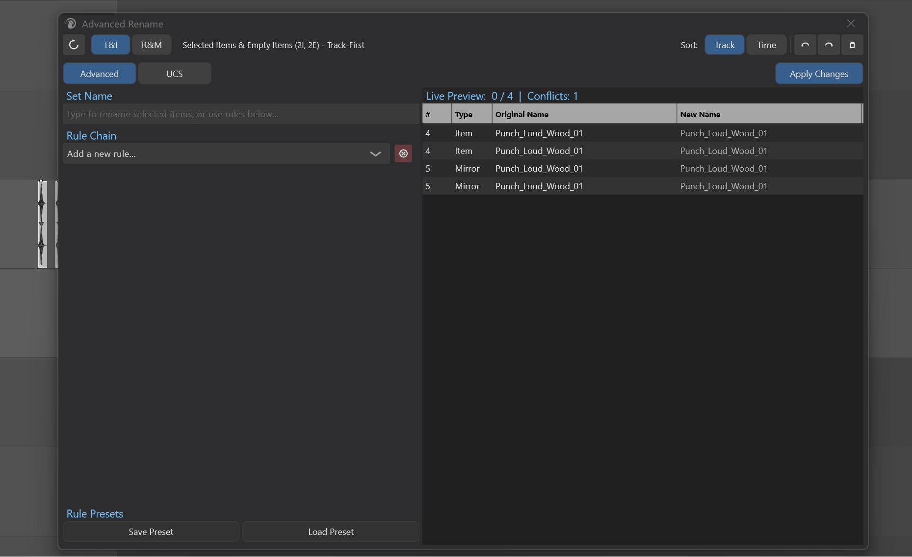

> ⚠️ **Structured Rename 假设选区里所有对象的命名结构一致**（同样数量的组件、同样的分隔符）。结构不一致时降级行为可能不符合预期。

---

### 8.2 Replace（查找替换）

**用途**：在原名字中查找指定文本并替换为新文本。

**参数**：

| 参数 | 默认 | 说明 |
|---|---|---|
| Find | (空) | 要查找的文本 |
| Replace | (空) | 替换成的文本（可留空 = 删除） |
| Case sensitive | OFF | 是否区分大小写 |

**行为**：

- **替换所有出现**（不只是第一个）。
- 大小写不敏感时只对英文生效。
- Find 为空时规则被视为未配置，自动跳过。

**示例**：

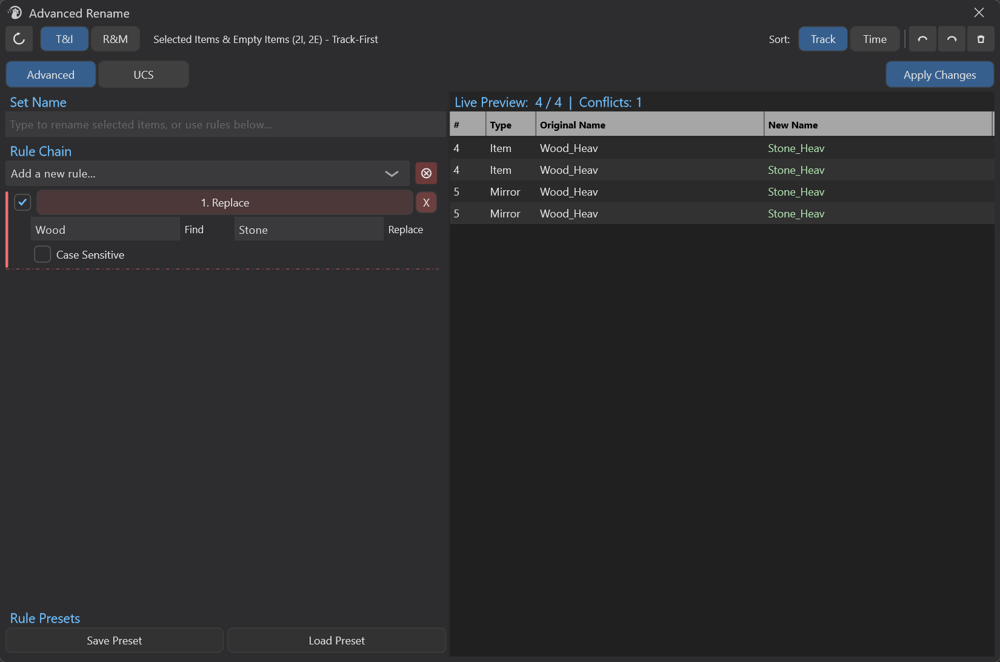

---

### 8.3 Change Case（大小写转换）

**用途**：把名字转换成 UPPER / lower / Title Case。

**参数**：

| 参数 | 默认 | 说明 |
|---|---|---|
| Case Type | UPPER | UPPER / lower / Title |
| Delimiters | `_-. ` | 仅 Title 模式使用，决定词边界 |

**行为**：

- 只影响英文字母。
- Title Case 把整串先转小写，再把每个分隔符（默认 `_ - . space`）后的第一个字母转大写。

**示例**：

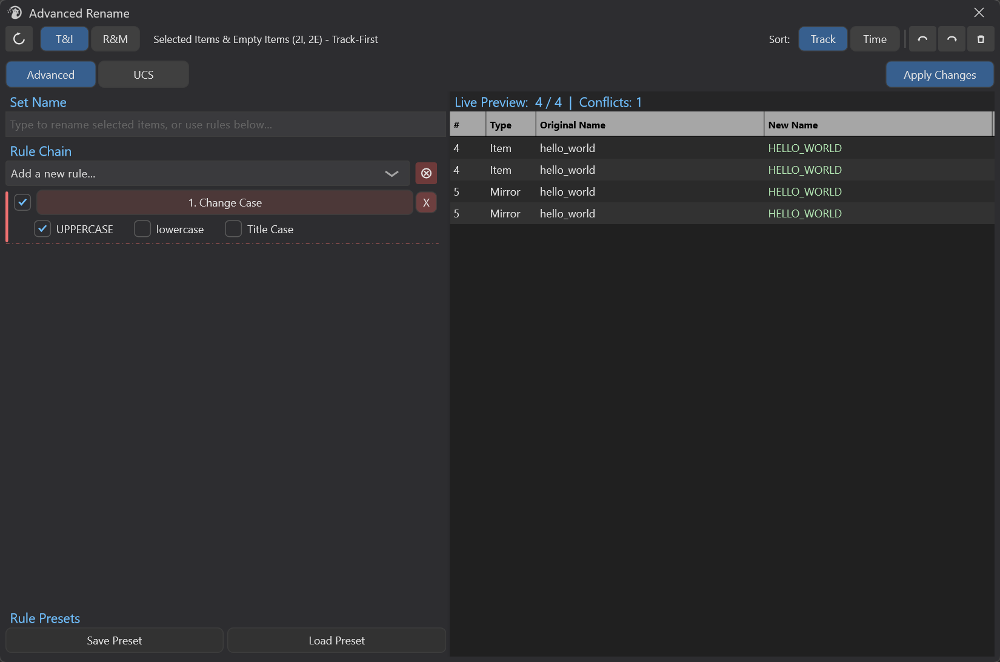
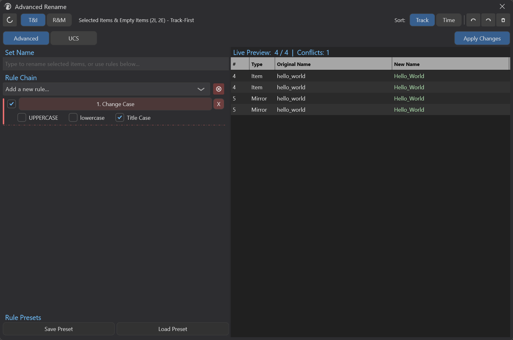

---

### 8.4 Add Text（加前缀/后缀）

**用途**：在名字开头或末尾追加文本。

**参数**：

| 参数 | 默认 | 说明 |
|---|---|---|
| Add Type | Prefix | Prefix（前缀）/ Suffix（后缀） |
| Text | (空) | 要添加的文本 |

**行为**：Text 为空时规则被视为未配置，自动跳过。

**示例**：


---

### 8.5 Remove/Trim（移除/裁剪）

**用途**：从名字中移除指定文本，或按位置裁掉一段字符。

这条规则有 **两种工作模式**，通过 Mode 切换。

#### Mode A: Remove Text（移除文本）

| 参数 | 默认 | 说明 |
|---|---|---|
| Text to Remove | (空) | 要移除的文本 |
| Case sensitive | OFF | 是否区分大小写 |
| Remove all occurrences | ON | ON = 移除所有出现，OFF = 只移除第一个 |

**示例**：

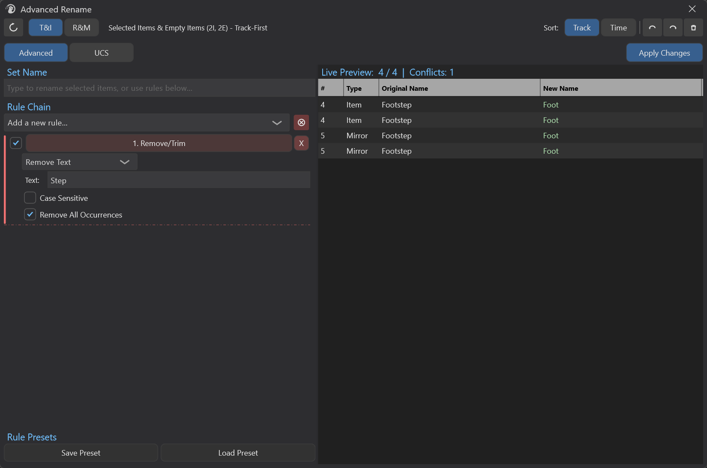

#### Mode B: Remove by Position（按位置裁剪）

按位置剪掉若干字符，三种位置模式：

| Position Mode | 参数 | 行为 |
|---|---|---|
| **From Start** | Char Count | 从开头删 N 个字符 |
| **From End** | Char Count | 从末尾删 N 个字符 |
| **Range** | Start Pos / End Pos | 删除字符索引 `[Start, End)` 区间 |

**示例**：


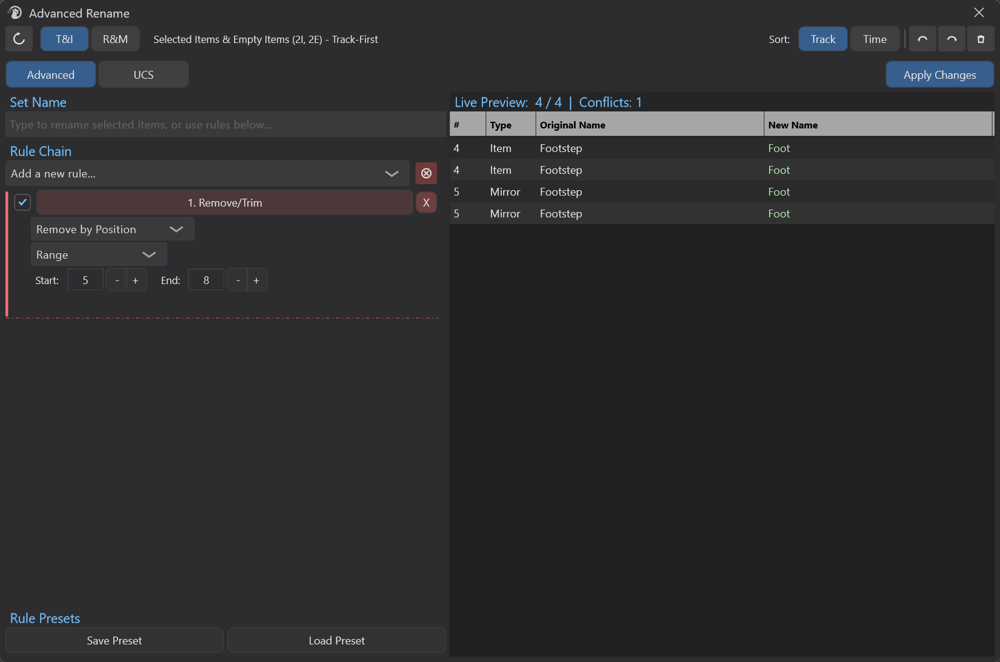

> ⚠️ Range 模式的 End 是**开区间**——`Range[5, 8)` 删掉索引 5,6,7,8 这 4 个字符。

---

### 8.6 List Rename（列表式重命名）

**用途**：用一份手写名字列表逐个替换选中对象的名字。

**参数**：

| 参数 | 默认 | 说明 |
|---|---|---|
| Text Buffer | (空) | 名字列表（**每行一个**） |
| Group by Track | OFF | 按所属 track 分组 |

**输入约定（重要）**：

> **每行一个名字**（用换行分隔，**不是逗号**！）。这跟 Simple Rename 的逗号分隔不同。

每行前后空白会被自动去除，空行会被跳过。

**两种工作模式**：

#### 模式 A: Group by Track = OFF（一对一）

逐行映射到选中对象的顺序。**严格要求** `行数 = 选中对象数` 才会被视为已配置。数量不匹配时整条规则被跳过（不执行）。

#### 模式 B: Group by Track = ON

按 track 分组，每行对应一个 track。**严格要求** `行数 == 唯一 track 数`。

> ⚠️ Group by Track 在 Tracks / Regions / Markers 上效果同 SimpleRename，**退化为一对一行为**（每个对象本身就是唯一的 track ID）。

> 📌 **常见用途**：从外部文档/Excel 复制一列名字，粘贴进 List Rename 的多行编辑框，立即映射到当前选区。

---

### 8.7 Numbering（编号）

**用途**：在每个名字前/后追加递增编号。

**参数**：

| 参数 | 默认 | 说明 |
|---|---|---|
| Start | 1 | 起始编号 |
| Step | 1 | 步进（可负数倒序、可大于 1 跳号） |
| Padding | 2 | 数字位数补零（0 = 不补零） |
| Position | Suffix | Prefix（前置）/ Suffix（后置） |
| Separator | `_` | 编号与原名之间的分隔符 |
| Reset on Name Change | OFF | 名字变化时重置编号 |

**行为**：

- Padding > 0 时按指定位数补零，超过位数自然递增（Padding=2 时：`01..09 10..99 100 101 ...`）。
- Padding = 0 时不补零（直接 `1 2 3 ...`）。
- Reset on Name Change：与上一行名字不同就重置回 Start——配合 List Rename 的 Group by Track 是经典组合。
- Step 可为负数（如 -1 实现倒序编号）。

---

### 8.8 Cleanup（清理）

**用途**：清理首尾空白和折叠多余空格。一般作为规则链的最后一条。

**参数**：

| 参数 | 默认 | 说明 |
|---|---|---|
| Trim Whitespace | ON | 去除字符串首尾的空白（空格/Tab/CR/LF） |
| Remove Extra Spaces | ON | 把多个连续空格折叠成一个 |

**行为**：两个开关都 OFF 时规则被视为未配置，跳过。


---

## 9. Rule Chain 预设

整条规则链可以保存为预设，方便后续一键加载。预设按 **预设名** 索引。

**操作**（左面板底部 Save / Load 按钮）：

| 按钮     | 行为                                                         |
| -------- | ------------------------------------------------------------ |
| **Save** | 弹框输入预设名 → 把当前规则链（含每条规则的启停状态、配置参数、顺序）整体存盘；重名会要求确认覆盖 |
| **Load** | 弹框选预设 → 替换当前规则链；同一弹框里还能删除预设           |

### 9.1 Save 重名预设时的确认流程

如果输入的预设名与已有预设重名，**不会**默默覆盖，而是弹一个确认框：

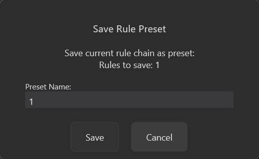
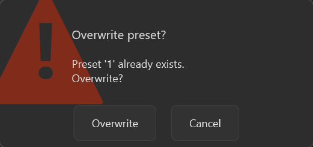

- 点 **Overwrite** → 真覆盖
- 点 **Cancel** → **重新弹 Save 弹框，并预填刚才的名字** 让你改名再保存——你的输入不会丢

如果在最初的 Save 弹框按 Cancel，则完全放弃保存。

### 9.2 Load 弹框的三个按钮

点 Load 按钮弹出的对话框：

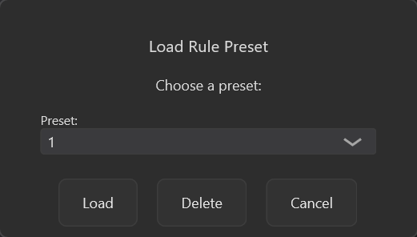

| 按钮       | 行为                                  |
| ---------- | ------------------------------------- |
| **Load**   | 用选中的预设替换当前规则链            |
| **Delete** | 二次确认后删除该预设（删除不可恢复）  |
| **Cancel** | 关闭对话框，什么都不做                |

### 9.3 预设的内容

**预设包含**：每条规则的类型、启用状态、完整配置参数、规则在链中的位置。

**预设不包含**：Set Name 编辑框内容（每次 Apply 后会清空）、UCS 字段配置（属于 UCS Tab 的独立预设系统）。

> 💡 **建议**：把常用工作流（例如"清理音频文件名"、"角色动作分组编号"）保存为预设，下次打开 Advanced Rename 直接加载。

---

## 10. UCS Tab

**UCS** = Universal Category System，一套面向音效素材的命名规范。Advanced Rename 内置 UCS 工作流，专门帮你按 UCS 字段构造文件名。

> 本节只覆盖 **如何在 Advanced Rename 里使用 UCS 功能**，不展开 UCS 规范本身的来龙去脉。

### 10.1 切换到 UCS Tab

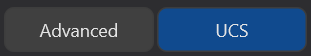

点击 Tab 行的 **UCS** 标签。左面板从规则链切换到 UCS 字段编辑界面，**Set Name 编辑框消失**（仅 Advanced Tab 可见）。

### 10.2 UCS 字段卡片

UCS Tab 默认初始化 4 个**受保护字段**：

| 字段名 | 含义 |
|---|---|
| Category | 主分类 |
| SubCategory | 子分类 |
| CatID | 分类 ID |
| CatShort | 分类缩写 |

> "受保护"指的是这 4 个字段名不能用于自定义字段（重复添加会被拒绝）。

每个字段是一张卡片：

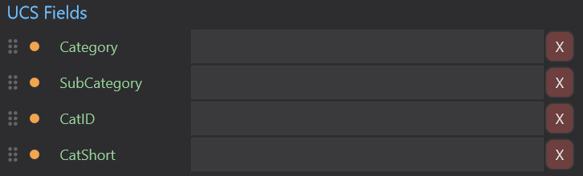

| 元素 | 作用 |
|---|---|
| ⠿ 拖拽手柄 | 调整字段顺序 |
| ● 输出开关 | 橙色 = 启用、灰色 = 禁用。禁用的字段**不会**出现在最终名字里 |
| 字段名 | 自定义字段可编辑；受保护字段（绿色徽章）只读 |
| 字段值 | 字段的内容，参与最终输出 |
| ⓧ | 删除字段 |

### 10.3 添加 / 重置 / 排序

- **[+] Add Custom Field** —— 在底部追加一个空白自定义字段（自定义字段名不能撞受保护名）。
- **Reset**（红底）—— 清空所有字段，恢复到默认 4 个受保护字段。
- **拖拽手柄** —— 上下拖动字段调整顺序（顺序决定输出时的拼接顺序）。

### 10.4 自动补全（仅受保护字段）

输入 Category / SubCategory / CatID / CatShort 字段值时，左面板下方会弹出**建议列表**，从内置 UCS 数据查询相关项：

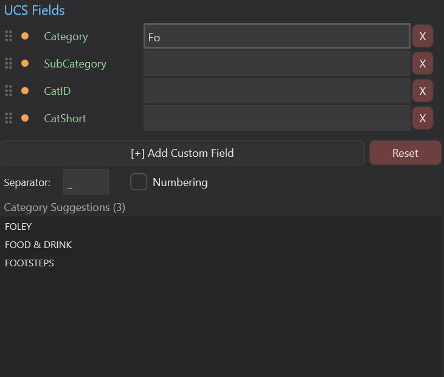

点击建议项即填入字段，下面的 Explanation 框会显示该项的详细说明（例如 "CatShort: 范畴缩写代码"）。

### 10.5 输出格式（Separator + Numbering）

字段卡片下方有一行：

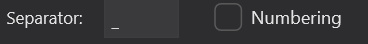

- **Separator** —— 字段之间的分隔符，默认 `_`。改这里立即影响输出。
- **Numbering** —— 启用后展开 Numbering 编辑器，给最终输出追加编号（参数同 §8.7）。

> 💡 **关键事实**：UCS 输出 = 把所有"非空且启用输出"的字段值用 separator 串起来。**字段值为空的字段会被自动跳过**——所以你不必删掉用不上的字段，留空就好。

### 10.6 UCS 预设

跟规则链预设独立的另一套预设系统，在 UCS 面板底部：

| 按钮 | 行为 |
|---|---|
| **Save** | 保存当前所有字段（含字段名、字段值、输出开关、displayOrder）+ Separator + Numbering 配置 |
| **Load** | 加载预设，替换当前字段配置 |

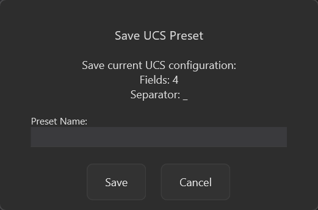

**默认预设**：可以指定一个预设为"默认"，下次打开 Advanced Rename 自动加载（详见 UCS 专题文档）。

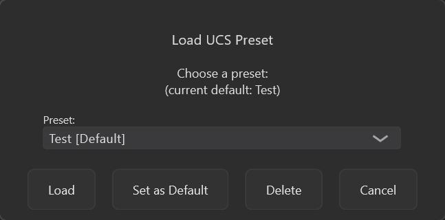

### 10.7 UCS 工作流示例

```
1. 切到 UCS Tab
2. Category 字段值: 输入 "Foot"
   → 建议弹出 [Foley, Footsteps, Forest]
   → 点击 "Footsteps"
3. SubCategory 字段值: 输入 "Wood"
4. CatID / CatShort 留空（自动跳过）
5. 加自定义字段 "Variant", 值 "Heavy"
6. Separator: "_", Numbering: ON, Padding: 2
7. 选区里有 5 个 items
8. Apply Changes
→ Footsteps_Wood_Heavy_01
   Footsteps_Wood_Heavy_02
   Footsteps_Wood_Heavy_03
   Footsteps_Wood_Heavy_04
   Footsteps_Wood_Heavy_05
```

---

## 11. R&M 模式详细操作

### 11.1 进入 R&M

点击 Header 的 **R&M** 按钮。右面板从单一 Preview 表切换为两个 Tab：

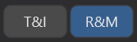

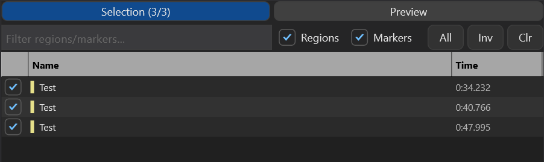


### 11.2 Selection Tab

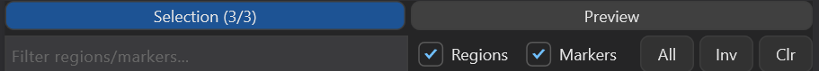

**控件**：

| 控件 | 作用 |
|---|---|
| Filter 编辑框 | 按名字模糊搜索（实时过滤） |
| Regions 切换 | 是否显示 region |
| Markers 切换 | 是否显示 marker |
| **All** | 选中所有当前可见（已过滤）项 |
| **Inv** | 反选当前可见项 |
| **Clr** | 清除所有选择（含被过滤掉的） |

**表格**：

| 列 | 内容 |
|---|---|
| 复选框 | 勾选 = 进入 Preview |
| 名字（带左侧色条） | 绿色色条 = Region；黄色色条 = Marker |
| 时间位置 | MM:SS.ddd 格式 |

### 11.3 R&M Tab 切换

点 **Preview** 标签查看新名字预览。Selection 与 Preview 之间可随意切换；Preview 显示的是 Selection 里**当前勾选**的对象。

### 11.4 R&M 模式的规则链

R&M 模式下规则链的工作方式与 T&I 模式**完全相同**——所有 8 种规则都可用，UCS Tab 也可用。区别只是数据源是 region/marker 而不是 item/track。

> ⚠️ **R&M 模式下 List Rename 的 Group by Track 无意义**——region/marker 没有"所属 track"概念，会退化为一对一。

### 11.5 关闭过滤后空表的兜底

如果关闭 Regions 和 Markers 两个切换，表格变空——这是预期行为，不会报错。打开任一类型即可恢复。

---

## 12. 快捷键与回车行为

### 12.1 全局快捷键

| 快捷键 | 行为 |
|---|---|
| `Ctrl+Z` | Undo（等同 Header 的 ↶ 按钮） |
| `Ctrl+Y` | Redo（等同 Header 的 ↷ 按钮） |

### 12.2 Enter 键的不同行为（取决于焦点）

| 焦点位置 | Enter 行为 |
|---|---|
| Set Name 编辑框 | generatePreview + tryExecuteRename（即 Apply） |
| 窗口任何其他地方 | tryExecuteRename（即 Apply） |
| Preview 表的 New Name 单元格编辑中 | 提交编辑值 → 刷新 stats / 冲突检测 |

> 总结：**几乎所有地方按 Enter 都等于点击 Apply Changes**。

### 12.3 Apply 失败时无反应

如果按 Enter / 点 Apply 但什么都没发生，可能原因：

1. 没选中任何对象
2. 所有对象的新名字都跟原名相同（successCount = 0）
3. 规则链里的关键规则未配置（IsConfigured 为 false）

---

## 13. 典型工作流

### 工作流 A：清理一批音效文件名

**目标**：把 `My Footstep .wav  ` 这种带尾巴扩展名 + 多余空格的名字清理干净。

```
1. 选中 Items
2. 规则链：
   - Remove/Trim:  Mode=Text, Text=".wav", Case insensitive, Remove all
   - Cleanup:      Trim Whitespace ON, Remove Extra Spaces ON
3. Apply
```

**结果**：`"My Footstep .wav  "` → `"My Footstep"`

---

### 工作流 B：批量改前缀 + 编号

**目标**：让选中的 5 个 items 都叫 `SFX_*_01..05`。

```
1. 选中 5 个 items
2. Set Name 输入: "Hit"
3. 规则链：
   - Add Text:  Type=Prefix, Text="SFX_"
   - Numbering: Start=1, Padding=2, Position=Suffix, Sep="_"
4. Apply
```

**结果**：`SFX_Hit_01, SFX_Hit_02, SFX_Hit_03, SFX_Hit_04, SFX_Hit_05`

---

### 工作流 C：结构化重排

**目标**：把所有 `Type_Material_Variant_NN` 格式的名字重排成 `Material_Type_Variant_NN`。

```
1. 选中所有目标 items
2. 添加 Structured Rename
3. 示例文件名：粘贴 "Footstep_Wood_Heavy_01" (选区里第一个就行)
4. 引擎自动检测 "_" 为分隔符，拆出 4 个组件
5. 拖拽：[Footstep] [Wood] → [Wood] [Footstep]
6. Apply
```

**结果**：所有名字按新顺序重排。

---

### 工作流 D：UCS 标准化命名

**目标**：用 UCS 规范给一批 Foley 素材命名。

```
1. 切到 UCS Tab
2. Category: Footsteps（从建议中选）
3. SubCategory: Wood
4. CatID / CatShort: 留空
5. 自定义字段 "Variant": Heavy
6. Separator: "_", Numbering ON
7. Apply
```

**结果**：`Footsteps_Wood_Heavy_01 ... Footsteps_Wood_Heavy_NN`

---

### 工作流 E：从 Excel 粘贴一列名字

**目标**：把外部表格里复制的 6 个角色名贴到 Advanced Rename 里改名。

```
1. 选中 6 个 items
2. 添加 List Rename
3. Text Buffer 粘贴（每行一个）：
       Player
       NPC1
       NPC2
       Boss
       Ambient
       Music
4. Group by Track: OFF
5. Apply
```

**结果**：6 个 items 各自得到对应的名字。

---

### 工作流 F：Region 批量改名

**目标**：把 4 个名为 "untitled" 的 region 改成 `Loop_01..04`。

```
1. 切到 R&M 模式
2. Selection Tab：
   - Filter: untitled
   - 勾选 Regions
   - All 按钮（全选已过滤）
3. 切回 Preview Tab
4. 规则链：
   - Set Name: Loop
   - Numbering: Start=1, Padding=2, Suffix
5. Apply
```

**结果**：4 个 region 改名为 `Loop_01, Loop_02, Loop_03, Loop_04`。

---

### 工作流 G：保存常用规则链

**目标**：把"清理 + 加 SFX 前缀 + 编号"这套组合保存下来重复使用。

```
1. 配好规则链
2. 左面板底部 Save Preset
3. 输入预设名："SFX Standard"
→ 下次打开直接 Load Preset 一键恢复
```

---

## 14. 注意事项 / 陷阱

### 14.1 Set Name 是规则链的输入起点，不是输出覆盖

详见 §7。理解错这点会让你疑惑"为什么 Numbering 没在我输入的名字后加编号"——其实加了，只是你以为 Set Name 是最后一步。

### 14.2 规则链严格按列表顺序执行

调换两条规则的顺序会得到不同结果。Numbering 通常应该放在最后。

### 14.3 冲突不阻塞 Apply

`X conflicts` 是警告不是错误。如果你不希望重名，请加 Numbering。

### 14.4 List Rename 用换行分隔，不是逗号

跟 SimpleRename 不同。粘贴 Excel 的一列正合适，粘逗号分隔的不行。

### 14.5 List Rename 数量不匹配会被静默跳过

不像 Simple Rename 有边框颜色实时反馈，Advanced Rename 的 List Rename 数量不匹配时只是 IsConfigured=false → 整条规则被跳过。如果你的列表没生效，先检查行数与对象数是否相等。

### 14.6 UCS 默认 4 个字段不能改名

Category / SubCategory / CatID / CatShort 是受保护字段名，自定义字段不能用这些名字。

### 14.7 UCS 字段值为空会被自动跳过

不需要手动删除暂时不用的字段，留空即可。

### 14.8 Apply 后 Set Name 编辑框会被清空

这是有意为之——避免你连续 Apply 时不小心把已经改过的对象再改一遍。

### 14.9 Clear All 不可撤销

删规则链没有 Undo 选项。删之前先 Save Preset。

### 14.10 R&M 模式下 List Rename 的 Group by Track 无意义

region/marker 没有所属 track，会退化为一对一。

### 14.11 刷新机制

Advanced Rename 不会自动检测 REAPER 选区变化。改选区后请点 Refresh 按钮（详见 §5.1）。

---

## 15. 故障排查

| 现象 | 可能原因 | 解决 |
|---|---|---|
| Apply 按钮按了没反应 | successCount = 0（所有新名字与原名相同） | 检查规则链是否有效配置 |
| Apply 按钮按了没反应 | 没选中任何对象 | 在 REAPER 里先选对象 |
| Apply 按钮按了没反应 | 焦点在 Preview 表的编辑单元格 | 先 Esc 退出编辑 |
| 某条规则似乎没生效 | 规则未启用（☑ 没勾） | 勾选启用 |
| 某条规则似乎没生效 | 规则未配置（IsConfigured=false） | 检查必填参数（如 Find 不为空） |
| List Rename 没生效 | 行数与对象数不匹配 | 让两边数量相等 |
| List Rename 没生效 | 用了逗号分隔 | 改用换行分隔（每行一个） |
| Numbering 永远从 1 开始 | Reset on Name Change 开着 + 每行名字都不一样 | 关掉 Reset on Name Change |
| Structured Rename 拼出奇怪结果 | 选区里对象命名结构不一致 | 这是已知限制，先把结构相同的选出来再用 |
| UCS 输出空字符串 | 所有字段都为空 | 至少给一个字段填值 |
| UCS 输出少了某个字段 | 字段输出开关被关掉 | 点亮橙色圆点 |
| UCS 自动补全没反应 | UCS JSON 数据未加载 | 见 UCS 专题文档 |
| R&M 表格是空的 | Regions / Markers 切换都关了 | 至少打开一个 |
| R&M 表格是空的 | Filter 文本框过滤太严 | 清空 Filter |
| 想改 track 但显示的是 item | REAPER 选区里有 item | 取消所有 item 选择 |
| Set Name 输入了内容但 Apply 后被清空 | 这是预期行为 | 见 §14.8 |
| 规则链丢了 | 切换 Tab / 切换模式不会丢；但 Clear All 会 | 操作前 Save Preset |

---

*最后更新：跟随主线代码*
