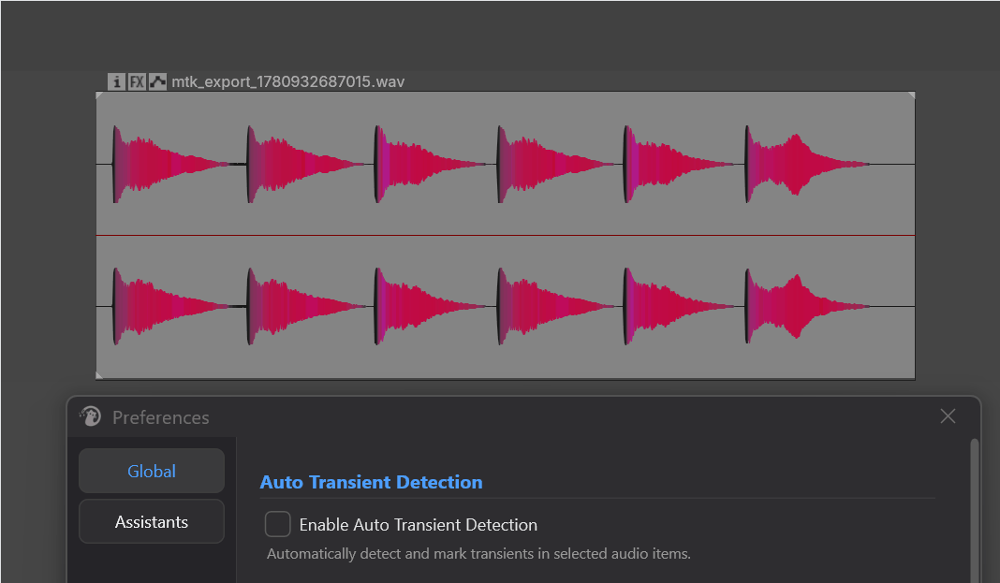
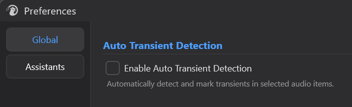
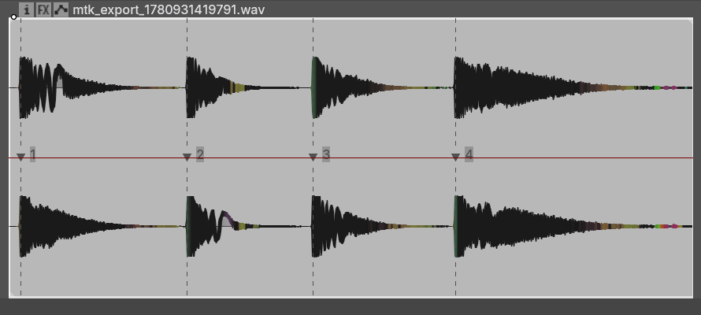

# Auto Transient Detection

---

## 1. 概述

**Auto Transient Detection** 是 Mantrika Tools 里给 **media item** 用的瞬态打点工具，定位是"**选中 item → take 上自动出现 transient 编号**"。

它把每个 item 里的瞬态点找出来，以 **take marker** 形式直接标在 active take 上，编号 `1, 2, 3, …`，浅灰色，贴在波形里每个瞬态起点上。

有两种用法：

- **自动模式**：开服务后，凡是被选中的 audio item 都会被后台分批检测，无需任何手动操作。
- **手动模式**：选 item → 触发 action → 一次性给所选 item 打点。

这些 marker **纯粹是视觉辅助**——让你在 Arrange 里一眼看到每个 item 的瞬态在哪。它们**不影响音频播放和导出**，也不与其他功能共享数据。

> **注意**：如果你删了或移动了 marker，服务会自动重新打一套（见第 5 节）。想保留自己的修改，请先 toggle skip。



---

## 2. 打开方式

### 2.1 启用 / 关闭自动化检测服务



勾上即开启服务。开关状态持久化，下次启动 REAPER 自动沿用。

### 2.2 手动 action（在 Action List 搜 "mantrika Transient"）

也可以从菜单走：

```
Extensions → Mantrika Tools → Util item
  ├─ Detect transients for selected items (manual)
  └─ Toggle: skip auto transient for selected items
```

| Action 名称 | 用途 |
| --- | --- |
| **`mantrika : Analysis - Detect Transients for Selected Items (manual)`** | 一次性给所选 item 打点；不依赖自动服务开关 |
| **`mantrika : Analysis - Toggle Skip Auto Transient Detection for Selected Items`** | 对所选 item 切换"跳过自动检测"标志 |

---

## 3. 基础用法 —— 三个典型操作

### 3.1 开后台服务，让它自己跑

```
1. 打开 Preferences...
2. 勾上 "Enable Auto Transient Detection"
3. 在 Arrange 里选中 audio item（可以一片一片选）
4. 每个 item 上出现带编号的 take marker
```

**特点**：
- 选了就开始算，不用任何额外触发
- 每个 tick 限流（≤ 10 个 item / ≤ 10 ms），不会卡 REAPER
- 算过的 item 不会重算，除非源被改过
- 关掉服务时会**清掉当前工程里所有 take 上的瞬态 marker**

适合日常 SFX 编辑——marker 在背景里悄悄出现。

---

### 3.2 一次性打点（手动）

```
1. 选中要打点的 item（可多选）
2. 触发 "Analysis - Detect Transients for Selected Items (manual)"
3. 完成
```

**什么时候用手动？**

- **关着自动服务**，临时给几个 item 打点，按需启用
- **源音频超过 5 分钟** —— 自动服务跳过这种文件以免阻塞，手动 action 不限长度

手动模式**会强制给所有符合条件的 item 打点**，不受 mute 状态和 skip 标志的影响。MIDI take、子工程 item、空 take 等没有真实音频源的内容仍然跳过。

---

### 3.3 拒绝某个 item 被自动打点

有些素材你就是不想要瞬态 marker（比如长 ambience、不需要切片的素材）。

```
1. 选中这些 item
2. 触发 "Analysis - Toggle Skip Auto Transient Detection..."
3. marker 被清掉，且该 item 之后不会再被自动检测
```

想恢复？

```
1. 再次选中这些 item
2. 再次触发同一个 toggle action
3. skip 标志被清除，下次自动服务轮到时会重新打点
```

> **Toggle 的逻辑**：
> - 有 marker → 清掉 marker，并打上"跳过"标志
> - 没 marker 但有"跳过"标志 → 清除标志（重新接受自动检测）
> - 什么都没有 → 不动

简单说就是"我不要这个" / "我又要了"的开关。

---

## 4. Marker 长什么样



| 项目 | 说明 |
| --- | --- |
| **名称** | 纯数字编号 `1`, `2`, `3`, …（按时间顺序） |
| **颜色** | 浅灰色 |
| **位置** | take 内的瞬态精确起点（毫秒级） |
| **类型** | take marker（不是 project marker，跟着 item 走） |

> **不要手动改这些 marker 的名称**——一旦改成非纯数字，系统会认为这不是瞬态 marker，自愈和清理逻辑都会绕过它。
>
> 这些 marker **跟着 take 走**。复制 item、拆分 item 时，marker 会一起被复制。

---

## 5. 自愈行为：删除\移动一个 marker 会怎样

自动服务会检查每个 item 的 marker 状态：

| 你做了什么 | 自动服务的反应 |
| --- | --- |
| 手动**删掉一个**瞬态 marker | 检测到状态变化 → **重新打全套** |
| 手动**移动**一个瞬态 marker 的位置 | 同上，重新打全套 |
| 源音频改变（trim 起止、换 source、reverse） | 重新打全套 |
| 啥都没动 | 跳过，不重算 |

设计意图是**保证 marker 永远反映当前源**——你想自己微调？请先 toggle skip。

---

## 6. 哪些 item 会被跳过

无论自动还是手动，下面这些一律不打点：

| 类型 | 原因 |
| --- | --- |
| MIDI take | 不是音频 |
| 子工程 item（subproject） | 保持区分度 |
| Click source / timecode source | 不是真实音频 |
| Mirror segment | 不是音频 |
| 空 take / 没 active take | 没东西可算 |
| 标了 skip 标志的 item | 用户主动拒绝 |

只在**自动模式**会额外跳过的：

| 类型 | 原因 |
| --- | --- |
| Mute 的 item | 通常不需要 |
| Source 长度 > 5 分钟 | 长 source 全扫会影响体验，并且大多数常见素材都没这么长。如有需要，请改用手动 Action |

---

---

## 8. 故障排查

| 现象 | 原因 | 解决 |
| --- | --- | --- |
| 选了 item 但没出现 marker | 自动服务关着；或源超过 5 分钟 | Preferences 里勾上 enable；长 source 用手动 action |
| 自动服务开着也不打 | item 标了 skip / 是 MIDI / 是 subproject / 静音 | 看上面第 6 节；如有 skip 标志，toggle 一次清掉 |
| Marker 自己跑回来了 | 自愈机制：删 / 移动 marker 会触发重算 | 想保留自己的修改，先 toggle skip 再改 |
| 关掉服务后 marker 不见了 | 这是设计行为——关服务会清所有瞬态 marker | 重新开启 -> 全选items；或者全选items -> 执行手动Action |
| 刚导入的大素材选中后没 marker | REAPER 还在生成波形预览，预览完成后才会检测 | 稍等几秒，等波形显示完整后再选 |
| 想全清干净 | 关掉 "Enable Auto Transient Detection" | 关闭服务会清所有 item 上的瞬态 marker |

> ⚠️ 注意！
> 如果你当前的工程，是素材源时长很长的拟音编辑、录音之类的工程，建议关闭这个自动化服务功能。对于这种工程，电脑可能会有一些不必要的性能压力。

---

## 9. 典型工作流

### 工作流 A：日常 SFX 编辑

```
1. 一劳永逸：Preferences 里勾上 enable
2. 之后正常工作，选 item 时 marker 自己出现
3. 看到不想要的 item，toggle skip 拒掉
4. 编辑时一眼能看到瞬态在哪，肉眼对齐 / 手动切片更精准
```

### 工作流 B：临时给几个 item 打点

```
1. 自动服务保持关闭
2. 选中需要的 item
3. 触发 "Analysis - Detect Transients..."
4. 完事
```

### 工作流 C：长素材（>5 分钟）

```
1. 选中这个 long source item
2. 触发手动 action（自动服务会跳过这种长度）
```

---