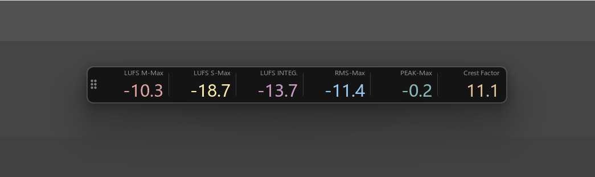
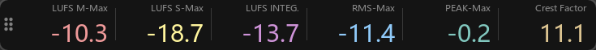
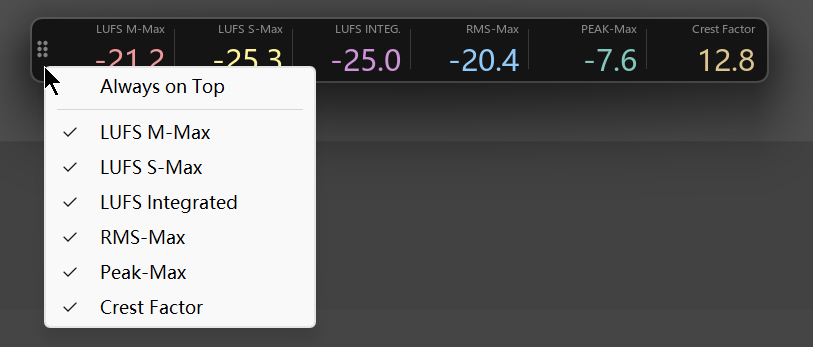

# Loudness Meter

---

## 1. 概述

**Loudness Meter** 是一个常驻挂在 MonitorFX 上的**轻量级响度表**，定位是"扫一眼就知道当前混音多响"。



它和 Sample Broker 共用同一个 Monitor FX 上的 CLAP 插件——所以**只要其中任意一个开过**，另一个就直接能用，不用单独装。

窗口很窄一长条，可以贴在屏幕任何位置常驻不挡事。

---

## 2. 打开方式

菜单入口：

Extension -> MantrikaTools -> Loudness -> Lightweight meter

或者 Action List（搜 "Loudness"）：

| Action 名称 | 用途 |
| --- | --- |
| **`mantrika : Loudness - Lightweight Meter`** | 切换显示 / 隐藏 Loudness Meter |

首次打开如果共用的 CLAP 还没就位，整个窗口会变成一个 "Setup" 按钮——点一下自动挂载即可。

---

## 3. 界面总览



```
┌──┬─────────────────────────────────────────────────────────────────────┐
│::│ LUFS M-Max  LUFS S-Max  LUFS INTEG.  RMS-Max  PEAK-Max  Crest Factor│
│::│   -18.3      -16.2       -23.4       -22.1     -1.2       12.1      │
└──┴─────────────────────────────────────────────────────────────────────┘
 ↑   ↑          ↑                                  ↑
 拖   各模块标签   绿/黄/紫/蓝/青/沙金各自配色       超过 0 dB 时变红
 把手
```

- **左侧那一列 6 个圆点** 是拖动把手——按住它拖窗口；**右键它**出菜单
- 数值过低（≤ -70 dBFS）时显示 `---`
- **Peak 一旦超过 0 dB 立刻变红**，提示爆音
- 一行数字、一行小字标签，颜色用来区分不同读数

---

## 4. 六个读数的含义

| 列名 | 中文 / 释义 |
| --- | --- |
| **LUFS M-Max** | Momentary 峰值响度（400ms 短窗的最大值） |
| **LUFS S-Max** | Short-term 峰值响度（3 秒滑窗的最大值） |
| **LUFS INTEG.** | Integrated 整体响度（按 BS.1770 标准累积平均） |
| **RMS-Max** | RMS 峰值（短窗 RMS 的最大值） |
| **PEAK-Max** | Peak / 采样峰值的最大值 |
| **Crest Factor** | `PEAK-Max − RMS-Max`，单位 dB（俗称 CF） |

### 关于 CF（Crest Factor）

**CF = PEAK-Max − RMS-Max**，也就是"这次播放里碰到的最大瞬态" 比 "这次播放里最响的短窗 RMS" 高出多少。

直观理解（**数字越大波形越瘦，数字越小波形越扁**）：

| 数值 | 典型材料 |
| --- | --- |
| **3 dB** | 纯正弦 / 三角波（理论下限） |
| **6–9 dB** | 砖墙限制的现代 pop master |
| **10–14 dB** | 一般混音 / 人声 / 吉他 |
| **15–20 dB** | 真实鼓点 / 打击 |
| **18–25+ dB** | 干净瞬态 SFX（whoosh head、impact） |

> **为什么不是"整段均值"**：早先版本 CF 拿全程平均 RMS 做分母，对带 fade out 尾巴的 SFX 一直漂——尾巴越长平均越低，CF 越大，永远没有"参考值"。现在 CF 锁在最响段，body 一过就稳态，停下来的数字就是这次播放的代表值。

做母带或最终响度判断时它和 LUFS-I 是搭档关系：LUFS-I 告诉你"多响"，CF 告诉你"被压扁了多少"。

---

## 5. 自动行为

读数的累积是**按播放会话来的**，不是一直挂着累积：

| 触发 | 行为 |
| --- | --- |
| **从停止 → 播放** | 所有读数清零，从这次播放开始重新累积 |
| **播放中跳光标**（>0.1s 跳变） | 同上：清零后从新位置重新累积 |
| **停止播放** | 读数定格在最后一刻，方便看完整段统计 |
| **窗口右键** | 手动清零（停止状态下也能用） |

这样设计的好处是：**每按一次播放都是一次"干净的测量"**，不会被上一段播放的历史污染。你想看某段的响度，就 Play 一次让它过完即可。

---

## 6. 窗口的位置 / 尺寸记忆

- **拖动把手到任何位置** → 关闭再打开会回到同一位置
- **拖窗口边框调大小** → 关闭再打开还是这个大小
- 位置 / 尺寸 **跨工程、跨 REAPER 重启** 都保留

意味着你只需要找一次自己习惯的位置（屏幕角落、副屏一条、第二显示器顶部 ⋯），之后就不用再管。

---

## 7. 右键菜单（拖把手上右键）



| 菜单项 | 含义 |
| --- | --- |
| **Always on Top** | 窗口置顶；勾上后永远盖在 REAPER 之上不被遮 |
| **LUFS M-Max** ⋯ **Crest Factor** | 每个读数都可单独显示 / 隐藏 |

> 隐藏读数不仅省地方，剩余可见模块会**自动均分剩余宽度**——只显示一个的时候它会占满整条窗口。
>
> 至少保留一个可见模块，最后一个会被禁用打勾防止全关闭。

右键菜单里所有的勾选状态 **都会保存**，下次打开沿用。

---

## 8. 典型用法

### 用法 A：常驻监听某段混音的响度

```
1. 打开窗口，拖到屏幕边角
2. 按播放
3. 全程瞟一眼即可知道 LUFS-I 大概在哪个档
```

### 用法 B：判断当前素材的动态情况

```
1. 看 Crest Factor（播一遍让它稳态收敛即可，body 过完就锁住）
2. <8 dB    → 已经很扁（重压缩 / 砖墙 master）
3. 10~14 dB → 一般混音
4. >15 dB   → transient 主导（鼓 / SFX 瞬态）
```

### 用法 C：检查爆音

```
1. PEAK-Max 一栏一直留意
2. 数字变红 = 已超过 0 dB，工程里某处肯定爆了
3. 右键清零，再回放定位
```

---

## 9. 故障排查

| 现象 | 原因 | 解决 |
| --- | --- | --- |
| 窗口里只有一个 "Setup" 按钮 | 共用的 CLAP 还没装好 / 被 bypass | 点 Setup，照提示完成；或先开一次 Sample Broker 走 Auto Setup |
| 数字一直 `---` | 当前没在播放，或电平太低 | 按播放；检查输入电平 |
| 数字不再变 | 工程已停止播放（读数会定格） | 这是预期行为，下次按播放自动清零重新累积 |
| PEAK-Max 始终红色 | 累积期间出现过爆音 | 右键清零；或重新播放重新测 |
| 窗口位置 / 大小没记住 | （不会发生）位置和尺寸都持久化 | — |

---
