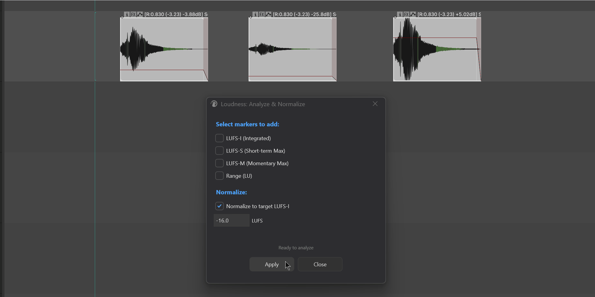
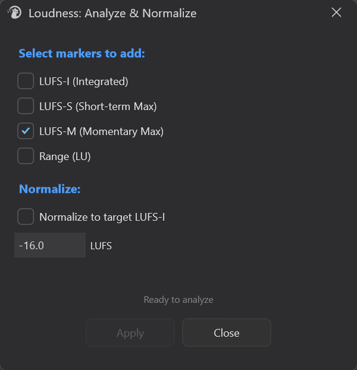
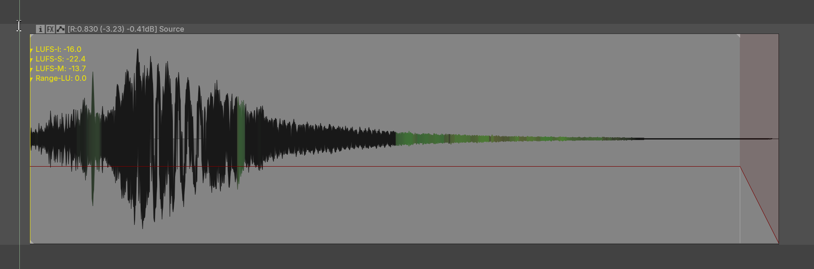

# Loudness Analyze

---

## 1. Overview

**Loudness** is a loudness tool for **media items**. Its purpose is **select items → one action → done**.



It does two things:

- **Analyze loudness**: calculates LUFS-I / LUFS-S Max / LUFS-M Max / Range for an item and writes them as **take markers** directly on the item.
- **Normalize loudness**: adjusts the item's volume to a target LUFS-I value. It changes item volume (`D_VOL`), does not render, and does not alter the waveform.

The whole workflow revolves around item selection — select items, trigger the action, and the rest is handled automatically.

---

## 2. Opening the tool

Menu paths:

```
Extensions → Mantrika Tools → Loudness → Analyze & normalize (main UI entry)

Extensions → Mantrika Tools → Loudness → Normalize selected to -23 LUFS -I

Extensions → Mantrika Tools → Loudness → Normalize selected to median LUFS-I
```

| Action name (search "Loudness" in the Action List) | Function |
| --- | --- |
| **`mantrika : Loudness - Analyze and Add Markers / Normalize to Target LUFS`** | Opens the main window; freely choose marker combination and target value |
| **`mantrika : Loudness - Normalize Selected Items to -23 LUFS`** | One-click normalize selected items to **-23 LUFS** (broadcast standard) |
| **`mantrika : Loudness - Normalize Selected Items to Median LUFS`** | One-click normalize selected items to the **median loudness** (unify volume across multiple assets) |

The last two are shortcut channels to save clicks; internally they use the same analysis logic.

---

## 3. Main window overview

Trigger `Loudness - Analyze and Add Markers / Normalize to Target LUFS` to open the main window:



```
┌──────────────────────────────────────────────┐
│ Select markers to add:                       │  ← Section 1: analyze
│   ☐ LUFS-I (Integrated)                      │
│   ☐ LUFS-S (Short-term Max)                  │
│   ☐ LUFS-M (Momentary Max)                   │
│   ☐ Range (LU)                               │
│                                              │
│ Normalize:                                   │  ← Section 2: normalize
│   ☐ Normalize to target LUFS-I               │
│   [ -16.0 ]  LUFS                            │
│                                              │
│ ▭▭▭▭▭▭▭▭▭▭▭▭▭▭▭▭▭▭▭▭▭▭▭▭▭ │  ← Progress bar
│              Ready to analyze                │  ← Status text
│                                              │
│          [  Apply  ]    [  Close  ]          │
└──────────────────────────────────────────────┘
```

| Area | Description |
| ---- | ----------- |
| **Markers section** | Check which markers to write on the item; any combination allowed |
| **Normalize section** | Must be checked before the target can be edited; target range **-60.0 ~ 0.0 LUFS** |
| **Progress bar / status** | Shows progress and count during analysis; turns green on success or red on failure |
| **Apply** | Runs the analysis; while running the button becomes **Cancel** and can be used to abort |

> **Important: Markers and Normalize are mutually exclusive.**
> Checking any marker automatically unchecks normalize, and vice versa.
> If you want to "add markers first, look, then normalize," run it twice.

---

## 4. Basic usage — three typical operations

### 4.1 Add loudness markers to items

```
1. Select one or more items in the Arrange view
2. Trigger "Loudness - Analyze and Add Markers / Normalize..."
3. Check the markers you want (for example, only LUFS-I)
4. Click Apply
```

**Result**: the active take of each selected item gets the corresponding take marker, looking like:

```
LUFS-I: -18.3
```

Orange, positioned at the take start (corrected for snap offset and start offset).

> Re-running **deletes old loudness markers first**, then writes new ones — they do not pile up.

---

### 4.2 Normalize items to a target LUFS

```
1. Select the items you want to normalize
2. Trigger the main-window action
3. Check "Normalize to target LUFS-I"
4. Enter a target in the input box, for example -16.0
5. Click Apply
```

**Result**: each item's volume is adjusted so its LUFS-I lands on the target.

> Normalize changes **item volume**; the original audio file is untouched. To undo, press Ctrl+Z or manually drag the item volume back to 0 dB.

---

### 4.3 One-click operations (no window needed)

| Scenario | Which action to use |
| -------- | ------------------- |
| Normalize a batch of assets to the broadcast standard -23 LUFS | `Loudness - Normalize Selected Items to -23 LUFS` |
| A group of assets has uneven volume and you want to level them | `Loudness - Normalize Selected Items to Median LUFS` |

Both actions **briefly flash the main window** to show progress, then close automatically when finished.

> **Median mode requires at least 2 audio items** to be meaningful; fewer than 2 shows a message and refuses to run.

---

## 5. What the four marker options mean



| Option | Marker text written | Plain meaning |
| ------ | ------------------- | ------------- |
| **LUFS-I (Integrated)** | `LUFS-I: -18.3` | The **average** loudness of the whole item (most commonly used) |
| **LUFS-S (Short-term Max)** | `LUFS-S: -12.1` | The loudest 3-second sliding window |
| **LUFS-M (Momentary Max)** | `LUFS-M: -8.5` | The loudest 400 ms short window |
| **Range (LU)** | `Range-LU: 7.2` | Overall loudness range span |

For everyday use one or two markers are enough; checking all four crowds the top of the take with markers.

---

## 6. Status feedback

The status bar at the bottom of the main window reports the result:

| Display text | Meaning |
| ------------ | ------- |
| `Ready to analyze` | Idle |
| `Preparing...` / `Processing N/M items...` | Running (multi-threaded) |
| `Analyzed K/N items` | Only markers were added; K succeeded |
| `Normalized K/N items` | Only normalize was run; K succeeded |
| `Analyzed & Normalized K/N items` | Two-step merge triggered by the shortcut actions |
| `No audio items selected` | No valid audio items in the selection |
| `Analysis cancelled` | You clicked Cancel |

> **MIDI items / empty items / video items are silently skipped** and are not counted in the success total.

---

## 7. Preference persistence

Choices in the main window are automatically saved after each successful run and restored the next time the window opens:

| Setting | Persisted? |
| ------- | ---------- |
| The four marker checkboxes | ✅ |
| Normalize switch | ✅ |
| Target LUFS value | ✅ |
| Last status text | ❌ (each reopen shows "Ready to analyze") |

> Only a successful **Apply** saves the settings — opening the window and closing it without running does not change the saved preferences.

---

## 8. Keyboard / mouse cheat sheet

| Input | Behavior |
| ----- | -------- |
| Trigger main-window action | Opens the window |
| **Enter** | Same as clicking Apply |
| Apply button (during analysis) | Becomes Cancel; click to abort |
| Target LUFS input box | Accepts only numbers, `.`, and `-`; values outside -60 ~ 0 are clamped automatically |
| Close window (X / Close) | Automatically cancels any running analysis |

---

## 9. Typical workflows

### Workflow A: one-click normalize game SFX assets to -23 LUFS before delivery

```
1. Select all items to deliver
2. Trigger "Loudness - Normalize Selected Items to -23 LUFS"
3. Wait a few seconds until "Normalized N/N items" appears
```

### Workflow B: level out a group of footsteps or weapon sounds

```
1. Select the group of items
2. Trigger "Loudness - Normalize Selected Items to Median LUFS"
3. All items are pulled to the group's median loudness
```

Good for "first get the group to a similar perceived level, then push the whole group with a fader."

### Workflow C: review how loud each item is

```
1. Select items
2. Trigger the main-window action
3. Check only LUFS-I (enough for everyday use)
4. Apply
5. Read the marker numbers at the top of each item in the Arrange view
```

Adding markers does not prevent later normalization — running normalize afterwards deletes the old markers cleanly.

---

## 10. Troubleshooting

| Symptom | Cause | Fix |
| ------- | ----- | --- |
| Apply button is grayed out | No item selected / neither markers nor normalize checked | Select an item and check at least one option |
| Status shows `No audio items selected` | Selected items are MIDI / video / empty takes | Try again with audio items |
| No marker appears on the item | Normalize was selected instead of markers; they are mutually exclusive | Check the marker options and Apply again |
| Median mode refuses to run | Fewer than 2 audio items in the selection | Select at least 2 audio items |
| Volume did not change after normalize | The item is already near the target, or LUFS-I is too low (~-70) to measure | Check whether the source is extremely quiet or nearly silent |
| Markers pile up on the item | (Should not happen) the plug-in deletes old markers with the same name first | —|
| Want to undo normalize | Press Ctrl+Z once, or manually reset item volume | — |

---

## 11. Relationship with other modules

| Related module | Description |
| -------------- | ----------- |
| **Loudness Meter** (`Loudness - Lightweight Meter`) | A **real-time level meter** that looks at the master / current playback stream. This module measures existing items; the purposes are different. |

---
