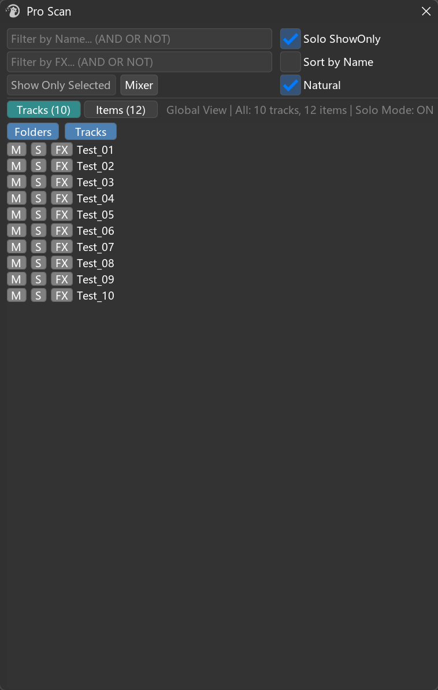
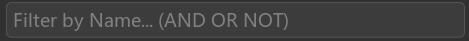
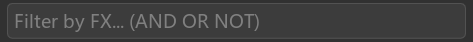
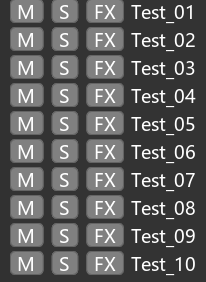
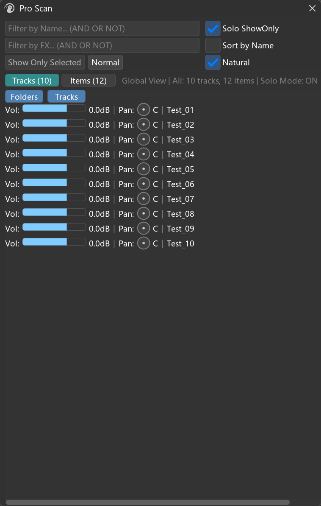
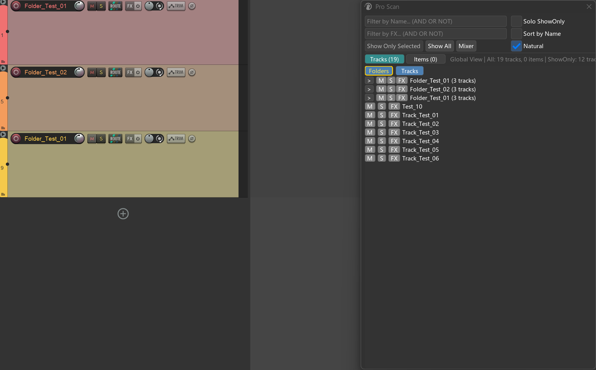
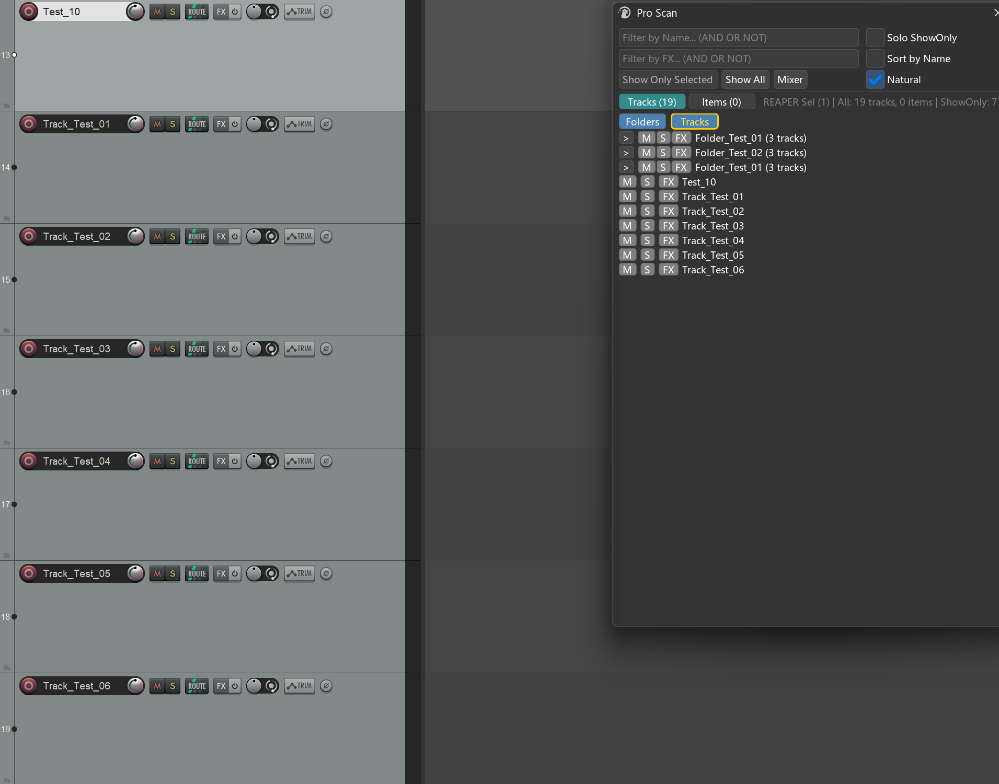
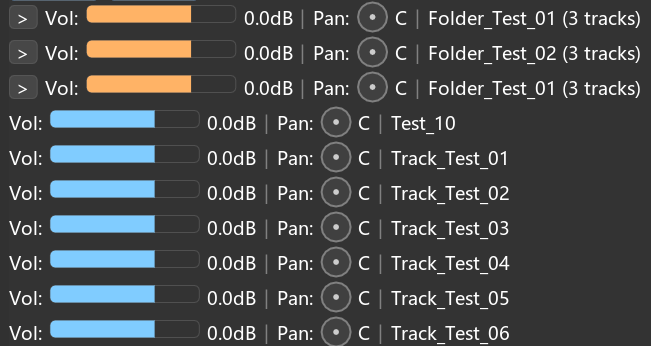
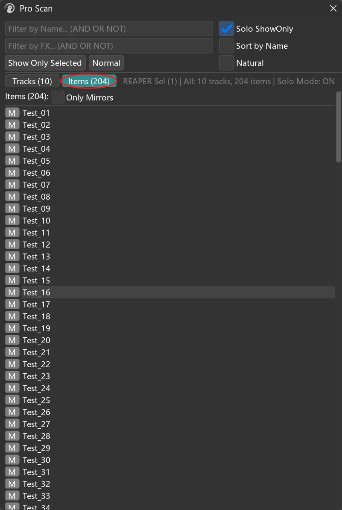

# Pro Scan 用户手册


## 1. 概述

**Pro Scan** 是 Mantrika Tools 的工程导航与轨道控制窗口。它把一个 REAPER 工程里所有的 **Tracks** 和 **Items** 收拢成一份可搜索、可一键聚焦的清单，让你不必在主时间线上一行行地翻 TCP，就能：

- **快速定位**任意轨道或 item（点一下就跳过去）
- **按名字 / FX 筛选**，把工程里需要关注的部分单独拎出来
- 一键**只显示**某一批轨道，临时把工程"瘦身"成需要的样子
- 在窗口里直接控制 **Mute / Solo / FX 旁路 / 音量 / 声像**，不用切回 TCP / Mixer

**典型使用场景**：

- 工程里有 200 条轨道，想找"所有名字带 Vocal、且挂了 ReaEQ 的轨道"
- 临时只想看某个 folder 的内容做编辑，编辑完再恢复整工程视图
- 多选若干轨道做"统一压低 3dB"的批量音量调整
- 在 Mirror 系统里只看含有 Mirror 的 item

---

## 2. 打开方式

菜单入口：

```
Extensions → MantrikaTools → Pro scan
```

或在 Action List 搜：

| Action 名称 | 用途 |
| --- | --- |
| **`mantrika : Synergy - Pro Scan`** | 打开 / 关闭 Pro Scan 窗口 |

---

## 3. 界面总览



四个主要区域：

| 区域 | 内容 |
|---|---|
| **顶部 3 行工具区** | 名字筛选 / FX 筛选 / 操作按钮与开关 |
| **状态栏** | 当前 REAPER 选中数、筛选/全部统计、Solo & ShowOnly 状态 |
| **Tab 行** | Tracks Tab / Items Tab（数字 = 当前可见数量） |
| **主列表区** | 当前 Tab 的内容；Tracks Tab 支持 Folder 嵌套展示 |

---

## 4. 工具栏（顶部 3 行）

### 4.1 Name 筛选框



按**对象名字**实时筛选。**Tracks Tab 和 Items Tab 共用同一个筛选条件**——输入 `Vocal` 同时影响轨道列表和 item 列表。

支持的语法（与 REAPER 搜索框一致）：

| 语法 | 含义 | 示例 |
|---|---|---|
| `word1 word2` | AND（两者都要出现） | `kick drum` |
| `word1 OR word2` | OR（任一出现即可） | `vocal OR vox` |
| `NOT word` | 排除 | `drum NOT kick` |
| `"exact phrase"` | 精确短语 | `"lead vox"` |
| `^word` | 以 word 开头 | `^FX_` |
| `word$` | 以 word 结尾 | `.wav$` |
| `(a OR b) c` | 分组 | `(kick OR snare) bus` |

> 💡 筛选框留空 = 显示全部对象。前后空白会自动忽略。

### 4.2 FX 筛选框



按**轨道 / item 上挂载的 FX 名字**筛选。两个特殊用法：

- 输入 `*` （Shift+8）—— 显示**所有挂了 FX 的对象**（无视 FX 名字）
- 输入具体名字（支持 §4.1 同样的 AND/OR/NOT 语法）—— 显示挂了对应 FX 的对象

**Name 筛选与 FX 筛选可叠加使用**——例如：Name = `Vocal`、FX = `ReaEQ` → "名字带 Vocal、且挂了 ReaEQ 的轨道"。

### 4.3 操作按钮与开关

| 控件 | 行为 |
|---|---|
| **Show Only Selected** | 把 ProScan 里当前选中的轨道做 Show Only（§6） |
| **Show All** | 退出 Show Only 状态，恢复所有轨道可见性（仅在 ShowOnly 激活时显示） |
| **Mixer / Normal** | 切换 Tracks Tab 的渲染模式（M/S/FX 按钮 ↔ 音量推子 + Pan 旋钮） |
| ☑ **Solo ShowOnly** | 启用后，做 Show Only 时会把这些轨道自动 Solo；退出 ShowOnly 时恢复原始 Solo 状态 |
| ☑ **Sort by Name** | 列表按名字自然排序（含数字分量，"Track2 < Track10"）。关闭时按工程顺序 |
| ☑ **Natural** | 在无筛选时，把顶级 folder 和顶级单轨道**混合在一起**按工程顺序排列，而不是分成两段（详见 §5.8） |

> 所有开关状态都会**自动保存**，下次打开 ProScan 会沿用上次的设置。

---

## 5. Tracks Tab

Tracks Tab 是 Pro Scan 的主舞台。它展示当前可见的所有轨道，支持完整的 Folder 嵌套、Mute / Solo / FX 控制、Mixer 模式、批量音量调整等等。

### 5.1 轨道行结构

#### Normal 模式（默认）



```
   M  S  FX   Track Name
   │  │  │
   │  │  └─ FX Chain 按钮 / FX 旁路控制（点击行为见 §5.5）
   │  └─ Solo 切换
   └─ Mute 切换
```

按钮颜色含义：

| 颜色 | M/S 含义 | FX 含义 |
|---|---|---|
| 灰色 | 未 Mute / 未 Solo | 没有 FX |
| 黄色 | 已 Mute / 已 Solo | 有 FX 但全部被旁路（Bypass） |
| 绿色 | —— | 有 FX 且至少一个启用 |

#### Mixer 模式




切换：点击工具栏的 **Mixer** / **Normal** 按钮。在 Mixer 模式下，列表横向变宽，下方出现横向滚动条。

### 5.2 选择交互（鼠标）

| 操作 | 行为 |
|---|---|
| **左键单击轨道名字** | 选中该轨道 + 跳转到该轨道（在 REAPER 里 SetOnlyTrackSelected 并垂直滚动到该轨道）。若该轨道位于折叠的父 folder 内（含多层嵌套折叠），会**先自动展开这些父 folder** 再跳转，确保滚动能定位到它 |
| **Ctrl + 左键** | 多选切换（仅在 ProScan 内部加选 / 取消加选，不立即跳转） |
| **Shift + 左键** | 范围选择（以上一个 Ctrl/单击位置为锚点） |
| **右键单击轨道名字** | 把当前轨道作为唯一选中并 Show Only（再次右键同一行 = Show All） |

ProScan 的选中状态**与 REAPER 单击跳转挂钩**：单击列表里某一行，REAPER 那边会同步只选中这一行。Ctrl/Shift 多选则只影响 ProScan 内部，不会立即修改 REAPER 选区。

### 5.3 Folder 展示

Folder 父轨道会带一个展开/折叠按钮 `▶` / `▼`：

**展开按钮的点击行为**：

| 操作 | 行为 |
|---|---|
| 左键单击 | 切换当前 folder 的展开 / 折叠状态 |
| **Ctrl + 左键** | 批量切换**所有** folder 的展开 / 折叠状态 |
| 双击 folder 名字 | 也可切换展开 / 折叠 |

> 💡 **Folder 的展开/折叠状态会同步到 REAPER 的 TCP**——你在 ProScan 折叠一个 folder，REAPER 主界面的 TCP 也会跟着折叠。

**folder 上的 M / S / FX 按钮**与普通轨道一致，并且 Ctrl+点击 FX 按钮可批量切换该 folder 父轨道上所有 FX 的旁路状态。

**folder 右键** = 把整个 folder（父轨道 + 所有子轨道）一起做 Show Only。

### 5.4 分组开关：Folders / Tracks 双按钮

当没有筛选条件时（Name 和 FX 都为空），列表上方出现两个独立按钮：


| 操作 | 行为 |
|---|---|
| **左键 Folders** | **整段显示 / 隐藏** —— 关掉后，ProScan列表里所有 folder（含子轨道）全部不再显示；再次按下恢复。 |
| **左键 Tracks** | **整段显示 / 隐藏** —— 关掉后，ProScan列表里所有"不属于任何 folder 的独立轨道"全部不再显示；再次按下恢复 |
| **右键 Folders** | 一键 **Show Only 所有文件夹**（含其子轨道） |
| **右键 Tracks** | 一键 **Show Only 所有非文件夹的独立轨道** |

按钮在 ShowOnly 激活时会显示**金黄色边框 + 淡黄文字**——明确告诉你"现在你在这种模式下"。再次右键同一个按钮 = Show All。


    


### 5.5 FX 按钮的高级用法

FX 按钮（Normal 模式下）有两种点击行为：

| 操作 | 行为 |
|---|---|
| **左键单击** | 打开 / 关闭该轨道的 **FX Chain 窗口** |
| **Ctrl + 左键** | **批量切换该轨道上所有 FX 的旁路状态**（按钮变绿/黄即可看出当前状态） |

> 用途：需要快速对比"开 FX vs 关 FX"听感时，Ctrl+点 FX 按钮可一键全部旁路 / 全部启用。

### 5.6 Mixer 模式：Volume 与 Pan

切换到 Mixer 模式后，每条轨道行变成一条迷你混音条。



**Volume 推子（横向蓝色填充）**：

| 操作 | 行为 |
|---|---|
| **左键拖动** | 调整音量 |
| **Shift + 拖动** | 精细调整（灵敏度 ÷10） |
| **Ctrl + 单击** | 弹出输入框，直接输入 dB 数值 |
| **双击** | 重置为 0 dB |

**Pan 旋钮（圆形）**：

| 操作 | 行为 |
|---|---|
| **左键垂直拖动**（上加大、下减小） | 调整 Pan |
| **Shift + 拖动** | 精细调整（灵敏度 ÷2） |
| **Ctrl + 单击** | 弹出输入框，输入百分比（-100 ~ +100） |
| **双击** | 重置为中央（C） |

**多选批量调整**：

当 ProScan 里同时选中**多条轨道**且你拖动其中一条的 Vol/Pan 时，**整批轨道一起动**，并且：

- 拖动模式：所有选中轨道保留原有相对差异，不会被强制归一化。
- 双击模式：所有选中轨道**全部归到目标值**，全部归零

### 5.7 排序模式


工具栏的 **Sort by Name** 复选框影响列表显示顺序：

- **关闭（默认）** —— 按 REAPER 工程内的轨道顺序（IP_TRACKNUMBER）
- **打开** —— 按名字自然排序（数字会按数值比较，`Track2 < Track10`）

排序同时影响**顶级**轨道、**folder 内的子轨道**、以及 **folder 之间**的顺序。

### 5.8 Natural 排序


工具栏的 **Natural** 复选框（仅 Tracks Tab、且无筛选时生效）：

- **关闭** —— 列表分两段：先是 `Folders 区段`，再是 `Tracks outside folders:`
- **打开** —— 顶级 folder 和顶级独立轨道**混合在一起**，按工程顺序（或按 Sort by Name 时按名字）排列

> 用途：当你的工程里 folder 和散轨是交错出现的，Natural 模式让 ProScan 的列表与 TCP 看起来"长得一样"。

---

## 6. Show Only：临时聚焦

Show Only 是 Pro Scan 的核心工作流——把一批轨道临时挑出来单独显示，其它轨道隐藏。结束时一键还原。

### 6.1 五种触发方式

| 触发 | 范围 |
|---|---|
| 单轨道**右键** | 只显示该轨道 |
| Folder **右键** | 显示该 folder 父轨道 + 所有子轨道 |
| 选中多条后点 **Show Only Selected** 按钮 | 显示当前 ProScan 选中的所有轨道 |
| **右键 Folders 按钮** | 显示所有 folder（含子轨道） |
| **右键 Tracks 按钮** | 显示所有"不在 folder 里"的独立轨道 |


### 6.2 退出 ShowOnly 的三种方式

| 操作 | 行为 |
|---|---|
| 点 **Show All** 按钮 | 恢复全部可见 + 恢复 Arrange View + 跳回 ShowOnly 时的原轨道 |
| **再次右键同一个轨道** | （仅单轨道触发模式有效）等同 Show All |
| **再次右键同一个 folder** | 等同 Show All |


退出后 ProScan 会**自动跳回**你进入 ShowOnly 之前的位置。

### 6.3 Solo ShowOnly（可选增强）

工具栏的 ☑ **Solo ShowOnly** 复选框打开后：


- 做 Show Only 时，会**先保存当前所有 Solo 状态**，再把这批"被 Show Only 的轨道"打上 Solo
- 退出 ShowOnly 时，**清除自己加的 Solo + 恢复原始 Solo 状态**

这个功能特别适合"我只想听这几条轨道的内容"的快速 monitor 场景——比 "Show Only" 单独显示更进一步，不仅看到画面只剩它们，听到的也只剩它们。

> ⚠️ 注意：开启 Solo ShowOnly 后，每次 ShowOnly 都会**覆盖**原来的 Solo 标记记录。所以建议把 Solo ShowOnly 当成一个**临时 monitor 工具**——开启 → 用完 → 关闭。

---

## 7. Items Tab

Items Tab 是工程内所有 item 的清单。结构比 Tracks Tab 简单：



### 7.1 行结构

| 元素 | 作用 |
|---|---|
| **M 按钮** | 切换该 item 的 Mute 状态（黄 = mute、灰 = 正常） |
| **Item 名字** | 单击跳转、Ctrl/Shift 多选（行为同 Tracks Tab） |

### 7.2 Only Mirrors 切换

☑ **Only Mirrors** 复选框打开后：

- 列表只显示 Mirror 类型的 item（Mantrika 自己的 item类型）
- 标题数字也变成 `Mirrors (N):`

> 💡 用途：在用 Mirror 系统做布局或对齐时，把工程里所有 Mirror 单独拎出来一目了然。

### 7.3 跳转到 item

单击 item 名字会：

1. 在 REAPER 里选中该 item（取消其它选择）
2. 选中该 item 所属轨道（若该轨道被折叠的父 folder 隐藏，会先自动展开父 folder）
3. 把编辑光标移到 item 起始位置

---

## 8. 状态栏

```
REAPER Sel (3) | Filtered: 24 tracks, 102 items | Solo Mode: ON (Active: 5 tracks) | ShowOnly: 5 tracks
```

各段含义：

| 段 | 内容 |
|---|---|
| **REAPER Sel (N)** / **Global View** | REAPER 当前选中 N 个轨道；为 0 时显示 Global View |
| **All / Filtered** | 当前可见的 track 数 + item 数；有筛选时显示 `Filtered:`，无筛选时显示 `All:` |
| **Solo Mode: ON** | 仅在 ☑ Solo ShowOnly 启用时显示；`Active: N` 表示当前由 ShowOnly 加的 Solo 个数 |
| **ShowOnly: N** | 仅在 ShowOnly 激活时显示，N = 当前显示的轨道数 |

---

## 9. 自动刷新机制

Pro Scan 不需要你手动按 Refresh：

- **REAPER 选区变化** —— 自动同步 ProScan 的选中状态、自动刷新列表
- **工程状态变化** —— 自动检测并清理已删除的轨道 / item
- **筛选条件变化** —— 输入框内容一变就实时刷新
- **Mute / Solo / Pan / Volume 修改** —— 在 ProScan 内修改后立即生效

> 💡 ProScan 也会自动适应：你在 REAPER 里删了一条轨道、改了名字、加了 FX，下一次 ProScan 渲染时就会看到最新状态。

---

## 10. 典型工作流

### 工作流 A：快速找到并聚焦某条轨道

**目标**：工程有 200 条轨道，想跳到 "Lead Vocal" 那条。

```
1. 在 Name Filter 输入: Lead Vocal
2. 列表过滤到几条结果
3. 单击目标轨道
   → REAPER 自动选中、滚动到该轨道
   → 若该轨道在折叠的 folder 里（含嵌套），会先自动展开父 folder 再跳转
```

---

### 工作流 B：临时只看 Drum Bus

**目标**：编辑鼓组时不想被别的轨道干扰。

```
1. 在列表里找到 "Drum Bus" folder
2. 右键 folder 名字
   → 只显示 Drum Bus + 所有子轨道
   → Arrange 自动 Zoom 到 Drum 内容
3. 编辑完成后，再次右键 "Drum Bus"（或点 Show All）
   → 恢复全部轨道可见、恢复原 Arrange View
```

---

### 工作流 C：找出所有挂了 ReaEQ 的人声轨道

**目标**：批量检查人声 EQ 设置。

```
1. Name Filter: Vox OR Vocal
2. FX Filter: ReaEQ
   → 列表过滤到所有"名字含 Vox/Vocal 且挂了 ReaEQ"的轨道
3. 点击任一条 → 跳转到该轨道
4. 左键点 FX 按钮 → 直接打开 FX Chain 窗口
```

---

### 工作流 D：批量降 3dB

**目标**：选中 8 条吉他轨道一起降 3dB，保留它们之间的相对音量差。

```
1. 切到 Mixer Mode
2. Name Filter: Guitar
3. 在列表里 Ctrl + 单击或 Shift + 单击选中 8 条吉他轨道
4. 拖动其中任一条的 Volume 推子向左 3dB
   → 8 条轨道全部下降 3dB（保留相对关系）
```

---

### 工作流 E：A/B 听 FX 开关效果

**目标**：快速对比某条母线挂了一长串 FX 和全部 bypass 的差异。

```
1. 单击列表里的目标轨道（让它选中且跳转）
2. 在该轨道的 FX 按钮上 Ctrl + 单击
   → 该轨道所有 FX 一键全部旁路（按钮变黄）
3. 听 A 段
4. 再次 Ctrl + 单击同一 FX 按钮
   → 全部启用回原状（按钮变绿）
5. 听 B 段
```

---

### 工作流 F：只看 Mirror

**目标**：检查工程里所有 Mirror 的位置。

```
1. 切到 Items Tab
2. 勾选 ☑ Only Mirrors
   → 列表只剩 Mirror items
3. 单击任一行
   → 跳到对应位置
```

---

### 工作流 G：Solo + ShowOnly 联动

**目标**：只听并只看某个 group 的内容做检查。

```
1. 工具栏勾选 ☑ Solo ShowOnly
2. 右键目标 folder
   → 显示该 folder + 自动 Solo 这些轨道
3. 听 + 看
4. 点 Show All（或再次右键 folder）
   → 恢复显示 + 恢复原 Solo 状态 + 跳回原轨道
5.（如果不再需要 Solo 联动）取消 ☑ Solo ShowOnly
```

---

## 11. 注意事项 

### 11.1 ShowOnly 退出时会跳到 ShowOnly 时的原轨道

不是跳回你"按 Show All 之前看的轨道"，而是跳回 **进入 ShowOnly 之前**关注的那条。这是设计意图——避免 Show Only 期间频繁滚动让你迷失原位置。

### 11.2 Solo ShowOnly 会覆盖你之前的 Solo 标记

每次新的 ShowOnly 都会"先清理上一次自己加的 Solo + 保存当前真实 Solo 状态"。如果你在 Solo ShowOnly 模式下手动 Solo 了别的轨道，下一次 ShowOnly 时这些"手动 Solo"会被当成"原始状态"保留下来。

### 11.3 Tracks Tab 的多选不影响 REAPER 的选区

Ctrl/Shift 多选只影响 ProScan 内部状态——是为了**让 Show Only Selected 和批量 Mixer 调整知道操作哪些轨道**。要把多选同步到 REAPER，单击其中一条即可（这一步会切换为 REAPER 单选）。

### 11.4 Mixer 模式下的双击和拖动行为不同

- **拖动** → 多选时走 delta（保留相对差异）
- **双击** → 多选时走绝对值（全部归零）

如果你想让所有选中轨道音量"一致归到 -6dB"——拖动是做不到的，得用 Ctrl+单击输入精确值，或者先双击归 0 再调整。

### 11.5 Folder 的展开状态由 REAPER 决定

ProScan 折叠 folder 会同步折叠 REAPER 的 TCP；反之亦然。这意味着你在 REAPER 主界面手动折叠了某个 folder，ProScan 下次刷新时也会显示为折叠。

> 💡 例外：当你**点击跳转**到一条位于折叠 folder 内的轨道 / item 时，ProScan 会按需自动展开它的父 folder（含嵌套），让目标可见。这一展开会同步到 REAPER 的 TCP，并产生一个可撤销（Undo）的操作点；已经展开的 folder 不受影响。

### 11.6 FX 筛选 `*` 是特殊用法

`*` （Shift+8）在 FX 筛选框里**不是通配符**——它是"显示所有有 FX 的对象"的特殊关键字。要按名字筛 FX 直接输入名字即可（不用通配符）。

### 11.7 Items Tab 没有 Folder 概念

Items Tab 是平铺列表，无视所属轨道的 folder 层级。需要按 folder 维度查看 item，请回到 Tracks Tab → 展开 folder 看内部轨道。

---

## 12. 故障排查

| 现象 | 可能原因 | 解决 |
|---|---|---|
| 列表是空的 | 筛选条件太严 | 清空 Name / FX 筛选框 |
| 列表是空的 | 工程里真的没有轨道 / item | 检查 REAPER |
| 单击轨道不跳转 | Ctrl/Shift 被按下 | 不按修饰键点击，或单独再单击一次 |
| FX 按钮没反应 | FX 操作正在进行中（防重入） | 等待几百毫秒再试 |
| Solo ShowOnly 退出后还有 Solo | 你在 ShowOnly 期间手动 Solo 了别的轨道，被当成"原始状态"保留 | 手动取消多余的 Solo |
| Mixer 拖动滑得太快 | 默认灵敏度对当前 DPI 偏高 | 按住 Shift 进入精细模式（音量 ÷10、声像 ÷2） |
| Mixer 拖动滑不动 | 数值已经到边界（-150dB 或 +12dB） | 已到上下限，无法继续 |
| 多选拖动只动一条 | 多选时正在拖动的那条**没有**被多选 | 确保拖动的轨道本身也在多选集合中 |
| FX 按钮全是灰的 | 工程里的轨道都没挂 FX | 正常显示 |
| Folders 按钮右键无反应 | 工程里没有 folder 轨道 | 正常行为 |
| Tracks 按钮右键无反应 | 工程里所有轨道都在 folder 里 | 正常行为 |
| Only Mirrors 打开后空白 | 工程里没有 Mirror item | 正常 |
| Show Only Selected 按钮灰着 | 当前 ProScan 没有任何选中轨道 | 先在列表里选中至少一条 |
