# Project Manager

---

## 1. Overview

**Project Manager** is the REAPER project-management tool in Mantrika Tools. It brings together REAPER's recent-project history, project files scattered across your drives, your own virtual categories, favorites, and more into a single window. You can quickly search, open, organize, and back up all your REAPER projects.

**Main features**:

- **📜 History**: automatically reads REAPER's recent-project list (up to 200 entries)
- **🔍 Disk scan**: define a scan root directory and recursively find all `.rpp` files
- **⭐ Favorites**: star frequently used projects so they appear in their own group
- **📁 Virtual Folders**: group projects by your own logic without changing the on-disk structure (supports 3-level nesting, drag-and-drop organization, Ctrl+drag reordering, color labels)
- **📝 Project notes**: attach notes to any project
- **💾 Batch backup**: package a project + media files + subprojects into a target directory (paths rewritten automatically)
- **🌐 Cross-machine migration**: copy the configuration JSON to a new machine and fix broken paths automatically
- **🆕 New project**: create a blank project directly, or create from a template
- **🎚️ FX Offline mode**: open projects with all FX offline (useful for "open first, decide what to load later")

---

## 2. Opening the tool

Menu path:

```
Extensions → Mantrika Tools → Project manager
```

Or search in the Action List:

| Action name | Function |
| --- | --- |
| **`mantrika : Synergy - Project Manager`** | Open / close the Project Manager window |

---

## 3. Interface overview

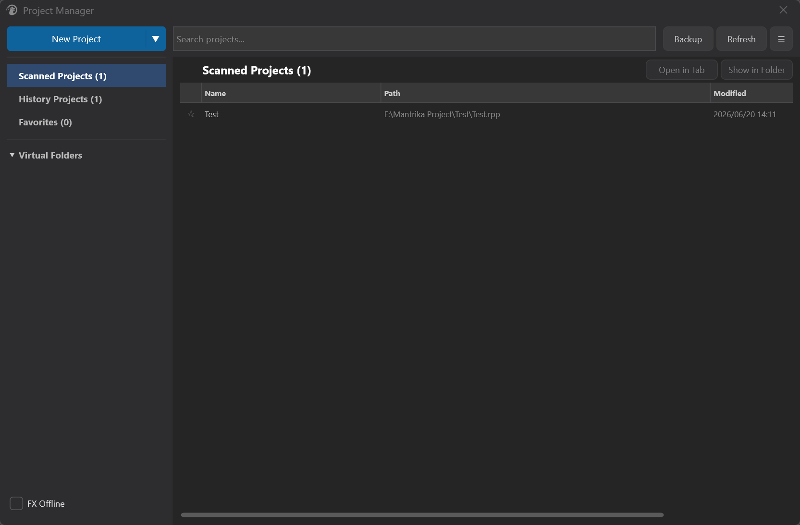

Four main areas:

| Area | Contents |
| ---- | -------- |
| **Top toolbar** | New Project / Search / Backup / Refresh / Advanced menu |
| **Left sidebar** | Navigation list + Virtual Folders list + folder-action buttons + FX Offline toggle |
| **Main area top** | Current-location title / Up button / Open in Tab / Show in Folder |
| **Main area table** | Project list (multi-select, sortable, draggable into virtual folders) |

---

## 4. Top toolbar

### 4.1 New Project (split button)

A blue button with a main left half and a dropdown arrow on the right:


- **Click NewProject**: create a blank REAPER project directly
- **Click the arrow**: open the **Template** dialog, which lists all `.rpp` templates in the `ProjectTemplates` folder. Pick one and click **Create** to create a project from that template.

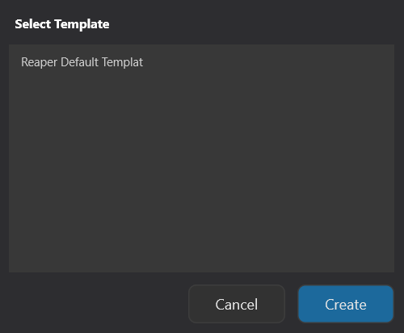

> 💡 **Tip**: To add your own templates, drop `.rpp` files into the `ProjectTemplates\` folder under REAPER's resource path. They will appear in the dropdown the next time PM opens.

### 4.2 Search


The empty input box in the middle, placeholder text "Search projects...":

- **Instant search** — filters in real time as you type
- Search scope = all projects across all views (History + Scanned)
- Supports fuzzy matching; multiple keywords separated by spaces
- Clearing the search box returns to the History Projects view

### 4.3 Backup

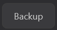

Backs up the **currently selected projects**. See §9 for details.

### 4.4 Refresh

Forces a re-read of REAPER's recent-project history (ignoring cache) and re-checks the existence / modification time of all listed projects.


> ⚠️ **Warning**: **Refresh only refreshes REAPER history + status** — it **does not scan the disk**. To discover newly added local projects, use **Advanced → Manage Scan Paths**.

### 4.5 Advanced menu ☰


Opens the advanced menu. See §13.

---

## 5. Left navigation

### 5.1 Top three fixed items

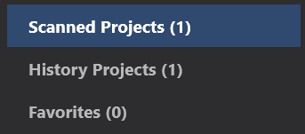

| Item | Meaning |
| ---- | ------- |
| **Scanned Projects (N)** | All projects found under your configured scan paths |
| **History Projects (N)** | REAPER's own recent-project list (up to 200) |
| **Favorites (N)** | Starred projects |

The numbers in parentheses are the counts under the current filter (affected by Show Deleted / Show Subprojects / Hide Excluded).

### 5.2 Virtual Folders area

Below that is the **Virtual Folders** header plus all folders under it.

**Header behavior**:


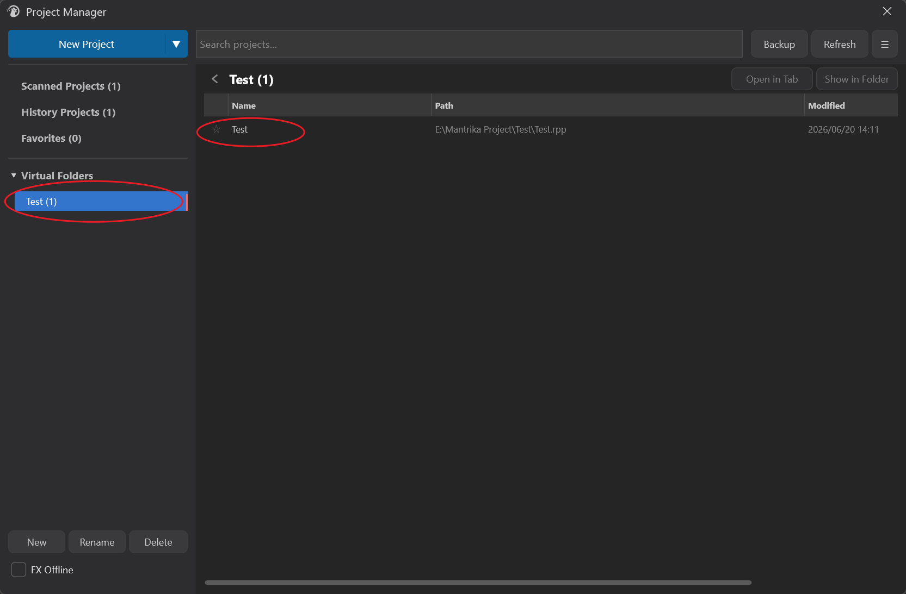

- **Left arrow (▶ / ▼)**: click to expand / collapse the folder list
- **Header text**: click to jump to the Virtual Folders root view (all top-level folders shown as cards in the main area)
- **Right-click**: expands the first level and jumps to the root view at the same time

### 5.3 Folders

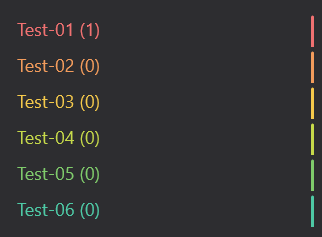

- **3-level nesting**: maximum 3 levels (the New button is disabled once the limit is reached)
- **Color labels**: each top-level folder is assigned a palette color automatically (12 colors, fixed per folder); subfolders inherit the parent color for quick visual recognition. Creating, reordering or deleting other folders **never** changes an existing folder's color
- **Count badge**: each folder shows the number of projects it contains
- **Click a folder** to switch to that folder's view
- **Ctrl/Cmd + drag** to reorder folders among their siblings (see §8.6)

### 5.4 New / Rename / Delete buttons

Three folder-action buttons in the middle of the sidebar (**only visible in the Virtual Folders view**):


| Button | Behavior |
| ------ | -------- |
| **New** | Opens an input box; enter a name to create a new folder. If a folder is currently selected, the new folder is created under it; otherwise it is created at the top level. **New folders appear at the top of their sibling list** (reorder freely afterwards with Ctrl+drag, see §8.6). |
| **Rename** | Renames the currently selected folder |
| **Delete** | Deletes the currently selected folder (**asks for confirmation**; after confirmation, jumps back to History) |

> ⚠️ **Warning**: After clicking Delete, a confirmation dialog shows the folder name and whether it contains subfolders / projects. The default button is Cancel; pressing Esc or Enter cancels. **Only clicking Delete actually executes**. Deleting a folder does not delete the project files from disk — it only removes them from that virtual category.

### 5.5 FX Offline toggle

A checkbox at the bottom of the sidebar:


- **Checked**: all subsequent "open project" operations (do not use the keyboard while opening) load the project with **all FX offline**
- **Unchecked**: opens normally

> **Use case**: the project uses heavy CPU FX or third-party plugins that are not available; open it first, then decide which FX to load.

### 5.6 Main-area top row (location / back button)

The top row of the main area shows the current view:

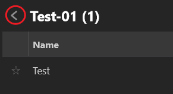

- **← Back button**: only appears in subfolder views; click to go up one level
- **Current-location title**: bold folder name + project count, e.g. "ClientA (12)"
- **Open in Tab** / **Show in Folder**: shortcut buttons on the right that act on the current selection

---

## 6. Project list (main table)

### 6.1 Columns

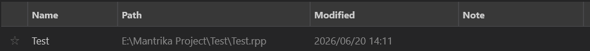

| Column | Meaning | Default shown |
| ------ | ------- | ------------- |
| **★** | Favorite star (click to toggle) | always |
| **Name** | Project name (without extension) | always |
| **Path** | Full file path | yes (hideable) |
| **Modified** | Last modified time | yes (hideable) |
| **Note** | Project note | yes (hideable) |
| **Deleted** | Deleted projects | hidden by default |
| **Subprojects** | Subprojects | hidden by default |

Hideable columns are toggled in the **Advanced menu**.

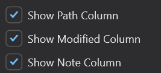

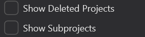

**Visual encoding**:

- ⭐ Yellow star = favorited; ☆ Gray star = not favorited
- `[Sub]` green prefix = subproject (has `.rpp-PROX` file)
- `[X]` red prefix + gray strikethrough = file no longer exists on disk (hidden by default; shown when Show Deleted is on)
- Blue folder icon = virtual folder (appears in the Virtual Folders root view)
- Hover row = dark gray highlight; selected row = blue highlight

### 6.2 Selection behavior

| Operation | Behavior |
| --------- | -------- |
| Single-click | Select only this row (clears other selections) |
| **Ctrl / Cmd** + click | Toggle selection of this row (multi-select) |
| **Shift** + click | Extend selection from the last selected row |
| Double-click project | **Open the project** |
| Double-click folder | Enter that folder's view |
| Right-click | Open context menu (see §7) |

> ⚠️ **Warning**: Repeated double-clicks within 1 second after opening a project are ignored (prevents accidentally opening a project twice).

### 6.3 Sorting

Click any column header to toggle sort direction (ascending / descending).

### 6.4 Column widths

Drag column dividers to resize. **Column widths are persisted** to your user config — PM remembers them after restart. Once you manually resize, PM no longer auto-redistributes widths based on the number of visible columns.

### 6.5 Dragging projects into virtual folders

Drag selected rows to the Virtual Folders area on the left:

- A floating chip appears next to the cursor showing "← ProjectName" or "← ProjectName (+N)" when multiple projects are selected
- Drop on the Virtual Folders header: hover for **400 ms** to auto-expand the folder list
- Drop on a folder: the folder highlights and a cyan indicator appears on the left
- Hover over a collapsed folder for 400 ms: it auto-expands
- Drag out / cancel: temporarily expanded folders collapse back
- Release: the project is added to that folder (within the same top-level folder, a project can only exist in one place; it is automatically removed from its previous location)

---

## 7. Project context menu

Right-click a project in the table:

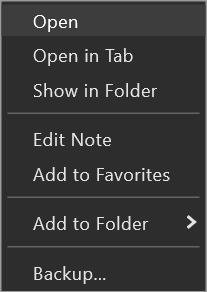

| Item | Behavior |
| ---- | -------- |
| **Open** | Open the first selected project (FX Offline toggle applies) |
| **Open in Tab** | Create a new tab and open each selected project |
| **Show in Folder** | Locate the file in the system file manager (highlights it on Windows, reveals on macOS) |
| **Edit Note** | Opens a NoteDialog to edit the project note (**single selection only**) |
| **Add to Favorites** / **Remove from Favorites** | Toggle favorite status |
| **Add to Folder ▸** | Recursive submenu listing all virtual folders — pick one to add the project to |
| **Remove from This Folder** | Only shown in a virtual-folder view; removes the project from that folder |
| **Backup...** | Opens the backup dialog (see §9) |

> 💡 **Tip**: In the **Add to Folder ▸** submenu, items that have subfolders become nested submenus, and the top of each submenu has an extra entry **"(Add Here)"** — choose this to add the project to the parent folder itself.

---

## 8. Virtual Folders workflow

Virtual Folders are the core organization tool in Project Manager. They **do not move files on disk** — they only record internally which projects belong to which virtual group.

### 8.1 Basic concepts

- **3-level nesting**: at most `Group → SubGroup → SubSubGroup`; deeper levels cannot be created
- **No duplicates within the same top-level folder**: when you add a project to a subfolder, if it already exists in **that top-level folder or any of its subfolders**, it is **automatically removed from the old location** — a project can only appear once under a single top-level group
- **Can coexist in different top-level folders**: a project can exist in two independent top-level folders at the same time
- **Color labels**: top-level folders are colored automatically; subfolders inherit the parent color; colors are tied to the folder itself and never change on reorder/create/delete
- **Controllable order**: new folders appear at the top of their sibling list, and you can reorder them at any time with Ctrl+drag (see §8.6); the order is persisted

### 8.2 Creating virtual folders

1. Click anywhere in the **Virtual Folders** area or click the arrow to expand it
2. To create a top-level folder: click the **New** button directly
3. To create a subfolder: first select the parent folder, then click **New**
4. Enter a name and confirm

### 8.3 Adding projects to folders

Three methods, pick whichever is convenient:

- **Drag and drop** (most intuitive): drag projects from the right table to a folder node on the left
- **Context menu**: right-click project → Add to Folder ▸ pick target folder

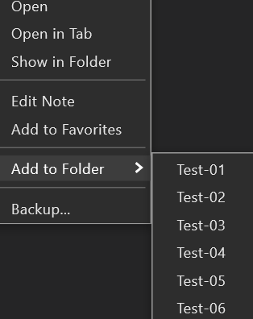

- **Multi-select drag**: Ctrl / Shift multi-select, then drag the batch

### 8.4 Removing projects from a folder

Enter the folder's view → select the project → right-click → **Remove from This Folder**.

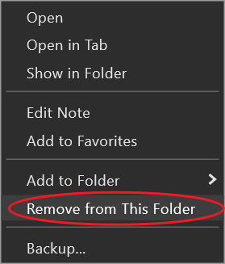

> ⚠️ **Warning**: "Remove" only removes the project from the virtual folder's list; disk files and other virtual folders are not affected.
>
> ⚠️ **Warning**: Note the difference: **Remove from This Folder** takes the project out of the folder; the **Delete** button at the bottom-left of the sidebar deletes the entire folder itself (with confirmation) — these are different operations.

### 8.5 Virtual Folders root view

Click the Virtual Folders header text (not the arrow) to switch to the "root view" — all top-level folders are listed as folder cards in the table; double-click one to enter it. This treats top-level folders themselves as categories to browse.

### 8.6 Reordering folders (Ctrl + drag)

In the sidebar folder tree, **hold Ctrl (Cmd on macOS) and drag a folder** to change its position among its siblings:

1. Hold **Ctrl/Cmd**, press the mouse on a folder node and start dragging
2. Move over a **sibling** folder's row:
   - **Upper half** of the row → a teal insert line appears at the top of that row = insert **before** it
   - **Lower half** of the row → the insert line appears at the actual landing spot = insert **after** it
3. Release the mouse → the folder moves; the new order is saved immediately

**Rules and details**:

- **Same-level only**: Ctrl+drag cannot move a folder into or out of another nesting level; hovering over a non-sibling node shows no insert line
- **The insert line marks the real landing spot**: when the target folder is **expanded**, "insert after it" means after its entire subtree — the line is drawn below its last visible descendant, so what you see is what you get
- **Plain dragging without Ctrl** never picks up a folder (avoids accidental moves); folder nodes then only act as drop targets for projects
- The order is written to the configuration file and survives REAPER restarts

> 💡 **Typical use**: with one folder per skin/client, new folders start at the top (newest at hand), and older ones can be Ctrl+dragged into whatever order suits you.

---

## 9. Project backup

Backs up the project file + referenced media files + subprojects + their dependencies into a target directory. The backup engine rewrites media paths in the `.rpp`, so **the backed-up project can be opened and migrated independently**.

### 9.1 Triggering backup

Both entry points open the **Backup** dialog:

- Top toolbar **Backup** button (backs up currently selected projects)
- Context menu **Backup...**

### 9.2 Backup dialog

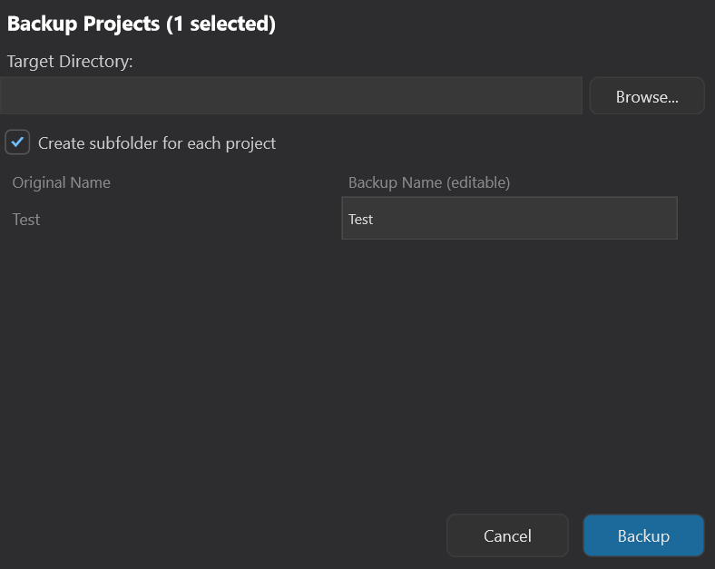

**Field descriptions**:

| Field | Purpose |
| ----- | ------- |
| **Target Directory** | Backup destination root (required). Click Browse to pick a system folder |
| **Create subfolder for each project** | See §9.3 |
| **Project list** | Each row shows the original file name on the left; the input on the right lets you customize the backup name for this run |

### 9.3 Create subfolder switch

This switch only decides one thing: **whether to wrap each backup in its own folder**. How media is arranged is a consequence of that choice, not an independent setting.

**ON (default): each project gets its own folder**

Each backup goes into its own folder, with the `.rpp` and its `Media/` and `Subproject Archive/` inside — a self-contained, portable unit:

```
TargetDir/
├── ProjectA/
│   ├── ProjectA.rpp
│   ├── Media/
│   │   ├── voice.wav
│   │   └── drums.wav
│   └── Subproject Archive/    <- created only if the project contains valid subprojects (independent of this switch)
│       └── SubProj1/
│           ├── SubProj1.rpp
│           └── Media/
└── ProjectB/
    └── ...
```

Best for: **first complete backup**, archiving.

> **Note**: Whether `Subproject Archive/` appears depends on whether the project **itself has subprojects** — this is separate from the Create subfolder switch. Do not confuse the two.

**OFF: no per-project folders, all backups flat, sharing one `Media/`**

All `.rpp` files go directly into the target root. Because there are no individual folders to isolate them, media goes into a **single shared** `Media/`. Because it is shared, copying is **differential** — files already in the target `Media/` with the same name are skipped instead of copied again:

```
TargetDir/
├── ProjectA.rpp
├── ProjectB.rpp
├── ProjectC.rpp
└── Media/
    ├── voice.wav        <- existing same-name files are skipped; same-name files from different sources get _2, _3 suffixes
    ├── drums.wav
    └── ...
```

Best for: **backing up multiple projects that share a material library** — one shared `Media/`, already-present assets are not copied again.

### 9.4 Custom backup names

The input box on each row lets you change the name for this backup:

- Create subfolder = ON: determines the subfolder name (the `.rpp` is renamed to match)
- Create subfolder = OFF: determines the output `.rpp` file name
- **Conflict auto-timestamp**: if a target with the same name already exists, PM appends `_bak_MMDD_HHMM` automatically and never overwrites existing backups

### 9.5 Backup progress dialog

After confirming, a progress window appears:

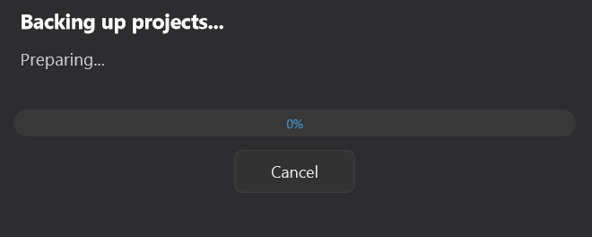

```
┌─ Backing up projects... ───────────────────┐
│  Backing up: 2 / 5                         │
│  Project: My Track v3                      │
│                                            │
│  ▓▓▓▓▓▓▓▓▓░░░░░░░░░░░  45%                 │
│                                            │
│              [ Cancel ]                    │
└────────────────────────────────────────────┘
```

- Project-level progress (X / Y) + per-project file-level sub-progress, smooth progress bar
- **Cancel** stops at any time; it waits for the current file copy to finish, then the title changes to "Cancelling..."

### 9.6 Completion dialog

When backup finishes, the window becomes a summary:

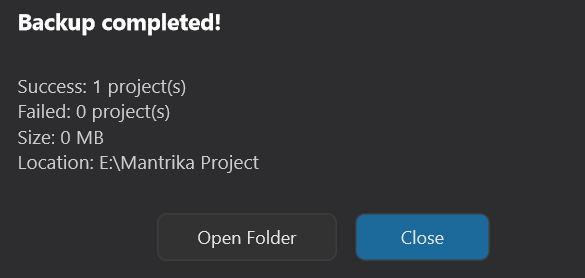

```
┌─ Backup completed! ────────────────────────┐
│  Successfully backed up: 5 projects        │
│  Failed: 0                                 │
│  Total size: 248.3 MB                      │
│  Location: D:\Backups\2026-05-19           │
│                                            │
│  ⚠️ Some files were missing. See            │
│    MISSING_FILES.txt in each project.      │
│                                            │
│      [ Open Folder ]    [ Close ]          │
└────────────────────────────────────────────┘
```

- **Open Folder** opens the target directory in the system file manager
- If any media files were missing, a **MISSING_FILES.txt** report is generated in the backup directory, listing all missing paths and context plus recommended actions

### 9.7 Smart media file lookup

The backup engine does not give up just because the path recorded in the `.rpp` cannot be found. It searches in this order:

1. The original path recorded in the `.rpp` (absolute or relative)
2. The same directory as the project `.rpp`
3. Subfolders named `media files`, `Media`, `audio`, `Audio`, or `media` under that directory

Only if none of these find the file is it recorded as missing.

### 9.8 Subproject recursion

If a project contains nested subprojects, the backup engine **recursively packages all subprojects** under `Subproject Archive/` and rewrites the parent project's paths. Nested subprojects within subprojects are also packed all the way down (cycles are detected and prevented).

### 9.9 Source deduplication

If the same source material is cut into N items in the project (N references in the `.rpp`), the backup only copies **one** file into the Media directory; all references point to that same target file — saving space and speeding up the backup.

---

## 10. Scan path management (Manage Scan Paths)

Open via **Advanced → Manage Scan Paths...**. This is the only place to configure the data source for "Scanned Projects".

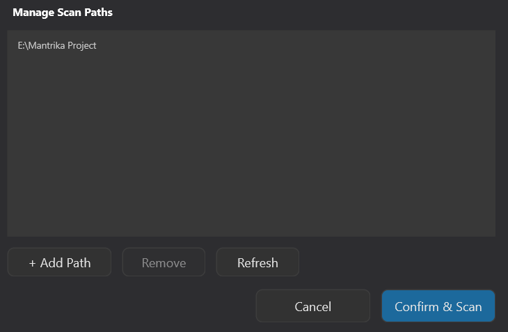

**Buttons**:

| Button | Behavior |
| ------ | -------- |
| **+ Add Path** | Opens a system folder picker; after adding, it previews how many `.rpp` files are found under that path |
| **Remove** | Removes the selected path (only available when a row is selected) |
| **Refresh** | Re-counts projects for all existing paths immediately |
| **Confirm & Scan** | Closes the dialog → opens scan progress window → scans all paths in the background |

### 10.1 Scan progress dialog

```
┌─ Scanning for projects... ────────┐
│  Found: 248 projects              │
│                                   │
│  ▓▓░░▓▓░░▓▓░░  (marquee)          │
│                                   │
│           [ Cancel ]              │
└───────────────────────────────────┘
```

- **Progress bar** (animated marquee)
- Live count of discovered projects
- **Cancel** stops at any time; when finished it becomes **Close**

### 10.2 Automatic cleanup

After removing a scan path, projects under that path disappear from Scanned Projects automatically — **no need to rescan**.

---

## 11. Exclude path management (Exclude Paths)

The companion feature to Scan Paths: **Advanced → Manage Exclude Paths...**

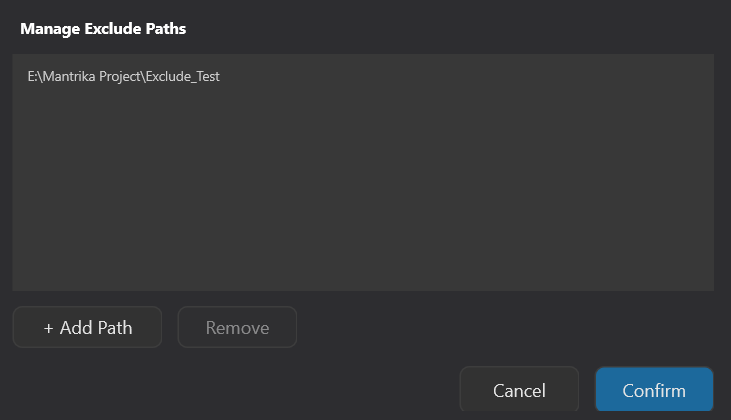

Any directory added to Exclude Paths (including its subdirectories) is marked as "excluded". Enabling **Advanced → Hide Excluded Projects** hides these projects from all views.

> **Typical use**: when scanning `D:\Music`, exclude `D:\Music\Backups` so backup directories are not listed as real projects.

---

## 12. Cross-machine migration (Path Relocate)

After copying the PM configuration file (`project_manager.json`) from machine A to machine B, almost all recorded project paths are broken (different drive letters, directory structures). **Path Relocate** fixes all broken paths to their actual locations on the new machine in one go.

### 12.1 Workflow

1. **Scan the disk on the new machine first** (required)
   - Advanced → Manage Scan Paths → add the new machine's project root directory → Confirm & Scan
   - Wait for the scan to finish
2. **Open the Path Relocate dialog**
   - Advanced → **Path Relocate...**
   - It forces a disk refresh (2-3 seconds) and analyzes the situation

### 12.2 Path Relocate dialog

```
┌─ Path Relocate ─────────────────────────────────────────────┐
│  Auto-matched: 23   Needs choice: 5   Not found: 2          │
│                                                             │
│  ┌───────────────────────────────────────────────────────┐  │
│  │ [AUTO]  Old: D:\Old\ProjectA.rpp                  ☑   │  │
│  │         New: E:\NewLocation\ProjectA.rpp              │  │
│  ├───────────────────────────────────────────────────────┤  │
│  │ [CHOOSE] Old: D:\Old\Demo.rpp                     ☐   │  │
│  │         [Choose: E:\New1\Demo.rpp        ▼]           │  │
│  ├───────────────────────────────────────────────────────┤  │
│  │ [MISSING] Old: D:\Old\Lost.rpp                        │  │
│  │  (no matching .rpp in scanned projects — kept as-is)  │  │
│  └───────────────────────────────────────────────────────┘  │
│                                                             │
│  [ Select All ] [ Deselect All ]    [ Cancel ] [ Apply ]    │
└─────────────────────────────────────────────────────────────┘
```

Each row has a **badge** indicating status:

| Badge | Color | Meaning | Default |
| ----- | ----- | ------- | ------- |
| **AUTO** | green | Unique best candidate; safe to auto-replace | checked by default |
| **CHOOSE** | orange | Multiple candidates tied; you must choose | unchecked by default — selecting a candidate auto-enables it |
| **MISSING** | gray | No same-name `.rpp` found in scanned projects | no toggle; original value kept |

### 12.3 After Apply

Clicking Apply will:

1. Automatically back up the current JSON to `project_manager.json.bak.YYYYMMDD-HHMMSS` (if backup fails, Apply aborts without modifying data)
2. Apply all checked mappings to: **virtual folders**, **favorites**, **project notes**
3. Show a result dialog with the number of updated entries and the backup file path

---

## 13. Advanced menu (settings menu)

The rightmost menu button on the toolbar opens a grouped floating panel:

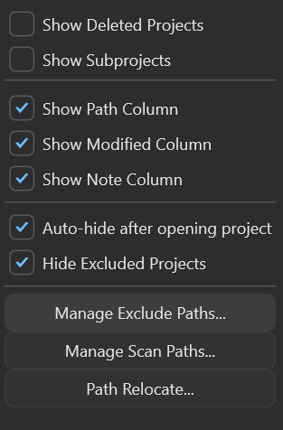

### 13.1 View filters

| Item | Default | Behavior |
| ---- | ------- | -------- |
| **Show Deleted Projects** | OFF | Shows projects whose files no longer exist on disk (red [X] label + strikethrough + gray text) |
| **Show Subprojects** | ON | Shows subprojects ([Sub] green label) |

### 13.2 Column visibility

| Item | Default |
| ---- | ------- |
| **Show Path Column** | ON |
| **Show Modified Column** | ON |
| **Show Note Column** | ON |

After hiding columns, remaining columns auto-widen proportionally — unless you have manually resized columns before.

### 13.3 Behavior

| Item | Default | Behavior |
| ---- | ------- | -------- |
| **Auto-hide after opening project** | OFF | Hides the PM window 100 ms after opening a project (applies to Open and Open in Tab) |
| **Hide Excluded Projects** | OFF | Hides all projects under Exclude Paths |

### 13.4 Management buttons

| Button | Purpose |
| ------ | ------- |
| **Manage Exclude Paths...** | See §11 |
| **Manage Scan Paths...** | See §10 |
| **Path Relocate...** | See §12 |

> 💡 **Tip**: All Advanced menu toggle states are persisted — they survive REAPER restarts.

---

## 14. Project notes

Every project can have a note, shown in the Note column.

**Entry points**:
- Right-click project → **Edit Note**
- Only available for single selection

**Dialog**:

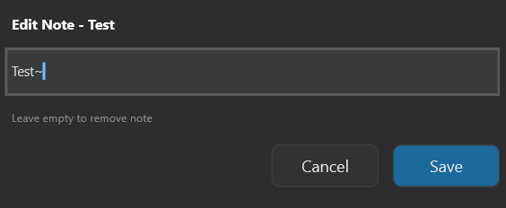

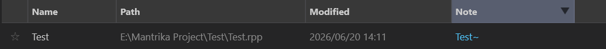

- Leave blank and click Save = delete the project's note
- Notes longer than 30 characters are truncated with "..." in the column, but the full note is still saved

---

## 15. Shortcuts and typical behaviors

### 15.1 Mouse behavior

| Operation | Behavior |
| --------- | -------- |
| Click project | Select |
| **Ctrl/Cmd** + click | Multi-select toggle |
| **Shift** + click | Range multi-select |
| Double-click project | Open (FX Offline toggle applies) |
| Double-click folder | Enter folder |
| Right-click project | Open context menu |
| Drag project | Drop onto Virtual Folders folder to categorize |
| **Ctrl/Cmd** + drag folder | Reorder folders among siblings (see §8.6) |
| Drag column divider | Resize column (auto-persisted) |
| Click column header | Sort |

### 15.2 Auto-refresh on mouse enter

When the mouse enters the PM window, it automatically rescans REAPER's history once — so after opening a new project in REAPER, switching back to PM shows it.

### 15.3 Default view

Every time PM opens, it defaults to the **History Projects** view.

---

## 16. Typical workflows

### Workflow A: First-time PM setup

```
1. Open PM (Extensions → Mantrika Tools → Project manager)
2. Advanced → Manage Scan Paths
3. + Add Path → pick your project root directory (multiple allowed)
4. Confirm & Scan, wait for the scan progress to finish
5. Click Scanned Projects in the sidebar → see all projects
```

### Workflow B: Build your own category system

```
1. Expand Virtual Folders in the sidebar → New to create a top-level folder (e.g. "ClientA")
   (new folders appear at the top)
2. Under "ClientA" create subfolders "Project1", "Project2"
3. Find the corresponding projects in the right table
4. Drag them to the right virtual folder (Ctrl multi-select for batch drag)
5. To adjust folder order: Ctrl + drag a folder to the target position (see §8.6)
6. Done
```

### Workflow C: Deliver a complete project package

```
1. Select all projects to deliver (Ctrl multi-select)
2. Top toolbar Backup button
3. Target Directory: pick D:\Delivery\2026-05-19
4. [x] Create subfolder for each project (recommended)
5. Optional: customize each project's external backup name on the right
6. Backup → wait for progress to finish
7. Click Open Folder to review
8. If MISSING_FILES.txt appears, handle it according to the report
```

### Workflow D: Cross-machine migration

```
Machine A (old):
1. Close REAPER
2. Locate project_manager.json (in the MantrikaTools config directory)
3. Copy it to machine B

Machine B (new):
1. Place project_manager.json in the corresponding directory
2. Open REAPER → Project Manager
3. Advanced → Manage Scan Paths → add the new machine's project root → Confirm & Scan
4. Wait for scan to finish
5. Advanced → Path Relocate → wait for analysis
6. Review each row:
   - AUTO is checked by default; keep if correct
   - CHOOSE: pick the correct candidate from the dropdown
   - MISSING: not found; original value kept
7. Apply → a report dialog appears
8. After closing, all virtual folders / favorites / notes point to the correct paths on the new machine
```

### Workflow E: Quickly search and open a project

```
1. Top toolbar Search box
2. Type keywords (space-separated; all must match)
3. Table filters in real time
4. Double-click the project you want → opens directly
```

### Workflow F: Open a heavy project with FX Offline

```
1. Check FX Offline at the bottom of the sidebar
2. Double-click the project or right-click → Open
3. REAPER loads with all FX offline
4. In REAPER, manually enable the FX you need
5. To return to normal mode later, uncheck FX Offline in PM
```

### Workflow G: Clean up "deleted" projects

```
1. Advanced → [x] Show Deleted Projects
2. All projects with a red [X] label are files already deleted on disk
3. Select them → right-click → Remove from Favorites / Remove from This Folder
4. Turn off Show Deleted Projects when done
```

---

## 17. Notes and caveats

### 17.1 Refresh does not scan the disk

The toolbar Refresh button only refreshes REAPER history and the status of existing projects. **To discover newly added local projects you must use Manage Scan Paths**.

### 17.2 Delete Folder also deletes subfolders

The sidebar Delete button opens a confirmation dialog; confirming deletes **all subfolders together**. The dialog shows the folder name and whether it contains subfolders; the default button is Cancel (Esc / Enter cancel). **Only clicking the Delete button actually executes the deletion** — but still double-check you have selected the correct folder before confirming. Project files on disk are not affected.

### 17.3 Virtual folders are limited to 3 levels

After reaching 3 levels the New button is disabled. There is no workaround.

### 17.4 No duplicate projects under the same top-level folder

When adding a project to a subfolder under top-level folder A, if it already exists in A or another subfolder of A, it is automatically removed from the old location. If you need "the same project in two places", put it in **two different top-level folders**.

### 17.5 Backup does not overwrite existing same-name directories

With Create subfolder = ON, if a same-name subfolder already exists at the target, PM appends a timestamp (`_bak_MMDD_HHMM`) to this backup. Multiple backups of the same project will not overwrite each other.

### 17.6 Differential copy when Create subfolder = OFF

When not creating subfolders (Create subfolder = OFF), all projects share one `Media/`, so files already in the target Media are **not** copied again. But if you have modified a file and want the new version, delete the old version in the target first.

### 17.7 Path Relocate requires scanning first

Path Relocate uses `Scanned Projects` as the candidate pool. If the new machine has never been scanned, you will see all MISSING rows and an orange hint at the top of the dialog.

### 17.8 Path Relocate auto-backs up JSON

Before Apply, PM backs up `project_manager.json` to a `.bak.<timestamp>` file in the same directory. If the backup fails (disk full / no permission), Apply aborts without modifying any data.

### 17.9 FX Offline is session-persistent

PM remembers this toggle after the window is closed and reopened. Next time it opens it is still in offline mode — remember to uncheck it when you no longer need it.

### 17.10 Auto Hide also applies to Open in Tab

If Auto Hide is on, the window hides after opening a batch of projects with "Open in Tab" too — reopen PM from the menu or shortcut when needed.

### 17.11 Subprojects are saved independently in backups

Projects with a `[Sub]` label are subprojects referenced by a parent project. When backing up a subproject directly, PM treats it as a main project — it does not automatically find which project references it; it only backs up the subproject and its own media.

### 17.12 Path / Modified / Note columns are blank for folders

Virtual folders in the table only show their name; the Path, Modified, and Note columns are empty — this is normal.

---

## 18. Troubleshooting

| Symptom | Possible cause | Fix |
| ------- | -------------- | --- |
| Table still empty after scanning | Not switched to Scanned Projects view | Click Scanned Projects in the sidebar |
| Scan finds no projects at all | No `.rpp` files under the path, or all are in excluded subdirectories | Check the preview count in Manage Scan Paths; check Exclude Paths |
| Project shown with gray strikethrough | File no longer exists on disk | Recover the file, or remove from favorites / folder via context menu |
| Search finds nothing | Keywords too strict / case sensitivity | Reduce keywords, check spelling; space-separated keywords must all match |
| Backup dialog OK button gray | No target directory selected | Click Browse and choose a directory |
| MISSING_FILES.txt after backup | Referenced media really cannot be found | Follow the suggestions in the txt file |
| Backup progress stuck at 0% | First project is large; a single file is being copied | Wait — the sub-progress bar will advance |
| Dragging project to folder does nothing | Dropped on Virtual Folders header instead of a folder node | Drop onto a specific folder node |
| Folder won't move when trying to reorder | Ctrl (Cmd on macOS) not held down | Hold Ctrl/Cmd before starting the drag |
| No insert line during Ctrl+drag | Hovering over a non-**sibling** node (reordering can't cross levels), or the cursor left the folder tree area | Move back over a sibling folder's row |
| Insert line appears far below the target | The target folder is expanded — "insert after it" means after its entire subtree; the line marks the real landing spot | Normal behavior; what you see is what you get |
| Folder colors changed after upgrading | The color algorithm now follows the folder itself (no longer its list position) | One-time change; from now on creating/reordering/deleting never affects existing colors |
| Cannot create subfolders | 3-level nesting limit reached | This is a hard limit — reorganize your category structure |
| Path Relocate all MISSING | Disk not scanned yet | First Manage Scan Paths → Confirm & Scan |
| Path Relocate recommendation wrong | Candidate difference <= 1 segment is uncertain | That row becomes CHOOSE for manual selection; if misclassified as AUTO, uncheck it |
| Columns feel cramped after resizing | Manual resize disables auto-redistribution | Drag column dividers again until comfortable |
| Create subfolder=OFF backup has no new files in Media | Same-name files already existed and were skipped | Delete old versions in target and re-backup |
| FX Offline still loads FX normally | Keyboard was used during opening | Double-click to open again without touching the keyboard |
| Add to Folder context menu very long | Too many virtual folders | Scroll the submenu; or locate the folder in the sidebar first and drop there |
