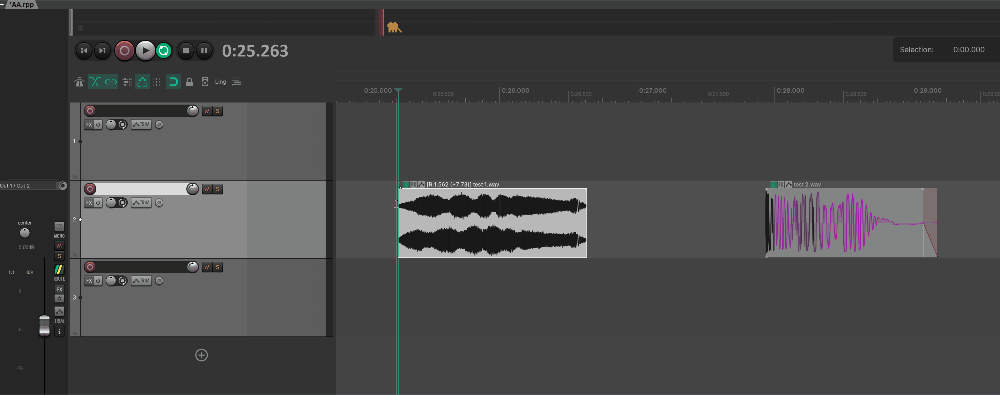
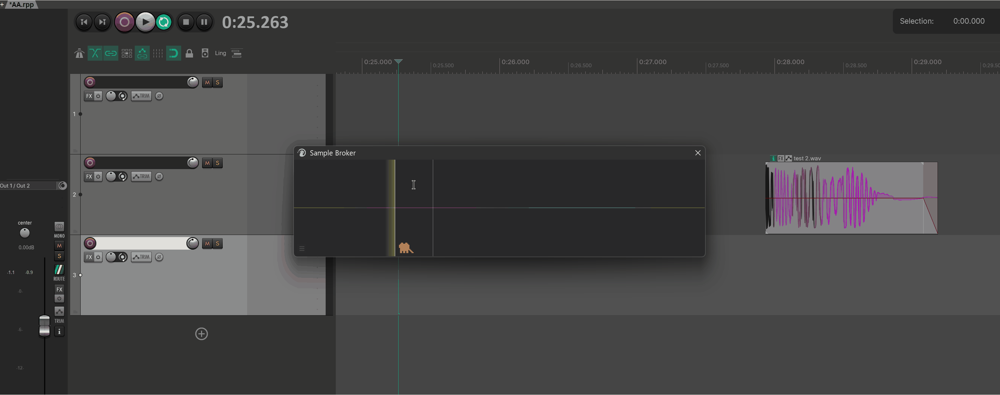
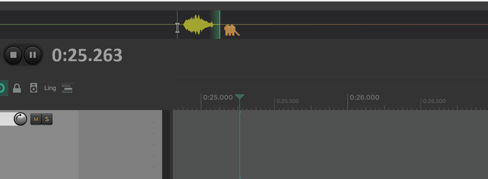
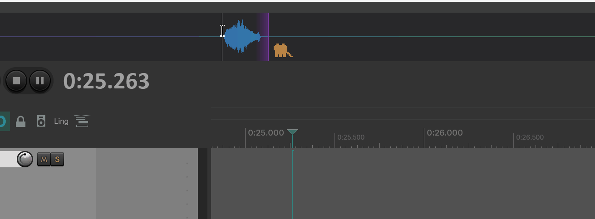
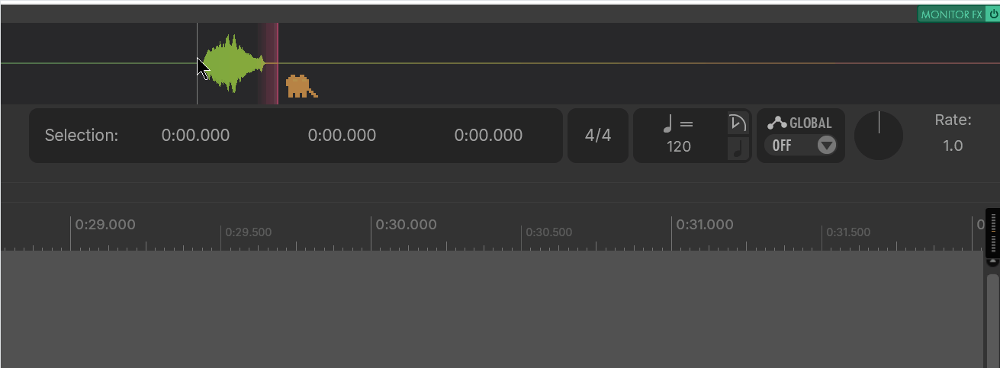
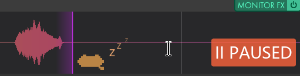
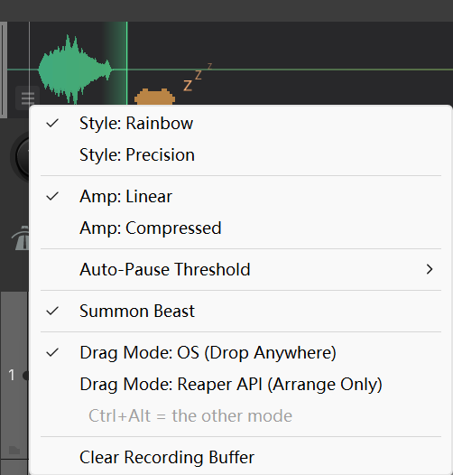

# Sample Broker

---

## 1. 概述

**Sample Broker** 是一个常驻后台的 **60 秒滚动录音器**，定位是"**听到的就能抓**"。 



它会在 Master 总线上挂一个监听插件，无论你在播放、试听 FX、还是 jam 即兴，最近 60 秒的声音都被它默默记着——形成一段循环覆盖的录音环带。当你听到一个想留下的声音，**到窗口里圈一段，拖出去就好**。

它能做两件事：

- **圈选 + 拖到 arrange**：选中一段波形，直接拖到 REAPER 的轨道上落成 item，自动新建轨道也可以。
- **圈选 + 拖到任何地方**：同样一段波形，按住默认的"OS 拖拽"模式可以拖到资源管理器、其他 DAW、采样器合成器、聊天软件——任何接受 wav 文件的位置。

整个流程围绕画布上的"圈一段 → 拖出去"展开，不需要按录音键、不需要停止。

---

## 2. 打开方式

菜单入口：

Extension -> MantrikaTools -> Sample broker



或者 Action List（搜 "Sample Broker"）：

| Action 名称 | 用途 |
| --- | --- |
| **`mantrika : Synergy - Sample Broker`** | 切换显示 / 隐藏 Sample Broker 窗口 |

窗口是 **dockable** 的——首次打开可能是浮动窗口，**右键点标题栏即可进 dock**。

---

## 3. 首次使用：穿过状态警告

第一次打开窗口时，大概率不会直接看到波形，而是一个带按钮的提示页。它在告诉你 Master 链上少了 / 关了某个东西。按钮上写什么就点什么：

| 提示标题 | 按钮 | 含义 / 你要做的 |
| --- | --- | --- |
| **CLAP plugin not found in Monitor FX** | `Auto Setup` | 插件还没被REAPER识别。先去 `Preferences > Plug-ins > CLAP` 点一次 `Re-scan`，回来再点 Auto Setup 即可 |
| **Sample Broker plugin is bypassed** | `Enable Plugin` | 插件被单独 bypass 了；点一下就启用 |
| **Monitor FX is globally bypassed** | `Enable Monitor FX` | 整条 Monitor FX 链都被关了；点一下打开 |
| **Plugin is not responding** | `Retry` | 插件失联（很罕见），但一般都是CLAP的扫描问题；点一下重新激活 |

成功之后窗口就直接进入主界面，开始显示波形。

---

## 4. 主界面总览

正常运行时窗口长这样：

```
┌────────────────────────────────────────────────────────────────┐
│                                                       2.0x     │  ← (右上角) 横向缩放倍数
│         ╱╲    ╱╲╱╲  ╱╲      ╱╲╱╲   ╱╲╱╲╲ ╱╲                  │
│     ╱╲╱╱  ╲╱╱╱    ╲╱  ╲╲╱╲╱╱    ╲╱╱    ╲╱  ╲             │  ← 波形画布
│     ──────────────────│─────────────────────────              │
│        历史段(暗色)   │ 当前段(亮色 / 彩虹)                   │
│   ▤                                                            │  ← (左下角) 汉堡菜单按钮
└────────────────────────────────────────────────────────────────┘
```

几个值得知道的视觉细节：

- **当前录制段** 显示为彩虹原色，**历史段** 会逐渐去饱和变暗——一眼看得出哪段是刚录的
- **录音头** 是一根细线，从左往右扫，到头就 wrap 回起点继续覆写
- 缩放后，右上角会浮一个 `2.0x` 之类的小标签
- 暂停时，右上角会浮一个橙红色 `II PAUSED` 标签
- 鼠标悬停时，画布上会有一根半透明的竖线指示位置

---

## 5. 基础用法 —— 三个典型操作

### 5.1 抓刚刚听到的一段，扔进 arrange

```
1. 在窗口里左键拖出一段（手动框选），或者
   按住 Ctrl 把鼠标移到一段声音上 → 出现青色边框就是"智能段落"，
   然后 Ctrl + 左键确认这段
2. 鼠标按住选区不放，往 arrange 拖
3. 在目标轨道上松手 → 自动落成新 item
```

落点规则：

| 鼠标松手时悬停在哪 | 结果 |
| --- | --- |
| 某条 track 上 | 在该轨道、当前编辑光标处落 item |
| 某个 item / take 上 | 同样落在那条轨道，光标处 |
| arrange 空白区域 | **自动新建一条 track** 并落 item |
| arrange 之外 | 不落（除非用 OS 模式，见下） |

### 5.2 抓一段直接拖成 wav 文件

如果你想把这段声音拖到桌面、聊天软件、其他 DAW，做法一样——只是默认拖拽模式得是 OS：

```
1. 圈一段（手动 or Ctrl+智能）
2. 直接拖出窗口 → 拖到任何接受文件的地方松手
3. 自动生成 mtk_export_<时间戳>.wav 落在当前工程文件夹
```

**默认就是 OS 模式**（出厂设置），所以这是"开箱即用"的路径。

### 5.3 单次切换拖拽模式（Ctrl+Alt）

如果当前默认是 OS 模式，但你想这一次想通过API形式，只落到 arrange 里——按住 **Ctrl+Alt** 再开始拖。反过来同样成立。

这是"对调"逻辑：Ctrl+Alt 永远表示**走另一种模式**。

---

## 6. 选区相关操作

### 6.1 三种产生选区的方法



| 操作 | 行为 |
| --- | --- |
| **左键拖拽（空白处）** | 手动框选，松手即定 |
| **Ctrl + 鼠标悬停** | 智能探测当前光标下的"非静音段落"，显示青色边框 + 时长标签 |
| **Ctrl + 左键** | 把当前的智能段落锁定为正式选区 |

智能探测以静音 (-54 dB) 为分隔，自动从光标位置向两端扩展直到遇到一段静音。适合录了一连串声音，想精确抓出"某一下"。

### 6.2 选区的清除

- **画布空白处快速点击**（不拖）= 清空选区
- 开始一次新框选会自动清空旧的
- 点击 `Clear Recording Buffer` 会同时清空选区和整条录音

---

## 7. 试听 / 预览



| 操作 | 行为 |
| --- | --- |
| **右键按住**（不拖） | 从光标位置开始预览，松开即停 |

预览不影响选区、不影响录音，纯粹是听一下当前位置是什么。

---

## 8. 视图：缩放与平移



录音是 60 秒，画布只有那么宽——细节不够时就要放大。

| 操作 | 行为 |
| --- | --- |
| **滚轮** | 横向缩放（1x ~ 10x），以鼠标所在位置为中心 |
| **Shift + 滚轮** | 振幅缩放（0.1x ~ 10x），看清小信号或拍平爆音 |
| **中键拖拽** | 横向平移视图 |
| **Shift + 中键点击** | 重置振幅缩放到默认 |

右上角的 `1.5x` 标签会告诉你当前的横向缩放倍数，缩放为 1.0x 时不显示。

---

## 9. 录制控制



| 操作 | 行为 |
| --- | --- |
| **Alt + 左键** | 切换暂停 / 继续录制 |

**暂停后**：写入头不再前进，新进来的声音不录；但已经录下的 60s 还在，照样能圈选、预览、导出。再 Alt+左键一次即恢复。

**自动暂停**：当输入电平连续低于阈值（默认 -72 dB）时，插件会自动判定为"没人说话/没在出声"并暂停。可以在汉堡菜单里调档位：-72 / -66 / -60 / -54 dB。

---

## 10. 汉堡菜单（左下角的三横线）



点开后是窗口的全部设置项：

| 菜单项 | 选项 / 含义 |
| --- | --- |
| **Style: Rainbow** | 默认。彩色渐变填充，醒目易看 |
| **Style: Precision** | 水润线框风格，更适合精读 |
| **Amp: Linear** | 默认。真实振幅显示 |
| **Amp: Compressed** | 压缩低振幅显示，让安静段也清晰可见，（和REAPER中的波形一致） |
| **Auto-Pause Threshold** | -72 / -66 / -60 / -54 dB；越高越容易触发自动暂停 |
| **Summon Beast** | 在录音头旁边召唤一只像素猫做陪伴（纯装饰） |
| **Drag Mode: OS** | 默认左键拖拽走 OS 拖拽（可拖到任何位置） |
| **Drag Mode: Reaper API** | 默认左键拖拽走 Reaper 内部（仅落 arrange） |
| **Clear Recording Buffer** | 清空整条 60s 录音（带确认对话框） |

> 上面所有设置项的勾选状态**都会保存**，下次打开 REAPER 沿用。

---

## 11. 状态提示（窗口里的浮动文字）

正常工作时画布是干净的。下面这些文字出现时意味着特殊状态：

| 显示文字 | 含义 | 你要做的 |
| --- | --- | --- |
| `Rendering @ XX Hz...` | REAPER 正在离线渲染，期间不录音 | 等渲染结束自动恢复 |
| `Audio engine paused...` | REAPER 的音频引擎关了 | 检查音频引擎 |
| `WARNING: Sample rate changed (X -> Y Hz). Old data invalid and Recording paused. Clear in menu or restore.` | 工程采样率被改了，旧波形已失效，录音自动暂停，此使的音频内容已经不可信了 | 要么把采样率改回去；要么从汉堡菜单 `Clear Recording Buffer` 清空开始新录 |

---

## 12. 键盘 / 鼠标速查

| 操作 | 行为 |
| --- | --- |
| 左键拖拽（空白处） | 手动框选 |
| 左键拖拽（选区上 / 智能段落上） | 触发**默认模式拖拽导出** |
| **Ctrl + Alt** + 左键拖拽 | 触发**另一种模式**的拖拽导出（对调 OS / API） |
| 左键短点击（空白处） | 清空选区 |
| **Ctrl** + 鼠标悬停 | 显示智能探测段落 |
| **Ctrl** + 左键 | 锁定智能段落为选区 |
| 右键按住 | 试听预览 |
| **Alt** + 左键 | 切换暂停 |
| 滚轮 | 横向缩放（以鼠标为中心） |
| **Shift** + 滚轮 | 振幅缩放 |
| 中键拖拽 | 横向平移视图 |
| **Shift** + 中键点击 | 重置振幅缩放 |
| 关闭窗口（X） | 隐藏窗口（数据保留） |
| **右键** 关闭按钮 | 把窗口贴底 dock |

> macOS 下 Ctrl 对应 Command，Alt 对应 Option。

---

## 13. 典型工作流

### 工作流 A：捕捉刚刚那个意外好声

排练 / jam 时随手弹了一段没录的，结果一听特别想要：

```
1. 打开 Sample Broker（如果没开），波形里能看到刚才那段的形状
2. 用 Ctrl + 悬停 找到那段 → Ctrl + 左键确认选区
3. 拖到 arrange 的目标轨道松手
4. 完成，进入工程
```

### 工作流 B：拖一段当 wav 给别人

```
1. 圈一段
2. 直接拖出窗口到聊天软件 / 资源管理器
3. 自动生成 wav，路径在当前工程目录下
```

### 工作流 C：默认走 API、临时想拖出 OS

```
1. 默认 Drag Mode 设成 Reaper API
2. 偶尔需要拖到资源管理器时，按住 Ctrl+Alt 拖一次即可
3. 不用每次去汉堡菜单切换
```

### 工作流 D：监听 master、不录视频段

工程里有视频 / 长循环不想被一直覆盖到 buffer 里：

```
1. Alt + 左键暂停录制
2. 操作工程
3. 想录的时候再 Alt + 左键恢复
```

---

## 14. 故障排查

| 现象 | 原因 | 解决 |
| --- | --- | --- |
| 打开窗口看到 `CLAP plugin not found` | 第一次用，CLAP 还没扫到 | 去 `Preferences > Plug-ins > CLAP` 点 `Re-scan`，回来点 `Auto Setup` |
| 看到 `Enable Plugin` / `Enable Monitor FX` | 插件 / 整条 Monitor FX 被 bypass | 点对应按钮即可 |
| 窗口里没有波形、显示 `Audio engine paused...` | REAPER 音频引擎关着 | 重新开启 REAPER 音频引擎 |
| 窗口里红色警告 `Sample rate changed` | 中途改了工程采样率 | 改回原采样率；或汉堡菜单 `Clear Recording Buffer` 重新开录 |
| 拖到 arrange 没反应 | 当前是 OS 拖拽模式 + 落点在 REAPER 内部 | 切到 Reaper API 模式，或按住 Ctrl+Alt 拖 |
| 拖到 OS 没生成文件 | 当前是 Reaper API 模式 | 切到 OS 模式，或按住 Ctrl+Alt 拖 |
| 录音头不动了 | 输入电平太低，触发了自动暂停 | 抬高音量；或在汉堡菜单把阈值往严的方向调（-72 dB） |
| 暂停标签 `II PAUSED` 不消失 | 你手动按 Alt+左键 暂停过 | 再 Alt+左键 一次解除 |
| 想撤销刚刚那次导出 | （拖到 arrange 的）按 Ctrl+Z；（拖到 OS 的）手动删那个 wav 文件 | — |

---
