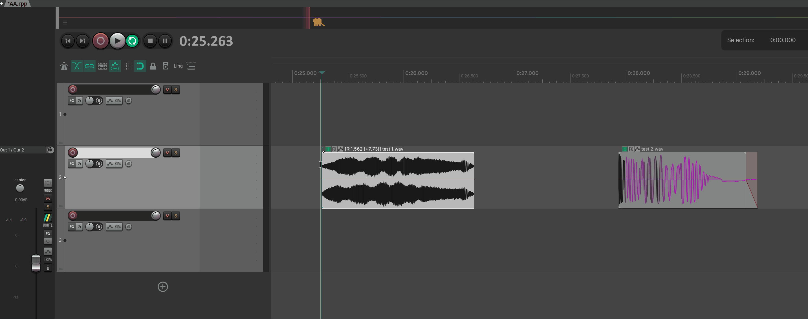
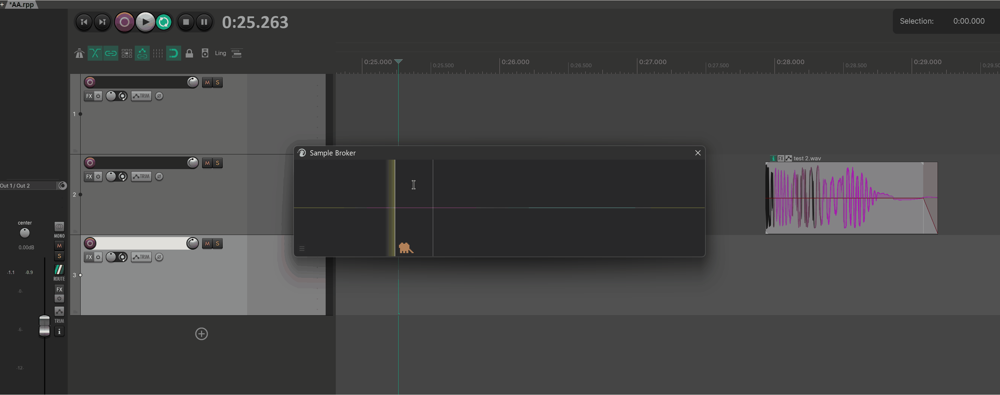
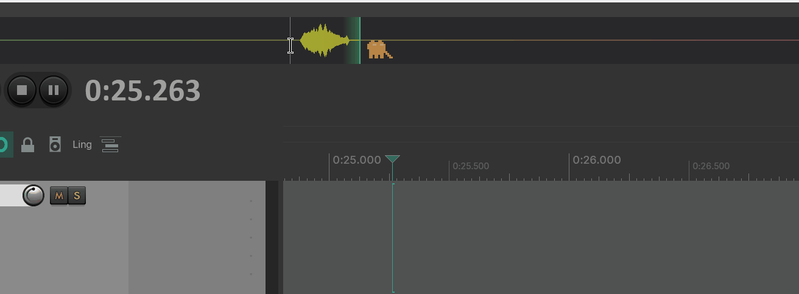
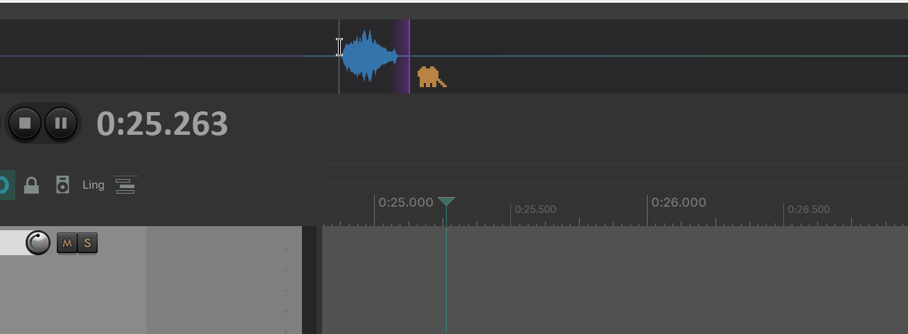
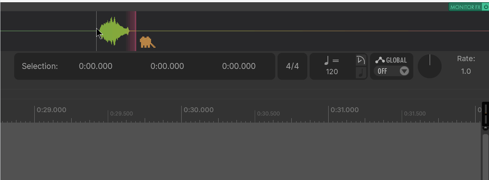
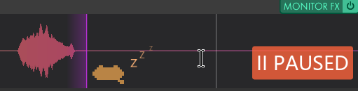
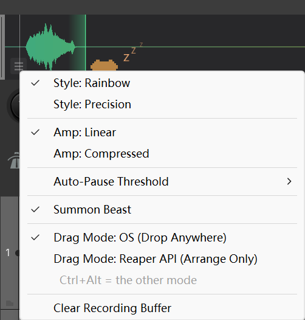

# Sample Broker

---

## 1. What Is Sample Broker?

**Sample Broker** is a resident background **60-second rolling recorder**. Its motto is **"catch what you hear."**



It installs a monitoring plug-in on the **Master** bus. Whether you are playing back, auditioning FX, or jamming, the last 60 seconds of audio are always being recorded in a looping, overwriting buffer. When you hear something worth keeping, **select it in the window and drag it out.**

It can do two things:

- **Select + drag to Arrange:** Drag a selected waveform onto a REAPER track to drop it as an item; a new track is created automatically if needed.
- **Select + drag anywhere:** With the default OS drag mode, the same selection can be dragged to the file explorer, another DAW, a sampler/synth, a chat app— anywhere that accepts a WAV file.
- **Several segments at once:** Hold Shift to keep adding selections, then drag them all out together in a single drag.

The whole workflow is "select a segment → drag it out." No record button, no need to stop playback.

---

## 2. Opening Sample Broker

Menu path:

```
Extensions → Mantrika Tools → Sample broker
```



Or use the Action List (search "Sample Broker"):

| Action name | Purpose |
| --- | --- |
| **`mantrika : Synergy - Sample Broker`** | Toggle the Sample Broker window on/off |
| **`mantrika : Synergy - Sample Broker - Insert Current Segment to Selected Track`** | Place the current segment on the selected track without selecting or dragging (see §5.5) |

The window is **dockable**— the first time it opens it may be a floating window; **right-click the title bar to dock it.**

---

## 3. First Use: Getting Past the Status Warnings

The first time you open the window, you will probably not see a waveform immediately. Instead, you will see a prompt page with a button. The message tells you that something on the Master chain is missing or disabled. Click the button whose label matches the situation:

| Prompt title | Button | Meaning / what to do |
| --- | --- | --- |
| **CLAP plugin not found in Monitor FX** | `Auto Setup` | The plug-in has not been recognized by REAPER yet. Go to `Preferences > Plug-ins > CLAP`, click `Re-scan`, then return and click `Auto Setup`. |
| **Sample Broker plugin is bypassed** | `Enable Plugin` | The plug-in is individually bypassed; click to enable it. |
| **Monitor FX is globally bypassed** | `Enable Monitor FX` | The whole Monitor FX chain is disabled; click to turn it back on. |
| **Plugin is not responding** | `Retry` | The plug-in lost contact (rare); this is usually a CLAP scan issue. Click to reactivate. |

Once resolved, the window enters the main interface and the waveform appears.

---

## 4. Main Interface Overview

When running normally, the window looks like this:

```
┌────────────────────────────────────────────────────────────────┐
│                                                       2.0x     │  ← (top-right) horizontal zoom factor
│         ╱╲    ╱╲╱╲  ╱╲      ╱╲╱╲   ╱╲╱╲╲ ╱╲                  │  ← waveform canvas
│     ╱╲╱╱  ╲╱╱╱    ╲╱  ╲╲╱╲╱╱    ╲╱╱    ╲╱  ╲             │
│     ──────────────────│─────────────────────────              │
│        history (dim)  │ current (bright / rainbow)            │
│   ▤                                                            │  ← (bottom-left) hamburger menu button
└────────────────────────────────────────────────────────────────┘
```

Visual details worth knowing:

- The **currently recording segment** is shown in rainbow colors; **older segments** gradually desaturate and darken, so you can tell at a glance which part was just recorded.
- The **record head** is a thin line that sweeps left to right; when it reaches the end, it wraps back to the start and continues overwriting.
- After zooming, a small `2.0x` label floats in the top-right corner.
- While paused, an orange-red `II PAUSED` label floats in the top-right corner.
- When the mouse hovers over the canvas, a semi-transparent vertical line shows the position.
- By default the canvas shows a **single merged waveform**. You can switch to a **stereo split view** (top = Left, bottom = Right) from the hamburger menu — see §10.

---

## 5. Basic Use — Three Typical Actions

### 5.1 Grab something you just heard and drop it into Arrange

```
1. In the window, left-click and drag to select a range manually, OR
 hold Ctrl and move the mouse over a sound → a cyan border shows the "smart segment,"
 then Ctrl + left-click to confirm that segment.
2. Hold the selection and drag it into Arrange.
3. Release over the target track → the selection becomes a new item.
```

Drop rules:

| Where the mouse is released | Result |
| --- | --- |
| Over a track | Drop the item on that track at the current edit cursor position |
| Over an item / take | Drop on the same track at the edit cursor position |
| Empty area of Arrange | **Create a new track automatically** and drop the item there |
| Outside Arrange | Nothing is dropped (unless using OS mode; see below) |

### 5.2 Grab a segment and drag it out as a WAV file

If you want to drag the segment to the desktop, a chat app, or another DAW, the process is the same — the default drag mode just needs to be OS:

```
1. Select a segment (manually or with Ctrl+smart select).
2. Drag it out of the window and release it over anything that accepts files.
3. A file named mtk_export_<timestamp>.wav is generated in the current project folder.
```

**The default is OS mode** out of the box, so this works immediately.

### 5.3 Temporarily switch drag mode with Ctrl+Alt

If the default is OS mode but you want this one drag to use the API mode and drop only into Arrange, hold **Ctrl+Alt** while starting the drag. The reverse also works.

This is a "swap" logic: Ctrl+Alt always means **use the other mode**.

### 5.4 Grab several segments in one drag

When you recorded a run of takes and want more than one of them:

```
1. Select the first segment (manually or with Ctrl + smart select).
2. Hold Shift and add more: Shift + left-click drag for manual ranges,
 or Ctrl + Shift + left-click for smart segments.
3. Drag any one of the selections — all of them go together.
```

What you get depends on the drag mode:

| Drag mode | Result |
| --- | --- |
| **OS** | One WAV file per segment, all carried in a single drag. When dropped into REAPER, REAPER asks how to place the files (its own import dialog). |
| **Reaper API** | The segments are placed **end to end** on the target track, starting at the drop position, in recording order. A single Ctrl+Z undoes the whole drop. |

See §6.3 for the details.

### 5.5 Insert the current segment with an action

When you know the take you just recorded is the one you want, you can skip selecting and dragging:

```
1. Select a track in REAPER.
2. Run "Synergy - Sample Broker - Insert Current Segment to Selected Track"
 (it works best with a keyboard shortcut).
3. The current segment — the rainbow-colored part of the waveform (§4) — is placed on that track.
```

- **Position:** the edit cursor when REAPER is stopped; the play position while playing, paused, or recording. The edit cursor ends up at the start of the new item.
- The silent tail after the sound ends is trimmed automatically.
- Existing selections are left untouched. Ctrl+Z undoes the insert.
- The Sample Broker window must be open; otherwise the action only shows a reminder.
- While REAPER is playing, everything recorded since playback started counts as one segment.

---

## 6. Selection Operations

### 6.1 Creating selections



| Action | Behavior |
| --- | --- |
| **Left-click drag (on empty canvas)** | Manual selection; release to confirm |
| **Ctrl + hover** | Smart-detect the "non-silent segment" under the cursor, shown with a cyan border and duration label |
| **Ctrl + left-click** | Lock the current smart segment as the selection (replaces any existing selections) |
| **Shift + left-click drag** | Add another manual selection, keeping the existing ones |
| **Ctrl + Shift + left-click** | Add the current smart segment to the existing selections |

Smart detection uses silence at **-54 dB** as the separator and automatically expands from the cursor position in both directions until it hits silence. This is useful when you have recorded a string of sounds and want to grab exactly one of them.

With **Ctrl + Shift** held, the smart segment keeps showing even when you already have selections, so you can hover and click your way through a whole series of sounds.

### 6.2 Clearing selections

- **Quick click on empty canvas** (without dragging) = clear all selections.
- **Quick click on a selection** = clear all selections.
- **Shift + quick click on a selection** = remove only that one segment.
- Starting a new manual selection **without** Shift automatically clears the old ones.
- Clicking `Clear Recording Buffer` clears both the selections and the entire recording.

### 6.3 Multiple selections

- Selections that **overlap or touch** are merged into one segment automatically, so the same audio is never exported twice.
- Each selection shows its own duration label. While dragging, the drag label shows the count and total length, e.g. `Export 3 clips (4.50 s)`.
- Dragging **any** selection takes **all** of them.
- Segments are exported in **recording order** (oldest first). Usually that is simply left to right; after the record head has wrapped around, a segment near the right edge can be older than one on the left, and it still comes first.
- **OS mode:** files are named `mtk_export_<timestamp>_01.wav`, `_02`, … in recording order. A single selection keeps the plain `mtk_export_<timestamp>.wav` name.
- **Reaper API mode:** segments are placed back to back, with no gaps, on the target track starting at the drop position. The edit cursor stays at the drop position afterward.
- **Ctrl + Alt** (the other drag mode) also carries all selections. Ctrl + Alt + left-click on a smart segment outside the current selections replaces them with that single segment.

---

## 7. Preview / Audition



| Action | Behavior |
| --- | --- |
| **Right-click and hold** (without dragging) | Preview from the cursor position; release to stop |

Preview does not affect the selection or the recording. It is purely for checking what is at the current position.

---

## 8. View: Zoom and Pan



The recording is 60 seconds long, but the canvas is only so wide. Zoom in when you need more detail.

| Action | Behavior |
| --- | --- |
| **Scroll wheel** | Horizontal zoom (1x ~ 10x), centered on the mouse position |
| **Shift + scroll wheel** | Amplitude zoom (0.1x ~ 10x), to see quiet signals or flatten peaks |
| **Middle-click drag** | Pan the view horizontally |
| **Shift + middle-click** | Reset amplitude zoom to default |

The `1.5x` label in the top-right corner shows the current horizontal zoom level. It is hidden at 1.0x.

---

## 9. Recording Control



| Action | Behavior |
| --- | --- |
| **Alt + left-click** | Toggle recording pause/resume |

**While paused:** the record head stops moving and new audio is not recorded, but the existing 60-second buffer remains available for selection, preview, and export. Alt+left-click again to resume.

**Auto-pause:** When the input level stays below the threshold (default -72 dB) continuously, the plug-in decides no one is playing and pauses automatically. The threshold can be changed in the hamburger menu: -72 / -66 / -60 / -54 dB.

---

## 10. Hamburger Menu (three lines at the bottom-left)



Clicking it reveals all window settings:

| Menu item | Options / meaning |
| --- | --- |
| **Style: Rainbow** | Default. Color gradient fill; eye-catching and easy to read. |
| **Style: Precision** | Watercolor-style wireframe; better for close inspection. |
| **Amp: Linear** | Default. Shows true amplitude. |
| **Amp: Compressed** | Compresses low-amplitude display so quiet sections are still clearly visible (matches REAPER's waveform view). |
| **Stereo Display (L / R)** | Off by default. When **off**, the canvas shows a single merged waveform (the louder of L/R). When **on**, the canvas splits into two horizontal bands — **top = Left channel, bottom = Right channel** — so you can read the stereo image. Works with both Rainbow and Precision styles. |
| **Auto-Pause Threshold** | -72 / -66 / -60 / -54 dB; higher values trigger auto-pause more easily. |
| **Summon Beast** | Summon a pixel cat next to the record head for companionship (purely cosmetic). |
| **Drag Mode: OS** | Default left-drag uses OS drag (can drop anywhere). |
| **Drag Mode: Reaper API** | Default left-drag uses REAPER's internal drag (Arrange only). |
| **Clear Recording Buffer** | Clear the entire 60-second recording (with confirmation dialog). |

> All settings listed above are **saved** and persist the next time REAPER opens.

---

## 11. Status Messages (floating text in the window)

Under normal conditions the canvas is clean. The following messages indicate special states:

| Text shown | Meaning | What to do |
| --- | --- | --- |
| `Rendering @ XX Hz...` | REAPER is rendering offline; recording is paused during this time | Wait for rendering to finish; recording resumes automatically |
| `Audio engine paused...` | REAPER's audio engine is turned off | Check the audio engine |
| `WARNING: Sample rate changed (X → Y Hz). Old data invalid and Recording paused. Clear in menu or restore.` | The project sample rate was changed. Old waveform data is invalid and recording is paused; the current buffer is no longer reliable. | Either change the sample rate back, or choose `Clear Recording Buffer` from the hamburger menu to start fresh. |

---

## 12. Keyboard / Mouse Quick Reference

| Action | Behavior |
| --- | --- |
| Left-click drag (empty canvas) | Manual selection |
| Left-click drag (on any selection / smart segment) | Trigger the **default mode** drag export (takes all selections) |
| **Ctrl + Alt** + left-click drag | Trigger the **other mode** drag export (swap OS / API) |
| **Shift** + left-click drag | Add a manual selection |
| Short left click (empty canvas or selection) | Clear all selections |
| **Shift** + short left click (on a selection) | Remove only that selection |
| **Ctrl** + hover | Show smart-detected segment |
| **Ctrl** + left-click | Lock smart segment as selection |
| **Ctrl + Shift** + left-click | Add smart segment to the selections |
| Right-click hold | Preview / audition |
| **Alt** + left-click | Toggle pause |
| Scroll wheel | Horizontal zoom (mouse-centered) |
| **Shift** + scroll wheel | Amplitude zoom |
| Middle-click drag | Pan view horizontally |
| **Shift** + middle-click | Reset amplitude zoom |
| Close window (X) | Hide the window (data is preserved) |
| **Right-click** the close button | Dock the window to the bottom |

> On macOS, Ctrl corresponds to Command and Alt corresponds to Option.

---

## 13. Typical Workflows

### Workflow A: Capture that accidental great take

During rehearsal or a jam, you played something you did not record but now want to keep:

```
1. Open Sample Broker (if it is not already open). The waveform shows the recent take.
2. Use Ctrl + hover to locate the segment, then Ctrl + left-click to confirm the selection.
3. Drag it onto the target track in Arrange and release.
4. Done — it is now part of the project.
```

### Workflow B: Drag a segment out as a WAV for someone else

```
1. Select a segment.
2. Drag it out of the window to a chat app or file explorer.
3. A WAV file is generated automatically in the current project directory.
```

### Workflow C: Default API mode, but occasionally drag to OS

```
1. Set the default Drag Mode to Reaper API.
2. When you need to drag to the file explorer, hold Ctrl+Alt for that one drag.
3. No need to open the hamburger menu every time.
```

### Workflow D: Monitor the Master bus without recording a video/loop section

If the project contains video or a long loop you do not want continuously overwriting the buffer:

```
1. Alt + left-click to pause recording.
2. Work on the project.
3. Alt + left-click again to resume when you want to record.
```

### Workflow E: Pick the best few takes from a series

You recorded ten variations of a sound and only want three of them:

```
1. Right-click and hold to audition each take.
2. Ctrl + Shift + left-click the ones you like.
3. Drag them into Arrange (Reaper API mode) → placed end to end on one track,
 or drag them to the file explorer (OS mode) → three numbered WAV files.
```

---

## 14. Troubleshooting

| Symptom | Cause | Fix |
| --- | --- | --- |
| Window shows `CLAP plugin not found` | First-time use; CLAP has not been scanned yet | Go to `Preferences > Plug-ins > CLAP`, click `Re-scan`, then return and click `Auto Setup` |
| Window shows `Enable Plugin` / `Enable Monitor FX` | The plug-in or the entire Monitor FX chain is bypassed | Click the corresponding button |
| No waveform; message `Audio engine paused...` | REAPER's audio engine is off | Turn REAPER's audio engine back on |
| Red warning `Sample rate changed` | Project sample rate was changed mid-session | Change the sample rate back, or choose `Clear Recording Buffer` from the hamburger menu to start fresh |
| Drag to Arrange does nothing | Currently in OS drag mode and the drop target is inside REAPER | Switch to Reaper API mode, or hold Ctrl+Alt while dragging |
| Drag to OS does not create a file | Currently in Reaper API mode | Switch to OS mode, or hold Ctrl+Alt while dragging |
| Record head is not moving | Input level is too low and auto-pause triggered | Raise the volume, or set a stricter threshold in the hamburger menu (e.g., -72 dB) |
| `II PAUSED` label does not disappear | You manually paused with Alt+left-click | Press Alt+left-click again to resume |
| Dropping several segments into REAPER opens a dialog | In OS mode REAPER receives multiple files and asks how to place them | Pick an option in the dialog, or switch to Reaper API mode to place them end to end without asking |
| Want to undo the last export | For Arrange drops, press Ctrl+Z (a multi-segment drop is a single undo step). For OS drops, manually delete the generated WAV files. | —|

---
