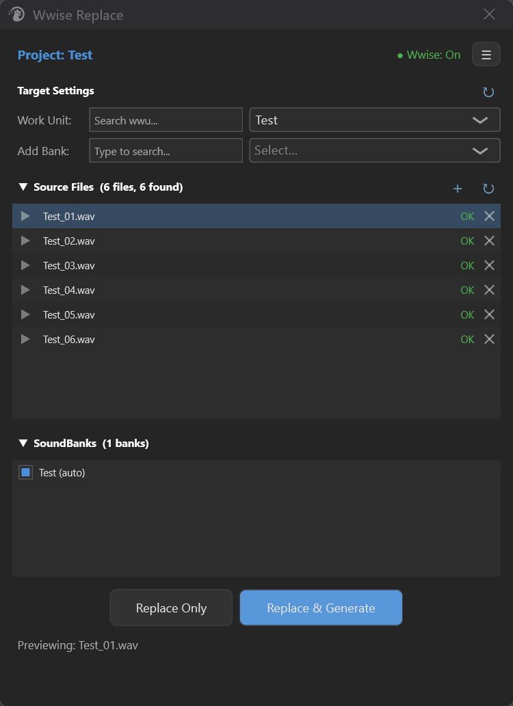
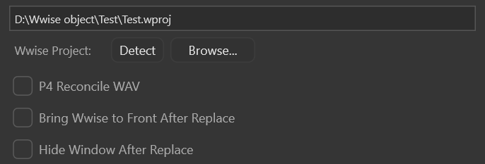
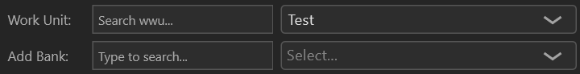
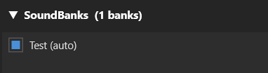
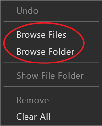
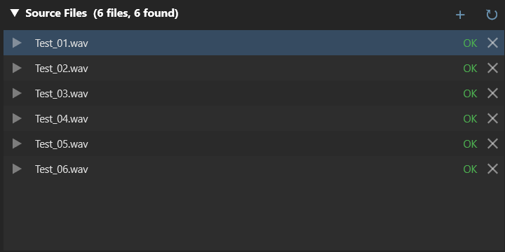
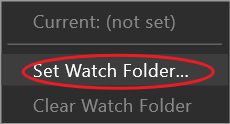
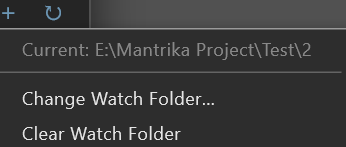
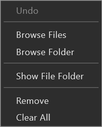
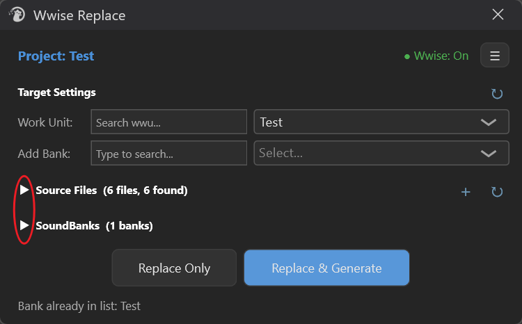

# Wwise Replace

> Only Windows

---

## 1. Overview

**Wwise Replace** is a Wwise-connected asset delivery tool embedded in REAPER. In one window it does:

* **One-click replace** a batch of freshly rendered WAVs into the Wwise project's **Originals** directory
* **Conveniently regenerate SoundBanks** in Wwise — no need to switch to Wwise and click Generate manually

**Typical use cases**:

* Finish a batch of SFX in REAPER, immediately replace them into the Wwise project and regenerate banks to audition
* After a Render Queue run, automatically sync to Wwise without manually dragging files

---

## 2. Opening Wwise Replace

Search `Wwise - Replace` in the REAPER Actions list (or use the Toolbar icon) to open. Run it again to close the window.

After opening, the window automatically loads all previous settings — selected wproj, selected Work Unit, and source file list.

---

## 3. Interface Overview



Five main areas:

| Area | Content |
|---|---|
| **Top** | Current Wwise project name · Wwise connection status · ☰ (settings menu) |
| **Target Settings** | Select Work Unit + manually add Banks; determines which Banks to generate |
| **Source Files** | WAV list you want to send into Wwise; each row shows whether found in Originals |
| **SoundBanks** | List of Banks ready to generate, auto-found by Work Unit + manually addable |
| **Actions + Status** | Replace Only / Replace & Generate + status line + progress bar |

---

## 4. Top: Project & Connection Status

### 4.1 Selecting a Wwise Project

Click **☰** to open the settings window, which contains:



| Option | Purpose |
|---|---|
| **Wwise Project** | Path of the currently associated wproj file |
| **Detect** | Ask the running Wwise: "Which project is currently open?" — one-click to get the path |
| **Browse...** | Select the wproj file manually |
| ☑ **P4 Reconcile WAV** | After replacing WAVs, automatically run `p4 reconcile` to notify Perforce the files have changed (ignore if not a P4 user) |
| ☑ **Bring Wwise to Front After Replace** | Bring the Wwise window to the front after Replace (for those too lazy to Alt+Tab) |
| ☑ **Hide Window After Replace** | Auto-hide this window after successful Replace — most workflows are Replace + switch to Wwise, leaving the window open just gets in the way |

> Tip: **wproj is machine-level configuration** — set it once, it persists across REAPER project switches; only need to reselect when changing computers or projects.

### 4.2 Wwise Connection Status

Dot + text in the top-right corner:


| Display | Meaning |
|---|---|
| 🟢 **Wwise: On** | Connected to running Wwise, all features available |
| 🔴 **Wwise: Off** | Wwise is not open (or open but WAAPI not enabled). **Replace & Generate unavailable** |
| ⚪ **Checking...** | Detecting Wwise status |

**Click this line of text** to immediately re-detect — if you opened/closed Wwise, clicking updates the status instantly.

> Tip: To let Wwise enable connection: Wwise → User Preferences → check **Enable Wwise Authoring API**.

---

## 5. Target Settings: Work Unit and SoundBanks

### 5.1 Selecting a Work Unit



**Work Unit** is a Wwise Actor-Mixer sub-unit (one `.wwu` file each). After selecting it, the tool does two things:

1. Only searches for your WAVs among the audio sources declared in this wwu (Source Files list OK/Not found is decided by this)
2. Automatically finds associated SoundBanks by wwu name and fills them into the SoundBanks list

**Search box** supports fuzzy search; click the dropdown to select a target.

> Tip: **Auto-matching Bank rules** are two:
> 1. **Bank name exactly matches wwu name** (most common naming convention)
> 2. **`sfx_` prefix special case**: when wwu name is `sfx_ABCD_aaa53`, automatically check all Bank names that independently contain `ABCD_aaa53` (e.g., `ABCD_aaa53_sfx_audio` / `ABCD_aaa53_sfx_events`)
>
> Names not matching these rules need to be added manually with **Add Bank** (search box below the Work Unit row).

### 5.2 Rescan Entire Project (↻)


The ↻ button to the right of the **Target Settings** title — **rescan the entire Wwise project structure** (all wwu + all Banks).

When to use: **you added/removed wwu in Wwise, or changed Bank names**, and the tool's lists cannot keep up.

> ⚠️ Large projects (2000+ Banks) may take over ten seconds; the window shows Loading during this. Do not click repeatedly.

### 5.3 SoundBanks List



| Action | Behavior |
|---|---|
| Check / uncheck | Decide whether to generate this Bank this time |
| **(auto)** marker | Indicates this entry was added automatically by Work Unit; cannot be deleted from the list — unless you switch wwu |
| **Add Bank** search box | Manually add any Bank (marked as non-auto) |
| Right-click → **Remove** | Delete a manually added entry (auto entries cannot be deleted) |
| Right-click → **Clear All Manual** | Clear all manually added entries at once |

---

## 6. Source Files: WAVs to Replace

### 6.1 Four Ways to Add Files



| Method | Behavior |
|---|---|
| **Drag & drop** (fastest) | Drag WAV files or whole folders into the list — folders are scanned **recursively** for all subdirectories' .wav |
| **Right-click → Browse Files** | Select one or more WAVs, **append** to current list (same-name files overwrite path) |
| **Right-click → Browse Folder** | Select a folder; its **top-level** .wav **overwrite** the entire list (not recursive — for recursive use drag & drop or Watch Folder) |
| **Watch Folder** | Set a monitored directory, scan recursively, rebuild list each time ↻ is clicked (see 6.3) |

### 6.2 Information in the List

Each row shows:



| Element | Meaning |
|---|---|
| **▶ / ❚❚ buttons** | Audition this WAV (click again to pause) |
| **Filename** | Source file name |
| **Status** | **OK** 🟢 = found a same-name file in the Originals associated with the current Work Unit, replaceable; **Not found** (yellow) = corresponding file not found, **this row will not be replaced** |
| **X button** | Remove from list (does not affect files on disk) |
| **Row sorting** | OK first, Not found after, convenient to see "which ones will actually take effect" at a glance |

> Tip: **Not found?** First confirm whether the wrong Work Unit is selected — switch to the correct Work Unit and status refreshes automatically; if the audio does not exist in Wwise at all, create it in Wwise first (Import), then come back to Replace.

### 6.3 Watch Folder (Monitor Render Output Directory)

Dragging files every time is annoying? Set a **render output directory** for the tool to watch automatically:



**Source Files** title right-side **+** button → menu pops up → **Set Watch Folder...** select directory.

> Tip: **First time setup does not auto-scan**; you must manually click ↻; after that the window auto-scans once each time it reopens.

Subsequent workflow:

```
1. Render a batch of WAVs in REAPER to this directory
2. Return to Wwise Replace window, click ↻ to refresh
3. List automatically overwrites with all .wav in this directory
4. Click Replace & Generate
```

**Watch Folder rules**:

- **Recursive scan** — .wav in subfolders also count
- **Same name keeps newest**: when same-name files exist in different subdirectories, keep the one with newest mtime (avoid getting an old render version)
- **Complete overwrite**: each ↻ clears and rebuilds the list — do not worry about accumulated dirty data
- Links with **Render Queue module**: Render Queue automatically sets Watch Folder to the corresponding directory and refreshes once after rendering finishes

**+ button menu** can also:



| Menu item | Behavior |
|---|---|
| **Current: ...** | Show currently set directory (truncated display) |
| **Change Watch Folder...** | Change to another directory |
| **Clear Watch Folder** | Stop monitoring (list remains) |

### 6.4 Right-Click Menu Full List



| Menu | Behavior |
|---|---|
| **Undo** | Undo last list change (up to 10 steps) |
| **Browse Files** | Append files |
| **Browse Folder** | Overwrite entire list |
| **Show File Folder** | Open the directory of the current row in Explorer |
| **Remove** | Delete current row |
| **Clear All** | Clear all rows |

**Ctrl+Z** also works for Undo (window needs focus first).

---

## 7. Action Buttons

| Button | Behavior |
|---|---|
| **Replace Only** | Only copy WAVs to Originals directory, **do not** ask Wwise to generate Banks. Useful when you want to inspect or continue tweaking in Wwise yourself |
| **Replace & Generate** | Copy WAVs → immediately ask Wwise to regenerate all selected Banks. One smooth flow |

### 7.1 Execution Details


* **Replace Only does not require Wwise to be running** — pure file copy
* **Replace & Generate requires Wwise to be running** (top-right is green dot)
* **Safe replacement**: writes a temporary file next to the target first, only replacing the original after the whole write completes — power failure / crash / file lock in the middle will not cause loss of the original wav in your Wwise project
* Only rows with **OK** status are actually replaced; **Not found** rows are skipped directly
* Replace & Generate **forcibly updates the modification time** of replaced wavs to ensure Wwise recognizes them as "changed" and re-converts cache — avoiding inconsistency between what you see in the BNK and reality
* When **Hide Window After Replace** is on, **Replace Only** success auto-hides the window (green success hint flashes first then disappears); if **Bring Wwise to Front** is also on, Wwise is brought to front first, then this window hides, so focus is not snatched back to REAPER

### 7.2 Status Line Colors

After copy / generate completes, the status line shows the result:

| Color | Meaning |
|---|---|
| Gray | Idle / hint / in progress |
| Green | Success |
| Yellow | No changes (Wwise judged wav content unchanged / Bank does not need regenerate) |
| Red | Failure (read message content to locate cause) |

The progress bar only displays during generation to indicate "busy", not a real percentage.

---

## 8. Collapsing and Window Size

**Source Files** and **SoundBanks** title bars can be clicked to collapse (▼/▶ toggle).



* Collapse one side: the other side automatically fills the space
* Collapse both sides: window automatically shrinks to a small strip with only the buttons, convenient to keep in a screen corner
* Expand either side: window restores to default size

---

## 9. Persistence (Auto-Save)

Tool configuration is split into two categories:

### 9.1 Stored in REAPER Project (inside rpp)

After each operation it is **automatically written** to the current REAPER project:

* Selected Work Unit
* Source Files list
* SoundBanks list (including check states, manual entries)
* Watch Folder path

REAPER marks the project as "modified"; these data are truly saved **when you Ctrl+S save the rpp**.

**Benefit**: rpp backup / save to another machine carries this configuration along.

> ⚠️ When rpp has never been saved (New Project state), this part of configuration lives only in REAPER memory — close REAPER without saving and it is lost. The status bar will hint this.

### 9.2 Global Configuration (Machine-Level)

* wproj path
* P4 Reconcile WAV toggle
* Bring Wwise to Front toggle
* Hide Window After Replace toggle

These do not travel with the rpp; they are stored in MantrikaTools global config.

---

## 10. Typical Workflows

### Workflow A: Render a Batch of SFX, Immediately Replace and Generate Banks

```
1. Render a batch of WAVs in REAPER to a folder
2. Drag the whole folder into Source Files list
3. Check OK / Not found — all OK is best
4. SoundBanks already auto-selected relevant Banks by default
5. Click Replace & Generate
6. Wait for status bar to show "Generated N bank(s)"
```

### Workflow B: Watch Folder

```
1. Click + next to Source Files title → set Watch Folder to your render directory
2. After each render, click ↻ → list automatically overwrites with the latest batch of .wav
3. Click Replace or Replace & Generate
4. Long-term use: nothing to adjust, just two clicks each time
```

### Workflow C: Render Queue Fully Automatic

```
1. Run a batch render with the Render Queue module
2. After Render Queue finishes, it automatically sets Wwise Replace's Watch Folder to the corresponding directory and refreshes
3. It also synchronously opens Wwise Replace's UI (if it was previously hidden)
4. You only need to click Replace or Replace & Generate in Wwise Replace
```

---

## 11. Notes

### 11.1 Replace Really Overwrites Disk Files

Writing to Originals is a **direct physical overwrite**. **Teams using P4 to manage wproj**: we recommend enabling **P4 Reconcile WAV**, the tool will automatically notify version control; if off, you will need to reconcile the overwritten wavs yourself.

### 11.2 Switching REAPER Projects Does Not Cause Chaos

The tool listens for REAPER project switches in the background:

* Switch to another rpp (including Tab switch) → automatically reads the config stored in that rpp
* **If you switch away during Generate**: Wwise generation on the other side continues to completion (you can switch back to the original project or go directly to Wwise to see the result), but the tool no longer writes generation status to the new project's status line — to avoid pollution

### 11.3 Multiple Wwise Instances Open

**Replace Only + Bring to Front** finds windows by "project name matching" — only activates the Wwise whose wproj name matches your configured one, never the wrong one.

### 11.4 File Lock After Audition

After auditioning a WAV, Windows adds a shared read lock to the file. If you immediately try to overwrite this file externally and fail with "in use":

* Click the Play button again to stop audition
* Or simply close the Wwise Replace window (hiding the window automatically releases the lock)

### 11.5 After Wwise Switches Project or Restarts

The tool detects Wwise disconnection and status automatically turns red dot **Wwise: Off**. Restart Wwise and click the top-right dot text once to re-detect.

---

## 12. Troubleshooting

| Symptom | Possible cause | Solution |
|---|---|---|
| Wwise: Off never changes | Wwise WAAPI not enabled | Wwise → User Preferences → check Enable Wwise Authoring API, restart Wwise |
| Detect says "Wwise not running" | Wwise not open / WAAPI not enabled | Open Wwise first, confirm WAAPI option is on |
| Source list all Not found | Wrong Work Unit selected / filename does not match Wwise | Switch to correct Work Unit; or Import these wavs in Wwise to create Sound objects first |
| SoundBanks list empty | Auto-match rules did not hit | Add manually with "Add Bank" |
| Replace reports "Failed to copy" | Source file locked by another program / target read-only | Close the locking program; do not set target wav read-only |
| Replace & Generate stuck for a long time | Dozens or hundreds of Banks selected, normal | Wait. It will time out and error within 10 minutes |
| Status shows "No changes detected" | Selected wavs are identical to those in Originals | Normal — confirm your render actually updated |
| Bank list still old after switching wproj | Old index not refreshed | Click ↻ next to Target Settings to rescan |
| Render Queue did not auto-sync after render | Watch Folder not enabled | Set Watch Folder once in Wwise Replace (Render Queue will take over automatically afterwards) |
| Ctrl+Z not working | Focus is on REAPER main window | Click Wwise Replace window first to give it focus |
| Window too small to resize after collapsing | By design | Expand any area and window automatically restores default size |
