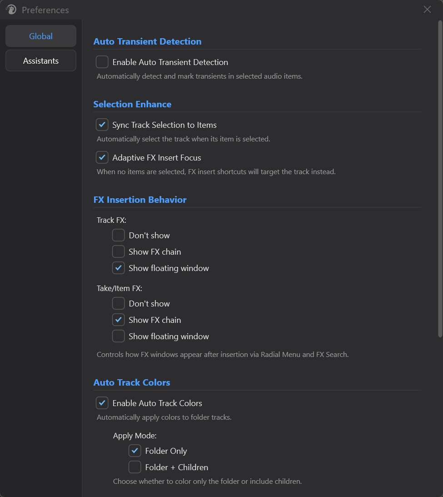
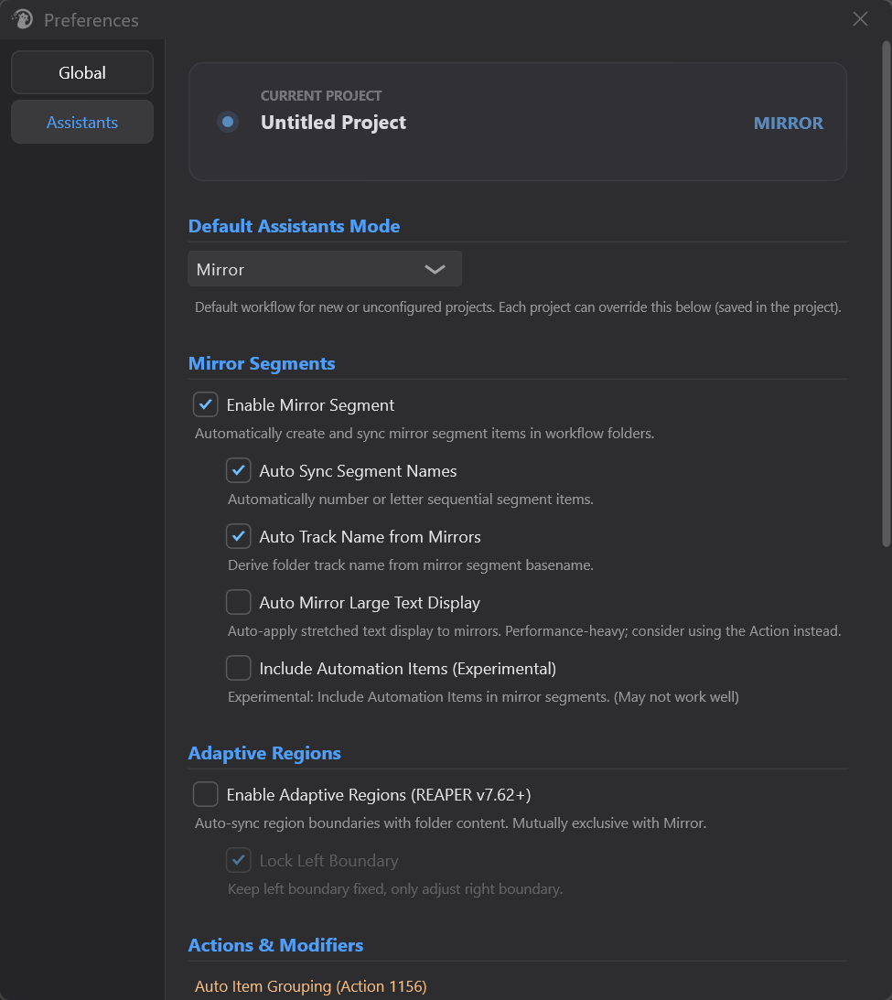
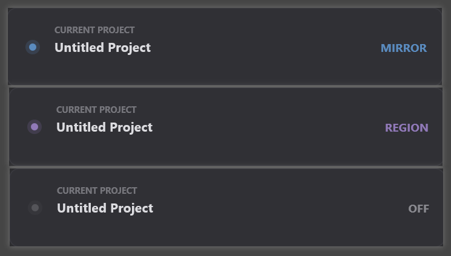

# Preferences

---

## 1. 概述

**Preferences**（偏好设置）是 Mantrika Tools 的总控面板，用来开关和调节那些"装上后自动在后台跑"的辅助行为，例如：

- 鼠标 / 选区联动
- Item Auto Transient 检测
- FX 插入后的弹窗策略
- Monitor Dim Action 衰减量
- 文件夹轨道的自动配色
- Mirror Segments / Adaptive Regions 等工作流助手

所有开关都是**实时生效**——勾选 / 拖动后立即应用，无需 OK 或 Apply 按钮，关闭窗口即可。

界面分为两大类（左侧导航）：

| 面板           | 内容                                                         |
| -------------- | ------------------------------------------------------------ |
| **Global**     | 通用后台辅助 + 视觉：Auto Transient、Selection Enhance、FX 插入弹窗、Auto Track Colors、Monitor Dim。 |
| **Assistants** | 工作流助手：当前工程的 Mirror / Region 模式、Mirror子选项、自适应区域、动作与鼠标修饰键。 |

> 默认进入 **Global** 面板。

---

## 2. 打开方式

在 REAPER 顶部菜单： Extensions -> MantrikaTools -> Mantrika Options -> Preferences...

窗口尺寸约 650×700，左侧是导航按钮，右侧是可滚动的设置区——内容较长，请用滚轮浏览。

---

## 3. Global 面板

> 这一面板下的所有项目都是**全局**设置（不跟工程走）。

### 3.1 Auto Transient Detection

| 选项                                | 作用                                             |
| ----------------------------------- | ------------------------------------------------ |
| **Enable Auto Transient Detection** | 选中音频 item 时，自动在波形上检测并标出瞬态点。 |

> 仅作用于选中的音频 item，背景常驻；

---

### 3.2 Selection Enhance

| 选项                              | 作用                                                         |
| --------------------------------- | ------------------------------------------------------------ |
| **Sync Track Selection to Items** | 选中 item 时，自动把它所在的 track 也选中。适合"我点哪个 item 就操作哪条轨"的工作流。 |
| **Adaptive FX Insert Focus**      | 开启以后，在 Arrange View 中点击 Arrange Track、焦点并没有在TCP时，直接执行 insert FX 快捷键，会自动把 FX 挂在 Track 本身上；这个功能解决的痛点是，REAPER中必须点击TCP让其获得焦点，才能让快捷键挂FX这件事情被正确应用。 |

---

### 3.3 FX Insertion Behavior（FX 插入后的窗口策略）

控制通过 **Radial Menu** 和 **FX Search** 插入插件后，FX 窗口如何出现。

| Track FX / Take or Item FX 单选项 | 含义                              |
| ------------------------------ | ------------------------------- |
| **Don't show**                 | 插入后不弹任何窗口。        |
| **Show FX chain**              | 弹出 FX Chain 窗口。          |
| **Show floating window**       | 直接以浮动窗形式显示插件 UI。 |

Track FX 与 Take/Item FX 各自独立设置，互不影响。

---

### 3.4 Auto Track Colors（自动轨道配色）

让 folder track 在创建 / 重整时自动获得合理的配色，省去手动一条条设色。

| 选项                                | 作用                                                                                |
| --------------------------------- | --------------------------------------------------------------------------------- |
| **Enable Auto Track Colors**      | 总开关。关闭后下面所有子选项灰显。                                                                 |

#### Apply Mode（着色范围）

| 单选项                  | 作用                              |
| -------------------- | ------------------------------- |
| **Folder Only**      | 只给 folder track 本身上色，子轨保持原样。    |
| **Folder + Children**| folder 与其所有子轨道一起着同一色系。          |

#### Saturation Mode（饱和度收敛方向）

控制饱和度调低时，颜色"往哪边走"。

| 单选项               | 作用                                  |
| ----------------- | ----------------------------------- |
| **Toward Gray**   | 降饱和时颜色向**灰**靠近（更柔和，适合深色主题）。         |
| **Toward White** | 降饱和时颜色向**白**靠近（更清淡，适合浅色主题）。         |

#### 三个微调滑杆

| 滑杆               | 范围               | 含义                                          |
| ---------------- | ---------------- | ------------------------------------------- |
| **Saturation**   | `0.0 ~ 1.0`      | 整体饱和度系数。1.0 = 原色；越小越接近所选 Saturation Mode 端点。 |
| **Brightness**   | `0.0 ~ 1.0`      | 整体明度系数。1.0 = 原色；越小越暗。                       |
| **Hue Shift**    | `-180° ~ +180°`  | 整体色相旋转。0 = 不旋转。                             |

> 滑杆均**松手即生效**——拖动过程中不会反复刷新。如果使用滚轮则会即时生效。

#### Reset 按钮

一键把三个滑杆恢复到默认（饱和度 1.0、明度 1.0、色相 0°）。不会影响开关本身或 Apply Mode / Saturation Mode 选择。

---

### 3.5 Monitor（监听衰减）

| 项目             | 作用                                                                                |
| -------------- | --------------------------------------------------------------------------------- |
| **Dim Level**  | Monitor Dim Action 切换时的衰减量。范围 `-60.0 dB ~ 0.0 dB`，步进 0.5 dB；松手即生效。               |

> 默认值 `-15.0 dB`。

---

## 4. Assistants 面板

Assistants 面板专门管理两个**互斥**的工作流助手——**Mirror** 与 **Region**——以及配套的动作 / 鼠标修饰键。

### 模式模型（先读这段）

每个工程在任意时刻处于三种模式之一：**None / Mirror / Region**。

- **每工程模式**：勾选 `Enable Mirror Segment` 或 `Enable Adaptive Regions`，就是把**当前工程**切到对应模式。
- **全局默认**：`Default Assistants Mode` 下拉决定那些**还没被显式配置过**的工程（新建工程 / 没动过这两个开关的工程）默认进哪个模式。
- **互斥**：Mirror 和 Region 只能开一个——打开其中一个，另一个会自动关闭。

### 4.1 当前工程状态卡

面板顶部的卡片**只读**，用来一眼确认"当前激活的工程现在是什么模式"：

- 左侧指示灯：随模式点亮（Mirror = 钢蓝，Region = 紫，None = 灰）。

- 中间：`CURRENT PROJECT` + 工程名。

- 右侧：模式徽章 **MIRROR / REGION / OFF**。

  

切换 REAPER 的工程 tab 时，状态卡会自动跟着刷新成那个工程解析出的模式。

---

### 4.2 Default Assistants Mode（全局默认模式）

| 选项                        | 作用                                                                 |
| ------------------------- | ------------------------------------------------------------------ |
| **None / Mirror / Region** | 新工程或未配置工程的默认工作流。每个工程都可以在下方用 Mirror / Region 开关覆写（覆写值存进工程文件）。 |

> 改这个下拉只影响"没有显式设置过"的工程。当前激活工程若属于这种情况，新默认会**立即生效**；若它已经被单独设过模式，则不受影响。

---

### 4.3 Mirror Segments

Mirror Segments ：在折叠的 folder track 上自动生成与子轨内容对应的"Mirror item"，方便整段拖拽 / 命名 / 切分。

| 选项                                        | 作用                                                         |
| ------------------------------------------- | ------------------------------------------------------------ |
| **Enable Mirror Segment**                   | 把**当前工程**切到 Mirror 模式（同时关闭 Region）。关闭后下面所有子选项一并失效（灰显）。 |
| **Auto Sync Segment Names**                 | 顺序段会自动编号 / 加字母（如 `_01 _02` / `_A _B` / `-1 -2`），不用每个手动改。 |
| **Auto Track Name from Mirrors**            | 将Mirror 的 basename 应用于 folder track name —— 给Mirror改完名，folder 名也跟着变。 |
| **Auto Mirror Large Text Display**          | 自动给Mirror开启 REAPER 的 stretched text 显示。**性能较重**（折叠组多时可能掉帧），更推荐用对应的 Action 直接应用，而不是在这里常开。 |
| **Include Automation Items** (Experimental) | 把 Automation Items 也纳入Mirror。**当前体验不稳定**，仅供尝鲜。 |

**联动关系**：

- Mirror 总开关关闭 → 所有子选项灰显。
- `Auto Sync Segment Names` 关闭 → `Auto Mirror Large Text Display` 一并自动关闭并灰显（因为后者依赖前者）。

---

### 4.4 Adaptive Regions

Adaptive Regions ：符合规则的region的左右边界会跟随Folder中实际item 的边界而自动调整。本质上是Mirror的概念在Region上的体现。

| 选项                                        | 作用                                                         |
| ------------------------------------------- | ------------------------------------------------------------ |
| **Enable Adaptive Regions** (REAPER v7.62+) | 把**当前工程**切到 Region 模式（同时关闭 Mirror）。folder 内子轨内容变化时，对应的 Region 边界自动跟随调整。 |
| **Lock Left Boundary**                      | 只让右边界跟随内容变化，左边界保持不动。适合"以某个时间点为锚、向后扩展"的游戏音效思路。 |

> ⚠️ **Adaptive Regions 与 Mirror Segments 互斥**——同时只能开一个。在 Preferences 里打开其中一个，另一个会自动关闭，顶部状态卡也会随之翻转。

---

### 4.5 Actions & Modifiers（动作与鼠标修饰键）

#### Auto Item Grouping (Action 1156)

| 按钮                                                       | 作用                                                         |
| ---------------------------------------------------------- | ------------------------------------------------------------ |
| **Enable Item Grouping** / **Item Grouping: Auto-Enabled** | 把 REAPER 自带的 Action 1156（Options: Toggle item grouping and track media/razor edit grouping）固定为"每个工程一打开就开启"状态。**Mirror 模式 + 折叠组拖动**强依赖它，建议长期开启。 |

按钮文案变成 "Item Grouping: Auto-Enabled" 且变绿即代表已激活。

#### Mouse Modifier Presets

把 Mantrika 推荐的双击 / Modifier 配置写入 REAPER 的 Mouse Modifiers。现在每个逻辑功能都**单独列成一个开关**，你可以**一键全部**，也可以**只挑想要的逐条开关**——互不影响。

**一键按钮**

| 按钮              | 作用                                                          |
| --------------- | ----------------------------------------------------------- |
| **Apply All**   | 一键应用下面全部功能。全部已应用时按钮变灰、文案改为 "All Applied"。           |
| **Restore All** | 一键把所有已应用的功能还原到你的原始设置。只要还有任意一项处于已应用，按钮就可点。      |

**逐条功能开关**

每个功能一行（勾选框 + 说明）。勾选 = 应用该项；取消 = 还原该项到原始设置。各项的原始配置**独立备份**，取消勾选时逐项精确还原，不会动到你其它没勾的修饰键。

| 功能开关                                     | 实际效果                                                     |
| -------------------------------------------- | ------------------------------------------------------------ |
| **Enhanced Item Double-Click**               | 双击 media item，触发增强的 item / Mirror选择动作。          |
| **Enhanced TCP Double-Click (Ctrl/Command)** | Ctrl + 双击TCP，执行增强的轨道选择。                         |
| **Focus View on Track Items (Alt/Option)**   | Alt + 双击TCP，视图跳转并缩放到该轨道的 item 范围。          |
| **Contextual Folder Toggle**                 | 双击Arrange Track / TCP：是 folder 就折叠 / 展开，是普通轨就选中该轨上所有 item。 |
| **Select All Automation Items**              | 双击 envelope lane，选中该 lane 上的所有 automation item。   |

- 各功能开关的状态**实时反映真实配置**：勾选 / 取消后立即写入并应用；若某项写入失败，开关会自动弹回正确位置并弹窗提示。
- 写入失败（极少见）时弹窗提示，可手动在 REAPER 的 Mouse Modifiers 设置里配置对应项。
- "Apply All" 只是把这些功能批量打开，等价于把每一项都勾上；"Restore All" 则等价于把已勾的逐项取消。

---

## 5. 注意事项

### 5.1 全部即时生效

没有 OK / Apply 按钮——勾选、单选、滑杆松手时数据会立刻写入并应用。直接关闭窗口即可。

### 5.2 模式跟工程走，子选项跟全局走

- **当前工程是哪个模式**（None/Mirror/Region）保存在该工程的 `.rpp` 里——换工程，状态卡会变。
- **Default Assistants Mode** 是全局默认，影响所有"没单独设过模式"的工程。
- Mirror / Region 各自的细节子选项（如 Auto Sync Segment Names、Lock Left Boundary 等）是全局配置，所有工程共享。

### 5.3 子选项的灰显是有意为之

`Mirror Segments`、`Adaptive Regions`、`Auto Track Colors` 三个分区的总开关关闭后，对应子选项会变成半透明（不可点）。这是用来提示"现在没在生效"，不是 bug。

### 5.4 Mirror 与 Adaptive Regions 互斥

同时只能开一个，打开一个会自动关掉另一个，状态卡随之翻转。参见 §4.4。

### 5.5 Auto Mirror Large Text Display 的性能取舍

开启该项可能影响 UI 帧率。推荐改用对应 Action 临时切换，常态下保持关闭。

### 5.6 Adaptive Regions 需要 REAPER v7.62+

低于此版本时，勾选了也不会生效——请先升级 REAPER。

### 5.7 Mouse Modifiers 的状态由 MTK 跟踪

每一项的应用 / 还原状态都被独立跟踪：开关位置、Apply All / Restore All 的可点状态都实时反映真实配置，避免重复应用或重复还原。

---

## 6. 故障排查

| 现象                                       | 可能原因                                | 解决                                                     |
| ---------------------------------------- | ----------------------------------- | ------------------------------------------------------ |
| 顶部状态卡显示 OFF，没有任何助手生效        | 当前工程模式为 None，全局默认也是 None  | 勾 Enable Mirror Segment 或 Enable Adaptive Regions，或改 Default Assistants Mode |
| 换了个工程，模式自己变了                   | 模式跟工程走（预期行为）                | 见 §5.2，状态卡反映的就是当前工程的设置                 |
| 勾上 Mirror 后没有生成                       | 当前工程没有合规的 folder 结构                 | 在 folder track 子轨上放 item 再观察                           |
| 开 Adaptive Regions 时 Mirror 自动关掉了        | 两者互斥（预期行为）                          | 见 §4.4                                                 |
| Mirror 子项一直灰显                            | Mirror 总开关未勾                        | 先勾上 Enable Mirror Segment                              |
| Auto Mirror Large Text Display 灰显         | `Auto Sync Segment Names` 未勾        | 先勾上 Auto Sync Segment Names                            |
| Auto Track Colors 滑杆拖了没反应                | Enable 总开关未勾                        | 先勾上 Enable Auto Track Colors                           |
| Apply All / 逐条开关弹错误窗               | REAPER Mouse Modifiers 写入失败（极少见）    | 按弹窗提示在 REAPER 内手动配置；或查看 REAPER Coonsole日志              |
| Item Grouping 按钮一直显示 "Enable Item Grouping" 而不是绿色      | 还没点过 / 设置未保存成功                     | 再点一次按钮，看到 "Item Grouping: Auto-Enabled" 即成功            |
| FX 插入后没弹窗                                | Track FX / Take FX 选成了 "Don't show" | 改回 "Show FX chain" 或 "Show floating window"            |
| Monitor Dim 没有衰减效果                       | Dim Level 调到 0 dB                   | 拖到负值，例如 -15 dB                                         |
