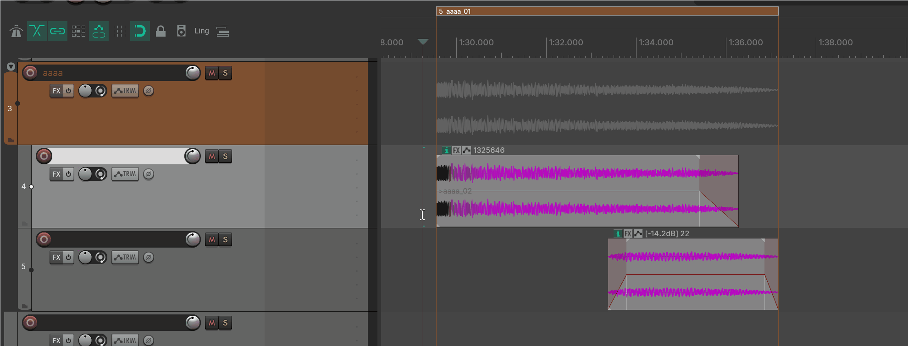
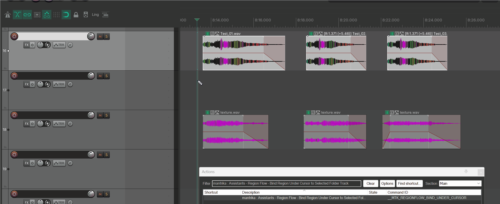
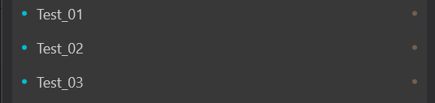

# Adaptive Regions

---

## 1. Overview

**Adaptive Regions** is a background workflow feature whose job is simple: **the regions you draw yourself keep their edges aligned with the actual audio content inside a folder.**

Think of it as the **reverse direction of Mirror**:

- **Mirror**: The system automatically generates overview blocks on a folder (you do not draw them).
- **Adaptive Regions**: **The regions are yours** (you draw, name, and delete them). The system only keeps their **boundaries and colors** aligned with the matching folder's content.



It is best for **"regions first"** workflows — for example, when iterating assets: the regions are already laid out and named, and you just want their edges to stick to the material without pulling them by hand.

> **It is mutually exclusive with Mirror**: both take over the folder overview, so they cannot run at the same time. Enabling Adaptive Regions automatically disables Mirror.

> **This feature has no separate window**. It has no UI of its own; it is turned on by **two switches in Preferences** and then works silently in the background. This manual therefore focuses on two things: **how to turn it on and pair a region with a folder**, and **what it actually does for you**.

---

## 2. Getting started

### 2.1 Turn it on

Menu path (same place as Mirror):

```
Extensions → Mantrika Tools → Mantrika Options → Preferences...
```

In the Preferences window, find the **Adaptive Regions** section and check the switches:

```
■ Adaptive Regions
  ☑ Enable Adaptive Regions (REAPER v7.62+)   ← master switch, turn this on first
      ☑ Lock Left Boundary                    ← sub-option (see §4)
      ☑ Mark Crossing Items                   ← safety sub-option (see §4.1; requires Lock Left Boundary)
```

> ⚠️ Requires **REAPER v7.62 or later**, because it relies on newer Region manipulation APIs.

### 2.2 Pairing a region with a folder (the key: matching names)

The most important part of the feature is this: **regions and folders are paired automatically by name** — you do not manually "bind" them.

The rule is simple:

> **When the stem of a region's name matches the stem of a top-level folder track's name, they are paired automatically.** After that, the region's boundaries start following the folder's contents.

"Name stem" means the name with trailing numbers, version tags, and extensions stripped off. The system automatically ignores these suffixes:

| Region / track name | Name stem the system sees |
| --- | --- |
| `footstep` | `footstep` |
| `footstep_01` | `footstep` (strips `_01`) |
| `footstep-02` | `footstep` (strips `-02`) |
| `footstep_v2` | `footstep` (strips version `v2`) |
| `footstep.wav` | `footstep` (strips extension) |
| `footstep_a` | `footstep` (strips single-letter suffix) |

So the simplest getting-started flow is:

```
1. Create a folder track named footstep and add child tracks with material.
2. Draw a region on the timeline named footstep_01 (or footstep).
3. → The name stems on both sides match → pairing succeeds automatically.
4. → The region's right edge immediately snaps to the right edge of the material inside the footstep folder.
5. From then on, adding, removing, or moving items inside the footstep folder updates the region's right edge automatically.
```

> **Fully automatic, no manual binding**: as long as the names match, pairing and following happen in the background. You do not run any "bind" action.
> (If renaming folders is tedious, there is also an action that renames the selected folder to match the region under the cursor in one step; see §5.)

> **Adaptive Regions mode is saved per project**: `Enable Adaptive Regions` sets the assistant mode (**Region / Mirror / off**) for the **current project** and is saved with the `.rpp` file. New or unconfigured projects use the global default from `Default Assistants Mode` in Preferences. Which regions are managed is also saved with the project and persists when you reopen it.



---

## 3. What it actually does for you

Once paired (the region enters the **managed** state), the system keeps doing the following automatically and in real time:

### 3.1 Right edge follows the content

- The region's **right edge** always equals the **rightmost point of all material** in the matching folder.
- When you move, add, or delete items on child tracks, the right edge **realigns immediately** — no manual refresh needed.

### 3.2 Left edge stays put by default (toggleable)

- **By default, the left edge stays where you drew it**; only the right edge moves.
- This matches intuition: you usually place the start of a region carefully and want the end to grow on its own.
- If you want the **left edge to snap to the leftmost content** as well, turn off the `Lock Left Boundary` sub-option (see §4).

### 3.3 Color follows the folder

- Managed regions **inherit the color of the matching folder track**.
- Change the folder color and the region color follows, so you can see at a glance which region belongs to which folder.

### 3.4 Muted content does not count

- **Muted items** on child tracks and **fully muted tracks** are excluded from the content range (treated as "no audio here"), so they do not push the region boundary outward.

### 3.5 Clean exit on mismatch or deletion

- If you **rename something so the pair no longer matches**, **dissolve the folder**, or **delete the region**, the system detects it and **removes the region from the managed list** (and clears the synchronized color). It exits cleanly without leaving clutter.

---

## 4. Sub-option: Lock Left Boundary

This switch sits under `Enable Adaptive Regions` and is **on by default**.

| State | Behavior |
| ----- | -------- |
| **On (default)** | Only the **right edge** is adjusted automatically; the **left edge stays where you drew it**. |
| **Off** | Both left and right edges snap to the leftmost / rightmost content. |

> In short: **keep this on if you want full control over the region start**; **turn it off if you want the region to wrap the content automatically at both ends (or follow material movement)**.

### 4.1 Safety sub-option: Mark Crossing Items

This switch sits under `Lock Left Boundary`, is **off by default**, and is **only available when `Lock Left Boundary` is on** (without locking the left edge there is no "crossing," so it is grayed out).

It addresses a subtle problem that is easy to miss when the left edge is locked:

> With the left edge locked, the left boundary stays put. If an item inside the folder **starts to the left of the region's left boundary** (it pokes out past the left side), that portion actually lies outside the region — it will be **cut off when rendering by region** — but it is often hard to spot in the Arrange view.

When enabled, the system places a **red marker named `MTK-Crossing`** at the **leftmost crossing point** of every region that has items crossing its left boundary, reminding you that "content is leaking outside the region here."

| State | Behavior |
| ----- | -------- |
| **Off (default)** | No markers are placed. |
| **On** | While the left edge is locked, every region with items crossing on the left gets a red `MTK-Crossing` marker at the leftmost crossing point. |

Key points:

- **One marker per region at most**, placed at the leftmost crossing point; not one marker per crossing item, so the timeline does not get cluttered with red dots.
- **Fully automatic add/remove**: when the item is dragged back inside the region, deleted, or no longer crosses, the matching `MTK-Crossing` marker is removed on the next automatic sync.
- **Turning the switch off clears them immediately**: disabling this switch (or disabling `Lock Left Boundary`) deletes every `MTK-Crossing` marker in the project.
- **The `MTK-` prefix is an ownership tag**: the system recognizes and manages markers with this name, so **do not name your own markers `MTK-Crossing`** or they may be deleted as if they belonged to the system.
- It is a purely visual reminder; it does **not** affect boundary following, color sync, rendering, or any other logic.

> **One small limitation**: if you open a project that previously contained `MTK-Crossing` markers **while this switch is off**, those old markers are not automatically cleared (the system does not manage markers when the switch is off). Delete them manually, or turn the switch on and then off again to clean them up.

---

## 5. Companion action: align a folder to a region in one click

Normally you pair regions and folders by renaming them (see §2.2). If you prefer not to rename folders one by one, use this action:

| Action name (search for `Region Flow` or `Bind` in the Action List) | Function |
| --- | --- |
| **`Assistants - Region Flow - Bind Region Under Cursor to Selected Folder Track`** | Renames the currently selected top-level folder to match the region under the cursor and pairs them immediately. |

Usage:

```
1. Select exactly one top-level folder track.
2. Move the edit cursor inside the desired region's time range.
3. Run the action.
4. → The folder is renamed to the region's name stem and immediately paired; boundaries and colors align right away.
```

> It essentially **renames the folder to match the region for you**, skipping the manual rename step. After that, the follow behavior is identical to §3.

If the conditions are not met, a message explains why. Common reasons:

- Adaptive Regions master switch is off.
- You do not have **exactly one** top-level folder track selected.
- The cursor is **not inside any region**.
- The region is already paired with another folder, or the folder is already paired with another region (one-to-one relationship).

---

## 6. Working with Render Queue

Regions managed by Adaptive Regions are marked with a **small dot badge** at the end of their row in the **Render Queue** source list (under `Master Mix - Regions`).

This supports a clean workflow: **region edges stick to the material → drop the regions into Render Queue and render by region in bulk**, without worrying that the boundaries are slightly off.
(See `render-queue.md` for Render Queue usage.)



---

## 7. Adaptive Regions or Mirror?

Both solve the same problem from opposite directions; pick one (turning one on automatically turns the other off).

| | **Mirror** | **Adaptive Regions** |
| --- | --- | --- |
| Who is "in charge"? | Overview blocks on the folder (system-generated) | **Regions (drawn and named by you)** |
| Who creates the overview segments? | System creates them automatically | **You draw the regions** |
| Who deletes them? | System manages them | **You delete the regions; the system exits cleanly** |
| How are they matched? | Child-track content automatically covered | **By matching name stems** |
| Best phase | Building structure from scratch, sketching as you go | **Mid-to-late stage: names/regions are set, doing integration and iteration** |
| Typical use case | Using folders to overview sound structure | AAA placeholder WAVs, Wwise binding, asset integration |

> One-liner: **if you prefer "folders first, let the system mark the segments" → use Mirror**; **if you prefer "I draw and arrange my own regions, let the edges stick to the material" → use Adaptive Regions**.

---

## 8. Typical workflows

### Workflow A: regions first, edges follow the material

```
1. Preferences → check Enable Adaptive Regions.
2. Create a top-level folder named footstep and add child tracks.
3. Draw a row of regions named footstep_01, footstep_02, ... (all stems are footstep).
4. Drop material onto the child tracks.
5. → Each region's right edge snaps to its matching content; colors sync with the folder.
6. Edit the material freely; the edges follow in real time.
```

### Workflow B: existing named regions auto-correct their boundaries

```
1. Your project already has a set of drawn, consistently named regions.
2. Create / name top-level folders with matching stems and fill them with material.
3. Check Enable Adaptive Regions.
4. → Regions whose names match are automatically managed and their boundaries align to the material.
(If renaming folders is tedious: select the folder, put the cursor inside the region, and run the Bind action from §5.)
```

### Workflow C: align boundaries, then batch-render

```
1. Turn on Adaptive Regions so region edges are already aligned to the material.
2. Open Render Queue and select the regions via Master Mix - Regions.
3. → Managed regions carry a small badge, boundaries are aligned, so you can render in bulk with confidence.
```

---

## 9. Notes and troubleshooting

| Symptom | Cause | Fix |
| ------- | ----- | --- |
| Region does not follow after checking the switch | Region and folder name stems do not match | Make the stems match (see §2.2 table) or use the Bind action |
| Master switch or sub-options are grayed out / cannot be checked | REAPER version is older than v7.62 | Upgrade to REAPER v7.62+ |
| `Lock Left Boundary` sub-option is grayed out | `Enable Adaptive Regions` master switch is off | Turn on the master switch first |
| `Mark Crossing Items` sub-option is grayed out | `Lock Left Boundary` is off (no crossing can occur without a locked left edge) | Turn on `Lock Left Boundary` first |
| Red `MTK-Crossing` marker appears | With the left edge locked, an item starts to the left of the region boundary and is leaking outside | Move the item back inside the region (or confirm you want it outside); the marker disappears automatically (see §4.1) |
| `MTK-Crossing` markers remain after turning off `Mark Crossing Items` | You opened a project that already had these markers while the switch was off | Delete them manually, or turn the switch on and then off again (see §4.1 limitation) |
| Only the right edge moves, left edge stays put | Default behavior when `Lock Left Boundary` is on | Turn off `Lock Left Boundary` if you want both edges to move (see §4) |
| Paired with content inside a nested folder, but nothing happens | Only **top-level folders** participate in pairing | Move the folder you want to pair to the top level |
| Region boundary ignores a particular piece of material | That item or its track is muted | Unmute it; muted content is excluded from the range (see §3.4) |
| Mirror turned off after enabling Adaptive Regions | The two are mutually exclusive | Expected behavior; choose one |
| Bind action reports "select exactly one folder" | Nothing, multiple tracks, or a non-top-level folder is selected | Select exactly one top-level folder track and rerun |
| Bind action reports "cursor not within any region" | Edit cursor is not inside any region | Move the cursor into the target region and rerun |
| Bind action reports "already bound" | The region or folder is already paired with something else | One-to-one relationship; release the existing pair first or pick a different target |
| Leftover artifacts after deleting a region / ungrouping a folder | (Handled automatically) The system removes mismatched items from the managed list | Wait for one automatic sync; no manual cleanup needed (see §3.5) |
| Searching for `Mirror` in the Action List does not find this action | It belongs to the `Region Flow` group | Search for `Assistants - Region Flow` |
