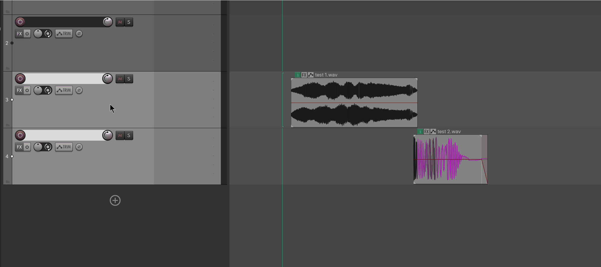
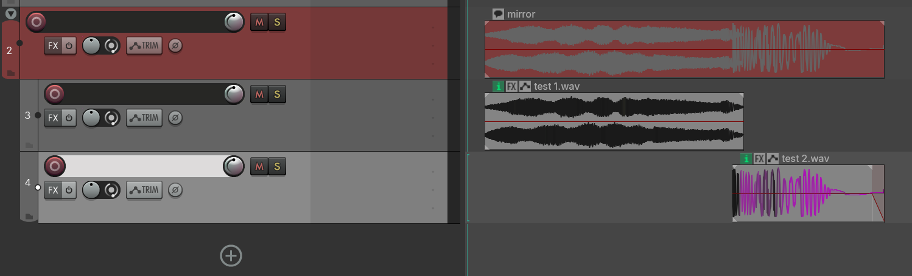
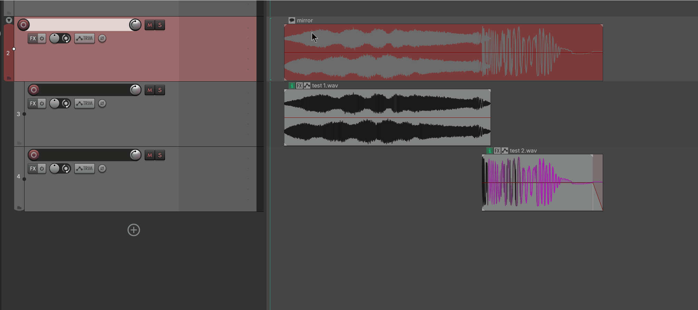
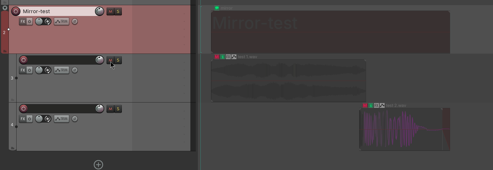
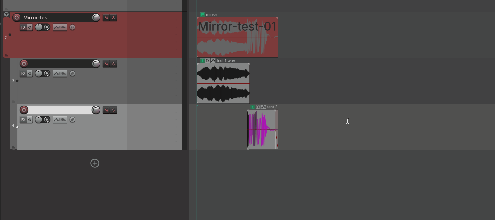
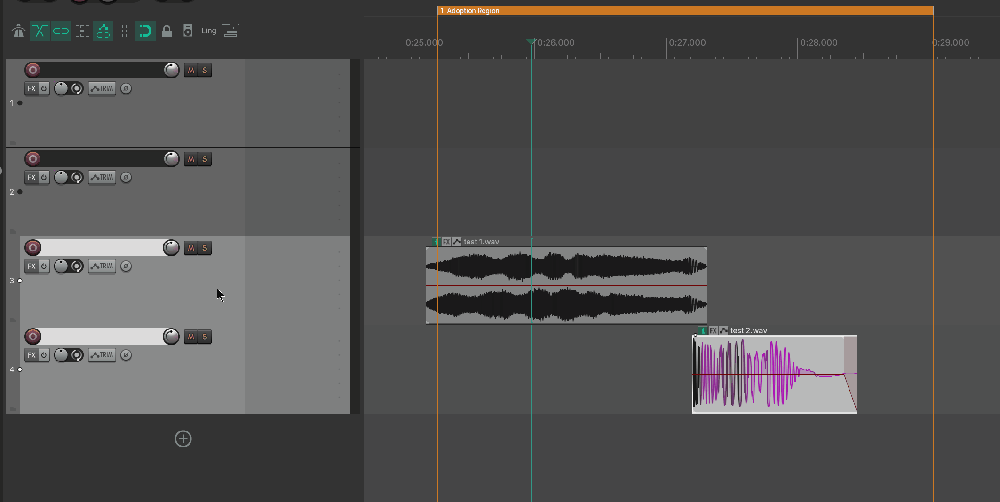
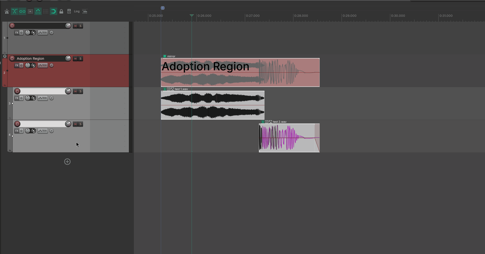

# Mirror

---

## 1. Overview

**Mirror** is a background workflow feature designed to **automatically generate a row of overview blocks on a folder track that show, in real time, where the child tracks have audio.**



Mirror does this by placing **empty items called "Mirrors"** on the folder track. Each Mirror spans the combined time range of all items on the child tracks below. When you move, resize, add, or remove items on the child tracks, the row of Mirrors **updates automatically** — no manual action required.

```
Folder "Footsteps" │  ▓▓▓▓▓▓       ▓▓▓▓        ▓▓▓▓▓▓▓   │ ← Mirror (auto-generated, auto-follows)
  ├ Child A        │  ■■■■          ■■           ■■■■■   │
  └ Child B        │     ■■■       ■■■           ■■      │
                       └─union─┘   └union┘      └──union──┘
```

> **It is mutually exclusive with Adaptive Regions**: both take over the folder overview, so they cannot run at the same time. Enabling Mirror automatically disables Adaptive Regions.

> **This feature has no separate window**. It has no UI of its own; it is turned on by **a few switches in Preferences** and then works silently in the background. This manual therefore focuses on two things: **how to turn it on**, and **what each switch does**.

---

## 2. Getting started

### 2.1 Turn it on

Menu path:

```
Extensions → Mantrika Tools → Mantrika Options → Preferences...
```

(You can also search for **`Preferences...`** in the Action List.)

In the Preferences window, find the **Mirror Segments** section and check the first switch:

```
■ Mirror Segments
  ☑ Enable Mirror Segment          ← master switch, turn this on first
      ☐ Auto Sync Segment Names
      ☐ Auto Track Name from Mirrors
      ☐ Auto Mirror Large Text Display
      ☐ Include Automation Items (Experimental)
```

The row below contains **sub-features** you can enable as needed (see §4). When the master switch is off, the sub-features are grayed out.

### 2.2 Make Mirrors appear

Once the switch is on, return to your project:

```
1. Create a folder track (parent) and add several child tracks below it.
2. Place items (material) on the child tracks.
3. → Mirrors automatically appear on the folder track, covering the time range of the child-track content.
```

After that, **moving, resizing, adding, or deleting items** on the child tracks causes the Mirrors on the folder track to **adjust automatically**. No manual refresh is needed.

> **Mirror mode is saved per project**: `Enable Mirror Segment` sets the assistant mode (**Mirror / Region / off**) for the **current project** and saves it with the `.rpp` file. New or unconfigured projects use the global default from the `Default Assistants Mode` dropdown in Preferences. The Mirror items themselves are also stored in the project.

---

## 3. Core concepts

Only three concepts matter. Once you understand them, everything else follows.

### 3.1 Mirror



- A Mirror is an **empty item** on a folder track whose length equals the **time union** of all items on the child tracks below it (overlapping items are merged into one segment).
- **Fully automatic**: created, resized, and deleted as needed. You do not manage it directly.
- **Muted items** on child tracks and **fully muted tracks** are excluded from the union (treated as "no audio here").
- A Mirror item's built-in label always shows as **`mirror`** and does not change with the track name or Note. **All meaningful naming goes through the Note** (see §3.2) — so you only have one place to watch.

### 3.2 Note — naming a Mirror (important)



By default a Mirror has no name. You can give it a **Note (text)** in either of these ways:

```
1. Click the note bubble button on the empty item (depends on your theme) → a text editor pops up → type.
2. Or select the Mirror and use Simple Rename or Advanced Rename.
```

This Note is the **core metadata** of the Mirror system. Write it once and it is reused in several places:

| What you write in the Note | Where it is used |
| -------------------------- | ---------------- |
| When deriving the track name | As the **source for the folder track name** (see §4.2) |
| When large text is shown | **Enlarged** across the item (see §5) |
| When auto-numbering | As the **template** for sequential naming (see §4.1) |

> In short: **if you want a Mirror to mean something, give it a Note.** Most of the automation revolves around that Note.
> Mirror Notes can also be used as render file names.

### 3.3 Mute = freeze



If you **mute a Mirror**, it becomes **frozen**:

- A frozen Mirror **no longer follows** the child-track content (it is not moved or deleted).
- It is effectively **pinned in place**.
- To resume auto-following, **unmute** it.

---

## 4. Sub-feature switches explained

The switches below sit under `Enable Mirror Segment`. They are **all off by default**; enable only the ones you need.

### 4.1 Auto Sync Segment Names



When enabled, consecutive Mirrors with regular naming are **auto-numbered** for you:

- Number sequences: `footstep_01`, `footstep_02`, `footstep_03`... (leading zeros preserved)
- Letter sequences: `swing_a`, `swing_b`, `swing_c`...

Just write the Note for the first Mirror in the sequence (for example `footstep_01`), and later Mirrors that share the same name stem are **continued automatically**, saving you from typing each one.

### 4.2 Auto Track Name from Mirrors

When enabled, Mirror Notes are used **in reverse to name the folder track**:

- The Note's **name stem** (trailing numbers, letter suffixes, and separators stripped) becomes the folder track name.
- Example: if a Mirror is named `footstep_01`, the folder track is named `footstep`.
- **No Note means no name change**: if none of the Mirrors on a folder have a Note yet, **your manually typed folder name is preserved and not cleared**. In other words, naming control is handed over to Mirror only when a Note exists.
- **Manual folder renames are corrected while this is on**: as long as the folder has Mirrors with Notes, the track name is governed by the Note stem; if you manually rename it, it snaps back. To set a custom folder name, turn this switch off first.

> 💡 **The reverse case**: If you **already set the folder name** and want to copy it into the Mirror Notes, there is a one-shot action for that — **`Assistants - Mirror - Apply Track Name to Mirror Notes`** (see §6). It works in the opposite direction and does not conflict with this automatic switch.

### 4.3 Auto Mirror Large Text Display

When enabled, all Mirror Notes are shown as **enlarged / stretched text** across the item so you can read them from a distance. See §5 for details.

> ⚠️ **The automatic mode is performance-heavy** (it processes on every sync). It is **better to trigger it with the actions in §6 when needed** instead of leaving this switch on.

### 4.4 Include Automation Items (experimental)

When enabled, the time range of **automation items** on child tracks is included in the Mirror union (by default only ordinary media items are considered).

> ⚠️ **Experimental feature; may be unstable.** If you are not sure, leave it off.

---

## 5. Large Note (stretched text display)

REAPER shows text on empty items very small by default. **Large text display** enlarges the Mirror Note to **fill the whole item**, so you can read each segment's name in the Arrange view at a glance.

```
Normal display:  │footstep_01      │   ← small text squeezed in a corner
Large display:   │  FOOTSTEP_01    │   ← text enlarged and filled, readable from afar
```

Two prerequisites:

1. **Only works on Mirrors that have a Note.** Empty Notes are ignored by REAPER at the low level, so the setting has no effect.
2. Trigger it one of two ways:
   - **Always on**: check `Auto Mirror Large Text Display` (performance cost, see §4.3).
   - **Manual trigger (recommended)**: use the actions below when you need it.

---

## 6. Companion actions

These actions can be found in the Action List by searching for **`Mirror`**, and you can bind them to shortcuts. They are **one-shot batch operations** on Mirrors:

| Action name (search in Action List) | Function |
| --- | --- |
| **`Assistants - Mirror - Apply Stretched Text to All Mirrors`** | Apply large text display to **all** Mirrors in the project at once. |
| **`Assistants - Mirror - Apply Stretched Text to Selected Mirrors`** | Apply large text display only to the **currently selected** Mirrors. |
| **`Assistants - Mirror - Clear All Mirrors`** | **Clear** all Mirrors and their related groups (see §8). |
| **`Assistants - Mirror - Create Static Regions from Mirrors`** | **Bake** Mirrors that have Notes into static Regions. |
| **`Assistants - Mirror - Apply Track Name to Mirror Notes`** | Copy the **selected track name** into all Mirror Notes on that track (≥2 Mirrors auto-add `_01` / `_02` suffixes). |

> **`Apply Track Name to Mirror Notes`** is useful when **the track names are already set and you do not want to name Mirrors separately**: select the track, run the action, and every Mirror on that track takes the track name (≥2 Mirrors get `_01`, `_02`... suffixes by position; only the `underscore + number` form is supported; an empty track name clears the Notes). It overwrites existing Notes, applies large text, and is a single undo step. It is also available from the **Extensions menu** and the **track context menu**. It works in the opposite direction from the §4.2 automatic switch and does not conflict with it.

About **Create Static Regions**:

- It generates a set of **Regions** from Mirrors that have Notes (region name = first line of the Note).
- The key difference: these Regions are **static** — they are **not** managed by the Mirror system and will **not** follow Mirror changes.

> There is also a **related action outside this group**: **`Assistants - Mark Regions For Adoption`** — lets Mirror **take over regions you have already drawn** (inheriting their names). Its usage is covered in **§7**.
> Note: in the Action List, search for **`Adopt`** or **`Regions`**; searching for `Mirror` will not find it.

---

## 7. Region adoption (let Mirror take over existing regions)

**Adoption** solves this situation: you already have a set of **regions** (drawn by hand, or bulk-generated with the action `mantrika : Markers - Create Regions From Items (remove extensions)`), and you want **Mirror to take over their names** — copying them into Mirror Notes instead of typing them one by one.



> Typical scenario: game-audio iteration. Import a batch of consistently named source files → use the action `mantrika : Markers - Create Regions From Items (remove extensions)` to generate named regions in one shot → now you want Mirror to **inherit** those names instead of typing Notes manually.

### 7.1 How to use it

```
1. Name your regions.
2. Run the action: Assistants - Mark Regions For Adoption → target regions turn "orange" and enter the pending-adoption queue.
3. Build a folder + child tracks with material so Mirrors appear on the folder.
4. → New Mirrors automatically adopt any overlapping orange region: the region name is written into the Mirror Note, and the old region becomes a plain marker.
```

**Step 2** (`Assistants - Mark Regions For Adoption`) does the following:

- Scans all regions in the project that were **not created by Mirror** and marks them **orange**, adding them to the pending-adoption queue.
- Regions already managed by the Mirror system are **not touched** (no duplicate marking).
- If there are no adoptable regions, a message box tells you so.

**Step 4** (adoption happens automatically the moment a new Mirror is created) does two things:

| Step | Action |
| ---- | ------ |
| 1 | The region's **name** is written into the Mirror's **Note**. |
| 2 | The original **region** becomes a **plain empty marker** (position kept, name cleared). |

### 7.2 Key points

- **Matched by time overlap**: any overlap between a Mirror and a region counts as a hit; strict alignment is not required. A region is adopted on a **first-come, first-served** basis by one Mirror.
- **Adoption only happens when a Mirror is newly created**: existing Mirrors do not go back and adopt regions later. The correct order is **mark regions first, then let Mirrors appear**. If Mirrors already exist, change child-track content to force a rebuild, or run `Clear All Mirrors` first and let them regenerate.
- **Orange = pending visual cue**: marked regions turn orange so you can see which are queued. Once adopted, the region has become a marker and will not be adopted again.
- **Not undoable**: it is a one-shot batch organization operation.

---

## 8. Cleanup

Most Mirror cleanup is **automatic**, but there is also a manual reset.



### 8.1 Automatic cleanup (background)

- **Orphan Mirrors**: if a track is **no longer a folder** (for example, you dissolved the folder), leftover Mirrors on it are **automatically deleted**.
- **Turning off the Mirror master switch** clears the item grouping created by Mirror.

### 8.2 Manual cleanup (one-click reset)

To wipe everything clean, use the action:

```
Assistants - Mirror - Clear All Mirrors
```

It **deletes all Mirrors in reverse order and clears the related groups**, effectively performing a reset. Use it when Mirrors get messy or when you want to start over.

> Note: `Clear All Mirrors` deletes content created by the Mirror system. The prerequisite is that the overall Mirror function is turned off.

---

## 9. Typical workflows

### Workflow A: overview sound structure with folders

```
1. Preferences → check Enable Mirror Segment.
2. Create a folder in the project, add child tracks, and place material on them.
3. → Mirrors automatically appear on the folder, showing at a glance "where there is content."
4. Collapsing the folder does not affect it — the Mirror is the collapsed overview bar.
```

### Workflow B: batch naming + large text overview

```
1. Enable Mirror Segment + Auto Sync Segment Names.
2. Write footstep_01 as the Note for the first Mirror in the sequence.
3. → Later Mirrors in the sequence auto-continue as footstep_02, footstep_03...
4. Run the action Apply Stretched Text to All Mirrors once.
5. → Every segment in the Arrange view shows its name in large text; the structure is immediately readable.
```

### Workflow C: freeze the current layout as permanent regions

```
1. Once segments and Notes are the way you want them.
2. Run the action Create Static Regions from Mirrors.
3. → You get a set of static Regions that no longer change.
4. (Optional) Afterwards, Clear All Mirrors or turn off Mirror; the static Regions remain.
```

### Workflow D: hand existing regions over to Mirror

```
1. You already have named regions (drawn by hand, or generated with REAPER's "create regions from item names").
2. Check Enable Mirror Segment.
3. Run the action Assistants - Mark Regions For Adoption → the regions turn orange.
4. Create a folder, add child tracks, and place material at the matching positions → Mirrors appear.
5. → Mirrors automatically inherit the names of overlapping regions (written into Notes); old regions become markers.
```
(See §7 for details; remember the order: mark first, then let Mirrors appear.)

---

## 10. Notes and troubleshooting

| Symptom | Cause | Fix |
| ------- | ----- | --- |
| Checked the switch but no Mirror appears on the folder | No items on child tracks, or the track is not actually a folder | Make sure it is a real folder track with child tracks and that child tracks contain material |
| Sub-feature switches are grayed out | `Enable Mirror Segment` master switch is off | Turn on the master switch first |
| A Mirror does not move or follow edits | It is muted and frozen | Unmute it to resume auto-following (see §3.3) |
| Large text display has no effect | The Mirror's Note is empty | Write a Note first, then apply large text (see §3.2) |
| Rendered Mirror file has no name (only `.wav`); queue shows `mirror (unnamed)` | The Mirror has no Note — both Mirror render paths use the `$itemnotes` wildcard, so an empty Note produces an empty file name | Write a Note before rendering (see §3.2); any queue entry labeled `mirror (unnamed)` is waiting for a name |
| Adaptive Regions turned off after enabling Mirror | The two are mutually exclusive | Expected behavior; choose one |
| Auto large text display makes the project sluggish | The always-on large text mode is performance-heavy | Turn off `Auto Mirror Large Text Display` and trigger it with an action instead |
| Empty items left after dissolving a folder | (Handled automatically) Orphan Mirrors are cleaned up automatically | Wait for one sync, or run Clear All Mirrors |
| Cannot find Mark Regions For Adoption in the Action List | It is not in the `Mirror` group | Search for `Adopt` or `Regions` (see §7) |
| Ran the adoption action, regions turned orange, but Mirrors did not inherit names | Adoption only happens when Mirrors are newly created; old Mirrors do not adopt retroactively | Mark regions first, then let Mirrors appear; existing Mirrors can be rebuilt by changing child-track content, or cleared first with Clear All Mirrors |
